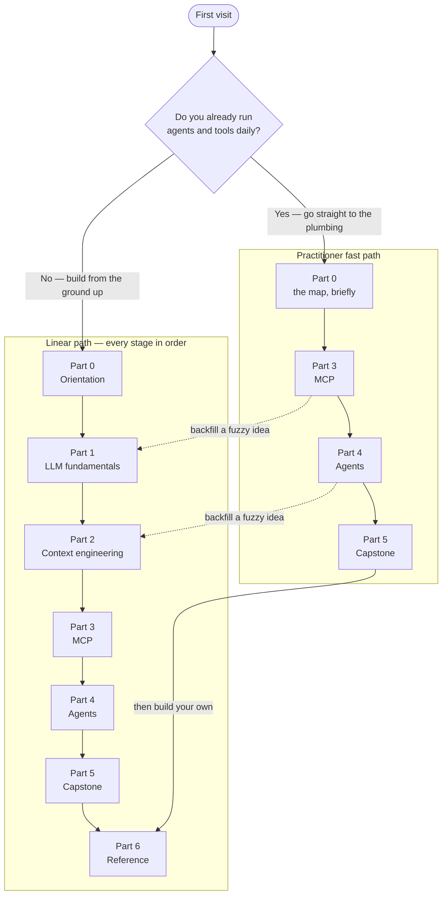

# Start here

This site is one curriculum with a long, deliberate arc: it begins at the question "what is a token?" and ends with you able to defend the architecture of a production server that speaks the Model Context Protocol — its retrieval design, its protocol surface, its cost profile, even the things it refuses to do — the way you would in a technical interview.

By the end you will be able to:

- explain, mechanically, what a large language model does with the text you send it;
- budget, retrieve, compress, and measure the context that goes into a model's window;
- read — and hand-write — the wire messages that connect models to tools;
- reason about agent loops: which software runs them, what they cost, and how they fail;
- walk through a real server's design decision by decision, alternatives and tradeoffs included.

Each part exists because the previous one exposes a problem. [Part 1 · LLM fundamentals](part1-fundamentals/index.md) explains the machine you are feeding: [tokens](part1-fundamentals/tokens.md), prediction, the [context window](part1-fundamentals/context-windows.md), embeddings, prompting. The window turns out to be finite and billed by the token, so [Part 2 · Context engineering](part2-context/index.md) teaches how to feed the machine well: retrieval, minimization, memory, measurement. Curated context needs a standard carrier, so [Part 3 · MCP](part3-mcp/index.md) covers the Model Context Protocol from its motivation down to the JSON on the wire. Tools need a caller, so [Part 4 · Agents](part4-agents/index.md) puts the model in a loop and asks which piece of software owns that loop, what it costs, and where it breaks. [Part 5 · Capstone](part5-capstone/index.md) then walks one production server end to end, and [Part 6 · Reference](part6-reference/build-your-own.md) hands you the keyboard to build a small server of your own. The whole pipeline is drawn once, stage by stage, in [the map of everything](part0-orientation/the-map.md).

## Two ways to read this site

There are two sensible routes through the same material, depending on where you stand today.

### The linear path

Take this route if terms like "context window", "embedding", or "tool call" feel fuzzy or second-hand. Read the parts in order, beginning with [the running example](part0-orientation/running-example.md) and [the map](part0-orientation/the-map.md). The ordering is load-bearing: every chapter uses only ideas that earlier chapters have defined, so nothing will ambush you.

### The practitioner fast path

Take this route if you already run agents and tools daily and came for the protocol and architecture material. Skim [the map](part0-orientation/the-map.md) once to pick up the stage names the site uses, then go straight to Parts 3, 4, and 5: the wire protocol, the agent loop and its economics, and the capstone architecture. Parts 1 and 2 become reference material — dip back whenever a chapter leans on an idea you want grounded, then carry on.

Both paths end at the same place: [Build your own MCP server](part6-reference/build-your-own.md), where you write a complete small server and speak to it by hand before any IDE touches it.

## How every page is written

A few conventions hold across the whole site. Knowing them up front makes every later page faster to read.

*Diagrams over prose.* Every mechanism worth teaching gets a diagram. If a sequence of events matters — a handshake, a loop, a pipeline — you will see it drawn, not just described.

*Dated facts.* This field moves. Anything churn-prone — context window sizes, protocol revisions, package versions — is phrased "As of 2026-07-18, ..." and marked like this:

!!! warning "Evolving — verified 2026-07-18"
    Blocks like this one flag facts that change quickly. Each states the date it was verified and links the official source to check for current values. Where this site and the source disagree, the source wins.

!!! note "Settled"
    Blocks like this mark the opposite: facts that look churn-prone but are stable, so you can rely on them without re-checking.

*Terms are defined once.* A term is bolded and given a one-sentence working definition exactly once, in the chapter that owns it; every other page links there instead of redefining it. All of these terms end up in the [glossary](part6-reference/glossary.md).

*Careful language about models.* Pages here avoid saying a model "understands" or "decides" as if that explained anything. They say what mechanically happens — for example, that the model emits a structured block naming a tool and a client executes it. [What an LLM actually does](part1-fundamentals/what-llms-do.md) defines the operational vocabulary the rest of the site links back to.

*A real example runs through everything.*

!!! example "In the wild: Sankshep"
    Generic teaching always comes first, but abstractions are easier to trust when a production system vouches for them. Blocks titled like this one connect a chapter's idea to [Sankshep](part0-orientation/running-example.md), the real MCP server this site uses as its recurring case study — introduced properly in the running example and examined decision by decision in Part 5. Every such block is optional: skip them all and the curriculum still stands on its own.

*Chapters end with checkpoints.* Most chapters close with a short list of questions, each answer collapsed directly beneath it, and — where it earns its keep — a hands-on "Try it" exercise. Checkpoints are calibration, not homework: if one stumps you, the section to re-read is right above it.

## What this site is not

- *Not a machine-learning course.* Training, backpropagation, and transformer internals appear only to the depth needed to reason about behavior. The lens here is the engineer's: what goes in, what comes out, what it costs.
- *Not vendor documentation.* Official docs and specifications always win on details — which is exactly why churn-prone facts here carry dates and links rather than pretending to be timeless.
- *Not a prompt-trick collection.* Where prompting appears, the interest is in which parts of a prompt reliably help and why. Engineering, not incantation.
- *Not a product manual.* The running example is studied for its design decisions, only in clearly marked and skippable blocks; this site teaches concepts, not one tool's usage.

## Where to go now

On the linear path, start with [the running example](part0-orientation/running-example.md) — five minutes that explain what the case study is and the rules for how it appears. On the fast path, open [the map of everything](part0-orientation/the-map.md), then jump to [what problem MCP solves](part3-mcp/why-mcp.md).
