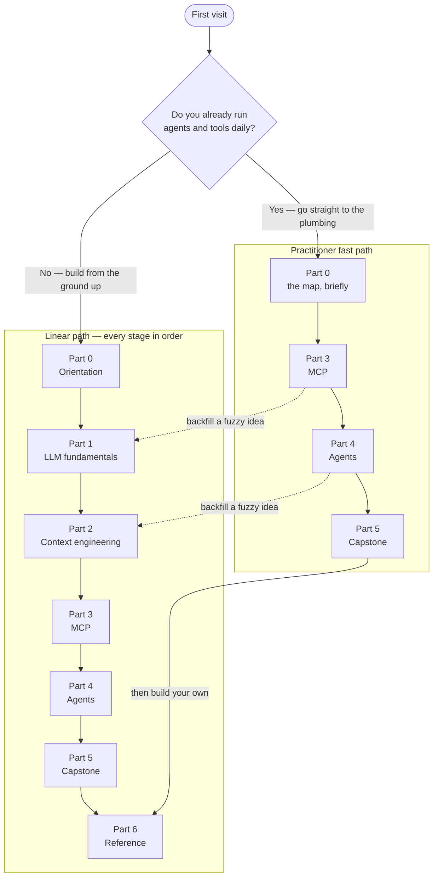

# Start here

This site is one course with a long arc. It starts at "what is a token?" It ends with you able to defend the design of a real production server — the kind of walkthrough you would give in a technical interview.

By the end you will be able to:

- explain what a large language model actually does with the text you send it;
- budget, retrieve, compress, and measure what goes into a model's context;
- read and hand-write the messages that connect models to tools;
- reason about agent loops: which software runs them, what they cost, how they fail;
- walk through a real server's design one decision at a time, alternatives included.

Each part exists because the part before it uncovers a problem.

[Part 1 · LLM fundamentals](part1-fundamentals/index.md) explains the machine you are feeding: [tokens](part1-fundamentals/tokens.md), prediction, the [context window](part1-fundamentals/context-windows.md), embeddings, prompting. That window turns out to be small and billed by the token. So [Part 2 · Context engineering](part2-context/index.md) teaches how to feed the machine well: retrieval, minimization, memory, measurement.

Curated context then needs a way to travel. [Part 3 · MCP](part3-mcp/index.md) covers the Model Context Protocol, from why it exists down to the JSON on the wire. Tools need something to call them, so [Part 4 · Agents](part4-agents/index.md) puts the model in a loop. It asks which software owns that loop, what it costs, and where it breaks.

[Part 5 · Capstone](part5-capstone/index.md) walks one real server end to end. [Part 6 · Reference](part6-reference/build-your-own.md) hands you the keyboard to build a small server yourself. The whole pipeline is drawn once, stage by stage, in [the map of everything](part0-orientation/the-map.md).

## Two ways to read this site

There are two sensible routes through the same material. Pick based on where you are today.

### The linear path

Take this route if "context window", "embedding", or "tool call" feel fuzzy or second-hand.

Read the parts in order. Start with [the running example](part0-orientation/running-example.md), then [the map](part0-orientation/the-map.md). The order matters: every chapter uses only ideas that earlier chapters have already defined. Nothing will ambush you.

### The practitioner fast path

Take this route if you already run agents and tools daily, and came for the protocol and architecture material.

Skim [the map](part0-orientation/the-map.md) once to pick up the stage names this site uses. Then go straight to Parts 3, 4, and 5: the wire protocol, the agent loop and its costs, and the capstone architecture. Treat Parts 1 and 2 as reference. Dip back whenever a chapter leans on an idea you want grounded, then carry on.

```mermaid
flowchart TB
    START(["First visit"]) --> Q{"Do you already run<br/>agents and tools daily?"}
    Q -->|"No — build from the ground up"| L0
    Q -->|"Yes — go straight to the plumbing"| F0
    subgraph linear["Linear path — every stage in order"]
        direction LR
        L0["Part 0<br/>Orientation"] --> L1["Part 1<br/>LLM fundamentals"] --> L2["Part 2<br/>Context engineering"] --> L3["Part 3<br/>MCP"] --> L4["Part 4<br/>Agents"] --> L5["Part 5<br/>Capstone"] --> L6["Part 6<br/>Reference"]
    end
    subgraph fast["Practitioner fast path"]
        direction LR
        F0["Part 0<br/>the map, briefly"] --> F3["Part 3<br/>MCP"] --> F4["Part 4<br/>Agents"] --> F5["Part 5<br/>Capstone"]
    end
    F3 -.->|"backfill a fuzzy idea"| L1
    F4 -.->|"backfill a fuzzy idea"| L2
    F5 -->|"then build your own"| L6
```

Both paths end in the same place: [Build your own MCP server](part6-reference/build-your-own.md). There you write a complete small server and talk to it by hand, before any IDE touches it.

## How every page is written

A few rules hold across the whole site. Knowing them now makes every later page faster to read.

*Diagrams over prose.* Every mechanism worth teaching gets a diagram. If a sequence of events matters, you will see it drawn, not just described.

*Dated facts.* This field moves fast. Anything that changes quickly — context window sizes, protocol revisions, package versions — is dated and marked like this:

!!! warning "Evolving — verified 2026-07-18"
    Blocks like this one flag facts that change quickly. Each gives the date it was checked and links the official source. Where this site and the source disagree, the source wins.

!!! note "Settled"
    Blocks like this mark the opposite. These facts look like they would churn, but they are stable. You can rely on them without re-checking.

*Misconceptions get named.* Where a believable idea is simply wrong, this site states it in your own words and then takes it apart:

!!! failure "Common misconception"
    Blocks like this one quote a belief you may well be holding. Then they explain the mechanism that makes it false. They appear where being wrong is expensive.

*Depth is optional, not missing.* Some mechanisms explain *why* something behaves as it does — attention, the KV cache, quantization, protocol history. Those go in a collapsed block instead of the main text:

??? info "Going deeper — how these blocks work"
    Everything a chapter needs to make its point is in the visible text. Blocks like this one hold the layer underneath: the mechanism, the arithmetic, or the compatibility detail. Skip every one of them and the course is still complete. Open them when a claim above made you ask "but why?"

*Terms are defined once.* Each term is bolded and given a one-sentence definition exactly once, in the chapter that owns it. Every other page links back there instead of redefining it. All these terms also live in the [glossary](part6-reference/glossary.md).

*Careful language about models.* Pages here avoid saying a model "understands" or "decides", as if that explained anything. They say what actually happens instead. For example: the model emits a structured block naming a tool, and a client runs it. [What an LLM actually does](part1-fundamentals/what-llms-do.md) sets up that vocabulary, and the rest of the site links back to it.

*A real example runs through everything.*

!!! example "In the wild: Sankshep"
    Generic teaching always comes first. But ideas are easier to trust when a real system backs them up. Blocks like this one connect a chapter's idea to [Sankshep](part0-orientation/running-example.md), the production MCP server this site uses as its running case study. It is introduced in the running example and examined decision by decision in Part 5. Every block like this is optional. Skip them all and the course still stands on its own.

*Chapters end with checkpoints.* Most chapters close with a few questions, each answer hidden just beneath it. Many also end with a hands-on "Try it" exercise. Checkpoints are there to calibrate you, not to grade you. If one stumps you, the section to re-read is right above it.

## What this site is not

- *Not a machine-learning course.* Training, backpropagation, and model internals appear only as far as you need them to reason about behavior. The view here is the engineer's: what goes in, what comes out, what it costs.
- *Not vendor documentation.* Official docs and specifications always win on details. That is exactly why fast-moving facts here carry dates and links, instead of pretending to be timeless.
- *Not a bag of prompt tricks.* Where prompting comes up, the question is which parts of a prompt reliably help, and why. Engineering, not magic words.
- *Not a product manual.* The running example is studied for its design decisions, in clearly marked blocks you can skip. This site teaches concepts, not one tool's usage.

## Where to go now

On the linear path, start with [the running example](part0-orientation/running-example.md). It takes five minutes and explains what the case study is and how it appears.

On the fast path, open [the map of everything](part0-orientation/the-map.md), then jump to [what problem MCP solves](part3-mcp/why-mcp.md).
