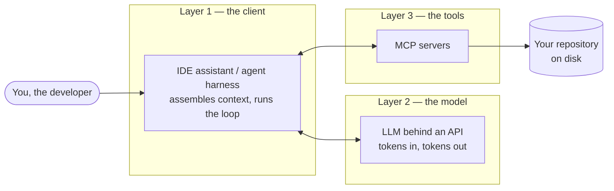

# The running example

Every part of this site — tokens, retrieval, the Model Context Protocol, agents — is illustrated against one real production system. This page introduces that system, explains why a real one teaches better than a toy, and states the rules the site follows whenever it appears. By the end you will recognize the example when it shows up, know exactly how much of it you are allowed to see, and carry a three-layer picture of an AI coding setup that every later chapter builds on.

## Why a real system beats a toy demo

Most tutorials teach with disposable examples: a to-do app, a weather-lookup tool, a fifty-line server written for the tutorial itself. Toys are easy to follow, and that is precisely their weakness. A toy has no users, no performance budget, no security audit, and no history — so whenever a design question gets hard, the author can quietly rewrite the toy to dodge it.

A production system cannot dodge. It has to pick a parser, and live with the languages that parser cannot handle. It has to choose between an embedded database and a hosted one, and defend that choice when requirements change. It has to publish benchmark numbers, including the unflattering ones. Each of those decisions has recorded alternatives, real costs, and a written rationale — and that record, not the code, is the teaching material.

There is a second audience benefit. If you ever have to explain a system you built — in a design review, or an interview — you will be defending decisions, not reciting code. Following one real system's decisions across this whole curriculum is practice for exactly that. [Part 5](../part5-capstone/architecture.md) turns this into an explicit method.

!!! example "In the wild: Sankshep"
    The running example is **Sankshep**, described here in five sentences.

    1. As of 2026-07-18, Sankshep is at version 1.8.0: a server for the Model Context Protocol (MCP), written in C# on .NET 9 — an MCP server is a program that offers tools to AI coding assistants over a standard protocol, and [Part 3](../part3-mcp/why-mcp.md) explains that protocol properly.
    2. Its tagline is its thesis: "Maximum context, minimum tokens — with the benchmarks to prove it."
    3. Its job is to sit beside a code repository and hand curated context to whatever assistant asks — retrieving the relevant files, compressing them structurally, remembering project facts, and measuring how much survived the compression.
    4. It is local-first: embeddings are computed on your own machine with a local ONNX model, vectors live in SQLite via sqlite-vec, and it sends no telemetry by default.
    5. Per ADR-0014 (an architecture decision record — a short document capturing one decision and its rationale), the source code is proprietary and private, while the binary is free to use.

    That fifth sentence matters for this site, as the next section explains.

## The ground rules

Two contracts govern every Sankshep appearance on this site. They are stated here once so you can hold the site to them.

**Generic first.** Every chapter teaches its concept generically, with generic examples, before any Sankshep material appears. Sankshep shows up only in clearly marked blocks — `In the wild: Sankshep` boxes like the one above, or a late section titled "In practice: Sankshep". If you skipped every such block on the entire site, you would still get a complete course. The blocks exist to show each idea surviving contact with production, not to carry the ideas themselves.

**The redaction rule, in the open.** Because the source is proprietary, this site never shows real Sankshep source code — not one line. What it may show instead:

- Diagrams at any level of fidelity, because architecture can be drawn without quoting code.
- Fresh illustrative snippets of at most 15 lines, always captioned "Illustrative — simplified, not Sankshep source".
- Facts from Sankshep's public record only: tool and resource names, command-line flags and environment variables, ADR numbers and titles, the names of its architecture-enforcing tests, and the figures on its published benchmarks page.

Nothing gets invented to fill gaps. If a detail is not in the public record, the site describes it conceptually or not at all. This constraint is not a limitation to apologize for — describing a system precisely without showing its internals is a skill you will need in any job that involves other people's proprietary code, and this site demonstrates it on every page.

## The three-layer frame

One picture organizes the entire curriculum. When you ask an AI coding assistant a question, three layers cooperate to answer it:

**Layer 1 — the client.** The IDE or agent harness you actually type into. It assembles everything the model will read, forwards it over the model's API, and executes any tool calls that come back. [Part 4](../part4-agents/agent-loop.md) shows that this layer — not the model — owns the loop.

**Layer 2 — the model.** A large language model behind an API. It reads [tokens](../part1-fundamentals/tokens.md) in and emits tokens out, and it has access to nothing except what the client sends in each request. [Part 1](../part1-fundamentals/what-llms-do.md) makes that mechanical picture precise.

**Layer 3 — the tools.** Programs the client can run on the model's behalf — MCP servers among them. These are the hands that touch the world: they read files, query indexes, and search repositories. [Part 2](../part2-context/why-raw-context-fails.md) covers what a context-serving tool must do well, and [Part 3](../part3-mcp/why-mcp.md) covers the protocol that connects tools to clients.

Notice what the diagram does *not* contain: an arrow between the model and the tools. The model never runs a tool. It emits a structured request naming a tool, and the client executes that request and sends the result back as more input. Keeping those roles straight — the model emits, the client executes, the tool serves — will save you from most of the confusion in Parts 3 and 4. Whenever this site seems to say a model "decides" or "knows" something, [What an LLM actually does](../part1-fundamentals/what-llms-do.md) holds the operational definitions behind the quotes.

The curriculum walks this picture layer by layer: Part 1 is the model layer, Parts 2 and 3 are the tools layer, Part 4 is the client layer, and Part 5 studies one tool-layer citizen — the running example — end to end. [The map of everything](the-map.md) lays out that route as a single diagram.

## Checkpoints

1. This site could have used a small open-source demo server as its running example, and shown you all of its code. What does a proprietary production system offer that would be lost?

    ??? success "Answer"
        Real, non-negotiable constraints. A production system has users, performance budgets, security audits, and history, so its decisions come with recorded alternatives, costs, and written rationale — a demo can be quietly rewritten whenever a question gets hard. The decision record is the teaching material, and it survives redaction because you can explain a decision without quoting the code. The trade-off is real too: you must trust the stated facts, which is why the site restricts itself to the public record and says so openly.

2. In the three-layer frame, the model and an MCP server need to work together to answer your question. Which layer connects them, and what does that arrangement imply?

    ??? success "Answer"
        The client (Layer 1) sits between them. The model emits a structured request naming a tool; the client executes that request against the MCP server and appends the result to the model's next input. Model and tool never hold a direct connection. This implies the client owns the loop — and, as Part 4 shows, the token bill that comes with it.

3. Under the redaction rule, which of these could appear on this site: (a) a 10-line simplified snippet captioned "Illustrative — simplified, not Sankshep source"; (b) a 40-line excerpt of real Sankshep source; (c) the number and title of a public Sankshep ADR; (d) a plausible-sounding internal file path inferred from context?

    ??? success "Answer"
        Only (a) and (c). (b) breaks the no-verbatim-source rule regardless of length, and (d) breaks the nothing-invented rule — if a detail is not in the public record, the site describes it conceptually or leaves it out.
