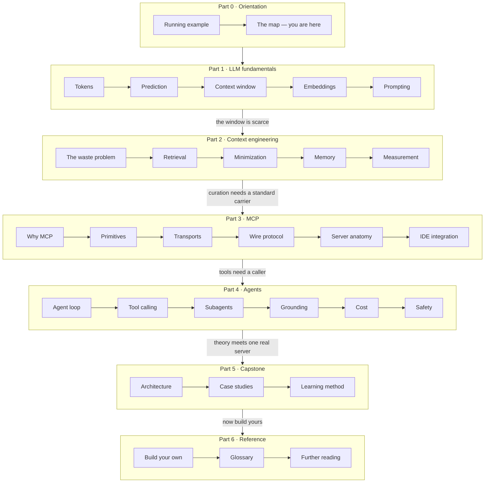

# The map of everything

Every chapter on this site teaches one stage of a single pipeline: how a question about your code becomes tokens, how those tokens find the right context, how that context travels over a protocol, and how an agent turns the result into an answer you can act on. This page is that pipeline drawn once, end to end.

Use it two ways. First, as orientation: skim the map, read the one-line blurbs, and you will have a skeleton to hang every later chapter on. Second, as a home base: when a chapter deep in Part 4 mentions "minimization" or "the wire protocol", this page tells you where that stage lives and what feeds it. The stage labels on this map are the canonical ones — the index pages of Parts 1-4 each repeat their slice of the map using exactly these names.

## The whole curriculum in one picture

Read it top to bottom. Part 1 ([LLM fundamentals](../part1-fundamentals/index.md)) explains the machine you are feeding. Part 2 ([context engineering](../part2-context/index.md)) explains how to feed it well. Part 3 ([MCP](../part3-mcp/index.md)) standardizes the plumbing between the machine and your tools. Part 4 ([agents](../part4-agents/index.md)) puts the machine in a loop. Part 5 ([the capstone](../part5-capstone/index.md)) walks through one real server that implements the middle of this map, and Part 6 hands you the keyboard with [Build your own MCP server](../part6-reference/build-your-own.md).

Every node on the map links to its chapter in the stage-by-stage list below.

## Stage by stage

### Part 0 — orientation

- [Running example](running-example.md): why this site teaches against a real production server instead of toy demos.
- The map: this page.

### Part 1 — LLM fundamentals

- [Tokens](../part1-fundamentals/tokens.md): the unit models read, write, and bill in — every budget on this site is measured in them.
- [Prediction](../part1-fundamentals/what-llms-do.md): what a large language model (LLM) actually does — predict the next token — and the operational vocabulary this site uses for it.
- [Context window](../part1-fundamentals/context-windows.md): the fixed budget that input and output share, and why more context is not automatically better.
- [Embeddings](../part1-fundamentals/embeddings.md): meaning as coordinates, so "similar to my query" becomes a number you can sort by.
- [Prompting](../part1-fundamentals/prompting-basics.md): the working parts of a prompt, and which of them reliably help.

### Part 2 — context engineering

- [The waste problem](../part2-context/why-raw-context-fails.md): what pasting whole files into the window costs, with worked numbers.
- [Retrieval](../part2-context/rag-for-code.md): find the few chunks that matter instead of shipping everything.
- [Minimization](../part2-context/structural-minimization.md): compress code by parsing it, not by asking a model to summarize it.
- [Memory](../part2-context/persistent-memory.md): keep durable project facts between sessions instead of re-deriving them.
- [Measurement](../part2-context/measuring-quality.md): prove the compressed context still answers real questions.

### Part 3 — MCP

- [Why MCP](../part3-mcp/why-mcp.md): how N×M bespoke integrations collapse to N+M with one protocol.
- [Primitives](../part3-mcp/primitives.md): tools, resources, and prompts, sorted by who invokes each.
- [Transports](../part3-mcp/transports.md): stdio and Streamable HTTP — how the bytes actually move.
- [Wire protocol](../part3-mcp/wire-protocol.md): the JSON-RPC messages underneath every tool call, spelled out message by message.
- [Server anatomy](../part3-mcp/writing-a-server.md): the layers every MCP server shares, and where your code goes.
- [IDE integration](../part3-mcp/ide-integration.md): wiring a server into VS Code, Claude Code, Claude Desktop, and Cursor.

### Part 4 — agents

- [Agent loop](../part4-agents/agent-loop.md): an LLM in a loop with tools, state, and a stop condition — and which piece of software owns that loop.
- [Tool calling](../part4-agents/tool-calling.md): how tools get selected, and why the description text does most of the work.
- [Subagents](../part4-agents/agents-subagents.md): fresh loops with their own context windows, and what that isolation buys.
- [Grounding](../part4-agents/grounded-prompting.md): building prompts from verifiable project state at request time.
- [Cost](../part4-agents/cost-efficiency.md): the loop multiplier on your token bill, and the levers against it.
- [Safety](../part4-agents/safety.md): trust boundaries, prompt injection, and where to fail closed.

### Part 5 — capstone

- [Architecture](../part5-capstone/architecture.md): one production server end to end, every step back-linked to the chapter that taught it.
- [Case studies](../part5-capstone/index.md): seven design decisions, each with alternatives, tradeoffs, and the condition that would flip it.
- [Learning method](../part5-capstone/learning-a-codebase.md): how to learn an unfamiliar codebase — this one or any other.

### Part 6 — reference

- [Build your own](../part6-reference/build-your-own.md): a complete, small MCP server you write yourself, using every earlier stage.
- [Glossary](../part6-reference/glossary.md): every bolded term on the site, defined operationally.
- [Further reading](../part6-reference/further-reading.md): dated primary sources, grouped by part.

## One question through the whole stack

The map above is organized by topic. Here is the same territory organized by time: one question, from your keyboard to an answer, touching the stages in order.

```mermaid
flowchart LR
    Q["A question:<br/>'Where is login validated?'"]
    S1["Tokens + Prompting:<br/>the question becomes<br/>a budgeted prompt"]
    S2["Agent loop:<br/>the client sends prompt<br/>plus tool list to the model"]
    S3["Tool calling:<br/>the model emits a call<br/>to a search tool"]
    S4["Wire protocol:<br/>MCP carries the call<br/>to a server"]
    S5["Retrieval + Minimization:<br/>the server returns compact,<br/>relevant code"]
    S6["Context window:<br/>the result joins<br/>the conversation"]
    S7["Answer:<br/>the model writes it —<br/>cost = tokens billed"]
    Q --> S1 --> S2 --> S3 --> S4 --> S5 --> S6 --> S7
```

Follow the arrows and notice two things. First, the model never touches your repository. It emits a request, and other software — the client, the protocol, the server — does the touching. That division of labor is the three-layer frame previewed in [the running example](running-example.md), and it is why MCP and agents get separate parts of this site.

Second, tokens enter at the first arrow and are paid for at every arrow after it: each hop either adds tokens to the window or re-sends the ones already there. Part 2 exists to shrink that flow; [Cost](../part4-agents/cost-efficiency.md) exists to account for it honestly.

!!! example "In the wild: Sankshep"
    The middle of this map is not hypothetical. Sankshep — the production MCP server introduced in [the running example](running-example.md) — ships the Part 2 stages as subsystems (retrieval, minimization, memory, measurement) and exposes them through the Part 3 machinery: tools, a prompt, and a resource, served over stdio or HTTP. Part 5 re-walks the map through its architecture, one design decision at a time. If you skip every block like this one, the curriculum still stands on its own; if you read them, every abstraction gets a production counterweight.

## Where to start

If this is your first pass through the material, read linearly: the map is ordered so that every stage uses only what came before it. If you already run agents daily and want the protocol and architecture material, the [home page](../index.md) lays out a faster path through Parts 3 to 5. Either way, come back here whenever you lose the thread — that is what a map is for.
