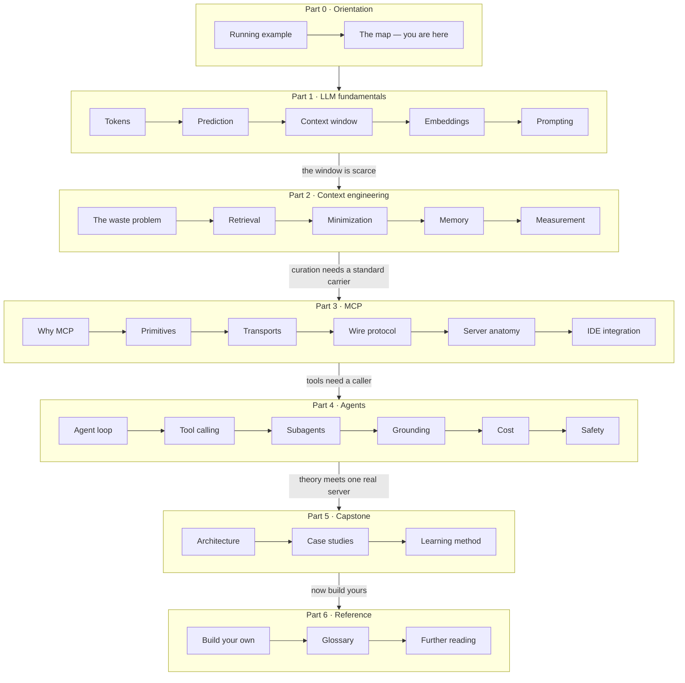

# The map of everything

Every chapter on this site teaches one stage of a single pipeline: how a question about your code becomes tokens, how those tokens find the right context, how that context travels over a protocol, and how an agent turns the result into an answer you can act on. This page is that pipeline drawn once, end to end.

Use it two ways. First, as orientation: skim the map, read the one-line blurbs, and you will have a skeleton to hang every later chapter on. Second, as a home base: when a chapter deep in Part 4 mentions "minimization" or "the wire protocol", this page tells you where that stage lives and what feeds it. The stage labels on this map are the canonical ones — the index pages of Parts 1-4 each repeat their slice of the map using exactly these names.

## The whole curriculum in one picture

```mermaid
flowchart TB
    subgraph part0["Part 0 · Orientation"]
        direction LR
        RE["Running example"] --> MAP["The map — you are here"]
    end
    subgraph part1["Part 1 · LLM fundamentals"]
        direction LR
        TOK["Tokens"] --> PRED["Prediction"] --> CTX["Context window"] --> EMB["Embeddings"] --> PRO["Prompting"]
    end
    subgraph part2["Part 2 · Context engineering"]
        direction LR
        WASTE["The waste problem"] --> RET["Retrieval"] --> MIN["Minimization"] --> MEM["Memory"] --> MEAS["Measurement"]
    end
    subgraph part3["Part 3 · MCP"]
        direction LR
        WHY["Why MCP"] --> PRIM["Primitives"] --> TRANS["Transports"] --> WIRE["Wire protocol"] --> ANAT["Server anatomy"] --> IDE["IDE integration"]
    end
    subgraph part4["Part 4 · Agents"]
        direction LR
        LOOP["Agent loop"] --> CALL["Tool calling"] --> SUB["Subagents"] --> GRND["Grounding"] --> COST["Cost"] --> SAFE["Safety"]
    end
    subgraph part5["Part 5 · Capstone"]
        direction LR
        ARCH["Architecture"] --> CASES["Case studies"] --> METH["Learning method"]
    end
    subgraph part6["Part 6 · Reference"]
        direction LR
        BUILD["Build your own"] --> GLOS["Glossary"] --> READ["Further reading"]
    end
    part0 --> part1
    part1 -->|"the window is scarce"| part2
    part2 -->|"curation needs a standard carrier"| part3
    part3 -->|"tools need a caller"| part4
    part4 -->|"theory meets one real server"| part5
    part5 -->|"now build yours"| part6
```

Read it top to bottom. Part 1 ([LLM fundamentals](../part1-fundamentals/index.md)) explains the machine you are feeding. Part 2 ([context engineering](../part2-context/index.md)) explains how to feed it well. Part 3 ([MCP](../part3-mcp/index.md)) standardizes the plumbing between the machine and your tools. Part 4 ([agents](../part4-agents/index.md)) puts the machine in a loop. Part 5 ([the capstone](../part5-capstone/index.md)) walks through one real server that implements the middle of this map, and Part 6 hands you the keyboard with [Build your own MCP server](../part6-reference/build-your-own.md).

Every node on the map links to its chapter in the stage-by-stage list below.

## Stage by stage

| Part | Chapter | What you can do after reading | Key diagram |
|------|---------|------------------------------|-------------|
| 0 | [Running example](running-example.md) | Explain why the site teaches against a real server, not toy demos | Three-layer frame |
| 0 | The map | Navigate the full curriculum; find any stage by topic or by time | Full curriculum flowchart |
| 1 | [Tokens](../part1-fundamentals/tokens.md) | Estimate token cost for any text; predict why code costs more than prose | BPE merge loop; two tokenizers, one text |
| 1 | [Prediction](../part1-fundamentals/what-llms-do.md) | Describe next-token prediction precisely; use temperature as an engineering control | Autoregressive loop; training vs. inference timeline |
| 1 | [Context window](../part1-fundamentals/context-windows.md) | Explain why re-sending costs compound; place important context at the edges | Window composition; lost-in-the-middle curve |
| 1 | [Embeddings](../part1-fundamentals/embeddings.md) | Trace a similarity search from index to result; diff the four silent failure modes | Quadrant chart; silent-failure decision tree |
| 1 | [Prompting](../part1-fundamentals/prompting-basics.md) | Build a five-part prompt; trace bad answers back to the missing part | Five-part flowchart with failure modes |
| 2 | [The waste problem](../part2-context/why-raw-context-fails.md) | Compute signal-to-noise for any file; name the four curation moves | Token-cost comparison; pie chart; curation pipeline |
| 2 | [Retrieval](../part2-context/rag-for-code.md) | Trace a full RAG pipeline; defend syntax-aware chunking and hybrid ranking | Six-stage pipeline; hybrid score merge |
| 2 | [Minimization](../part2-context/structural-minimization.md) | Pick a transform for a question; state what it loses | Transform table; minimizer pipeline |
| 2 | [Memory](../part2-context/persistent-memory.md) | Design a memory store on four axes; avoid the retrieval-mode mismatch | ER diagram; memory sequence |
| 2 | [Measurement](../part2-context/measuring-quality.md) | Score a curated context with key-point recall; apply four honest-accounting rules | Eval harness flowchart; recall vs. compression |
| 3 | [Why MCP](../part3-mcp/why-mcp.md) | Explain N×M → N+M; use host/client/server correctly; state what MCP is not | Before/after integration graph |
| 3 | [Primitives](../part3-mcp/primitives.md) | Sort tools, resources, and prompts by who invokes each | Primitive invocation diagram |
| 3 | [Transports](../part3-mcp/transports.md) | Choose stdio vs. Streamable HTTP; explain the stdout corruption danger | stdio diagram; HTTP sequenceDiagram; decision tree |
| 3 | [Wire protocol](../part3-mcp/wire-protocol.md) | Trace a tool call from model emission to server execution at the JSON level | Handshake; tool invocation; error paths |
| 3 | [Server anatomy](../part3-mcp/writing-a-server.md) | Lay out the four layers; enforce a dependency fence with a test | Layer diagram; fence structure |
| 3 | [IDE integration](../part3-mcp/ide-integration.md) | Connect a server to VS Code, Claude Code, Claude Desktop, and Cursor | — |
| 4 | [Agent loop](../part4-agents/agent-loop.md) | Trace one iteration end to end; guard against the three failure modes | State machine; sequence diagram; parallel calls |
| 4 | [Tool calling](../part4-agents/tool-calling.md) | Write descriptions that select well; design results and errors that keep loops moving | Call lifecycle sequence |
| 4 | [Subagents](../part4-agents/agents-subagents.md) | Explain context isolation; choose among fan-out, pipeline, and worker-pool | Orchestrator/subagent isolation diagram |
| 4 | [Grounding](../part4-agents/grounded-prompting.md) | Assemble a grounded prompt from live project state; make it golden-testable | — |
| 4 | [Cost](../part4-agents/cost-efficiency.md) | Reconstruct any session's bill from loop mechanics; apply the two levers | Cumulative-token chart; routing diagram |
| 4 | [Safety](../part4-agents/safety.md) | Draw trust boundaries; rank five mitigations by what each guarantees | Trust-boundary diagram; mitigations priority flowchart |
| 5 | [Architecture](../part5-capstone/architecture.md) | Describe Sankshep's architecture in 30 seconds; trace a request through every subsystem | Full architecture flowchart; request sequence |
| 5 | [Case studies](../part5-capstone/index.md) | Defend seven engineering-judgment decisions with alternatives and flip conditions | One diagram per case study |
| 5 | [Learning method](../part5-capstone/learning-a-codebase.md) | Apply a five-step method to learn any unfamiliar codebase | 5-step cycle |
| 6 | [Build your own](../part6-reference/build-your-own.md) | Write a complete, small MCP server from scratch | — |
| 6 | [Glossary](../part6-reference/glossary.md) | Look up any bolded term with its operational definition and source chapter | Concept map |
| 6 | [Further reading](../part6-reference/further-reading.md) | Find dated primary sources grouped by part | — |

## One question through the whole stack

The map above is organized by topic. Here is the same territory organized by time: one question, from your keyboard to an answer, touching the stages in order.

```mermaid
flowchart LR
    Q["A question:<br/>'Where is login validated?'"]
    S1["Tokens + Prompting:<br/>the question becomes<br/>a budgeted prompt"]
    S2["Agent loop:<br/>the client sends prompt<br/>plus tool list to the model"]
    S3["Tool calling:<br/>the model emits a call<br/>to a search tool"]
    S4["Wire protocol:<br/>MCP carries the call<br/>to a server"]
    S5["Retrieval + Minimization:<br/>the server returns compact,<br/>relevant code"]
    S6["Context window:<br/>the result joins<br/>the conversation"]
    S7["Answer:<br/>the model writes it —<br/>cost = tokens billed"]
    Q --> S1 --> S2 --> S3 --> S4 --> S5 --> S6 --> S7
```

Follow the arrows and notice two things. First, the model never touches your repository. It emits a request, and other software — the client, the protocol, the server — does the touching. That division of labor is the three-layer frame previewed in [the running example](running-example.md), and it is why MCP and agents get separate parts of this site.

Second, tokens enter at the first arrow and are paid for at every arrow after it: each hop either adds tokens to the window or re-sends the ones already there. Part 2 exists to shrink that flow; [Cost](../part4-agents/cost-efficiency.md) exists to account for it honestly.

!!! example "In the wild: Sankshep"
    The middle of this map is not hypothetical. Sankshep — the production MCP server introduced in [the running example](running-example.md) — ships the Part 2 stages as subsystems (retrieval, minimization, memory, measurement) and exposes them through the Part 3 machinery: tools, a prompt, and a resource, served over stdio or HTTP. Part 5 re-walks the map through its architecture, one design decision at a time. If you skip every block like this one, the curriculum still stands on its own; if you read them, every abstraction gets a production counterweight.

## Where to start

If this is your first pass through the material, read linearly: the map is ordered so that every stage uses only what came before it. If you already run agents daily and want the protocol and architecture material, the [home page](../index.md) lays out a faster path through Parts 3 to 5. Either way, come back here whenever you lose the thread — that is what a map is for.
