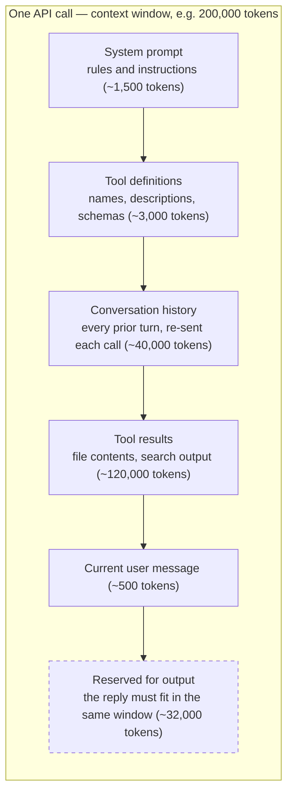
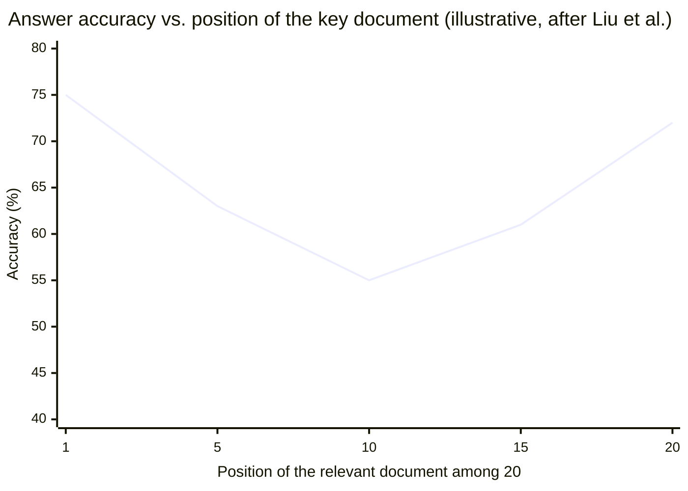

# The context window

You already know that a model reads and writes [tokens](tokens.md). This chapter is about the container those tokens live in. By the end you will be able to explain what a context window is, why input and output share it, why every API call re-sends the entire conversation, and why a bigger window is not a license to fill it.

That last point matters most. It is the single sentence this site keeps returning to: **the job is curation, not accumulation.**

## What the context window is

The **context window** is the maximum number of tokens a model can process in one call — everything the model conditions on to produce output, plus the output itself. It is a hard limit: tokens beyond it are not "skimmed" or "half-read"; they are simply not part of the input.

It helps to look at what actually fills a window in a real tool-using session. Your question is usually the smallest block in it.

Two things to notice in that picture:

- **Input and output share the window.** If the limit is 200,000 tokens and you send 195,000 tokens of input, the longest possible reply is about 5,000 tokens — regardless of what the model's separate output limit says. Some providers also publish a smaller dedicated output cap; whichever ceiling you hit first wins.
- **Tool results dominate.** In agentic workflows, files and search output routinely dwarf everything a human typed. That is why [Part 2](../part2-context/index.md) exists.

## The window is re-sent on every call

A model API call is stateless. As covered in [What an LLM actually does](what-llms-do.md), the model has exactly two sources of information: its weights and the tokens in the current call. There is no hidden memory on the server that carries your conversation from one call to the next. The model "knows" (in the [operational sense](what-llms-do.md)) only what is inside the window right now.

So when a chat feels continuous, that is the client's doing: on every turn, it re-sends the system prompt, the tool definitions, and the entire history, with your latest message appended. Turn 10 pays again for turns 1 through 9.

This has a quiet but brutal consequence for cost. A 30-turn conversation is not 30 small bills; it is 30 bills of *increasing* size, because each one contains all its predecessors. In an agent loop, where a single task may take many tool-calling iterations, this multiplier is the dominant cost driver — [Cost and efficiency](../part4-agents/cost-efficiency.md) works the numbers.

## How big are windows in practice?

Window sizes are among the fastest-moving numbers in this field, so this page — and only this page — states them, dated.

!!! warning "Evolving — verified 2026-07-18"
    As of 2026-07-18: Anthropic's Claude models have a 1,000,000-token window as the generally available default on Opus 4.8, 4.7, and 4.6, Sonnet 5 and 4.6, and Fable 5 / Mythos 5, while Sonnet 4.5 stays at 200,000 (see the [Anthropic model docs](https://docs.anthropic.com/en/docs/about-claude/models)). OpenAI's flagship GPT-5.5 accepts a 1,050,000-token context with a 128,000-token output limit (see the [OpenAI model docs](https://platform.openai.com/docs/models)). Gemini 2.5 Pro offers 1,000,000 tokens, with roughly 2,000,000 available through Vertex AI tiers (see the [Gemini model docs](https://ai.google.dev/gemini-api/docs/models)). This changes quickly; check those official pages for current values.

A million tokens sounds like the end of the problem: an entire mid-sized codebase fits. It is not the end of the problem, for two reasons — one economic, one empirical. The economic one you just met: every one of those tokens is re-billed on every call. The empirical one is next.

## Lost in the middle

**Lost in the middle** is the measured tendency of language models to answer more accurately when the relevant information sits at the beginning or end of a long context than when it sits in the middle. The canonical study is Liu et al., "Lost in the Middle: How Language Models Use Long Contexts" (TACL 2024, [arXiv 2307.03172](https://arxiv.org/abs/2307.03172)): the researchers placed the one document containing the answer at different positions among many distractors and plotted accuracy against position. The result is a U-shaped curve.

The numbers above are illustrative — shapes, not measurements — but the shape is the finding: performance does not degrade gracefully from front to back; it sags in the middle.

Later work refined the picture rather than overturning it. Benchmarks such as RULER, HELMET ([arXiv 2410.02694](https://arxiv.org/abs/2410.02694)), and NoLiMa repeatedly find that the *effective* context length — the span over which a model performs to spec — is often shorter than the advertised window, especially once the task requires more than literal string matching. Anthropic's own engineering writing describes the same phenomenon as "context rot": as the token count grows, retrieval quality across the window erodes. Pointers to all of these are collected in [Further reading](../part6-reference/further-reading.md).

The practical reading: an advertised window is a capacity guarantee, not a quality guarantee. What you can *fit* and what the model can *use well* are different quantities.

## More context is not better context

Put the three facts of this chapter side by side:

1. Input and output share one hard limit.
2. Everything in the window is re-sent — and re-billed — on every call.
3. Quality sags for material buried in the middle of a large context.

Together they demolish the tempting strategy of "just paste everything in." Filling the window costs money on every iteration, crowds out room for the answer, and buries the signal in exactly the region where models perform worst. A window is not a bucket to fill; it is a budget to spend.

That reframing — from *how much can I fit?* to *what has earned its place?* — is the pivot of this entire curriculum. [Why raw context is wasteful](../part2-context/why-raw-context-fails.md) makes the failure concrete with worked numbers, and the rest of Part 2 builds the toolkit: retrieve the right material, compress it structurally, remember durable facts, and measure whether the compressed context still answers questions.

!!! example "In the wild: Sankshep"
    Sankshep — the production MCP server introduced in [The running example](../part0-orientation/running-example.md) — exists because of this chapter: its entire purpose is to fill a client's context window with fewer, better tokens instead of more of them.

## Checkpoints

**1. A model has a 200,000-token context window and a published 32,000-token output limit. You send 195,000 tokens of input. What is the longest reply you can get, and why?**

??? success "Answer"
    About 5,000 tokens. Input and output share the same window, so 195,000 tokens of input leave only ~5,000 tokens of room, even though the model could otherwise produce up to 32,000 output tokens. The binding constraint is whichever limit you hit first.

**2. Why does a 30-turn conversation cost far more than 30 independent single-turn calls, even if every message is the same length?**

??? success "Answer"
    Because API calls are stateless, the client re-sends the entire history on every turn. Turn N's input contains turns 1 through N−1, so input size — and cost — grows with every turn. Thirty independent calls each pay for one message; the 30-turn conversation pays for turn 1 thirty times.

**3. You must include one critical document among twenty in a long prompt. According to Liu et al. (arXiv 2307.03172), where should you place it, and where should you avoid placing it?**

??? success "Answer"
    Place it at the beginning or the end of the context, where measured accuracy is highest. Avoid the middle — that is where the U-shaped accuracy curve bottoms out.

**4. A teammate says: "The new model has a 1M-token window, so we can retire our retrieval pipeline and just send the whole repo." Give two distinct reasons this is a bad trade.**

??? success "Answer"
    First, cost: the whole repo would be re-sent and re-billed on every call of every loop iteration, so the bill scales with repo size times iterations. Second, quality: effective context length is shorter than the advertised window, and material in the middle of a huge context is exactly where lost-in-the-middle degradation hits hardest. Capacity to fit is not ability to use. (A third reason: a filled window leaves less room for the output.)

## Try it

Run a miniature lost-in-the-middle experiment against any chat model you have access to.

1. **Build a haystack.** Generate about 2,000 words of plausible filler — for example, concatenate a few permissive license texts, or generate paragraphs of generic project documentation.
2. **Plant a needle.** Insert one distinctive, unguessable fact as its own sentence, e.g. `The deployment vault code is 7419.`
3. **Make three variants.** Place that sentence near the start of the filler in variant A, in the middle in variant B, and near the end in variant C. Keep everything else identical.
4. **Ask.** For each variant, send the full text followed by: "Based only on the text above, what is the deployment vault code?" Run each variant three times.
5. **Score and scale.** Record how many of the nine runs answered correctly. With only 2,000 words, a strong model will likely go nine for nine — so double the filler and repeat until you see the middle position fail first.

The point is not to catch a specific model failing; it is to feel how position and haystack size interact — and to notice that *you*, the context author, control both.
