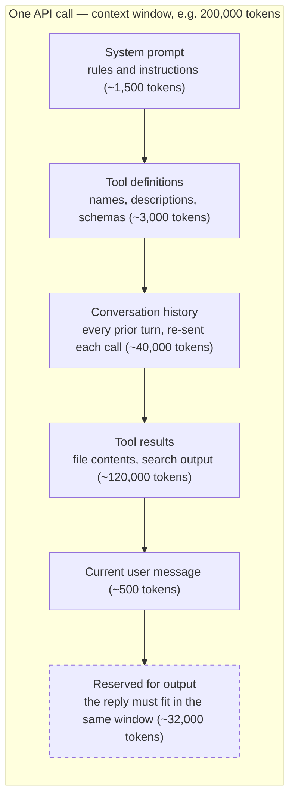
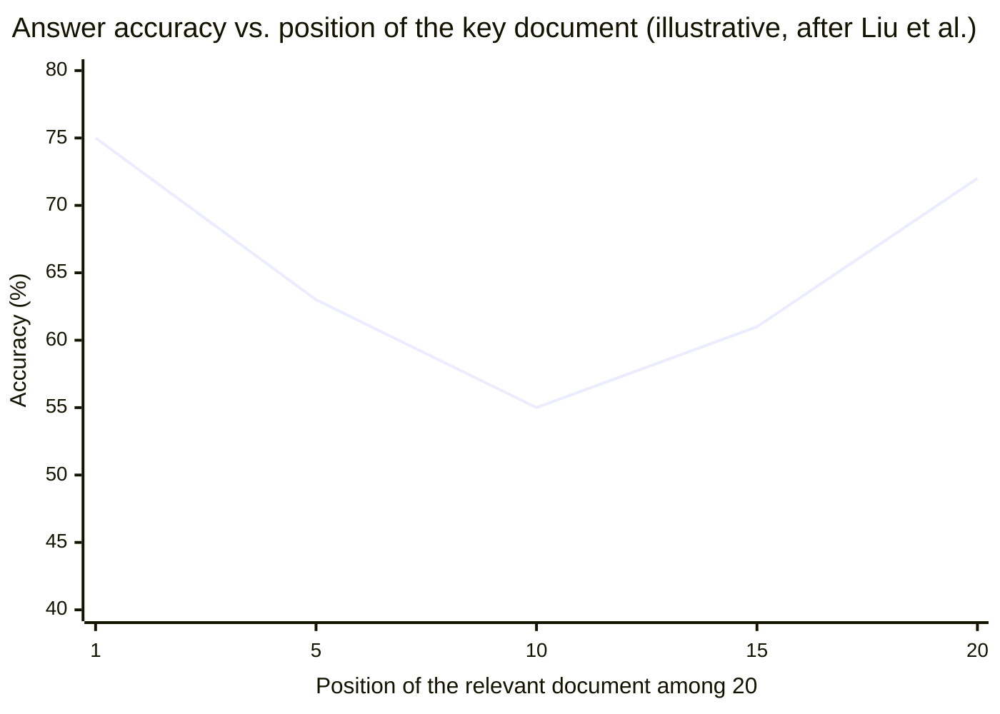

# The context window

You already know that a model reads and writes [tokens](tokens.md). This chapter is about the container those tokens live in.

By the end you will be able to explain what a context window is. You will know why input and output share it, why every API call re-sends the whole conversation, and why a bigger window is not permission to fill it.

That last point matters most. It is the sentence this site keeps coming back to: **the job is curation, not accumulation.**

## What the context window is

The **context window** is the largest number of tokens a model can process in one call. It holds everything the model reads, plus the output it writes.

It is a hard limit. Tokens beyond it are not "skimmed" or half-read. They are simply not part of the input.

It helps to look at what actually fills a window in a real tool-using session. Your question is usually the smallest block in it.

```mermaid
flowchart TB
    subgraph W["One API call — context window, e.g. 200,000 tokens"]
        direction TB
        A["System prompt<br/>rules and instructions (~1,500 tokens)"]
        B["Tool definitions<br/>names, descriptions, schemas (~3,000 tokens)"]
        C["Conversation history<br/>every prior turn, re-sent each call (~40,000 tokens)"]
        D["Tool results<br/>file contents, search output (~120,000 tokens)"]
        E["Current user message (~500 tokens)"]
        F["Reserved for output<br/>the reply must fit in the same window (~32,000 tokens)"]
        A --> B --> C --> D --> E --> F
    end
    style F stroke-dasharray: 5 5
```

Two things stand out in that picture.

**Input and output share the window.** Say the limit is 200,000 tokens and you send 195,000 tokens of input. The longest possible reply is then about 5,000 tokens, whatever the model's separate output limit says. Some providers also publish a smaller output cap. Whichever ceiling you hit first is the one that binds.

**Tool results dominate.** In agent workflows, file contents and search output routinely dwarf everything a human typed. That is why [Part 2](../part2-context/index.md) exists.

## The window is re-sent on every call

A model API call is stateless.

As [What an LLM actually does](what-llms-do.md) covered, the model has exactly two sources of information: its weights, and the tokens in the current call. There is no hidden memory on the server carrying your conversation forward. The model "knows" — in the [operational sense](what-llms-do.md) — only what is inside the window right now.

So when a chat feels continuous, that is the client's doing. On every turn it re-sends the system prompt, the tool definitions, and the whole history, with your latest message added on the end.

Turn 10 pays again for turns 1 through 9.

!!! warning
    Every token in the window is re-sent, and re-billed, on every API call. A 30-turn conversation is not 30 equal bills. It is 30 bills of increasing size. In an agent loop, this is the biggest cost driver you have.

The consequence for cost is quiet but brutal. Each bill contains all the ones before it. In an agent loop, where one task may take many tool-calling rounds, this multiplier dominates everything else. [Cost and efficiency](../part4-agents/cost-efficiency.md) works the numbers.

## How big are windows in practice?

Window sizes move faster than almost any other number in this field. So this page — and only this page — states them, with a date.

!!! warning "Evolving — verified 2026-07-18"
    As of 2026-07-18: Anthropic's Claude models have a 1,000,000-token window as the generally available default on Opus 4.8, 4.7, and 4.6, Sonnet 5 and 4.6, and Fable 5 / Mythos 5. Sonnet 4.5 stays at 200,000 (see the [Anthropic model docs](https://docs.anthropic.com/en/docs/about-claude/models)). OpenAI's flagship GPT-5.5 accepts a 1,050,000-token context with a 128,000-token output limit (see the [OpenAI model docs](https://platform.openai.com/docs/models)). Gemini 2.5 Pro offers 1,000,000 tokens, with roughly 2,000,000 available through Vertex AI tiers (see the [Gemini model docs](https://ai.google.dev/gemini-api/docs/models)). This changes quickly; check those official pages for current values.

A million tokens sounds like the end of the problem. A whole mid-sized codebase fits.

It is not the end of the problem, for two reasons. One is economic, one is empirical. You have just met the economic one: every one of those tokens is re-billed on every call. The empirical one comes next.

## Lost in the middle

**Lost in the middle** is the measured tendency of language models to answer more accurately when the key information sits at the start or end of a long context, rather than in the middle.

The canonical study is Liu et al., "Lost in the Middle: How Language Models Use Long Contexts" (TACL 2024, [arXiv 2307.03172](https://arxiv.org/abs/2307.03172)). The researchers placed the one document containing the answer at different positions among many distractors, then plotted accuracy against position. The result is a U-shaped curve.

```mermaid
xychart-beta
    title "Answer accuracy vs. position of the key document (illustrative, after Liu et al.)"
    x-axis "Position of the relevant document among 20" [1, 5, 10, 15, 20]
    y-axis "Accuracy (%)" 40 --> 80
    line [75, 63, 55, 61, 72]
```

The numbers above are illustrative — shapes, not measurements. But the shape *is* the finding. Performance does not fade gently from front to back. It sags in the middle.

Later work refined this picture rather than overturning it. Benchmarks such as RULER, HELMET ([arXiv 2410.02694](https://arxiv.org/abs/2410.02694)), and NoLiMa keep finding the same thing: the *effective* context length is often shorter than the advertised window. The gap widens once a task needs more than literal string matching. Anthropic's engineering writing calls the same effect "context rot" — as token count grows, retrieval quality across the window erodes. [Further reading](../part6-reference/further-reading.md) collects pointers to all of these.

The practical reading is short. An advertised window is a capacity guarantee, not a quality guarantee. What you can *fit* and what the model can *use well* are two different numbers.

## More context is not better context

Put this chapter's three facts side by side:

1. Input and output share one hard limit.
2. Everything in the window is re-sent, and re-billed, on every call.
3. Quality sags for material buried in the middle of a large context.

Together they destroy the tempting strategy of "just paste everything in".

Filling the window costs money on every round. It crowds out room for the answer. And it buries the signal in exactly the region where models perform worst.

A window is not a bucket to fill. It is a budget to spend.

!!! tip
    Put the most important context at the very start or the very end of the window. The U-shaped accuracy curve means material in the middle is the most likely to be missed, and that gets worse as the window grows.

That reframing — from *how much can I fit?* to *what has earned its place?* — is the pivot of this whole curriculum.

[Why raw context is wasteful](../part2-context/why-raw-context-fails.md) makes the failure concrete with worked numbers. The rest of Part 2 builds the toolkit: retrieve the right material, compress it structurally, remember durable facts, and measure whether the compressed context still answers questions.

!!! example "In the wild: Sankshep"
    Sankshep — the production MCP server introduced in [The running example](../part0-orientation/running-example.md) — exists because of this chapter. Its entire purpose is to fill a client's context window with fewer, better tokens instead of more of them.

!!! failure "Common misconception"
    *"Million-token windows mean context engineering is a solved problem — just send everything."*

    A larger window relaxes the hard limit. It changes nothing about the other two costs.

    You still pay for every token on every lap of an [agent loop](../part4-agents/agent-loop.md). So the bill scales with what you send, not with what you needed.

    Accuracy still degrades as the window fills, too. [Attention is shared among all positions](what-llms-do.md), so each irrelevant token is one more competitor for the relevance the useful ones need.

    Big windows make careless context *possible*, not *free*. They raise the ceiling on what you can send, and leave every reason to send less exactly where it was.

## Checkpoints

**1. A model has a 200,000-token context window and a published 32,000-token output limit. You send 195,000 tokens of input. What is the longest reply you can get, and why?**

??? success "Answer"
    About 5,000 tokens.

    Input and output share the same window. So 195,000 tokens of input leave only about 5,000 tokens of room, even though the model could otherwise write up to 32,000 output tokens. Whichever limit you hit first is the one that binds.

**2. Why does a 30-turn conversation cost far more than 30 separate single-turn calls, even when every message is the same length?**

??? success "Answer"
    Because API calls are stateless, so the client re-sends the whole history on every turn.

    Turn N's input contains turns 1 through N−1. So input size, and cost, grows with every turn. Thirty separate calls each pay for one message. The 30-turn conversation pays for turn 1 thirty times.

**3. You must include one critical document among twenty in a long prompt. Based on Liu et al. (arXiv 2307.03172), where should you put it, and where should you avoid putting it?**

??? success "Answer"
    Put it at the start or the end of the context, where measured accuracy is highest.

    Avoid the middle. That is where the U-shaped accuracy curve bottoms out.

**4. A teammate says: "The new model has a 1M-token window, so we can retire our retrieval pipeline and just send the whole repo." Give two separate reasons this is a bad trade.**

??? success "Answer"
    First, cost. The whole repo would be re-sent and re-billed on every call of every loop round, so the bill scales with repo size times rounds.

    Second, quality. Effective context length is shorter than the advertised window, and material in the middle of a huge context is exactly where lost-in-the-middle hits hardest. Being able to fit something is not the same as being able to use it.

    A third reason, if you want one: a full window leaves less room for the output.

## Try it

Run a miniature lost-in-the-middle experiment against any chat model you can reach.

1. **Build a haystack.** Generate about 2,000 words of plausible filler. Concatenating a few permissive license texts works, as does generating paragraphs of generic project documentation.
2. **Plant a needle.** Insert one distinctive, unguessable fact as its own sentence. For example: `The deployment vault code is 7419.`
3. **Make three variants.** Put that sentence near the start of the filler in variant A, in the middle in variant B, and near the end in variant C. Keep everything else identical.
4. **Ask.** For each variant, send the full text followed by: "Based only on the text above, what is the deployment vault code?" Run each variant three times.
5. **Score, then scale up.** Record how many of the nine runs got it right. With only 2,000 words, a strong model will probably go nine for nine. So double the filler and repeat, until you see the middle position fail first.

The point is not to catch one model failing. It is to feel how position and haystack size interact — and to notice that *you*, the person writing the context, control both.
