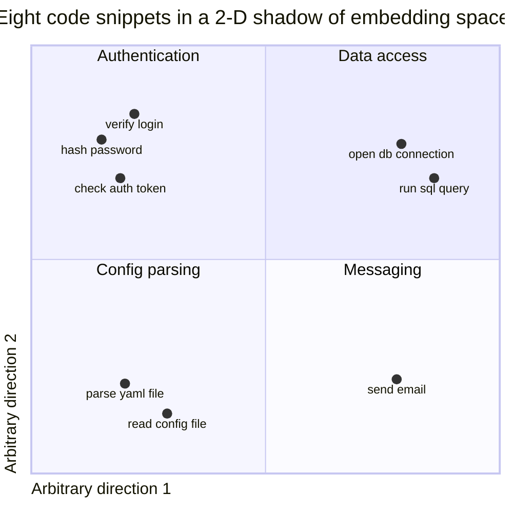
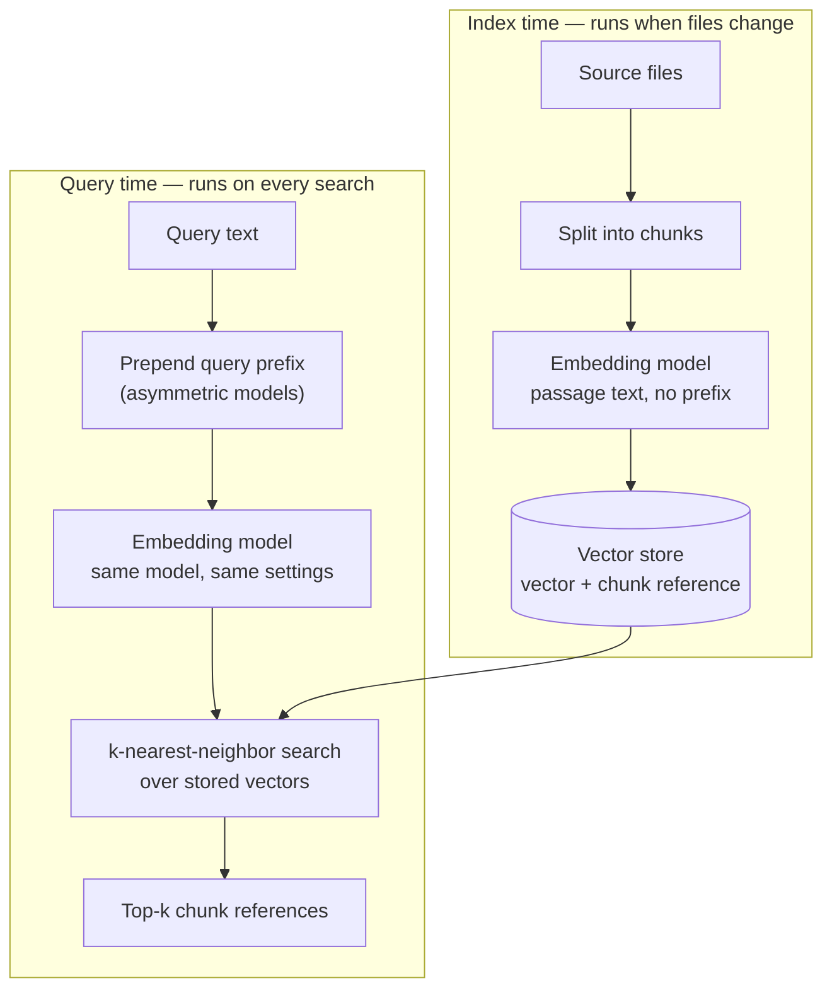

# Embeddings and similarity

Type "where is the login checked" into a plain keyword search and you get nothing unless some file literally contains those words. Retrieval systems get past this with **embeddings**: fixed-length lists of numbers — vectors — produced by a model and arranged so that pieces of text used in similar ways end up with vectors that sit close together.

By the end of this chapter you will be able to explain similarity search end to end, read cosine similarity scores without over-trusting them, name the four model-card details that silently ruin retrieval pipelines, and decide when a brute-force neighbor search is all you need.

## Vectors as coordinates for meaning

A city's latitude and longitude say nothing on their own; they are useful because *distances between coordinates* mirror distances on the ground. Embeddings apply the same trick to text: no single number means anything by itself, but the distance between two vectors mirrors how related the two texts are.

An **embedding model** is a neural network that reads one piece of text and outputs one vector. That makes it a different machine from the text-generating models in [What an LLM actually does](what-llms-do.md): it emits no [tokens](tokens.md), only numbers. Training on enormous numbers of text pairs pushes texts that occur in similar contexts toward nearby points, and unrelated texts apart.

Real embedding spaces have hundreds of dimensions, which no one can draw. Here is a hand-made two-dimensional shadow of the idea:



*Illustrative — positions are hand-placed to show the idea. Real embeddings have hundreds of dimensions, and no individual axis has a nameable meaning.*

"Hash password" sits near "check auth token" despite sharing no words. That is the entire value proposition: relatedness without shared vocabulary.

## Cosine similarity, operationally

**Cosine similarity** is the standard way to score how close two embeddings are: the dot product of the two vectors divided by the product of their lengths. It measures the *angle* between them and ignores their lengths, giving a value from −1 to 1, where 1 means "pointing the same way."

A toy example in two dimensions: for a = (1, 0) and b = (0.7, 0.7), the dot product is 0.7, the lengths are 1.0 and about 0.99, so the cosine similarity is roughly 0.71 — a 45-degree angle.

Two rules for reading real scores:

- **Rank, don't grade.** Within one model, higher means more related. But a 0.7 from one model is not a 0.7 from another — never carry a similarity threshold across models without re-measuring.
- **Only near-duplicates score near 1.0.** Related-but-different texts land in the middle of the model's own range.

One optimization appears everywhere: **L2 normalization**, scaling a vector so its length is exactly 1. Once both vectors are unit length, the denominator in the cosine formula becomes 1 and cosine similarity collapses to a plain dot product. Most retrieval stacks normalize every vector once, at index time.

## Four details that break pipelines silently

Embedding bugs rarely throw exceptions. The pipeline runs, results come back, and retrieval is just quietly worse. Four settings on the model card decide whether your numbers mean anything:

1. **Dimensions.** Every model has a fixed output width — 384, 768, 1536. Vectors from different models are never comparable, *even at the same width*: two 384-dimension models place "password" at completely different coordinates. The model that embeds queries must be the model that embedded the index.
2. **Pooling.** Internally, the model produces one vector per [token](tokens.md); **pooling** is the rule that collapses them into a single vector for the whole text — take the special first-position vector (CLS pooling) or average all of them (mean pooling). Use whichever rule the model was trained with. The classic bug is mean-pooling a CLS-trained model: everything runs, and every similarity is subtly wrong.
3. **Normalization.** If your store assumes unit-length vectors so it can use dot products, skipping L2 normalization skews every score by vector length instead of angle.
4. **Query prefixes.** Some models are trained for **asymmetric retrieval** — short queries searching long passages — with the query wrapped in a fixed instruction string during training. Prepend the same string at query time, to queries only. Omit it and accuracy drops with no error message.

!!! tip "Debugging order"
    If retrieval quality drops after a model or library change, diff these four settings between index and query time before anything else.

## Index time and query time

A similarity search system runs the expensive work once, ahead of time, and the cheap work on every query. The two lanes must agree on every setting from the previous section:



At index time, documents are split into chunks — pieces sized for retrieval; splitting code well is its own craft, covered in [Retrieval for code](../part2-context/rag-for-code.md) — and each chunk's vector is stored with a reference back to its source. At query time, one string is embedded and compared against the store.

That comparison step is **k-nearest-neighbor (KNN) search**: given a query vector, find the k stored vectors with the highest similarity. There are two ways to run it:

- **Exact (brute force).** Compare the query against every stored vector. With normalized 384-dimension vectors, a repo-sized corpus of tens of thousands of chunks costs a few milliseconds of dot products — and the answer is exactly right.
- **Indexed (approximate).** An **approximate nearest-neighbor (ANN) index** — graph-based structures such as HNSW are typical — pre-organizes the vectors so each query touches only a small fraction of them. The price: build time, memory, tuning knobs, and the possibility of missing true neighbors. ANN pays off at millions of vectors, not thousands.

The honest default: measure brute force first, and adopt an index only when latency data says so. One production version of that judgment call is the Part 5 case study [sqlite-vec over a vector DB](../part5-capstone/case-sqlite-vec-vs-vector-db.md).

Embeddings also do not replace keyword search. For code especially, exact identifier matches carry signal that vectors blur; [Retrieval for code](../part2-context/rag-for-code.md) shows why real systems combine both.

## Local or cloud

You can run a small open embedding model on your own CPU — a few hundred megabytes of weights. Nothing leaves your machine, queries cost nothing beyond electricity, and it works offline; in exchange, the quality ceiling sits below the strongest hosted models, and you own the operational details.

Or you can call a hosted embedding API: stronger models, zero local compute, someone else's operations. In exchange, every chunk of your text crosses the network, you pay per token at both index and query time, and if the provider retires the model you must re-embed the entire corpus — vectors from the replacement model live in a different space. The full tradeoff, argued with a real system's constraints, is the Part 5 case study [local ONNX over cloud](../part5-capstone/case-local-onnx-vs-cloud.md).

!!! example "In the wild: Sankshep"
    [Sankshep](../part0-orientation/running-example.md) runs its embedding pipeline entirely locally: the open model bge-small-en-v1.5 on CPU via ONNX Runtime. Its configuration reads like a checklist of this chapter's four footguns: 384 dimensions; CLS pooling (not mean — the classic bug); L2-normalized vectors; and the asymmetric query prefix `"Represent this sentence for searching relevant passages: "` on queries only. Vectors live in SQLite through sqlite-vec's `vec0` cosine KNN, with a pure-C# brute-force fallback when `vec0` is unavailable — exact search kept as the degradation path, precisely because repo-scale corpora make brute force viable.

## Checkpoints

1. A teammate built the index with model A and embeds queries with model B. Both are 384-dimension models, so nothing errors. What actually happens to search results?

    ??? success "Answer"
        The arithmetic runs because the widths match, but the two models place texts at unrelated coordinates — same width does not mean same space. Scores between an A-vector and a B-vector are meaningless, so results are effectively random. Both lanes must use the same model with the same settings.

2. After a library upgrade, search returns plausible-looking but noticeably worse results, with no exceptions anywhere. Which four settings do you diff first, and why those?

    ??? success "Answer"
        Model identity (index vs query), pooling (CLS vs mean), L2 normalization (present or dropped), and the asymmetric query prefix (still prepended to queries?). These four change scores without changing whether the code runs — embedding bugs fail silently, so check configuration before logic.

3. Why does L2-normalizing all vectors at index time let the store use a plain dot product instead of full cosine similarity?

    ??? success "Answer"
        Cosine similarity is the dot product divided by the product of the two vectors' lengths. After L2 normalization every length is 1, the denominator disappears, and the dot product *is* the cosine similarity.

4. Your corpus is 40,000 chunks of 384-dimension vectors. Do you need an ANN index before shipping?

    ??? success "Answer"
        No. Exact brute-force KNN over tens of thousands of normalized vectors takes a few milliseconds and returns exactly the right neighbors. ANN trades recall and operational complexity for speed, which pays off at millions of vectors. Measure brute-force latency first; add the index only if the numbers demand it.

## Try it

Compute a 6×6 cosine similarity matrix and watch topic structure appear in the numbers.

1. Install the library: `pip install sentence-transformers`.
2. Run this script (the model downloads once, then runs locally on CPU):

    ```python
    from sentence_transformers import SentenceTransformer

    sentences = [
        "Validate the user's password against the stored hash.",
        "Reject the login if the auth token has expired.",
        "Hash the password with a per-user salt before saving.",
        "Simmer the sauce until it thickens, then add basil.",
        "Preheat the oven and butter the baking tray.",
        "Whisk the eggs with sugar until pale and fluffy.",
    ]

    model = SentenceTransformer("BAAI/bge-small-en-v1.5")
    vectors = model.encode(sentences, normalize_embeddings=True)
    similarity = vectors @ vectors.T  # unit vectors: dot product == cosine

    for row in similarity:
        print("  ".join(f"{value:.2f}" for value in row))
    ```

3. Read the matrix: a diagonal of 1.00 (each sentence against itself), a high-scoring 3×3 block in the top-left (the authentication sentences), another in the bottom-right (the cooking sentences), and low scores elsewhere. That block structure *is* semantic clustering, visible in raw numbers — no shared keywords needed between "Validate the user's password" and "auth token has expired".

4. Extension: this model is trained for asymmetric retrieval. Embed `"How is a login checked?"` twice — as-is, and with `"Represent this sentence for searching relevant passages: "` prepended — and compare each version's similarity to the six sentences. The prefixed query should separate the authentication sentences from the cooking ones more sharply.
