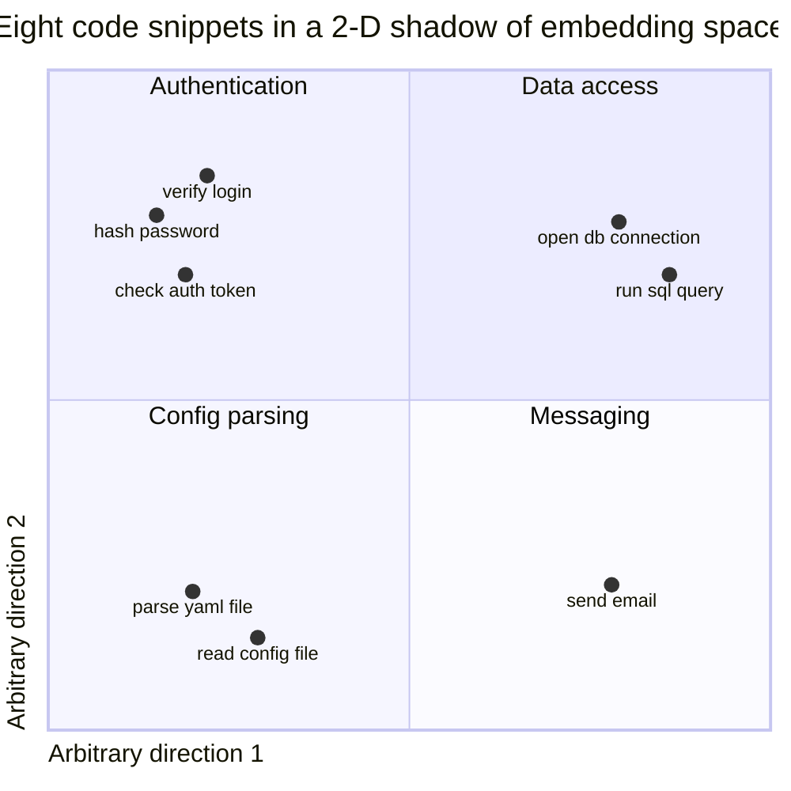
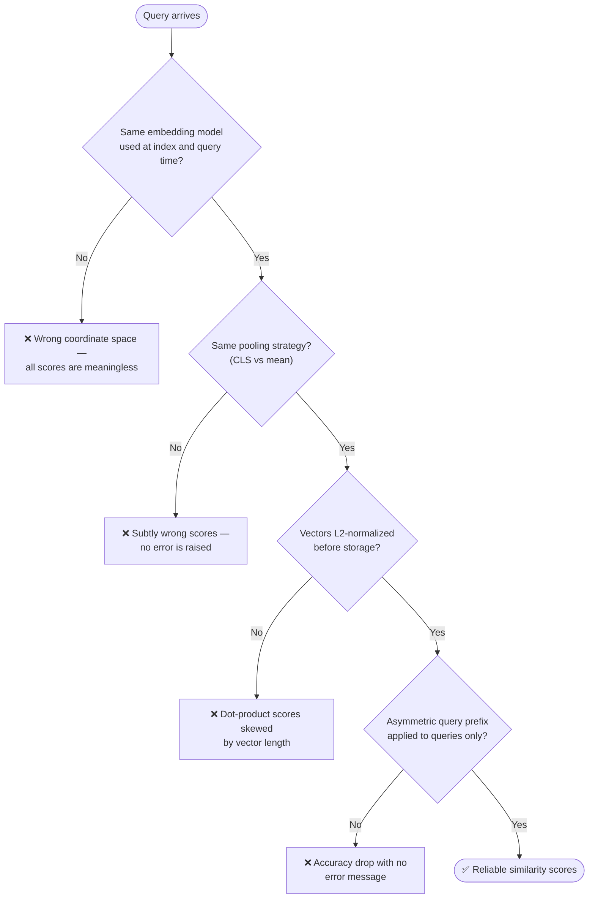
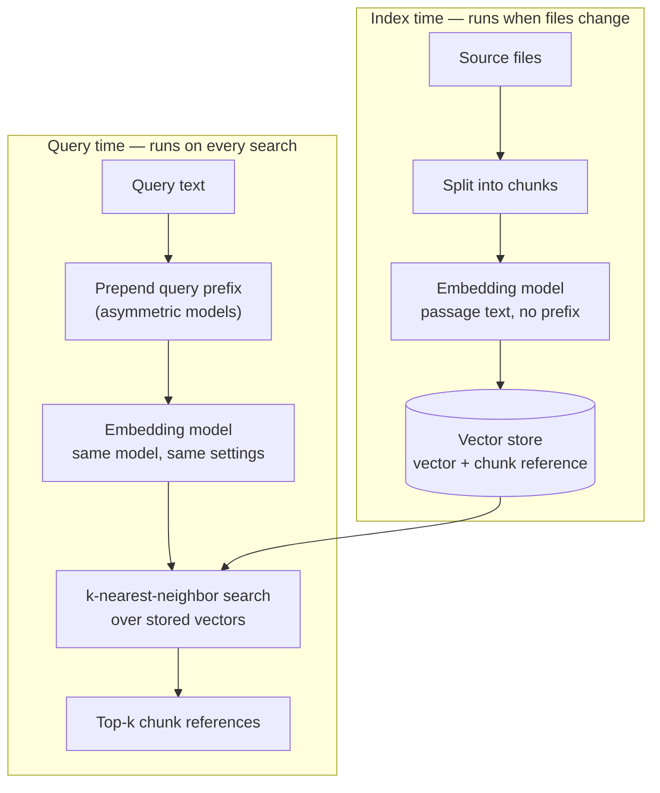

# Embeddings and similarity

Type "where is the login checked" into a plain keyword search and you get nothing, unless some file literally contains those words.

Retrieval systems get past this with **embeddings**: fixed-length lists of numbers, called vectors, produced by a model. They are arranged so that pieces of text used in similar ways end up with vectors that sit close together.

By the end of this chapter you will be able to explain similarity search end to end. You will be able to read cosine similarity scores without over-trusting them, name the four model-card details that silently ruin retrieval, choose an embedding model on the properties that actually matter, and tell when a brute-force search is all you need.

## Vectors as coordinates for meaning

A city's latitude and longitude say nothing on their own. They are useful because *distances between coordinates* mirror distances on the ground.

Embeddings do the same trick with text. No single number means anything by itself. But the distance between two vectors mirrors how related the two texts are.

An **embedding model** is a neural network that reads one piece of text and outputs one vector. That makes it a different machine from the text-generating models in [What an LLM actually does](what-llms-do.md). It emits no [tokens](tokens.md), only numbers.

Training on huge numbers of text pairs pushes texts that appear in similar contexts toward nearby points, and unrelated texts apart.

Real embedding spaces have hundreds of dimensions, which nobody can draw. Here is a hand-made two-dimensional shadow of the idea:


```mermaid
quadrantChart
    title Eight code snippets in a 2-D shadow of embedding space
    x-axis Arbitrary direction 1
    y-axis Arbitrary direction 2
    quadrant-1 Data access
    quadrant-2 Authentication
    quadrant-3 Config parsing
    quadrant-4 Messaging
    hash password: [0.15, 0.78]
    verify login: [0.22, 0.84]
    check auth token: [0.19, 0.69]
    open db connection: [0.79, 0.77]
    run sql query: [0.86, 0.69]
    parse yaml file: [0.2, 0.21]
    read config file: [0.29, 0.14]
    send email: [0.78, 0.22]
```

*Illustrative. The positions are hand-placed to show the idea. Real embeddings have hundreds of dimensions, and no single axis has a nameable meaning.*

"Hash password" sits near "check auth token" even though they share no words. That is the whole value: relatedness without shared vocabulary.

## Cosine similarity

Start with the question the measure has to answer. Given two arrows drawn from the same origin, how do you score "these point the same way"?

The obvious answer is to measure the distance between their tips. That turns out to be wrong, and seeing why is the whole idea.

Picture two documents about the same subject: a one-line comment and a thousand-line file. Both point in the "authentication" direction. But the long one is a much longer arrow, simply because it contains more of everything.

Judged by tip-to-tip distance, they look unrelated. Judged by *direction*, they are nearly identical.

So the better question is not "how far apart are the tips?" It is "how wide is the angle between them?"

Cosine turns that angle into a single number. A 0° angle gives 1. A 90° angle gives 0. A 180° angle gives −1. Direction counts; length is thrown away.

**Cosine similarity** is that measure. It is the dot product of the two vectors, divided by the product of their lengths. The result runs from −1 to 1, where 1 means "pointing the same way".

Work one all the way through, in two dimensions where you can picture it. Take **a** = (1, 0), pointing straight along the first axis. Take **b** = (0.7, 0.7), pointing diagonally.

1. **Dot product.** Multiply matching components and add: (1 × 0.7) + (0 × 0.7) = **0.7**.
2. **Length of a.** √(1² + 0²) = **1.0**.
3. **Length of b.** √(0.7² + 0.7²) = √0.98 ≈ **0.99**.
4. **Divide.** 0.7 ÷ (1.0 × 0.99) ≈ **0.71**.

And 0.71 is the cosine of 45°. That is exactly the angle between "straight along the axis" and "diagonal". The arithmetic recovered the geometry.

Now the check that proves length really is ignored.

Double **b** to (1.4, 1.4) — a much longer arrow in the same direction. The dot product doubles to 1.4. But b's length doubles too, to about 1.98. The ratio does not move: still 0.71.

That is the property you are buying. It is why a short comment and a long file about the same topic can score alike.

Real embeddings do this in hundreds of dimensions instead of two. The arithmetic does not change. There are just more terms in the sum, and nobody can draw the picture.

Two rules for reading real scores:

- **Rank, do not grade.** Within one model, higher means more related. But a 0.7 from one model is not a 0.7 from another. Never carry a threshold across models without re-measuring.
- **Only near-duplicates score near 1.0.** Texts that are related but different land in the middle of the model's own range.

One optimization shows up everywhere: **L2 normalization**, which scales a vector so its length is exactly 1. Once both vectors are unit length, the bottom of the cosine formula becomes 1, and cosine similarity collapses to a plain dot product. Most retrieval systems normalize every vector once, at index time.

!!! failure "Common misconception"
    *"A cosine similarity of 0.85 means the texts are 85% similar."*

    It means neither 85% nor anything else on an absolute scale.

    Cosine similarity is a **ranking signal**, not a percentage. Its only reliable reading is that 0.85 beats 0.80, for the same model on the same corpus.

    Different models sit in different ranges. One may cluster all real matches between 0.6 and 0.9. Another may put them between 0.2 and 0.5. So a threshold tuned on one model, moved to another, will either let everything through or reject everything.

    This is the single most common way a "model upgrade" quietly destroys retrieval quality. The vectors changed space. The threshold in the config file did not.

## Four details that break pipelines silently

Embedding bugs rarely throw exceptions. The pipeline runs, results come back, and retrieval is just quietly worse.

Four settings on the model card decide whether your numbers mean anything.

1. **Dimensions.** Every model has a fixed output width: 384, 768, 1536. Vectors from different models are never comparable, *even at the same width*. Two 384-dimension models put "password" at completely different coordinates. The model that embeds queries must be the model that embedded the index.
2. **Pooling.** Inside, the model produces one vector per [token](tokens.md). **Pooling** is the rule that collapses those into a single vector for the whole text. It either takes the special first-position vector (CLS pooling) or averages all of them (mean pooling). Use whichever rule the model was trained with. The classic bug is mean-pooling a CLS-trained model: everything runs, and every score is subtly wrong.
3. **Normalization.** If your store assumes unit-length vectors so it can use dot products, skipping L2 normalization skews every score by vector length instead of angle.
4. **Query prefixes.** Some models are trained for **asymmetric retrieval**, where short queries search long passages. During training, the query is wrapped in a fixed instruction string. You must add the same string at query time, to queries only. Leave it out and accuracy drops with no error message.

!!! tip "Debugging order"
    If retrieval quality drops after a model or library change, compare these four settings between index time and query time before you look at anything else.


```mermaid
flowchart TD
    A(["Query arrives"])
    B{"Same embedding model<br/>used at index and query time?"}
    FAIL1["❌ Wrong coordinate space —<br/>all scores are meaningless"]
    C{"Same pooling strategy?<br/>(CLS vs mean)"}
    FAIL2["❌ Subtly wrong scores —<br/>no error is raised"]
    D{"Vectors L2-normalized<br/>before storage?"}
    FAIL3["❌ Dot-product scores skewed<br/>by vector length"]
    E{"Asymmetric query prefix<br/>applied to queries only?"}
    FAIL4["❌ Accuracy drop with no<br/>error message"]
    OK(["✅ Reliable similarity scores"])

    A --> B
    B -- "No" --> FAIL1
    B -- "Yes" --> C
    C -- "No" --> FAIL2
    C -- "Yes" --> D
    D -- "No" --> FAIL3
    D -- "Yes" --> E
    E -- "No" --> FAIL4
    E -- "Yes" --> OK
```

*Every gate here fails silently. The pipeline still produces numbers, and nothing throws. Work through the gates in order before debugging anything else.*

## Index time and query time

A similarity search system does the expensive work once, ahead of time, and the cheap work on every query. The two lanes must agree on every setting from the last section.


```mermaid
flowchart TB
    subgraph idx["Index time — runs when files change"]
        A[Source files] --> B["Split into chunks"]
        B --> C["Embedding model<br>passage text, no prefix"]
        C --> V[("Vector store<br>vector + chunk reference")]
    end
    subgraph qry["Query time — runs on every search"]
        Q[Query text] --> P["Prepend query prefix<br>(asymmetric models)"]
        P --> E["Embedding model<br>same model, same settings"]
        E --> K["k-nearest-neighbor search<br>over stored vectors"]
        K --> R[Top-k chunk references]
    end
    V --> K
```

At index time, documents are split into chunks — pieces sized for retrieval — and each chunk's vector is stored with a pointer back to its source. Splitting code well is its own craft, covered in [Retrieval for code](../part2-context/rag-for-code.md).

At query time, one string is embedded and compared against the store.

That comparison is **k-nearest-neighbor (KNN) search**: given a query vector, find the k stored vectors with the highest similarity. There are two ways to run it.

- **Exact, or brute force.** Compare the query against every stored vector. With normalized 384-dimension vectors, a repo-sized corpus of tens of thousands of chunks costs a few milliseconds of dot products. The answer is exactly right.
- **Indexed, or approximate.** An **approximate nearest-neighbor (ANN) index** — graph structures such as HNSW are typical — pre-organizes the vectors so each query touches only a small slice of them. The price is build time, memory, tuning knobs, and a chance of missing true neighbors. ANN pays off at millions of vectors, not thousands.

The honest default: measure brute force first. Adopt an index only when latency data says you must. One production version of that call is the Part 5 case study [sqlite-vec over a vector DB](../part5-capstone/case-sqlite-vec-vs-vector-db.md).

Embeddings also do not replace keyword search. For code especially, exact identifier matches carry signal that vectors blur. [Retrieval for code](../part2-context/rag-for-code.md) shows why real systems use both.

## Choosing a model

The four settings above assume you already picked an embedding model. That choice comes first, and it is hard to reverse.

No leaderboard rank answers it for you, because changing your mind later means re-embedding every chunk you own.

Start from the fact that makes this serious: **an index is married to its model.** Vectors from different models are not comparable. So "we will upgrade later" really means "we will rebuild the whole index later". Choose as if switching is expensive, because it is.

Five properties decide it, roughly in the order they tend to matter.

- **Domain fit.** A model trained mostly on web prose does worse on source code, where the vocabulary is identifiers and the structure is syntax. Benchmarks report code-retrieval scores separately for exactly this reason. The gap between a general model and a code-aware one is usually bigger than the gap between neighboring ranks on a general leaderboard.
- **Dimensions.** Wider vectors carry more information and cost more of everything: storage, memory, and time per comparison. 384 and 768 are common small sizes. 1,536 and above are typical of large hosted models. Many recent models are trained so a vector can be *cut short* and still work, which turns dimension into a runtime dial rather than a permanent commitment, at some cost in accuracy.
- **Maximum input length.** Every model has a token limit, and text past it is silently cut off rather than rejected. So chunks longer than the limit embed only their opening. The tail is invisible to retrieval, and nothing warns you. Check this against your real [chunk sizes](../part2-context/rag-for-code.md).
- **Where it runs.** A few hundred megabytes on local CPU, or a hosted API. The next section takes up that trade-off.
- **Benchmark quality, last.** A benchmark score summarizes someone else's corpus. It is useful for building a shortlist, and nearly worthless for picking the winner from it.

!!! warning "Evolving — verified 2026-08-20"
    The usual starting point for a shortlist is **MTEB** (Massive Text Embedding Benchmark) and its multilingual counterpart MMTEB, published as a [leaderboard on Hugging Face](https://huggingface.co/spaces/mteb/leaderboard). It reports a code-retrieval subset separately from prose tasks. Two cautions outlast any particular ranking: MTEB v2 scores are not comparable with v1 scores, and the top of the board reshuffles often enough that any specific recommendation here would be stale before you read it. Use it to shortlist, not to decide; check the leaderboard for current standings.

The reliable procedure is unglamorous, and it beats leaderboard-reading every time.

Shortlist two or three models that fit your dimension, length, and deployment limits. Embed a sample of *your* corpus with each one. Score them against a set of real questions with known answers.

That is the harness [Measuring context quality](../part2-context/measuring-quality.md) builds, and this is where it repays the effort fastest. A model that ranks third on a public benchmark and first on your repository is simply the better model.

??? info "Going deeper — quantization, or paying less per vector"

    A vector is normally stored as 32-bit floats. A 768-dimension vector costs about 3 KB, so a million chunks costs roughly 3 GB before any index overhead.

    **Quantization** cuts that down by storing each number with less precision.

    Two levels are common. *Scalar quantization* stores each dimension as an 8-bit integer instead of a 32-bit float. That is a 4x reduction, and the accuracy loss is usually too small to notice. *Binary quantization* keeps a single bit per dimension, recording only whether each number was positive. That is a 32x reduction, and comparisons become very fast bitwise operations, at a real cost in accuracy.

    What makes aggressive quantization safe is the same funnel as [reranking](../part2-context/rag-for-code.md). Search the quantized vectors to get a generous shortlist quickly. Then rescore that shortlist against the full-precision vectors. Cheap and approximate first, exact and expensive last, over a set small enough to afford it.

    When does this matter? At repository scale — thousands to a few hundred thousand chunks — usually not at all. A few hundred megabytes of vectors is not worth engineering around, and full precision keeps one variable out of your debugging.

    Quantization earns its complexity at millions of vectors, alongside the [ANN index](#index-time-and-query-time) that becomes necessary at the same scale, for the same reason.

## Local or cloud

You can run a small open embedding model on your own CPU, using a few hundred megabytes of weights. Nothing leaves your machine, queries cost nothing beyond electricity, and it works offline. In exchange, the quality ceiling sits below the strongest hosted models, and you own the operational details.

Or you can call a hosted embedding API. You get stronger models, no local compute, and someone else's operations. In exchange, every chunk of your text crosses the network, and you pay per token at both index and query time. If the provider retires the model, you must re-embed the entire corpus, because vectors from the replacement live in a different space.

The full trade-off, argued against a real system's constraints, is the Part 5 case study [local ONNX over cloud](../part5-capstone/case-local-onnx-vs-cloud.md).

!!! example "In the wild: Sankshep"
    [Sankshep](../part0-orientation/running-example.md) runs its embedding pipeline entirely locally, using the open model bge-small-en-v1.5 on CPU via ONNX Runtime.

    Its configuration reads like a checklist of this chapter's four traps. 384 dimensions. CLS pooling, not mean — the classic bug. L2-normalized vectors. And the asymmetric query prefix `"Represent this sentence for searching relevant passages: "` applied to queries only.

    Vectors live in SQLite through sqlite-vec's `vec0` cosine KNN, with a pure-C# brute-force fallback when `vec0` is unavailable. Exact search is kept as the fallback path precisely because repo-scale corpora make brute force practical.

## Checkpoints

1. A teammate built the index with model A and embeds queries with model B. Both are 384-dimension models, so nothing errors. What actually happens to search results?

    ??? success "Answer"
        The arithmetic runs, because the widths match. But the two models put texts at unrelated coordinates, and the same width does not mean the same space.

        Scores between an A-vector and a B-vector are meaningless, so results are effectively random. Both lanes must use the same model with the same settings.

2. After a library upgrade, search returns plausible but noticeably worse results, with no exceptions anywhere. Which four settings do you compare first, and why those?

    ??? success "Answer"
        Model identity between index and query. Pooling, CLS versus mean. L2 normalization, present or dropped. And the asymmetric query prefix, still added to queries or not.

        These four change scores without changing whether the code runs. Embedding bugs fail silently, so check configuration before logic.

3. Why does L2-normalizing all vectors at index time let the store use a plain dot product instead of full cosine similarity?

    ??? success "Answer"
        Cosine similarity is the dot product divided by the two vectors' lengths multiplied together.

        After L2 normalization, every length is 1. The bottom of the fraction disappears, and the dot product *is* the cosine similarity.

4. Your corpus is 40,000 chunks of 384-dimension vectors. Do you need an ANN index before shipping?

    ??? success "Answer"
        No. Exact brute-force KNN over tens of thousands of normalized vectors takes a few milliseconds, and returns exactly the right neighbors.

        ANN trades recall and operational complexity for speed, which pays off at millions of vectors. Measure brute-force latency first. Add the index only if the numbers demand it.

## Try it

Compute a 6×6 cosine similarity matrix and watch topic structure appear in the numbers.

1. Install the library: `pip install sentence-transformers`.
2. Run this script. The model downloads once, then runs locally on CPU.

    ```python
    from sentence_transformers import SentenceTransformer

    sentences = [
        "Validate the user's password against the stored hash.",
        "Reject the login if the auth token has expired.",
        "Hash the password with a per-user salt before saving.",
        "Simmer the sauce until it thickens, then add basil.",
        "Preheat the oven and butter the baking tray.",
        "Whisk the eggs with sugar until pale and fluffy.",
    ]

    model = SentenceTransformer("BAAI/bge-small-en-v1.5")
    vectors = model.encode(sentences, normalize_embeddings=True)
    similarity = vectors @ vectors.T  # unit vectors: dot product == cosine

    for row in similarity:
        print("  ".join(f"{value:.2f}" for value in row))
    ```

3. Now read the matrix. You should see a diagonal of 1.00, where each sentence meets itself. You should see a high-scoring 3×3 block in the top-left, the authentication sentences. Another in the bottom-right, the cooking sentences. And low scores everywhere else.

    That block structure *is* semantic clustering, visible in raw numbers. No shared keywords were needed between "Validate the user's password" and "auth token has expired".

4. **Extension.** This model is trained for asymmetric retrieval. Embed `"How is a login checked?"` twice: once as-is, and once with `"Represent this sentence for searching relevant passages: "` in front. Compare each version's similarity to the six sentences.

    The prefixed query should separate the authentication sentences from the cooking ones more sharply.
