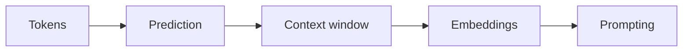

# LLM fundamentals

This part builds the five ideas that everything later on this site stands on. By the end of it you will be able to say what a token is and why bills and limits are counted in them, describe what a large language model actually does when it "answers", explain why the context window is a scarce budget rather than a bottomless inbox, use embeddings to turn "similar to my query" into a number, and assemble a prompt from parts that reliably help.

The five chapters form one chain — each stage produces exactly what the next one consumes:

These are the same stage names used on [the map of everything](../part0-orientation/the-map.md), so you can always trace where you are in the larger pipeline.

- [Tokens and tokenization](tokens.md) — the unit models read, write, and bill in.
- [What an LLM actually does](what-llms-do.md) — next-token prediction, and the operational vocabulary this site uses for words like "decides" and "knows".
- [The context window](context-windows.md) — the fixed budget that input and output share, and why more context is not automatically better.
- [Embeddings and similarity](embeddings.md) — meaning as coordinates you can sort by distance.
- [Prompting basics](prompting-basics.md) — the working parts of a prompt, treated as an engineering artifact.

## Prerequisites

No machine-learning background is assumed, and there is no math beyond arithmetic and one dot product. You should be comfortable reading short code snippets; the hands-on tasks use small Python scripts, so a working Python install with `pip` helps, but every chapter can be read without running anything.

If you already have these fundamentals, skim the chain above, note the stage names, and move on to [context engineering](../part2-context/index.md) — later parts link back here whenever they lean on a definition.
