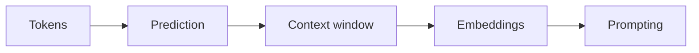

# LLM fundamentals

This part builds the five ideas that everything later on this site stands on.

By the end of it you will be able to say what a token is, and why bills and limits are counted in them. You will be able to describe what a large language model actually does when it "answers", down to why long context costs what it costs. You will see why the context window is a tight budget rather than a bottomless inbox, use embeddings to turn "similar to my query" into a number, and build a prompt from parts that reliably help.

The five chapters form one chain. Each stage produces exactly what the next one needs:

```mermaid
flowchart LR
    TOK["Tokens"] --> PRED["Prediction"] --> CTX["Context window"] --> EMB["Embeddings"] --> PRO["Prompting"]
```

These are the same stage names used on [the map of everything](../part0-orientation/the-map.md). So you can always work out where you are in the larger pipeline.

- [Tokens and tokenization](tokens.md) — the unit models read, write, and bill in.
- [What an LLM actually does](what-llms-do.md) — next-token prediction, the sampling knobs, attention and the KV cache, and the vocabulary this site uses for words like "decides" and "knows".
- [The context window](context-windows.md) — the fixed budget that input and output share, and why more context is not automatically better.
- [Embeddings and similarity](embeddings.md) — meaning as coordinates you can sort by distance, and how to pick the model that draws them.
- [Prompting basics](prompting-basics.md) — the working parts of a prompt, treated as an engineering artifact.

## Prerequisites

No machine-learning background is assumed. There is no math beyond arithmetic and one dot product, and that one is worked step by step where it appears.

You should be comfortable reading short code snippets. The hands-on tasks use small Python scripts, so a working Python install with `pip` helps. But every chapter can be read without running anything.

If you already have these fundamentals, skim the chain above and note the stage names. Then move on to [context engineering](../part2-context/index.md). Later parts link back here whenever they lean on a definition.
