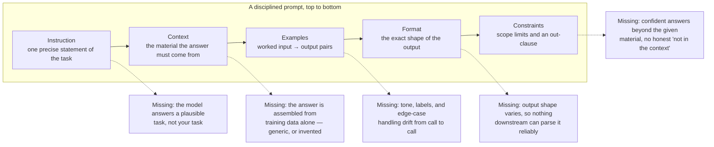

# Prompting basics

You now know that a model receives [tokens](tokens.md), holds them in a [context window](context-windows.md), and [emits the most probable continuation](what-llms-do.md). This chapter turns that mechanical picture into practice. By the end you will be able to take a vague request, restructure it into five named parts, predict which missing part a bad answer traces back to, and treat prompts with the same discipline you apply to code.

## What a prompt is

A **prompt** is the complete text input a model receives for a single call: standing instructions, conversation history, pasted or retrieved material, and the immediate request, concatenated into one token sequence. The model does not receive your intent. It receives this sequence, inside its context window, and emits the continuation that the sequence makes probable.

That framing has a practical consequence: prompting is not persuasion. A well-built prompt does not make the model ["understand"](what-llms-do.md) you — it changes the input so that the continuation you want becomes the high-probability one. Every technique in this chapter is a variation on that single move.

## Roles: who is speaking

Chat APIs split the prompt into messages, each tagged with a role — commonly `system`, `user`, and `assistant`. A **system prompt** is the message slot reserved for standing instructions — persona, rules, output policy — that apply to the whole conversation rather than to one turn.

Mechanically, roles are formatting: the API serializes each message with special tokens marking where it begins and which role produced it, and models are trained to weight instructions in the system slot heavily. Two consequences follow:

- Put durable rules in the system prompt and the per-turn task in the user message.
- A role tag is not access control. Any text that lands in the window — including file contents and tool results — can steer the continuation, whatever slot it arrived in. That is the seed of the injection problems covered in [safety and judgment](../part4-agents/safety.md).

## The five working parts of a prompt

A disciplined prompt separates five jobs. Naming them matters because each one fails differently when it is missing.

**Instruction.** One precise statement of the task. "Summarize this diff for a release note" beats "look at this diff" because it names the operation and the audience.

**Context.** The material the answer must be grounded in: the diff, the failing test, the API doc. Choosing *which* material — and how much — is a discipline of its own; [Part 2](../part2-context/why-raw-context-fails.md) is devoted to it.

**Examples.** Worked input → output pairs that demonstrate what a good answer looks like. They earn their own section below.

**Format.** The output shape, stated exactly: "return a JSON object with keys `summary` and `risk`", or "three bullets, at most 15 words each". If code will consume the answer, the format section is what makes that possible.

**Constraints.** Boundaries and an escape hatch: "change only this function", "do not add dependencies", and — most useful of all — "if the context does not contain the answer, say so". Without an out-clause, the most probable continuation for an unanswerable question is a fluent guess.

## What reliably helps — and what is incantation

Each of the five parts helps for a stable, mechanical reason: it narrows the set of high-probability continuations toward answers you can use. Precision in the instruction rules out neighboring tasks; relevant context makes grounded statements more probable than remembered ones; an explicit format collapses a thousand valid phrasings into one.

Then there are incantations: "take a deep breath", offering tips, threatening consequences, "you are the world's best programmer". Some of these have measurably shifted outputs on some models at some point — but the effects are small, task-dependent, and unstable from one model version to the next. They are correlations absorbed from training data, not levers you control. Do not build a process on them.

!!! note "Settled"
    Model-specific phrasing tips churn with every release; the anatomy above does not. Instruction, context, examples, format, constraints — that decomposition has stayed stable across model generations, and optimizing those parts pays before any hunt for magic words.

## Few-shot examples: a behavior spec you pay for

**Few-shot prompting** means including a small number of worked input → output examples in the prompt so the model continues the demonstrated pattern; **zero-shot prompting** is the instruction alone. Examples work because a pattern already instantiated in the window is easier to continue than a pattern merely described.

What examples buy is precision where instructions underdetermine. "Classify each ticket as bug, feature, or question" leaves boundaries open: is a crash report with a workaround request a bug or a question? One example settles it by demonstration. The same goes for tone, label edge cases, and format corners such as "malformed input → output `INVALID`".

What they cost is tokens — permanently. Examples ship with every call for the life of the prompt: three 200-token examples add 600 tokens to each request, multiplied across iterations in an agent loop (worked numbers in [cost and efficiency](../part4-agents/cost-efficiency.md)). The discipline: start zero-shot, add the smallest example set that fixes an observed failure, and make each example cover a *distinct* case.

## Prompts are engineering artifacts

A prompt that ships in a product is code. It has behavior; it regresses; someone will edit it under deadline pressure. Treat it accordingly:

- **Version it.** Store prompts in the repository, not in a chat history or a wiki. A prompt diff is a behavior diff and deserves review.
- **Template it.** A **prompt template** is a prompt with named slots — task, retrieved code, output rules — filled in at request time, separating the fixed scaffold you version from the per-request variables.
- **Test it.** "It looked better on the one example I tried" is not evidence. [Measuring context quality](../part2-context/measuring-quality.md) shows what a real check looks like.

Follow this road to its end and the prompt stops being hand-written at all: a program assembles it from live project state on every request. That is grounded prompting, covered in [Part 4](../part4-agents/grounded-prompting.md) — and it is exactly where our running example goes.

!!! example "In the wild: Sankshep"
    [Sankshep](../part0-orientation/running-example.md) ships prompt assembly as an MCP prompt named `compose_task_prompt`. It renders a four-section prompt — `# Task`, `# Relevant code (minimized)`, `# Project conventions`, `# Constraints` — which is this chapter's anatomy with the parts filled in by machinery: instruction from the task, context from retrieved and minimized code, constraints stated explicitly. The composer is deterministic by design — it never calls an LLM at request time (ADR-0013) — so identical inputs yield byte-identical prompts, which makes it testable against golden files. The full walkthrough is in [grounded prompting and composition](../part4-agents/grounded-prompting.md).

## Checkpoints

**1. A teammate's prompt reads: "You are an expert engineer. Fix this bug:" followed by a 500-line file. Which of the five parts are missing, and what failure do you predict?**

??? success "Answer"
    The instruction is imprecise (which bug? is "fixed" a diff, a patched file, an explanation?); format, constraints, and examples are absent; the context is present but uncurated. Predicted failure: a fluent rewrite of *some* plausible problem, in an arbitrary shape, possibly out of scope. The "expert engineer" line is the one part included — and it is the incantation.

**2. Why is the system prompt not a security boundary?**

??? success "Answer"
    Roles are serialization: tags in the token stream that the model was trained to weight, not an enforcement mechanism. Any text that reaches the context window — a user message, a file, a tool result — can make unwanted continuations more probable, regardless of what the system prompt forbids. Real enforcement has to live outside the model, in the client and its tooling; see [safety and judgment](../part4-agents/safety.md).

**3. What does a few-shot example buy that a longer instruction cannot, and what does it cost?**

??? success "Answer"
    It pins down behavior the instruction underdetermines — label boundaries, tone, format corners — by demonstration: a pattern already present in the window is easier to continue than one merely described. The cost: its tokens are re-sent on every call for the life of the prompt, multiplied by loop iterations in agent settings.

**4. A blog post claims a magic phrase improves output quality by 10%. What should you check before adopting it?**

??? success "Answer"
    Whether the effect was measured on your task and model version, and whether it survives a model update — incantation effects are typically small and unstable. Then ask whether a structural fix (sharper instruction, better context, one more example) achieves the same gain for a stable reason. If you adopt it anyway, version it and put an evaluation around it so a regression cannot hide.

## Try it

Take a small piece of code with a real bug — ideally one you have already fixed, so you can judge the answers.

1. **Baseline.** Send an assistant the prompt "fix my code" plus the pasted file. Save the response.
2. **Restructure.** Rewrite the request in a four-section structure:
   `# Task` — the precise symptom, the expected behavior, and what "done" means.
   `# Relevant code (minimized)` — only the failing function and its immediate caller, not the whole file.
   `# Project conventions` — two or three bullets, such as "no new dependencies" or "match existing error-handling style".
   `# Constraints` — output a unified diff only; if the cause is not visible in the given code, say so instead of guessing.
3. **Compare.** Send the restructured prompt in a fresh conversation and put the two responses side by side. Which addressed the actual bug? Which stayed in scope? Which could you apply without hand-editing?
4. **Count the cost.** Using the tokenizer setup from [tokens and tokenization](tokens.md), count both prompts. The structured prompt is often *smaller* — curated context replaces the whole pasted file — while producing the more usable answer.
