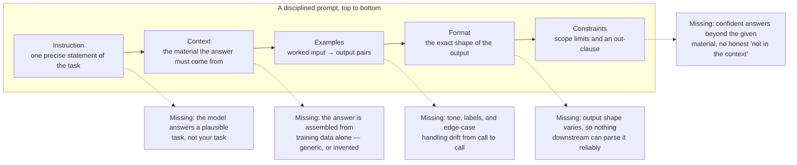

# Prompting basics

You now know that a model receives [tokens](tokens.md), holds them in a [context window](context-windows.md), and [emits the most probable continuation](what-llms-do.md). This chapter turns that picture into practice.

By the end you will be able to take a vague request and restructure it into five named parts. You will be able to trace a bad answer back to the part that was missing, and treat prompts with the same discipline you give code.

## What a prompt is

A **prompt** is the complete text a model receives for a single call. It includes standing instructions, conversation history, pasted or retrieved material, and the immediate request — all joined into one token sequence.

The model does not receive your intent. It receives this sequence, inside its context window, and emits whatever continuation the sequence makes probable.

That has a practical consequence. Prompting is not persuasion. A good prompt does not make the model ["understand"](what-llms-do.md) you. It changes the input so the answer you want becomes the probable one.

Every technique in this chapter is a variation on that one move.

## Roles: who is speaking

Chat APIs split the prompt into messages, each tagged with a role. The common ones are `system`, `user`, and `assistant`.

A **system prompt** is the message slot for standing instructions: persona, rules, output policy. These apply to the whole conversation rather than one turn.

Roles are formatting. The API writes each message out with special tokens marking where it starts and which role produced it, and models are trained to weight system-slot instructions heavily.

Two things follow:

- Put durable rules in the system prompt, and the per-turn task in the user message.
- A role tag is not access control. Any text that reaches the window can steer the output, whatever slot it arrived in. That includes file contents and tool results. This is the seed of the injection problems in [safety and judgment](../part4-agents/safety.md).

## The five working parts of a prompt

A disciplined prompt separates five jobs. Naming them matters, because each one fails differently when it is missing.

```mermaid
flowchart LR
    subgraph prompt["A disciplined prompt, top to bottom"]
        direction TB
        I["Instruction<br/>one precise statement of the task"]
        C["Context<br/>the material the answer must come from"]
        E["Examples<br/>worked input → output pairs"]
        F["Format<br/>the exact shape of the output"]
        K["Constraints<br/>scope limits and an out-clause"]
        I --> C --> E --> F --> K
    end
    I -.-> WI["Missing: the model answers a plausible<br/>task, not your task"]
    C -.-> WC["Missing: the answer is assembled from<br/>training data alone — generic, or invented"]
    E -.-> WE["Missing: tone, labels, and edge-case<br/>handling drift from call to call"]
    F -.-> WF["Missing: output shape varies, so nothing<br/>downstream can parse it reliably"]
    K -.-> WK["Missing: confident answers beyond the given<br/>material, no honest 'not in the context'"]
```

**Instruction.** One precise statement of the task. "Summarize this diff for a release note" beats "look at this diff", because it names both the operation and the audience.

**Context.** The material the answer must be built from: the diff, the failing test, the API doc. Choosing *which* material, and how much of it, is a discipline of its own. [Part 2](../part2-context/why-raw-context-fails.md) is devoted to it.

**Examples.** Worked input-to-output pairs showing what a good answer looks like. They get their own section below.

**Format.** The output shape, stated exactly. "Return a JSON object with keys `summary` and `risk`", or "three bullets, at most 15 words each". If code will consume the answer, this part is what makes that possible.

**Constraints.** Boundaries plus an escape hatch. "Change only this function." "Do not add dependencies." And most useful of all: "if the context does not contain the answer, say so."

Without that last one, the most probable continuation for an unanswerable question is a fluent guess.

!!! tip "Quick-reference: the five parts"
    | Part | Purpose | Failure when missing |
    |------|---------|---------------------|
    | Instruction | Names the task precisely | Model answers a plausible task, not your task |
    | Context | Grounds the answer in your material | Answer is assembled from training data — generic or invented |
    | Examples | Demonstrates edge-case handling and tone | Output format and label boundaries drift call to call |
    | Format | States the exact output shape | Downstream code cannot parse inconsistent output |
    | Constraints | Defines scope and the out-clause | Confident answers beyond the given material, no honest "not found" |

## What reliably helps — and what is superstition

Each of the five parts helps for a stable, mechanical reason. Each one narrows the set of probable continuations toward answers you can use.

A precise instruction rules out neighboring tasks. Relevant context makes grounded statements more probable than remembered ones. An explicit format collapses a thousand valid phrasings into one.

Then there are the incantations. "Take a deep breath." Offering tips. Threatening consequences. "You are the world's best programmer."

Some of these have measurably shifted outputs, on some models, at some point. But the effects are small, task-dependent, and unstable between model versions. They are correlations picked up from training data, not levers you control. Do not build a process on them.

!!! note "Settled"
    Model-specific phrasing tips churn with every release. The anatomy above does not. Instruction, context, examples, format, constraints — that breakdown has held across model generations, and improving those parts pays off before any hunt for magic words.

## Few-shot examples: a behavior spec you pay for

**Few-shot prompting** means putting a few worked input-to-output examples in the prompt, so the model continues the pattern you showed. **Zero-shot prompting** is the instruction alone.

Examples work for a simple reason. A pattern already present in the window is easier to continue than a pattern merely described.

What they buy is precision where instructions leave gaps. Take "classify each ticket as bug, feature, or question". That leaves boundaries open: is a crash report that also asks for a workaround a bug, or a question? One example settles it by showing rather than telling. The same goes for tone, for label edge cases, and for format corners like "malformed input produces `INVALID`".

What they cost is tokens, permanently. Examples ship with every call for the life of the prompt. Three 200-token examples add 600 tokens to every request, multiplied across every round of an agent loop. [Cost and efficiency](../part4-agents/cost-efficiency.md) has the worked numbers.

So the discipline is: start zero-shot. Add the smallest set of examples that fixes a failure you actually observed. Make each example cover a *different* case.

## Prompts are engineering artifacts

A prompt that ships in a product is code. It has behavior. It regresses. Someone will edit it under deadline pressure.

Treat it accordingly.

- **Version it.** Keep prompts in the repository, not in a chat history or a wiki. A prompt diff is a behavior diff, and it deserves review.
- **Template it.** A **prompt template** is a prompt with named slots — task, retrieved code, output rules — filled in at request time. It separates the fixed scaffold you version from the per-request variables.
- **Test it.** "It looked better on the one example I tried" is not evidence. [Measuring context quality](../part2-context/measuring-quality.md) shows what a real check looks like.

Follow that road to the end and the prompt stops being hand-written at all. A program assembles it from live project state on every request.

That is grounded prompting, covered in [Part 4](../part4-agents/grounded-prompting.md). It is also exactly where our running example goes.

!!! example "In the wild: Sankshep"
    [Sankshep](../part0-orientation/running-example.md) ships prompt assembly as an MCP prompt named `compose_task_prompt`.

    It renders a four-section prompt: `# Task`, `# Relevant code (minimized)`, `# Project conventions`, `# Constraints`. That is this chapter's anatomy, with the parts filled in by machinery — instruction from the task, context from retrieved and minimized code, constraints stated outright.

    The composer is deterministic by design. It never calls an LLM at request time, per ADR-0013. So identical inputs give byte-identical prompts, which makes it testable against golden files. The full walkthrough is in [grounded prompting and composition](../part4-agents/grounded-prompting.md).

## Checkpoints

**1. A teammate's prompt reads: "You are an expert engineer. Fix this bug:" followed by a 500-line file. Which of the five parts are missing, and what failure do you predict?**

??? success "Answer"
    The instruction is imprecise: which bug, and is "fixed" a diff, a patched file, or an explanation? Format, constraints, and examples are all absent. The context is present but uncurated.

    Predicted failure: a fluent rewrite of *some* plausible problem, in an arbitrary shape, possibly out of scope.

    The "expert engineer" line is the one part that was included. It is also the superstition.

**2. Why is the system prompt not a security boundary?**

??? success "Answer"
    Roles are just formatting: tags in the token stream that the model was trained to weight. They are not an enforcement mechanism.

    Any text that reaches the context window can make unwanted continuations more probable — a user message, a file, a tool result — whatever the system prompt forbids.

    Real enforcement has to live outside the model, in the client and its tooling. See [safety and judgment](../part4-agents/safety.md).

**3. What does a few-shot example buy that a longer instruction cannot, and what does it cost?**

??? success "Answer"
    It pins down behavior the instruction leaves open — label boundaries, tone, format corners — by demonstration. A pattern already in the window is easier to continue than one merely described.

    The cost: its tokens are re-sent on every call for the life of the prompt, multiplied by every loop round in agent settings.

**4. A blog post claims a magic phrase improves output quality by 10%. What should you check before adopting it?**

??? success "Answer"
    Whether the effect was measured on your task and your model version, and whether it survives a model update. These effects are usually small and unstable.

    Then ask whether a structural fix gets the same gain for a stable reason: a sharper instruction, better context, one more example.

    If you adopt it anyway, version it and put an evaluation around it, so a regression cannot hide.

## Try it

Take a small piece of code with a real bug. Ideally one you have already fixed, so you can judge the answers.

1. **Baseline.** Send an assistant the prompt "fix my code" plus the pasted file. Save the response.
2. **Restructure.** Rewrite the request in four sections:
   `# Task` — the precise symptom, the expected behavior, and what "done" means.
   `# Relevant code (minimized)` — only the failing function and its immediate caller, not the whole file.
   `# Project conventions` — two or three bullets, such as "no new dependencies" or "match the existing error-handling style".
   `# Constraints` — output a unified diff only. If the cause is not visible in the given code, say so instead of guessing.
3. **Compare.** Send the restructured prompt in a fresh conversation. Put the two responses side by side. Which one addressed the actual bug? Which stayed in scope? Which could you apply without hand-editing?
4. **Count the cost.** Using the tokenizer setup from [tokens and tokenization](tokens.md), count both prompts.

    The structured prompt is often *smaller*, because curated context replaced the whole pasted file — and it still produced the better answer.
