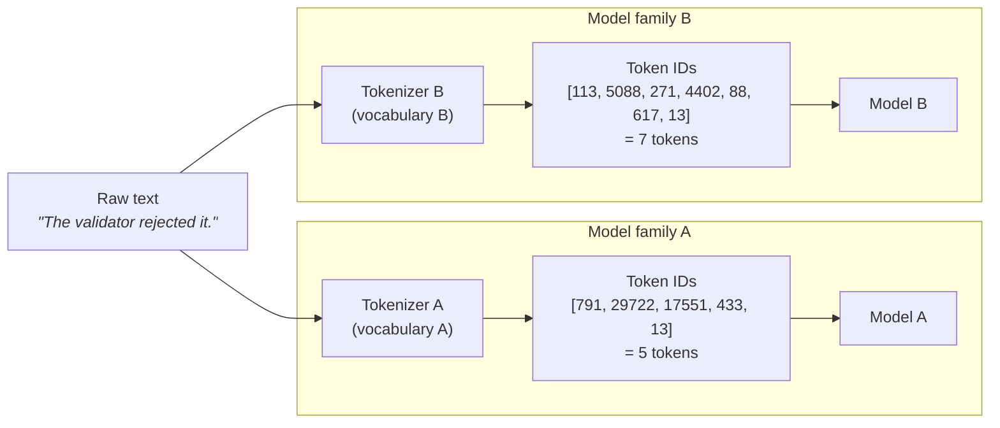

# Tokens and tokenization

Every number that matters in this curriculum — context limits, API bills, retrieval budgets, compression ratios — is denominated in tokens. By the end of this chapter you will be able to explain what a token is, estimate what a piece of text costs to process, and predict why the same file produces different counts on different models. You will also learn why source code, in particular, tokenizes expensively — the fact that motivates most of Part 2.

## What a token is

A **token** is the unit a language model reads and writes: a short sequence of characters, often a fragment of a word, that maps to a single integer in the model's fixed vocabulary. A [large language model](what-llms-do.md) never operates on raw characters or whole words. Before any text reaches the model, it is converted into a sequence of these integers, and everything the model produces comes back out one token at a time.

A **tokenizer** is the deterministic program that does the converting: it splits text into tokens and looks each one up in a fixed table. The integer assigned to each token is its **token ID**. The same tokenizer applied to the same text always yields the same IDs — there is no model, no randomness, and no meaning involved at this stage.

A few concrete behaviors are worth internalizing early:

- `"unbelievable"` typically splits into pieces like `un` + `believ` + `able` — three tokens for one word.
- Leading whitespace usually attaches to the word that follows: `" the"` (space included) is commonly a single token, distinct from `"the"`.
- For English prose, a serviceable rule of thumb is roughly 4 characters or about three-quarters of a word per token. Treat it as an estimate; the real number depends on the tokenizer and the text.

## BPE: how the vocabulary gets chosen

A tokenizer's **vocabulary** is its fixed list of known tokens — typically 50,000 to 200,000 entries, frozen when the tokenizer is built. Most modern tokenizers construct that list with **byte-pair encoding (BPE)**: start from single bytes, then repeatedly merge the most frequent adjacent pair found in a large training corpus into a new vocabulary entry, stopping when the vocabulary reaches its target size.

Two consequences follow directly from "merge the most frequent pair":

1. **Frequent strings become single tokens.** `" the"`, `" function"`, and common programming keywords earned their own entries by sheer repetition.
2. **Rare strings shatter.** An unusual surname, a typo, or a hex string like `3f8a1c` was never frequent enough to be merged, so it falls back to many small fragments — sometimes individual bytes.

Corpus frequency is the only criterion. The tokenizer has no notion of grammar, syntax, or meaning; it is compression, not comprehension.

!!! note "Settled"
    Subword tokenization in the BPE family has been the standard approach across major model families for years. Vocabularies differ between vendors and generations; the approach itself is stable.



The same text, run through two tokenizers with different vocabularies, produces different IDs *and a different count*. (The integer IDs above are illustrative, not real vocabulary entries.)

## Tokens are the unit of everything you pay for

Three separate systems are all denominated in tokens, which is why the concept keeps reappearing throughout this site:

- **Pricing.** Model APIs bill per token — one rate for input tokens, a higher rate for output tokens. In agent workflows the input side dominates, because conversation history is re-sent on every call; Part 4's [cost and efficiency](../part4-agents/cost-efficiency.md) chapter works through that multiplication.
- **Limits.** The [context window](context-windows.md) — the model's bounded working area, covered in the next chapter but one — is measured in tokens, not characters or lines.
- **Budgets.** Any tool that assembles content into a prompt under a size constraint must count tokens to enforce it. Part 2's [structural minimization](../part2-context/structural-minimization.md) chapter is entirely about making a fixed token budget carry more useful information.

Same unit, three different constraints — when you see "4,000 tokens" later, it may be a budget, a slice of a window, or a line on a bill.

## Different models count differently

There is no such thing as *the* token count of a text — only its count under a specific tokenizer. Each model family ships its own vocabulary, so a file that measures 1,000 tokens under one encoding may measure 1,150 under another. Counts are not portable across vendors, and often not even across model generations.

!!! warning "Evolving — verified 2026-07-18"
    OpenAI's open-source [tiktoken](https://github.com/openai/tiktoken) library is the current way to count tokens for OpenAI models locally, and the GPT-5 family uses its `o200k_base` encoding. Anthropic instead offers a free `POST /v1/messages/count_tokens` API endpoint returning model-specific counts, and publishes no tokenizer for Claude 3 and later models — Claude token counts cannot be computed locally. This changes quickly; check [tiktoken's repository](https://github.com/openai/tiktoken) and [Anthropic's token-counting documentation](https://docs.anthropic.com/en/docs/build-with-claude/token-counting) for current values.

The practical rules: count with the tokenizer that matches the model when you can; when you cannot, pick one encoding, count consistently against it, and label the result an estimate with margin to spare.

## Code tokenizes expensively

Source code has quirks that make it cost more tokens per character than prose:

- **Indentation is not free.** Runs of leading spaces consume tokens. Tokenizers have multi-space entries, but deeply nested code still pays a per-line whitespace tax that prose never does.
- **Identifiers shatter.** `ValidateRequest` typically splits into pieces like `Validate` + `Request`; `snake_case_names` split at underscores and beyond. A long descriptive identifier is repaid in readability but billed on every mention.
- **Punctuation is dense.** Braces, semicolons, parentheses, and operators each consume tokens, and code has far more of them per line than English does.
- **Comments bill at full rate.** A tokenizer applies the same per-token cost to a boilerplate license header as to load-bearing logic. Nothing about being "just a comment" makes text cheap.

Put together: when you paste a source file into a prompt, a substantial share of the tokens you pay for are indentation, delimiters, and comments rather than information the task needs. Code's token cost is structural — so it can be reduced structurally, which is the premise of [structural minimization](../part2-context/structural-minimization.md) in Part 2.

!!! example "In the wild: Sankshep"
    [Sankshep](../part0-orientation/running-example.md), this site's running example, packs minimized source code into a caller-supplied token budget — so it has to count tokens for models it does not control. It counts every budget with tiktoken's `o200k_base` encoding (via the .NET `Microsoft.ML.Tokenizers` library). But the connected IDE client may hand Sankshep's output to a Claude model, and as of 2026-07-18 there is no public tokenizer for Claude 3 and later. So Sankshep documents its budgets as estimates keyed to one encoding, not exact counts for whichever model ultimately reads the text. That is the honest version of an unavoidable compromise: when exact counting is impossible, count consistently against one named encoding and say so.

## Checkpoints

1. **Why are pricing and context limits denominated in tokens rather than in words or characters?**

    ??? success "Answer"
        Because tokens are what the model actually processes: its input and output are sequences of token IDs, and compute cost scales with the number of tokens handled. Words and characters relate to that cost only indirectly, through the tokenizer — so vendors bill and limit in the unit that maps directly to work done.

2. **A script uses tiktoken's `o200k_base` to check whether a prompt fits under a Claude model's context limit. What is wrong, and what should it do instead?**

    ??? success "Answer"
        Token counts are not portable across tokenizers: `o200k_base` is an OpenAI encoding, and as of 2026-07-18 there is no public tokenizer for Claude 3+ models, so the local count is only an estimate of what Claude will measure. The script should call Anthropic's `count_tokens` endpoint for a model-specific count — or, if it must count locally, treat the result as an estimate and leave a safety margin.

3. **Using the BPE intuition: why does `" the"` usually cost one token while a hex ID like `3f8a1c9b` costs several?**

    ??? success "Answer"
        BPE builds its vocabulary by repeatedly merging the most frequent adjacent pairs in a training corpus. `" the"` is one of the most frequent strings in English, so it was merged into a single vocabulary entry early. That particular hex sequence essentially never appeared, so no merged entry exists for it and the tokenizer falls back to stitching it together from short, generic fragments.

4. **Name two reasons a C# file typically produces more tokens per character than an English paragraph.**

    ??? success "Answer"
        Any two of: indentation — runs of leading whitespace consume tokens on nearly every line; identifiers like `ValidateRequest` split into multiple sub-word tokens and are repeated often; punctuation density — braces, semicolons, and operators each cost tokens; comments and boilerplate headers bill at the same per-token rate as logic.

## Try it

Measure the code-versus-prose gap yourself with Python and tiktoken (encoding facts dated in the admonition above).

1. Install the tokenizer: `pip install tiktoken`.
2. Pick one source file and one prose file (a README or documentation page) of roughly similar character length.
3. Run this script against both:

```python
import tiktoken

enc = tiktoken.get_encoding("o200k_base")

for path in ["your_source_file.cs", "your_prose_file.md"]:
    with open(path, encoding="utf-8") as f:
        text = f.read()
    tokens = enc.encode(text)
    print(f"{path}: {len(text)} chars, {len(tokens)} tokens, "
          f"{len(text) / len(tokens):.2f} chars/token")
```

4. Compare the chars-per-token ratios. English prose commonly lands near 4; source code usually lands noticeably lower — meaning more tokens for the same number of characters.
5. To see *why*, print the first thirty splits: `print([enc.decode([t]) for t in tokens[:30]])`. Look for indentation runs, shattered identifiers, and punctuation, then find the most expensive non-essential region of your file — it is often a comment block.

Keep your two numbers in mind: in [why raw context is wasteful](../part2-context/why-raw-context-fails.md), they become the baseline for calculating what a naive copy-paste workflow actually costs.
