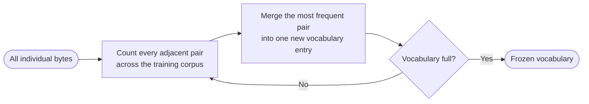
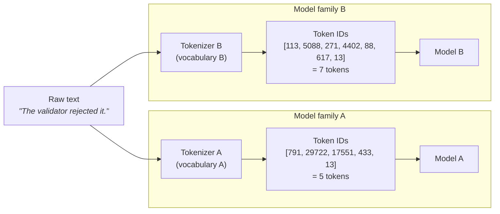

# Tokens and tokenization

Every number that matters on this site is counted in tokens: context limits, API bills, retrieval budgets, compression ratios.

By the end of this chapter you will be able to explain what a token is. You will be able to estimate what a piece of text costs to process, and predict why the same file gives different counts on different models. You will also see why source code is unusually expensive to tokenize — the fact that motivates most of Part 2.

## What a token is

A **token** is the unit a language model reads and writes. It is a short run of characters, often a fragment of a word, that maps to a single number in the model's fixed vocabulary.

A [large language model](what-llms-do.md) never works on raw characters or whole words. Before any text reaches the model, it is turned into a sequence of these numbers. Everything the model produces comes back out one token at a time.

A **tokenizer** is the program that does the converting. It splits text into tokens and looks each one up in a fixed table. The number assigned to each token is its **token ID**.

The same tokenizer on the same text always gives the same IDs. There is no model here, no randomness, and no meaning. It is a lookup.

Three behaviors are worth learning early:

- `"unbelievable"` usually splits into pieces like `un` + `believ` + `able`. Three tokens for one word.
- A leading space usually sticks to the word after it. `" the"`, with the space, is often a single token — and a different one from `"the"`.
- For English prose, roughly 4 characters make a token. That is about three-quarters of a word. Treat it as a rough estimate. The real number depends on the tokenizer and the text.

## BPE: how the vocabulary gets chosen

A tokenizer's **vocabulary** is its fixed list of known tokens. It usually holds 50,000 to 200,000 entries, and it is frozen when the tokenizer is built.

Most modern tokenizers build that list with **byte-pair encoding (BPE)**. The recipe is short. Start from single bytes. Then repeatedly find the most common adjacent pair in a huge pile of training text, and merge it into one new vocabulary entry. Stop when the vocabulary hits its target size.

Two things follow from "merge the most common pair":

1. **Common strings become single tokens.** `" the"`, `" function"`, and popular programming keywords earned their own entries by sheer repetition.
2. **Rare strings shatter.** An unusual surname, a typo, or a hex string like `3f8a1c` was never common enough to be merged. So it falls back to many small fragments, sometimes single bytes.

Frequency is the only rule. The tokenizer knows nothing about grammar, syntax, or meaning. It is compression, not comprehension.

!!! note "Settled"
    Subword tokenization in the BPE family has been standard across major model families for years. Vocabularies differ between vendors and generations. The approach itself is stable.


```mermaid
flowchart LR
    START(["All individual bytes"])
    COUNT["Count every adjacent pair<br/>across the training corpus"]
    MERGE["Merge the most frequent pair<br/>into one new vocabulary entry"]
    FULL{"Vocabulary full?"}
    FROZEN(["Frozen vocabulary"])

    START --> COUNT
    COUNT --> MERGE
    MERGE --> FULL
    FULL -- "No" --> COUNT
    FULL -- "Yes" --> FROZEN
```

*BPE builds its vocabulary from the bottom up. It merges pairs by frequency alone, with no grammar or meaning involved. Common strings like `" function"` earn a single entry. Rare strings like hex IDs never reach the threshold, so they shatter into fragments.*


```mermaid
flowchart LR
    TEXT["Raw text<br><i>&quot;The validator rejected it.&quot;</i>"]
    subgraph famA["Model family A"]
        TOKA["Tokenizer A<br>(vocabulary A)"] --> IDA["Token IDs<br>[791, 29722, 17551, 433, 13]<br>= 5 tokens"] --> MODA["Model A"]
    end
    subgraph famB["Model family B"]
        TOKB["Tokenizer B<br>(vocabulary B)"] --> IDB["Token IDs<br>[113, 5088, 271, 4402, 88, 617, 13]<br>= 7 tokens"] --> MODB["Model B"]
    end
    TEXT --> TOKA
    TEXT --> TOKB
```

The same sentence, run through two tokenizers, gives different IDs *and a different count*. (The numbers above are made up for illustration. They are not real vocabulary entries.)

## Tokens are the unit of everything you pay for

Three separate things are all measured in tokens. That is why the word keeps coming back on this site.

- **Pricing.** Model APIs bill per token, with one rate for input and a higher rate for output. In agent workflows, input dominates the bill, because the whole conversation is re-sent on every call. Part 4's [cost and efficiency](../part4-agents/cost-efficiency.md) chapter works through that multiplication.
- **Limits.** The [context window](context-windows.md) is the model's bounded working area. It is measured in tokens, not characters or lines.
- **Budgets.** Any tool that packs content into a prompt under a size cap has to count tokens to enforce it. Part 2's [structural minimization](../part2-context/structural-minimization.md) chapter is entirely about making a fixed token budget carry more useful information.

One unit, three different constraints. So when you meet "4,000 tokens" later, check which one it is. It could be a budget, a slice of a window, or a line on a bill.

## Different models count differently

There is no such thing as *the* token count of a text. There is only its count under a specific tokenizer.

Each model family ships its own vocabulary. A file that measures 1,000 tokens under one encoding may measure 1,150 under another. Counts do not transfer between vendors, and often not even between model generations.

!!! warning "Evolving — verified 2026-07-18"
    OpenAI's open-source [tiktoken](https://github.com/openai/tiktoken) library is the current way to count tokens for OpenAI models locally, and the GPT-5 family uses its `o200k_base` encoding. Anthropic instead offers a free `POST /v1/messages/count_tokens` API endpoint that returns model-specific counts. Anthropic publishes no tokenizer for Claude 3 and later models, so Claude token counts cannot be computed locally. This changes quickly; check [tiktoken's repository](https://github.com/openai/tiktoken) and [Anthropic's token-counting documentation](https://docs.anthropic.com/en/docs/build-with-claude/token-counting) for current values.

Two practical rules follow. Count with the tokenizer that matches the model whenever you can. When you cannot, pick one encoding, count consistently against it, call the result an estimate, and leave yourself margin.

## Code tokenizes expensively

Source code costs more tokens per character than prose. Four quirks explain why.

- **Indentation is not free.** Runs of leading spaces cost tokens. Tokenizers do have multi-space entries, but deeply nested code still pays a whitespace tax on nearly every line. Prose never does.
- **Identifiers shatter.** `ValidateRequest` usually splits into `Validate` + `Request`. Names like `snake_case_names` split at every underscore and beyond. A long descriptive name pays you back in readability, but you are billed for it on every mention.
- **Punctuation is dense.** Braces, semicolons, parentheses, and operators each cost tokens. Code has far more of them per line than English does.
- **Comments bill at full rate.** A boilerplate license header costs the same per token as the logic underneath it. Nothing about being "just a comment" makes text cheap.

Put those together. When you paste a source file into a prompt, a large share of what you pay for is indentation, punctuation, and comments — not the information the task needs.

Code's token cost is structural. That means it can be cut structurally, which is the whole premise of [structural minimization](../part2-context/structural-minimization.md) in Part 2.

!!! example "In the wild: Sankshep"
    [Sankshep](../part0-orientation/running-example.md) packs minimized source code into a token budget its caller supplies. So it has to count tokens for models it does not control.

    It counts every budget with tiktoken's `o200k_base` encoding, through the .NET `Microsoft.ML.Tokenizers` library. But the connected IDE client may hand Sankshep's output to a Claude model, and as of 2026-07-18 there is no public tokenizer for Claude 3 and later.

    So Sankshep documents its budgets as estimates keyed to one encoding. It does not claim exact counts for whichever model ends up reading the text. That is the honest version of an unavoidable compromise: when exact counting is impossible, count consistently against one named encoding, and say which one.

!!! failure "Common misconception"
    *"Roughly 4 characters per token, so I can estimate any file's cost by dividing its size by 4."*

    That ratio was measured on English prose. It does not survive contact with source code.

    Indentation, shattered identifiers, and dense punctuation push code well below it. Code often lands at 3 characters per token or less. That is a 30%-plus underestimate, on exactly the content you are most likely to be budgeting.

    The error is not even uniform. A deeply nested file with long names drifts much further than a flat one. Measure your own code once with a real tokenizer, using the exercise below. Then carry *that* ratio, and label it with the encoding it came from.

## Checkpoints

1. **Why are pricing and context limits counted in tokens rather than words or characters?**

    ??? success "Answer"
        Because tokens are what the model actually processes. Its input and output are sequences of token IDs, and compute cost scales with how many tokens it handles.

        Words and characters only relate to that cost indirectly, through the tokenizer. So vendors bill and limit in the unit that maps straight to work done.

2. **A script uses tiktoken's `o200k_base` to check whether a prompt fits under a Claude model's context limit. What is wrong, and what should it do instead?**

    ??? success "Answer"
        Token counts do not transfer between tokenizers. `o200k_base` is an OpenAI encoding, and as of 2026-07-18 there is no public tokenizer for Claude 3 and later. So the local count is only an estimate of what Claude will measure.

        The script should call Anthropic's `count_tokens` endpoint for a model-specific count. If it must count locally, it should treat the result as an estimate and leave a safety margin.

3. **Using the BPE idea: why does `" the"` usually cost one token while a hex ID like `3f8a1c9b` costs several?**

    ??? success "Answer"
        BPE builds its vocabulary by repeatedly merging the most common adjacent pairs in a training corpus. `" the"` is one of the most common strings in English, so it got merged into a single entry early.

        That particular hex sequence essentially never appeared. No merged entry exists for it, so the tokenizer stitches it together from short, generic fragments.

4. **Name two reasons a C# file usually produces more tokens per character than an English paragraph.**

    ??? success "Answer"
        Any two of these. Indentation costs tokens on nearly every line. Identifiers like `ValidateRequest` split into several sub-word tokens and repeat often. Punctuation is dense: braces, semicolons, and operators each cost tokens. Comments and boilerplate headers bill at the same rate as real logic.

## Try it

Measure the code-versus-prose gap yourself, with Python and tiktoken. (The encoding facts are dated in the box above.)

1. Install the tokenizer: `pip install tiktoken`.
2. Pick one source file and one prose file, such as a README, of roughly the same character length.
3. Run this script against both:

```python
import tiktoken

enc = tiktoken.get_encoding("o200k_base")

for path in ["your_source_file.cs", "your_prose_file.md"]:
    with open(path, encoding="utf-8") as f:
        text = f.read()
    tokens = enc.encode(text)
    print(f"{path}: {len(text)} chars, {len(tokens)} tokens, "
          f"{len(text) / len(tokens):.2f} chars/token")
```

4. Compare the two chars-per-token numbers. English prose usually lands near 4. Source code lands noticeably lower, which means more tokens for the same number of characters.
5. Now look at *why*. Print the first thirty splits with `print([enc.decode([t]) for t in tokens[:30]])`. Look for runs of indentation, shattered identifiers, and punctuation. Then find the most expensive non-essential region of your file. It is often a comment block.

Keep both numbers. In [why raw context is wasteful](../part2-context/why-raw-context-fails.md), they become the baseline for working out what a copy-paste workflow really costs.
