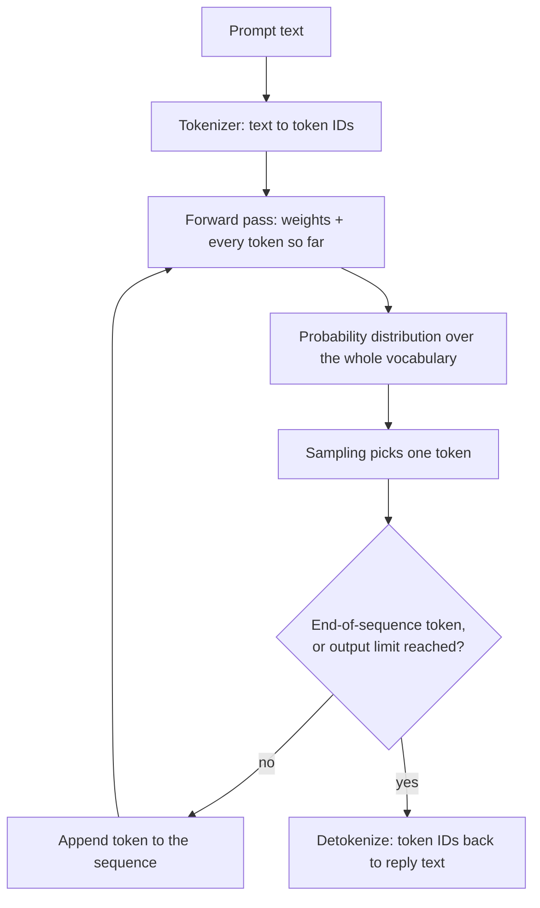
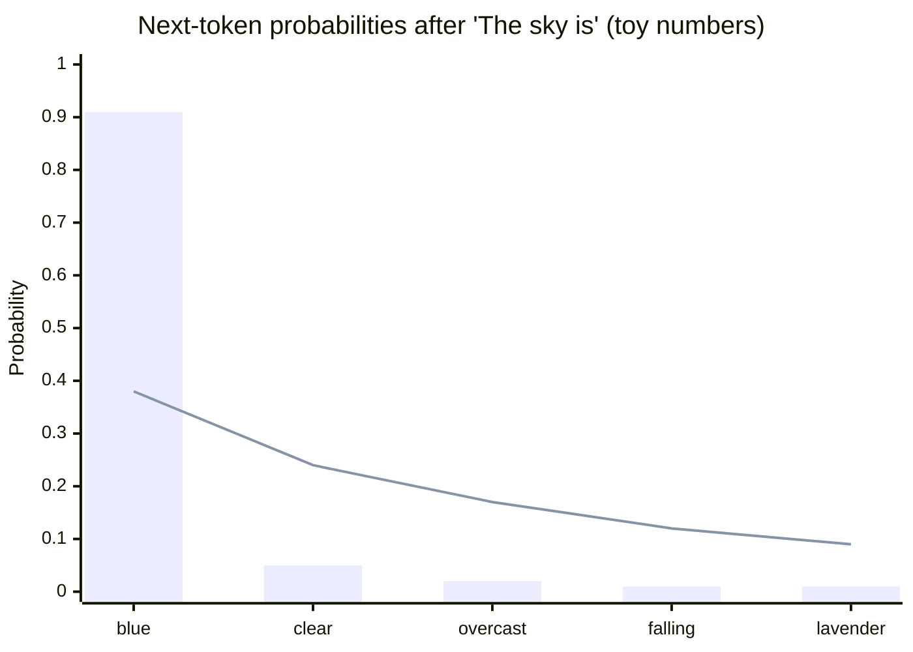

# What an LLM actually does

Strip away the chat interface and a large language model is one narrow operation applied over and over. By the end of this chapter you will be able to:

- describe, step by step, what happens between sending a prompt and receiving a reply;
- use temperature as a deliberate engineering control, not a mystery knob;
- translate sentences like "the model understood the question" into precise, testable claims.

This chapter builds directly on [tokens and tokenization](tokens.md): everything below operates on tokens, never on raw text.

## Next-token prediction

An LLM performs one job: **next-token prediction** — given a sequence of [tokens](tokens.md), compute a probability for every token in its vocabulary being the next one. That is the entire interface. Chat, code review, translation, and tool use are all built by running this one function repeatedly.

Concretely: feed the model `The sky is` and it returns a distribution — `blue` gets a large share, `clear` a smaller one, `lavender` a sliver, and tens of thousands of other tokens sit near zero. Nothing was looked up. The distribution is produced by arithmetic over the model's **weights**: the billions of numeric parameters fixed when training ended. At generation time the weights are read-only constants.

!!! note "Settled"
    Base models, chat models, "reasoning" models, and the models inside coding agents all generate the same way: one token at a time, each drawn from a probability distribution computed from the tokens before it. The product layers around models change fast; this mechanism does not.

## The autoregressive loop

One forward pass yields one token. Replies come from a loop: pick a token, append it to the sequence, run the model again on the longer sequence. Generation is therefore **autoregressive** — each output token becomes input for producing the next one.



Three consequences fall out of this loop:

- **No hidden plan.** No draft of the full answer exists anywhere. Whatever structure a long reply has must be carried by the weights plus the tokens emitted so far.
- **Every step re-reads everything.** Each pass processes the prompt plus all tokens generated so far, so long inputs make every step more expensive — the seed of the cost story in [the context window](context-windows.md).
- **Stopping is mechanical.** Generation ends when the sampled token is a special end-of-sequence marker or an output-token limit is hit. No other "done" signal exists.

## Sampling and temperature

The forward pass produces probabilities; something must still pick one token. **Sampling** is that step: draw the next token at random, in proportion to its probability — a weighted dice roll, not a lookup of "the answer."

**Temperature** is a number that reshapes the distribution before the draw: low temperature sharpens it, concentrating probability on the top tokens; high temperature flattens it, giving unlikely tokens a real chance. Temperature 0 approximates **greedy decoding** — always take the single most probable token.



Toy numbers, not measurements: the bars are a low-temperature distribution (around 0.2), with nearly all probability on `blue`; the line is the same model at high temperature (around 1.5), where `falling` and `lavender` become live options. Same weights, same prompt — only the pre-draw reshaping changed.

Practical defaults follow directly:

- Extraction, classification, structured output, anything a test asserts on: low temperature. Variance is a bug.
- Brainstorming, naming, varied prose: higher temperature. Variance is the point.
- Temperature 0 shrinks variance but does not guarantee byte-identical output — serving stacks add small nondeterminism. Read it as "low variance," not "deterministic."

## The anthropomorphism contract

Plain English pulls hard toward mental-state verbs: the model *knows* Python, *understands* the codebase, *decides* to call a tool. This site bans those verbs in their bare form — along with *thinks*, *believes*, *wants*, *realizes*, and *figures out* — because they smuggle in claims the mechanism does not support. Every later page either uses mechanical phrasing or puts the verb in quotes and links back to the definitions below.

**"Decides."** When a page says a model "decides" to do something, the operational meaning is: sampling produced a continuation naming that action — for example, a structured tool call naming `search_code` — and a separate program (the client) executed it. A "decision" is a probable continuation plus machinery that honors it. [The agent loop](../part4-agents/agent-loop.md) rests entirely on this reading.

**"Understands."** A behavioral claim about outputs, not inner life: across inputs where a distinction matters, outputs reliably track it. The claim is testable — its characteristic failure is fluent text that tracks nothing.

**"Knows."** A claim is retrievable from one of exactly two sources: it was encoded into the weights during training, or it is present in the context right now. The two sources fail differently — weights can be stale or blurry; context is precisely what you chose to put there.

When neither source supports an answer, the loop does not stop. Next-token prediction has no built-in "nothing to say" state — declining to answer is itself trained behavior, not a default. Fluent, confident output unsupported by either weights or context is a **hallucination**, and this mechanism is why it exists.

## Training vs inference

**Training** is the phase in which weights are adjusted by processing a huge corpus; it ends before you ever type a prompt. **Inference** is everything after: running the frozen weights forward over your context to produce distributions. Every interaction in this curriculum happens at inference.

Two consequences shape the rest of the site:

- **Nothing you send changes the weights.** A correction persists only while it sits in the context; open a fresh conversation and it is gone. The engineering response is [persistent memory](../part2-context/persistent-memory.md), not repetition and hope.
- **Weights have a cutoff.** They encode nothing about events, library versions, or your codebase's state after training ended. Anything fresher must arrive through the context — which is what Part 2's retrieval machinery is for.

## Only weights and context

Put the last two sections together and you get the most useful sentence in this part: *at inference, a model has exactly two information sources — its frozen weights and the tokens in its [context window](context-windows.md).* There is no third channel: no filesystem, no database, no live web — unless a surrounding program fetches something and pastes the result into the context as tokens.

Products that appear to browse or run code follow the same rule: a client program executed the search or the code and inserted the results into the context; the model only ever mapped tokens to probabilities.

This two-source rule powers everything that follows: choosing which tokens deserve context space is context engineering (Part 2); a standard way for clients to fetch those tokens from external systems is [MCP](../part3-mcp/why-mcp.md) (Part 3); wrapping the loop with tools and a stop condition makes an agent (Part 4).

## Checkpoints

**1. In one sentence: what single operation does an LLM perform — and how does a three-paragraph answer emerge from it?**

??? success "Answer"
    The operation: map a token sequence to a probability distribution over the next token. Long answers emerge from the autoregressive loop — sample a token, append it, run again — until an end-of-sequence token is sampled or the output limit is hit.

**2. You run the same prompt twice and get two different answers. What happened, and which setting reduces — but does not eliminate — the effect?**

??? success "Answer"
    Sampling drew different tokens from the same distribution, and once one token differs the loop diverges. Lowering temperature toward 0 collapses most variance, but serving-stack nondeterminism means even 0 is "low variance," not a guarantee.

**3. Rewrite this sentence to comply with the anthropomorphism contract: "The model understood our codebase and decided to call `search_code`."**

??? success "Answer"
    One compliant version: "With the task and the tool descriptions in context, sampling produced a structured tool call naming `search_code`, which the client executed." The mechanical version exposes the load-bearing fact: the description text in context made that continuation probable.

**4. A teammate says: "I corrected the model yesterday, so it knows better now." What is wrong with this, mechanically?**

??? success "Answer"
    Inference never updates weights. The correction existed only as tokens in yesterday's context; today's conversation starts without it. For a correction to survive sessions, something outside the model must store it and re-insert it — the subject of [persistent memory](../part2-context/persistent-memory.md).

**5. Why do hallucinations exist at all — why doesn't the model output nothing when neither its weights nor the context supports an answer?**

??? success "Answer"
    Because the mechanism has no "unsupported" state. Every forward pass yields a full distribution and sampling always picks something, so the output is the most plausible-sounding continuation available. Declining to answer is trained behavior layered on top, not a property of next-token prediction.

## Try it

Measure temperature's effect directly. Any chat playground or API that exposes a temperature control works.

1. Pick a prompt with many acceptable answers:

    ```text
    Suggest one name for a coffee shop run by retired lighthouse keepers.
    Reply with the name only.
    ```

2. Run it five times at the lowest temperature the interface allows, then five times at a high setting (1.0 or above). Keep everything else identical.

3. Tabulate the runs and count distinct answers per column:

    | Run | Low temperature | High temperature |
    |-----|-----------------|------------------|
    | 1   |                 |                  |
    | 2   |                 |                  |
    | 3   |                 |                  |
    | 4   |                 |                  |
    | 5   |                 |                  |

    Low temperature typically repeats one or two names; high temperature should scatter.

4. Repeat both columns with `What is 17 × 23? Reply with the number only.` The variance gap should nearly vanish: an arithmetic answer's distribution is already sharply peaked, and temperature only reshapes what is there. Flat distributions scatter; peaked ones do not.
