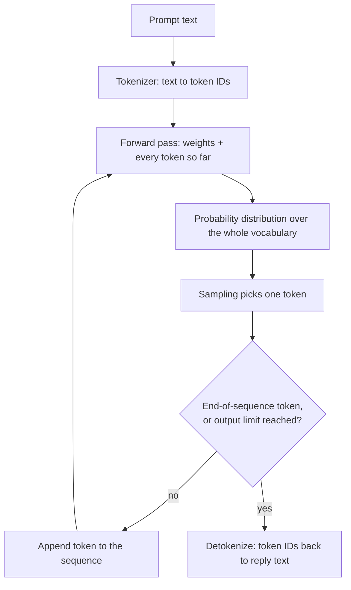
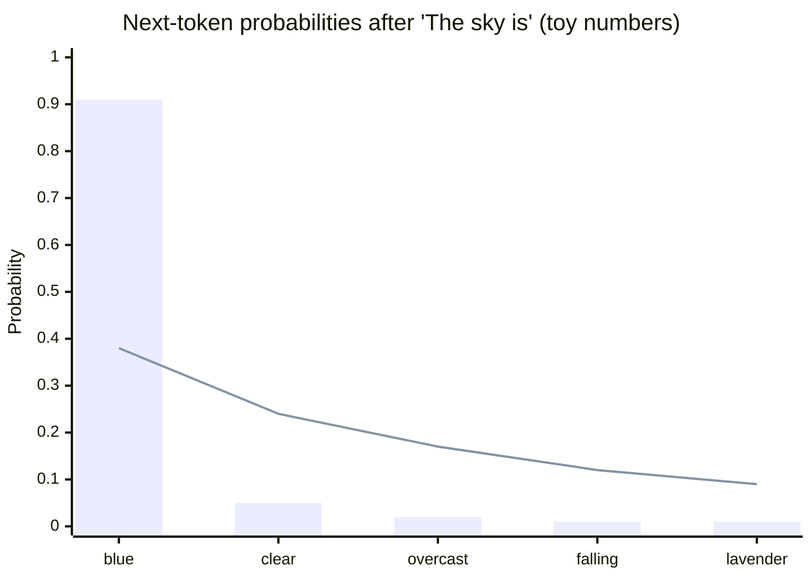
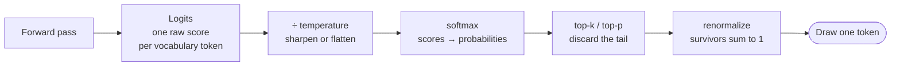
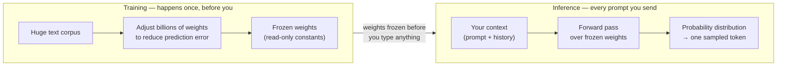

# What an LLM actually does

Strip away the chat interface and a large language model does one narrow thing, over and over.

By the end of this chapter you will be able to:

- describe, step by step, what happens between sending a prompt and getting a reply;
- explain why long context costs what it costs, and what the KV cache changes;
- use temperature, top-p, and top-k as real controls rather than mystery knobs;
- turn sentences like "the model understood the question" into precise, testable claims.

This chapter builds on [tokens and tokenization](tokens.md). Everything below works on tokens, never on raw text.

## Next-token prediction

An LLM has one job: **next-token prediction**. Give it a sequence of [tokens](tokens.md), and it computes a probability for every token in its vocabulary being the next one.

That is the whole interface. Chat, code review, translation, and tool use are all built by running this one function again and again.

Here it is concretely. Feed the model `The sky is`. It returns a spread of probabilities. `blue` gets a large share. `clear` gets a smaller one. `lavender` gets a sliver. Tens of thousands of other tokens sit near zero.

Nothing was looked up. That spread comes from arithmetic over the model's **weights** — the billions of numbers fixed when training ended. During generation, the weights are read-only constants.

!!! note "Settled"
    Base models, chat models, "reasoning" models, and the models inside coding agents all generate the same way. One token at a time, each drawn from a probability spread computed from the tokens before it. The products around models change fast. This mechanism does not.

## The autoregressive loop

One pass through the model gives you one token. Replies come from a loop.

Pick a token. Add it to the sequence. Run the model again on the longer sequence. Repeat.

That makes generation **autoregressive**: each output token becomes input for producing the next one.


```mermaid
flowchart TD
    A["Prompt text"] --> B["Tokenizer: text to token IDs"]
    B --> C["Forward pass: weights + every token so far"]
    C --> D["Probability distribution over the whole vocabulary"]
    D --> E["Sampling picks one token"]
    E --> F{"End-of-sequence token,<br>or output limit reached?"}
    F -- "no" --> G["Append token to the sequence"]
    G --> C
    F -- "yes" --> H["Detokenize: token IDs back to reply text"]
```

Three things follow from this loop:

- **No hidden plan.** No draft of the full answer exists anywhere. Whatever structure a long reply has comes from the weights plus the tokens already emitted.
- **Every step re-reads everything.** Each pass processes the prompt plus every token generated so far. Long inputs make every step more expensive. This is the seed of the cost story in [the context window](context-windows.md).
- **Stopping is mechanical.** Generation ends when the model samples a special end-of-sequence token, or when it hits an output limit. There is no other "done" signal.

### Why "re-reads everything" costs what it costs

That second point deserves one more level of detail. It is the mechanism behind four separate claims later on this site: why long context is expensive, why quality sags in the middle of a long window, why the first token is slow but the rest arrive quickly, and why prompt caching works at all.

The operation inside each pass is **attention**. For every position in the sequence, the model scores how relevant every *other* position is. It then uses those scores to decide which earlier tokens shape the prediction here.

That is what lets a model connect a pronoun to a noun forty tokens back. It also means the tokens in your context are not passive storage. Each one takes part in a comparison with every other one.

Two things follow from "every position against every other":

- **Work grows faster than length.** Double the context and you roughly quadruple the comparisons. Context is not a bucket you fill. It is a surface whose cost curves upward.
- **Attention is a fixed budget.** The scores at each position add up to one. So relevance is shared, not stacked. Every extra token in the window is one more competitor for a fixed amount of attention.

That second point is the mechanism behind the [lost-in-the-middle effect](context-windows.md). Junk context does not just waste money. It dilutes the signal the useful tokens carry.

!!! note "Settled"
    Attention as described here — every position scored against every other — has been the core of transformer models since 2017, across every major model family since. Vendors ship optimizations that cut the constant factors a lot, and long-context models clearly do something smarter than naive full attention. But the shape of the trade-off is stable, and it is what your bills and your quality curves both reflect.

??? info "Going deeper — prefill, decode, and the KV cache"

    Taken literally, "every step re-reads everything" would make generation absurdly slow. Emitting the 500th token would mean redoing all the work of the previous 499.

    Real systems do not do that. The optimization that saves them explains several things you can watch happen.

    Attention computes two vectors for each token: a **key** and a **value**. Here is the useful property. A token's key and value depend only on that token and the ones before it. They never depend on tokens that come later.

    So once computed, they never change. Which means they can be kept.

    That store is the **KV cache**. It splits generation into two phases that behave completely differently:

    | | **Prefill** | **Decode** |
    |---|---|---|
    | What it processes | Your entire prompt, at once | One token at a time |
    | Parallelism | All prompt tokens in parallel | Strictly sequential |
    | Cost driver | Grows with prompt length, faster than linearly | Roughly constant per token |
    | What you observe | Time to the *first* token | The rate the rest arrive at |

    This is why a long prompt makes you wait before anything appears, and then the reply flows smoothly no matter how long the prompt was. You are watching prefill finish, then decode run.

    Three practical facts follow. Each one gets used later.

    - **Input tokens and output tokens are different products.** Input tokens are processed together in one batch. Output tokens each need their own sequential pass. That is why providers price them differently, and [cost and efficiency](../part4-agents/cost-efficiency.md) does the arithmetic.
    - **Prompt caching is KV-cache reuse.** If a new request starts with exactly the same tokens as a recent one, the stored keys and values for that prefix are still valid. Prefill can skip straight past them. Now the strict rule makes sense: the prefix must be *byte-identical*, because one changed token invalidates its key and value and everything after it. A timestamp at the top of a system prompt does not cost you one token. It costs you the entire cached prefix.
    - **The cache uses memory.** Every token in the window holds keys and values in memory for the whole request. That is a real reason context limits exist, rather than simply being raised.

    Notice that none of this changes the [autoregressive loop](#the-autoregressive-loop) above. The model still conditions on the whole sequence for every token it emits. The cache just means it does not recompute what it already worked out.

## Sampling: choosing one token

The forward pass gives you probabilities. Something still has to pick one token.

**Sampling** is that step. It draws the next token at random, in proportion to its probability. Think of a weighted dice roll, not a lookup of "the answer".

**Temperature** is a number that reshapes the spread before the draw. Low temperature sharpens it, piling probability onto the top tokens. High temperature flattens it, giving unlikely tokens a real chance. Temperature 0 approximates **greedy decoding**: always take the single most probable token.


```mermaid
xychart-beta
    title "Next-token probabilities after 'The sky is' (toy numbers)"
    x-axis ["blue", "clear", "overcast", "falling", "lavender"]
    y-axis "Probability" 0 --> 1
    bar [0.91, 0.05, 0.02, 0.01, 0.01]
    line [0.38, 0.24, 0.17, 0.12, 0.09]
```

These are toy numbers, not measurements. The bars show a low-temperature spread, around 0.2, with nearly all probability on `blue`. The line shows the same model at high temperature, around 1.5, where `falling` and `lavender` become live options. Same weights, same prompt. Only the reshaping before the draw changed.

Practical defaults follow directly:

- **Low temperature** for extraction, classification, structured output, and anything a test checks. Here, variance is a bug.
- **Higher temperature** for brainstorming, naming, and varied prose. Here, variance is the point.
- **Temperature 0 is not a guarantee.** It shrinks variance but does not promise byte-identical output, because serving systems add small amounts of nondeterminism. Read it as "low variance", not "deterministic".

### The other two knobs

Temperature reshapes the spread. It never removes anything from it.

So at high temperature, a genuinely absurd token keeps a small but real chance. Across a thousand tokens of output, small-but-real happens.

Two more controls exist for that. They work by *cutting* candidates before the draw, rather than reshaping them.

- **Top-k** keeps only the `k` most probable tokens and throws away the rest. It is simple, and blunt. `k = 40` is far too generous when the model is confident, and far too strict when it is genuinely unsure.
- **Top-p**, also called nucleus sampling, sorts tokens by probability and keeps just enough to reach a running total of `p` — say 0.9. So the number of survivors *adapts*. Where the model is confident, the top one or two tokens already reach 0.9 and everything else is cut. Where it is unsure, the pool stays wide.

That adaptiveness is why top-p is the better default, and why most APIs put it front and center.


```mermaid
flowchart LR
    F["Forward pass"] --> L["Logits<br/>one raw score<br/>per vocabulary token"]
    L --> T["÷ temperature<br/>sharpen or flatten"]
    T --> S["softmax<br/>scores → probabilities"]
    S --> K["top-k / top-p<br/>discard the tail"]
    K --> R["renormalize<br/>survivors sum to 1"]
    R --> D(["Draw one token"])
```

The pipeline is worth holding as a picture.

The forward pass does not emit probabilities. It emits **logits**: one raw, unbounded score per vocabulary token. Temperature divides those logits, which is why low temperature *sharpens* — dividing by 0.2 blows up every gap. **Softmax** then turns them into probabilities that add up to one. Only then do top-k and top-p cut the tail. The survivors are rescaled, and one token is drawn.

This picture explains two things.

First, setting temperature to 0 makes the division break down. So implementations special-case it to "take the single highest logit". That is greedy decoding, with no draw at all, which is why the other knobs stop mattering there.

Second, a model can be *confidently wrong*. A sharply peaked spread means the output is consistent with training patterns. It does not mean the output is correct. Nothing in this pipeline checks a fact.

## The anthropomorphism contract

Plain English pulls hard toward mental-state verbs. The model *knows* Python. It *understands* the codebase. It *decides* to call a tool.

This site avoids those verbs in their bare form, along with *thinks*, *believes*, *wants*, *realizes*, and *figures out*. They smuggle in claims the mechanism does not support.

Every later page either uses mechanical phrasing, or puts the verb in quotes and links back to the definitions here.

**"Decides."** When a page says a model "decides" to do something, here is what that means. Sampling produced a continuation naming that action — a structured tool call naming `search_code`, say — and a separate program, the client, ran it.

A "decision" is a probable continuation plus machinery that acts on it. [The agent loop](../part4-agents/agent-loop.md) rests entirely on this reading.

**"Understands."** This is a claim about outputs, not inner life. Across inputs where some distinction matters, the outputs reliably track that distinction.

The claim is testable. Its typical failure is fluent text that tracks nothing.

**"Knows."** A claim can be retrieved from exactly two places. It was encoded into the weights during training, or it is in the context right now.

The two sources fail differently. Weights can be stale or blurry. Context is exactly what you chose to put there.

When neither source supports an answer, the loop does not stop. Next-token prediction has no built-in "nothing to say" state — refusing to answer is trained behavior, not a default.

Fluent, confident output that neither weights nor context supports is a **hallucination**. This mechanism is why it exists.

## Training vs inference

**Training** is the phase where weights get adjusted by processing a huge pile of text. It finishes before you ever type a prompt.

**Inference** is everything after: running the frozen weights over your context to produce probabilities. Every interaction on this site happens at inference.

Two consequences shape the rest of the curriculum:

- **Nothing you send changes the weights.** A correction lasts only as long as it sits in the context. Open a fresh conversation and it is gone. The engineering answer is [persistent memory](../part2-context/persistent-memory.md), not repetition and hope.
- **Weights have a cutoff.** They hold nothing about events, library versions, or your codebase after training ended. Anything newer has to arrive through the context. That is what Part 2's retrieval machinery is for.

??? info "Going deeper — so why not just train it on our codebase?"

    Everyone asks this at exactly this point, and it deserves a straight answer, because the answer shapes the rest of this site.

    There are three ways to make a model act on knowledge it did not ship with. They are not rivals. They solve different problems.

    | | **Context** | **Retrieval (RAG)** | **Fine-tuning** |
    |---|---|---|---|
    | What it changes | Tokens in this request | Which tokens get selected | The weights themselves |
    | Freshness | Instant | As fresh as the index | Frozen at training time, again |
    | Cost model | Per token, every call | Per token, plus index upkeep | Large up front, cheap per call |
    | Good at | Facts for *this* task | Picking from a large corpus | Format, style, task behavior |
    | Bad at | Anything past the window | — | Facts, freshness, verifiability |

    The "bad at" row is what decides it.

    Fine-tuning teaches a model *how to behave*. Emit a house JSON format reliably. Adopt a review tone. Follow a domain's conventions. It is a poor way to teach *facts*, for three reasons that all trace back to this chapter.

    - **Facts learned as weights cannot be cited.** A retrieved fact arrives with a file path and line number someone can check. A fact absorbed into weights arrives as a probable continuation, which looks exactly like a [hallucination](#the-anthropomorphism-contract).
    - **Weights go stale by design.** Fine-tuning ends and the weights freeze again. You moved the cutoff. You did not remove it. Your codebase changes this afternoon.
    - **Updating means rebuilding.** Fixing one wrong fact means another training run. Fixing one wrong retrieved document means editing a file.

    So the working rule is short: **retrieval for knowledge, fine-tuning for behavior.**

    Reach for fine-tuning when the model already knows the material and gets the *form* wrong. Reach for retrieval when the form is fine and the model simply does not know your project. For coding assistants it is overwhelmingly the second case, which is why [Part 2](../part2-context/index.md) is about feeding the window well rather than about training runs.

    One honest caveat. Teams do successfully fine-tune for narrow, high-volume, stable tasks where prompt overhead dominates the bill. And the two combine: a fine-tuned model still needs retrieved context to know anything about your repository.


```mermaid
flowchart LR
    subgraph TRAIN["Training — happens once, before you"]
        direction LR
        T1["Huge text corpus"] --> T2["Adjust billions of weights<br/>to reduce prediction error"]
        T2 --> T3["Frozen weights<br/>(read-only constants)"]
    end
    subgraph INFER["Inference — every prompt you send"]
        direction LR
        I1["Your context<br/>(prompt + history)"] --> I2["Forward pass<br/>over frozen weights"]
        I2 --> I3["Probability distribution<br/>→ one sampled token"]
    end
    TRAIN -->|"weights frozen before<br/>you type anything"| INFER
```

*Training happens once. Every conversation you have with the model is inference, and the weights never change again.*

## Only weights and context

Put the last two sections together and you get the most useful sentence in this part.

At inference, a model has exactly two sources of information: its frozen weights, and the tokens in its [context window](context-windows.md).

There is no third channel. No filesystem. No database. No live web. Unless a surrounding program fetches something and pastes the result into the context as tokens.

Products that look like they browse the web or run code follow the same rule. A client program ran the search or the code and put the results into the context. The model only ever mapped tokens to probabilities.

This two-source rule drives everything that follows. Choosing which tokens deserve context space is context engineering, which is Part 2. A standard way for clients to fetch those tokens from outside systems is [MCP](../part3-mcp/why-mcp.md), which is Part 3. Wrapping the loop with tools and a stop condition makes an agent, which is Part 4.

## Checkpoints

**1. In one sentence: what single operation does an LLM perform — and how does a three-paragraph answer come out of it?**

??? success "Answer"
    The operation: map a sequence of tokens to a probability spread over the next token.

    Long answers come from the autoregressive loop. Sample a token, append it, run again. It repeats until the model samples an end-of-sequence token or hits the output limit.

**2. You run the same prompt twice and get two different answers. What happened, and which setting reduces — but does not remove — the effect?**

??? success "Answer"
    Sampling drew different tokens from the same spread. Once one token differs, the loop diverges from there.

    Lowering temperature toward 0 removes most of the variance. But serving systems add small amounts of nondeterminism, so even 0 means "low variance", not a guarantee.

**2b. Temperature is already low, yet an occasional wildly off-topic word still shows up in long outputs. Which knob fixes that, and why does temperature not?**

??? success "Answer"
    Top-p, or top-k.

    Temperature *reshapes* the spread but never empties its tail. An absurd token keeps a small non-zero probability, and across thousands of sampled tokens, small probabilities eventually fire.

    Top-p cuts instead. It keeps only enough of the sorted candidates to reach a running total of `p`, and discards the rest before the draw. Those tokens then cannot be picked at all. Prefer top-p over top-k, because the surviving pool adapts to how confident the model is at each position.

**2c. Your agent's system prompt starts with the current timestamp. Your bill is far higher than a colleague's for the same work. Explain the mechanism, not just the rule.**

??? success "Answer"
    Prompt caching reuses the KV cache — the stored key and value vectors for a prefix of tokens.

    A token's key and value depend on it and on everything before it. So changing the first token invalidates every cached vector after it.

    A timestamp at the top means every request has a unique prefix. Prefill then recomputes the whole prompt at full input price on every call, instead of skipping past a cached prefix. Volatile content belongs at the *end* of the context, or nowhere.

**3. Rewrite this sentence to follow the anthropomorphism contract: "The model understood our codebase and decided to call `search_code`."**

??? success "Answer"
    One version that works: "With the task and the tool descriptions in context, sampling produced a structured tool call naming `search_code`, which the client ran."

    The mechanical version exposes the load-bearing fact. The description text in the context is what made that continuation probable.

**4. A teammate says: "I corrected the model yesterday, so it knows better now." What is wrong with this?**

??? success "Answer"
    Inference never updates weights. The correction existed only as tokens in yesterday's context, and today's conversation starts without it.

    For a correction to survive between sessions, something outside the model has to store it and put it back. That is the subject of [persistent memory](../part2-context/persistent-memory.md).

**5. Why do hallucinations exist at all? Why doesn't the model output nothing when neither its weights nor the context supports an answer?**

??? success "Answer"
    Because the mechanism has no "unsupported" state. Every forward pass produces a full probability spread, and sampling always picks something. So the output is the most plausible-sounding continuation available.

    Declining to answer is trained behavior layered on top. It is not a property of next-token prediction.

## Try it

Measure temperature's effect directly. Any chat playground or API with a temperature control works.

1. Pick a prompt with many acceptable answers:

    ```text
    Suggest one name for a coffee shop run by retired lighthouse keepers.
    Reply with the name only.
    ```

2. Run it five times at the lowest temperature the interface allows. Then run it five times at a high setting, 1.0 or above. Keep everything else the same.

3. Write the runs down and count how many distinct answers each column produced:

    | Run | Low temperature | High temperature |
    |-----|-----------------|------------------|
    | 1   |                 |                  |
    | 2   |                 |                  |
    | 3   |                 |                  |
    | 4   |                 |                  |
    | 5   |                 |                  |

    Low temperature usually repeats one or two names. High temperature should scatter.

4. Now repeat both columns with `What is 17 × 23? Reply with the number only.`

    The gap should almost vanish. An arithmetic answer's spread is already sharply peaked, and temperature only reshapes what is there. Flat spreads scatter. Peaked ones do not.
