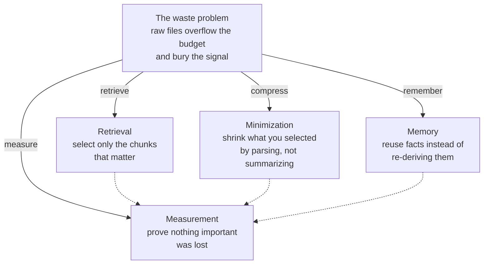

# Context engineering

Part 1 closed on an uncomfortable fact: the [context window](../part1-fundamentals/context-windows.md) is a fixed budget that input and output share, every token in it is billed, and filling it does not reliably help — answer quality drops when the relevant material sits in the middle of a long input. The job, that chapter argued, is curation, not accumulation. This part teaches how curation is actually done.

**Context engineering** is the practice of deciding, for each model call, which tokens enter the context window and in what form. It replaces "paste everything and hope" with four deliberate moves: retrieve only what is relevant, compress what you retrieved, remember what earlier sessions already established, and measure whether the result still answers real questions.

## One problem, four responses

The five chapters of this part are one problem statement and its four answers:

- [Why raw context is wasteful](why-raw-context-fails.md) — the waste problem, with worked token numbers from a real file.
- [Retrieval for code](rag-for-code.md) — chunk, embed, index, and search, so a query surfaces the few passages that matter.
- [Structural minimization](structural-minimization.md) — compress code deterministically with a parser: fast, repeatable, no model call.
- [Persistent memory](persistent-memory.md) — durable project facts that survive between sessions.
- [Measuring context quality](measuring-quality.md) — the dotted edges above: every technique must prove, with numbers, that it kept the signal.

## What you need first

This part leans on Part 1's vocabulary: [tokens](../part1-fundamentals/tokens.md) as the unit of cost, the [context window](../part1-fundamentals/context-windows.md) as the budget, and [embeddings](../part1-fundamentals/embeddings.md) for the retrieval chapter. Read the chapters in order — each response builds on the one before it, and measurement judges them all.

!!! example "In the wild: Sankshep"
    The four responses are not academic categories. Sankshep, the production server from [the running example](../part0-orientation/running-example.md), ships each one as a subsystem — retrieval, minimization, memory, and an eval harness for measurement — and Part 5 revisits every design decision behind them.
