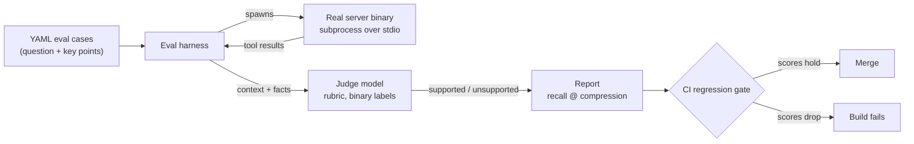
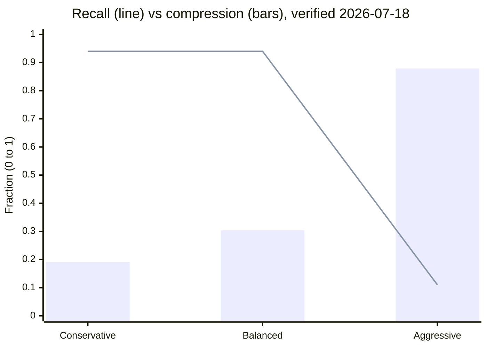

# Measuring context quality

The previous three chapters each promised the same thing: fewer [tokens](../part1-fundamentals/tokens.md), same usefulness. [Retrieval](rag-for-code.md) picks the right files, [structural minimization](structural-minimization.md) shrinks them, and [persistent memory](persistent-memory.md) replaces re-discovery with stored facts. Every one of those claims has a cheap half and an expensive half.

By the end of this chapter you will be able to score curated context against a checklist of atomic facts, use a model as a scalable grader without trusting it blindly, and apply four accounting rules that separate a measurement from a marketing number.

## Compression is trivial, lossless enough is the discipline

Deleting tokens is the easy half. Truncating a file after 100 lines "compresses" it by any percentage you like; so does deleting every other word. A compression figure on its own is therefore not evidence of anything.

**Compression ratio**, as used on this site, is the fraction of the original input's tokens that a transform removed: 10,000 tokens in, 7,000 delivered, is 30% compression. The expensive half is showing that what survived still does its job — that the compression was *lossless enough* for the task at hand.

That means quality claims come in pairs: how much was removed, and how much a reader of the result can still get right. The rest of this chapter builds the second number.

## Judging with a model

Some evaluations have a mechanical oracle: a unit test passes or it does not. "Does this shrunken file still contain what a developer needs in order to answer *how does login validate requests?*" has no such oracle, and human review does not scale to every commit.

**LLM-as-judge** is the standard workaround: a separate model call, constrained by a written rubric, labels outputs that have no mechanical oracle. The rubric is the load-bearing part. "Rate this context 1–10 for usefulness" produces drifting, unauditable scores. "Is the following fact stated or directly implied by this text — yes or no?" produces labels you can spot-check by hand.

The technique has a famous failure mode. **Verbosity bias** is the tendency of judge scoring to favor longer text independently of its content. For compression evals this is exactly the wrong defect to have: the uncompressed baseline is longer *by construction*, so an unguarded judge systematically flatters it and every compressor looks worse than it is. The guards are structural: ask per-fact binary questions instead of holistic scores, word the rubric to reward presence of content rather than fluency, and hand-check a sample of labels.

!!! note "Settled"
    Judge models favoring longer outputs is a repeatedly replicated finding across models and years, not a quirk of one system. Treat verbosity bias as a property of the technique and design every rubric around it.

When should you trust a judge? Three tests: the questions are binary and atomic; a hand-checked sample of its labels agrees with yours; and the judge model plus rubric are pinned and versioned, so scores from different runs are comparable. Whether the judge "understands" the rubric is the wrong question — the useful one is whether its labels agree with careful human labels often enough to stand in for them (see the operational definitions in [what an LLM actually does](../part1-fundamentals/what-llms-do.md)).

## Key-point recall

**Key-point recall** is the fidelity measure this site pairs with compression: decompose the ideal answer to each question into atomic facts, have the judge label every fact as supported or unsupported by the context under test, and report recall — supported facts divided by total facts. An atomic fact is a single checkable statement, small enough that a yes/no label is honest.

```yaml
# One eval case (illustrative)
question: "How does login validate a request?"
key_points:
  - "ValidateRequest checks the session token before the password"
  - "Expired tokens return AUTH_EXPIRED, not a generic error"
  - "Validation failures are logged with the request id"
```

A worked micro-example: an ideal answer decomposes into five facts; the compressed context supports four of them, and it is 40% smaller than the original. Report the pair: *0.80 recall @ 40% compression*. Never report either number alone.

Plotted across configurations, the pair traces a frontier. Recall tends not to degrade smoothly as compression rises — it holds, then falls off a cliff: the facts that die first live inside whatever the transform deleted wholesale. Two configurations where neither dominates the other are both legitimate; choosing between them is a budget decision, not a correctness decision.

## Four rules of honest accounting

A harness produces numbers. These rules decide whether the numbers deserve trust.

**1. Measure the shipped artifact.** If the harness imports the tool's internals as a library, it measures a program users never run: transport framing, serialization, configuration, and packaging are all skipped. For an [MCP server](../part3-mcp/index.md), that means the harness spawns the real binary and speaks to it over [stdio](../part3-mcp/transports.md), exactly as an IDE client would.



**2. Publish the unflattering numbers.** A benchmark page that contains only wins is indistinguishable from marketing. A harness that can produce bad news — and a team that publishes it — is what makes the good news credible.

**3. Gate regressions, and fail closed.** **Fail-closed** means that when a check fails or cannot run, the pipeline stops rather than proceeding with a warning. Applied to evals: if recall drops below the recorded baseline, the build fails. A gate that only warns is a gate everyone learns to walk around.

**4. State your non-claims.** An **honest non-claim** is an explicit statement that a plausible-sounding benefit was not measured and is therefore not claimed. It marks the boundary of what you know, which is precisely what makes the claims inside that boundary believable.

## In practice: Sankshep

As of 2026-07-18, Sankshep v1.8.0's published benchmark suite — `keypoint-recall-v1`, described in its public `docs/benchmarks.md` — is a direct instance of this chapter: 8 questions decomposed into 50 atomic facts over a real, private C# trading platform, with files ranging from roughly 750 to 37,000 tokens. Claude Opus serves as judge, with a verbosity guard built into the rubric. Per ADR-0008, the harness drives the real server binary as a subprocess over stdio — the wire protocol is also the test interface.

The flagship numbers (verified 2026-07-18), by [minimization level](structural-minimization.md):

| Level | Key-point recall | Compression |
| --- | --- | --- |
| Conservative | 0.94 | 19.1% |
| Balanced | 0.94 | 30.4% |
| Aggressive | 0.11 | 87.9% |



The headline is Balanced: it holds Conservative's 0.94 recall while compressing about 11 points more. Aggressive's 0.11 is lossy by design — and published anyway, which is rule 2 in action. On the largest file in the suite (~37,000 tokens), recall was 1.00 at 35–37% compression: the file that needs compression most lost nothing.

Two more honest-accounting details. First, a published tradeoff: in a composed-versus-naive eval, naive context scored 0.96 recall against 0.63 for the composed prompt, at a 32.6% token reduction — an unflattering pair, printed rather than hidden. Second, per ADR-0017, savings reports compare against delivered files only — never against everything-in-scope divided by budget — and dollar figures were deleted from reports entirely: "a ratio whose numerator and denominator come from different universes is not a measurement."

And the honest non-claim: "roundtrips avoided" — the idea that better context saves whole [agent-loop iterations](../part4-agents/cost-efficiency.md) — is explicitly not measured, so it is not claimed. The full story is in the capstone: [case study — measure what you ship](../part5-capstone/case-measure-what-you-ship.md).

## Checkpoints

1. A vendor advertises "up to 90% context compression" with no other numbers. Why does this tell you nothing yet?

    ??? success "Answer"
        Deleting tokens is trivial — truncation achieves any ratio you like. A compression figure only means something when paired with a fidelity measure on the same artifact, such as key-point recall, so you can see what the deletion cost.

2. An eval decomposes ideal answers into 40 atomic facts. Against configuration A, the judge marks 34 supported and the context is 45% smaller. Configuration B supports 36 facts at 20% smaller. Compute both pairs. Is either strictly better?

    ??? success "Answer"
        A is 0.85 recall @ 45% compression; B is 0.90 recall @ 20% compression. Neither dominates: A compresses more, B preserves more. They are two points on a frontier; choosing between them is a budget decision, driven by how much recall the task can afford to lose.

3. What is verbosity bias, and why is it especially dangerous in a compression eval?

    ??? success "Answer"
        Verbosity bias is a judge's tendency to score longer text higher independently of content. In a compression eval the uncompressed baseline is longer by construction, so an unguarded judge systematically flatters the baseline and makes every compressor look worse than it is. Per-fact binary questions and presence-not-fluency rubric wording are the standard guards.

4. Why should an eval harness spawn the real server binary as a subprocess instead of importing its internals as a library?

    ??? success "Answer"
        Importing internals measures a program users never run. Serialization, transport framing, configuration, and packaging are all skipped — and bugs in any of them are invisible. Spawning the shipped binary over its real transport measures the artifact users actually get.

5. A tool's published benchmarks include a mode that scores 0.11 recall. Why can that number *increase* your trust in the mode that scores 0.94?

    ??? success "Answer"
        It proves the harness is capable of producing bad news and that the authors publish it. A measurement that can fail — and visibly did, for the lossy-by-design mode — is a real instrument, and the flattering number came from that same instrument.

## Try it

Hand-compute your own recall@compression pair, no harness required.

1. Pick a source file you know well, roughly 150–400 lines.
2. Write three questions a teammate might plausibly ask about it. Decompose the ideal answers into 12–20 atomic facts — one checkable statement each.
3. Make a signatures-only copy: delete every function body, keep signatures, types, and doc comments.
4. Estimate tokens for both versions — the tiktoken script from [tokens](../part1-fundamentals/tokens.md) works, or use characters divided by four. Compression = 1 − (compressed ÷ original).
5. Act as your own judge: for each fact, mark supported or unsupported using *only* the signatures-only copy. Recall = supported ÷ total.
6. Report the pair — for example, "0.65 recall @ 55% compression" — then look at *which* facts died. If most of them describe behavior that lived inside function bodies, you have just rediscovered the case for query-targeted collapse from [structural minimization](structural-minimization.md).
