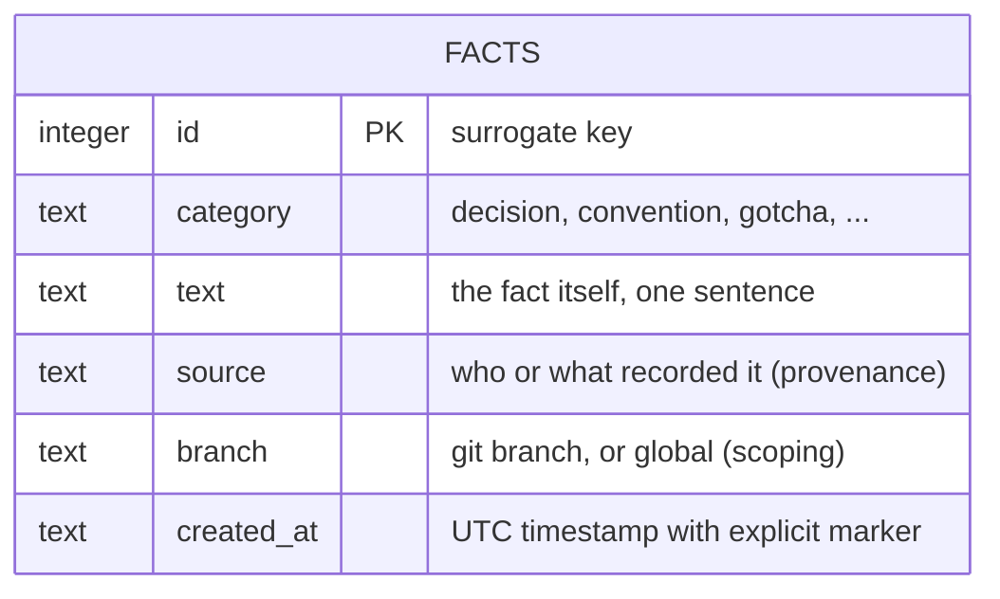
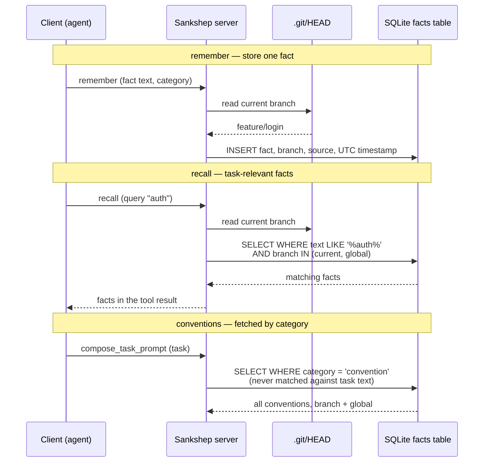

# Persistent memory

A language model finishes an API call and retains nothing: no conversation, no facts, no preferences. When an assistant appears to remember something across sessions, application code wrote that something to disk earlier and put it back into the prompt later. This chapter is about designing that machinery: by the end you can evaluate a memory design along four axes, pick a right-sized retrieval mechanism, and spot two failure modes that ship silently.

## Why memory has to be built

**Persistent memory** is a store outside the model that survives across sessions, holding facts an application selectively re-injects into the [context window](../part1-fundamentals/context-windows.md) at request time.

The reason is mechanical. A model's output is a function of two inputs: its weights, fixed at training time, and the tokens in the current request ([what an LLM actually does](../part1-fundamentals/what-llms-do.md)). Neither carries anything over from your last session. When a chat product greets you by name, the product looked your name up in a database and inserted it into the prompt — the model itself never "knows" anything in the everyday sense ([operational definitions](../part1-fundamentals/what-llms-do.md)).

!!! note "Settled"
    Statelessness is not a limitation waiting to be patched away. Products advertising "memory" features layer application code — a database plus prompt insertion — on top of a stateless model; the model's weights do not change when you talk to it.

What is worth remembering is usually small and dense: decisions and their reasons ("we picked polling because the firewall blocks inbound"), team conventions ("integration tests live in `tests/Integration`"), and hard-won gotchas ("staging truncates strings at 64 characters"). Each is one sentence that can prevent an expensive wrong turn — high value per token, the currency of this whole part ([why raw context is wasteful](why-raw-context-fails.md)).

## Four design axes

Every memory system, from a notes file to a hosted product, makes a choice on each of these axes; making the choices explicit is most of the design work.

**Granularity** is the size of one memory unit: a full conversation transcript, a summary of a session, or an atomic one-sentence fact. Transcripts are cheap to write and expensive to reuse — you pay their full token cost at every re-injection, and most of a transcript is noise. Atomic facts cost more thought at write time, but each is individually retrievable for a few dozen tokens.

**Retrieval mode** is how memories get selected for a given request: matched against the current task (by [embedding similarity](../part1-fundamentals/embeddings.md) or substring search), or fetched wholesale by kind ("always include every convention"). Different kinds of memory need different modes — this axis bites hardest, as the mismatch section shows.

**Scoping** is where a memory applies: to every project (global), to one repository, or to one branch. A fact like "the payment module is mid-refactor; ignore the old interfaces" is true on one branch and actively misleading on `main`. Without scoping, a store either pollutes other contexts or forces users to delete true facts.

**Provenance** is where a memory came from and when: a source field and a timestamp. It lets you resolve contradictions (prefer the newer fact), expire stale ones, and audit what the assistant was told when it produced a surprising answer.

## Right-sizing retrieval: facts do not need embeddings

The previous chapter built a full retrieval stack — chunking, embeddings, a vector index, hybrid ranking ([retrieval for code](rag-for-code.md)). It is tempting to reuse it for memory. Usually you should not.

That stack earns its complexity when the corpus is large and there is a paraphrase gap between query and content — "validate credentials" needs to find `CheckPassword`. A memory store is a different corpus: a few hundred one-sentence facts written by people who reuse the project's own vocabulary. For that shape, plain SQL substring search (`LIKE '%auth%'`) is honest engineering: deterministic, zero model dependencies, sub-millisecond, debuggable by reading the query. Embeddings would add a model download, an index, and non-determinism — to solve a paraphrase problem this corpus barely has.

A minimal schema covers all four axes with one table:



The flip condition: if memory grows into thousands of long-form notes queried in words unlike their contents, the paraphrase gap returns and embeddings earn their keep. Switch when [measurement](measuring-quality.md) shows recall failing, not because embeddings feel more sophisticated.

## The retrieval-mode mismatch

Here is a failure that passes every unit test. Conventions are stored in memory; at request time, memories are matched against the task text — the obvious design, since it works for everything else. A user asks: "add retry logic to the HTTP client." The convention "test files mirror the source tree" shares no words with that task, so it is never retrieved. No error is raised; the assistant simply writes tests in the wrong place, forever.

The bug is not retrieval *quality* — better matching cannot fix it, because a convention is genuinely unrelated to any single task's text. The bug is retrieval *mode*. Conventions are standing rules about *how* work is done, not *what* this task is about. Fetch episodic facts ("staging truncates strings") by relevance; fetch norms by category, unconditionally, every time.

A useful rule of thumb: if a memory would be wrong to omit even when it matches nothing in the request, relevance matching is the wrong mode for it.

## Timestamps: quiet corruption

One more bug class that ships silently. SQLite's `datetime('now')` returns UTC — but as a bare string with no timezone marker, and many client libraries parse a marker-less timestamp as *local* time. Every stored time silently shifts by your UTC offset on read: facts appear hours in the future or past, "newest first" ordering breaks, staleness checks misfire. Nothing crashes.

Prevention is mechanical: write ISO 8601 with an explicit `Z` (or offset), parse with an explicit UTC assumption, and add a round-trip test that runs under a non-UTC machine timezone. This is a general persistence bug, but memory is unusually exposed: provenance is one of the four axes, and a store whose timestamps drift has quietly lost it.

## In practice: Sankshep

[Sankshep](../part0-orientation/running-example.md) — as of 2026-07-18, at v1.8.0 — exposes memory through three of its tools: `remember`, `recall`, and `export_decisions` (tools are covered in [Part 3](../part3-mcp/primitives.md)). Its design maps onto this chapter's axes almost line by line.

The store is plain SQLite in WAL mode with a single `facts` table — the six columns in the diagram above. Facts are never vectorized. That is the right-sizing argument made concrete: Sankshep already ships an ONNX embedding pipeline and a sqlite-vec index for *code* retrieval, yet memory uses SQL `LIKE`, because one-sentence facts lack the paraphrase problem embeddings solve.

Scoping is per-branch: the branch is read directly from the repository's `.git/HEAD` file rather than by shelling out to git, and recall returns facts for the current branch plus `global` ones — a note recorded mid-refactor stays on its feature branch.



Both silent failure modes above come from Sankshep's own history. An earlier version matched conventions against the task text like any other memory, and they almost never surfaced in composed prompts; the shipped fix pulls category `convention` wholesale, with no relevance filter, whenever `compose_task_prompt` runs. The timestamp story is real too: `datetime('now')` wrote timezone-less strings read back as local time, fixed by making UTC explicit at both ends. Neither bug threw an exception.

## Checkpoints

**1.** Why can a model not serve as its own memory across sessions, even in principle?

??? success "Answer"
    Its output depends only on weights (frozen at training time) and the tokens in the current request. Nothing persists from one call into the next, so continuity must come from application code that stores information externally and re-injects it into a later prompt.

**2.** Your team's conventions are stored in memory but almost never appear in composed prompts. Diagnose this using the retrieval-mode axis.

??? success "Answer"
    The conventions are selected by relevance matching against the task text. Standing rules rarely share vocabulary with any given task, so they lose every relevance contest. The fix is a mode change, not better matching: fetch the convention category wholesale on every request.

**3.** When is plain substring search the right retrieval mechanism for memory, and what would justify switching to embeddings?

??? success "Answer"
    Substring search fits a small corpus of short facts written in the project's own vocabulary: deterministic, dependency-free, debuggable. Embeddings earn their complexity when the corpus grows large and queries stop sharing words with contents (a paraphrase gap) — a switch that should be triggered by measured recall failures, not preference.

**4.** A fact saved at 14:00 UTC displays as 19:30 on a machine at UTC+5:30. What class of bug is this, and how do you prevent it?

??? success "Answer"
    A timezone-naive timestamp: the store wrote a bare string with no timezone marker (SQLite's `datetime('now')` does this), and the reader parsed it as local time. Prevent it by writing ISO 8601 with an explicit `Z` or offset, parsing with an explicit UTC assumption, and adding a round-trip test that runs under a non-UTC machine timezone.

## Try it

Design and populate a facts store for a project you actually work on.

1. List five to ten facts a new teammate would need in week one. Sort each into a category: `decision`, `convention`, or `gotcha`.
2. Create the table in a scratch database — the same six columns as the schema above:

    ```sql
    CREATE TABLE facts (
      id         INTEGER PRIMARY KEY,
      category   TEXT NOT NULL,
      text       TEXT NOT NULL,
      source     TEXT NOT NULL,
      branch     TEXT NOT NULL DEFAULT 'global',
      created_at TEXT NOT NULL   -- ISO 8601, explicit Z
    );
    ```

3. Insert your facts with honest provenance and explicit-UTC timestamps:

    ```sql
    INSERT INTO facts (category, text, source, branch, created_at)
    VALUES ('gotcha',
            'Staging DB truncates strings at 64 characters.',
            'manual', 'global',
            strftime('%Y-%m-%dT%H:%M:%SZ', 'now'));
    ```

4. Run both retrieval modes: a relevance query (`WHERE text LIKE '%staging%'`) and a category fetch (`WHERE category = 'convention'`). Find at least one convention the `LIKE` query would never surface for a realistic task.
5. Stress the scoping axis: which of your facts would be wrong if retrieved on a different branch? Move those off `global` and re-run recall with a `branch IN (...)` filter.

If every fact you wrote fits in one sentence and the `LIKE` queries already find what you need, you have just confirmed the right-sizing argument on your own data.
