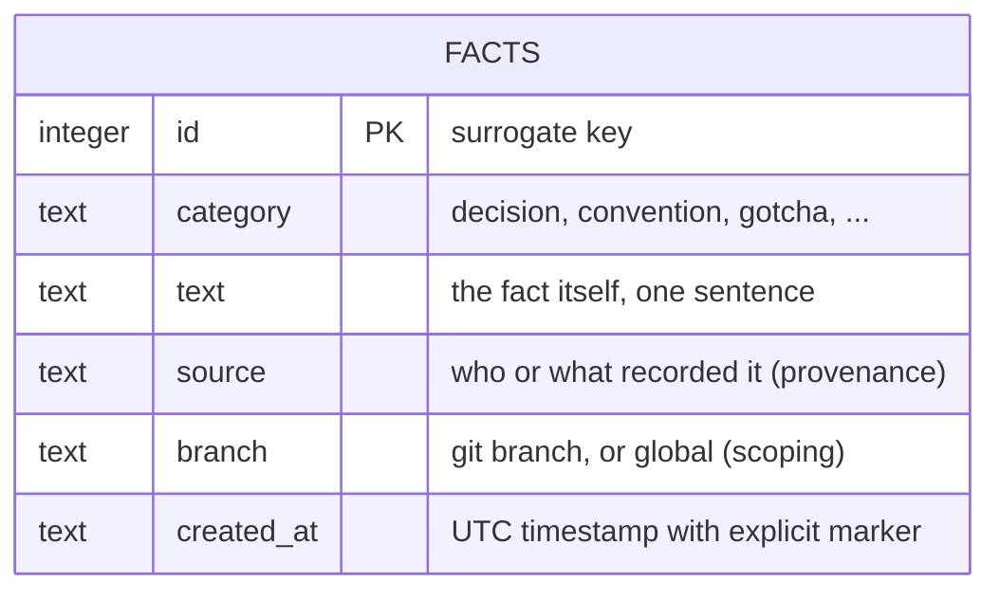
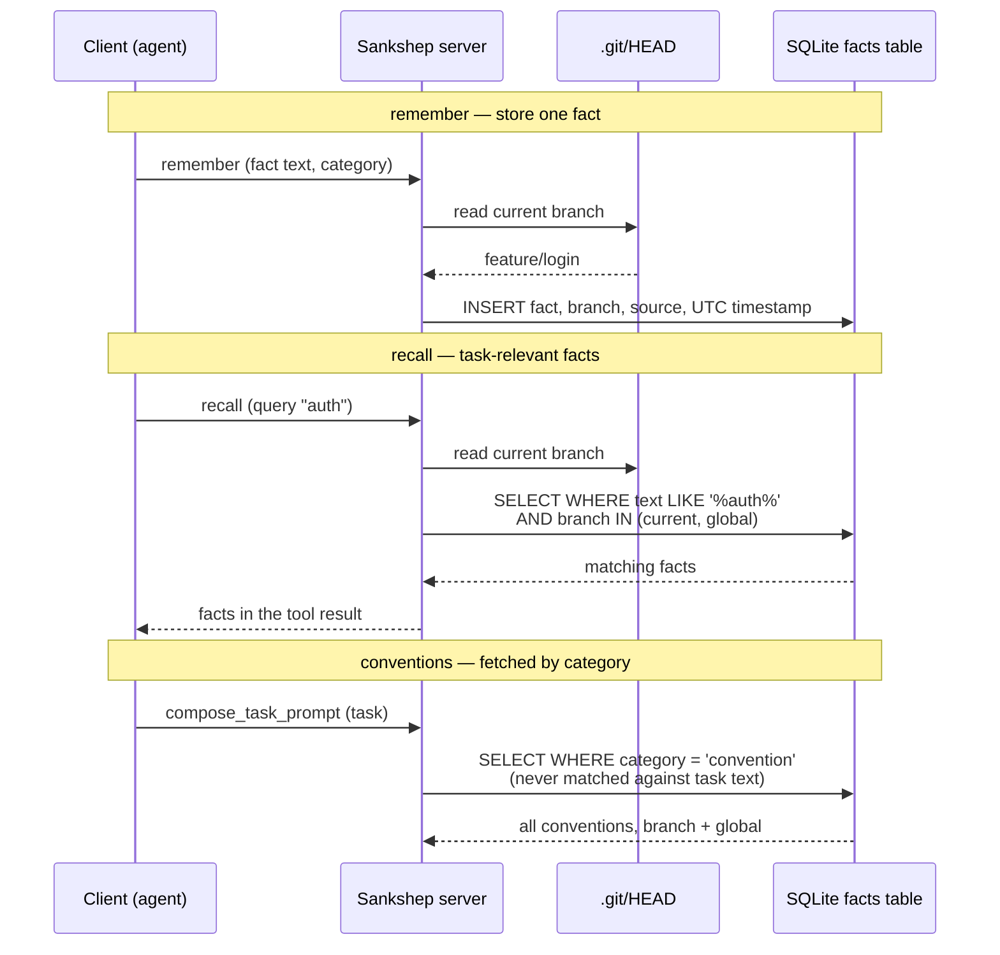

# Persistent memory

A language model finishes an API call and keeps nothing. No conversation, no facts, no preferences.

When an assistant appears to remember something across sessions, application code wrote that something to disk earlier and put it back into the prompt later.

This chapter is about designing that machinery. By the end you will be able to evaluate a memory design along four axes, pick a right-sized retrieval mechanism, and spot two failure modes that ship silently.

## Why memory has to be built

**Persistent memory** is a store outside the model that survives across sessions. It holds facts an application selectively puts back into the [context window](../part1-fundamentals/context-windows.md) at request time.

The reason it must exist is mechanical. A model's output depends on two inputs: its weights, fixed at training time, and the tokens in the current request. [What an LLM actually does](../part1-fundamentals/what-llms-do.md) covers this.

Neither input carries anything over from your last session.

So when a chat product greets you by name, the product looked your name up in a database and put it in the prompt. The model itself never "knows" anything in the everyday sense. See the [operational definitions](../part1-fundamentals/what-llms-do.md).

!!! note "Settled"
    Statelessness is not a limitation waiting to be patched away. Products that advertise "memory" features layer application code — a database plus prompt insertion — on top of a stateless model. The model's weights do not change when you talk to it.

What is worth remembering is usually small and dense.

Decisions and their reasons: "we picked polling because the firewall blocks inbound". Team conventions: "integration tests live in `tests/Integration`". Hard-won gotchas: "staging truncates strings at 64 characters".

Each is one sentence that can prevent an expensive wrong turn. That is high value per token, which is the currency of this whole part. See [why raw context is wasteful](why-raw-context-fails.md).

## Four design axes

Every memory system makes a choice on each of these axes, from a notes file to a hosted product. Making those choices explicit is most of the design work.

| Axis | What it governs | Sankshep's choice | Gets wrong when missing |
|------|-----------------|-------------------|------------------------|
| **Granularity** | Size of one memory unit: transcript, summary, or atomic fact | One-sentence atomic facts | Transcripts re-inject full noise every call; summaries lose precision |
| **Retrieval mode** | How memories are selected: relevance-matched, or fetched wholesale by category | Episodic facts by `LIKE` relevance; conventions by category, unconditionally | Conventions silently vanish — they match nothing in most task texts |
| **Scoping** | Which contexts a memory applies to: global, repo, or branch | Per-branch, plus a `global` tier | Branch-specific facts leak into unrelated contexts, or pollute `main` |
| **Provenance** | Where a memory came from, and when | `source` field plus an explicit UTC timestamp | Cannot resolve contradictions, expire stale facts, or audit surprises |

## Right-sizing retrieval: facts do not need embeddings

The previous chapter built a full retrieval stack: chunking, embeddings, a vector index, hybrid ranking. See [retrieval for code](rag-for-code.md).

It is tempting to reuse all of that for memory. Usually you should not.

That stack earns its complexity when the corpus is large and there is a paraphrase gap between query and content — when "validate credentials" has to find `CheckPassword`.

A memory store is a different shape of corpus. It holds a few hundred one-sentence facts, written by people who reuse the project's own vocabulary.

For that shape, plain SQL substring search — `LIKE '%auth%'` — is honest engineering. It is deterministic, has no model dependencies, runs in under a millisecond, and can be debugged by reading the query.

Embeddings would add a model download, an index, and non-determinism, to solve a paraphrase problem this corpus barely has.

A minimal schema covers all four axes with one table:


```mermaid
erDiagram
    FACTS {
        integer id PK "surrogate key"
        text category "decision, convention, gotcha, ..."
        text text "the fact itself, one sentence"
        text source "who or what recorded it (provenance)"
        text branch "git branch, or global (scoping)"
        text created_at "UTC timestamp with explicit marker"
    }
```

Here is the flip condition. If memory grows into thousands of long-form notes, queried in words unlike their contents, the paraphrase gap returns and embeddings earn their keep.

Switch when [measurement](measuring-quality.md) shows recall failing. Not because embeddings feel more sophisticated.

!!! failure "Common misconception"
    *"Memory means a vector database."*

    Embeddings answer "what is this *like*?" That is the right question for searching a large body of prose you cannot list out.

    Most project memory is the opposite shape: a few hundred short, explicit facts, looked up by a key someone already knows. "What is our deploy policy?"

    For that, an exact lookup or a plain text match is faster, cheaper, and debuggable. Critically, it also never returns a *nearly* right fact with a confident score.

    Reach for embeddings when the corpus is too large to enumerate and the queries are genuinely paraphrases. Below that threshold, a table is the better engineering.

## The retrieval-mode mismatch

Here is a failure that passes every unit test.

Conventions are stored in memory. At request time, memories are matched against the task text — the obvious design, since it works for everything else.

A user asks: "add retry logic to the HTTP client."

The convention "test files mirror the source tree" shares no words with that task. So it is never retrieved. No error is raised. The assistant simply writes tests in the wrong place, forever.

The bug is not retrieval *quality*. Better matching cannot fix it, because a convention is genuinely unrelated to any single task's text.

The bug is retrieval *mode*. Conventions are standing rules about *how* work is done, not about *what* this task is.

So: fetch episodic facts like "staging truncates strings" by relevance. Fetch norms by category, unconditionally, every time.

A useful rule of thumb. If a memory would be wrong to omit even when it matches nothing in the request, relevance matching is the wrong mode for it.

## Timestamps: quiet corruption

One more bug class that ships silently.

SQLite's `datetime('now')` returns UTC. But it returns it as a bare string with no timezone marker, and many client libraries parse a marker-less timestamp as *local* time.

So every stored time silently shifts by your UTC offset on read. Facts appear hours in the future or the past. "Newest first" ordering breaks. Staleness checks misfire. Nothing crashes.

Prevention is mechanical. Write ISO 8601 with an explicit `Z` or offset. Parse with an explicit UTC assumption. And add a round-trip test that runs under a non-UTC machine timezone.

This is a general persistence bug, but memory is unusually exposed to it. Provenance is one of the four axes, and a store whose timestamps drift has quietly lost it.

## In practice: Sankshep

[Sankshep](../part0-orientation/running-example.md) — as of 2026-09-20, at v2.0.0 — exposes memory through three of its tools: `remember`, `recall`, and `export_decisions`. Tools are covered in [Part 3](../part3-mcp/primitives.md).

Its design maps onto this chapter's axes almost line by line.

The store is plain SQLite in WAL mode, with a single `facts` table holding the six columns in the diagram above. Facts are never vectorized.

That is the right-sizing argument made concrete. Sankshep already ships an ONNX embedding pipeline and a sqlite-vec index for *code* retrieval. Memory still uses SQL `LIKE`, because one-sentence facts do not have the paraphrase problem embeddings solve.

Scoping is per-branch. The branch is read directly from the repository's `.git/HEAD` file rather than by shelling out to git, and recall returns facts for the current branch plus `global` ones. So a note recorded mid-refactor stays on its feature branch.


```mermaid
sequenceDiagram
    participant C as Client (agent)
    participant S as Sankshep server
    participant H as .git/HEAD
    participant DB as SQLite facts table

    Note over C,DB: remember — store one fact
    C->>S: remember (fact text, category)
    S->>H: read current branch
    H-->>S: feature/login
    S->>DB: INSERT fact, branch, source, UTC timestamp

    Note over C,DB: recall — task-relevant facts
    C->>S: recall (query "auth")
    S->>H: read current branch
    S->>DB: SELECT WHERE text LIKE '%auth%'<br/>AND branch IN (current, global)
    DB-->>S: matching facts
    S-->>C: facts in the tool result

    Note over C,DB: conventions — fetched by category
    C->>S: compose_task_prompt (task)
    S->>DB: SELECT WHERE category = 'convention'<br/>(never matched against task text)
    DB-->>S: all conventions, branch + global
```

Both silent failure modes above come from Sankshep's own history.

An earlier version matched conventions against the task text like any other memory, and they almost never surfaced in composed prompts. The shipped fix pulls category `convention` wholesale, with no relevance filter, whenever `compose_task_prompt` runs.

The timestamp story is real too. `datetime('now')` wrote timezone-less strings that were read back as local time. The fix was making UTC explicit at both ends.

Neither bug ever threw an exception.

## Checkpoints

**1.** Why can a model not serve as its own memory across sessions, even in principle?

??? success "Answer"
    Its output depends only on two things: weights, frozen at training time, and the tokens in the current request.

    Nothing persists from one call into the next. So continuity has to come from application code that stores information outside the model and puts it back into a later prompt.

**2.** Your team's conventions are stored in memory but almost never appear in composed prompts. Diagnose this using the retrieval-mode axis.

??? success "Answer"
    The conventions are being selected by relevance matching against the task text.

    Standing rules rarely share vocabulary with any given task, so they lose every relevance contest.

    The fix is a mode change, not better matching: fetch the convention category wholesale on every request.

**3.** When is plain substring search the right retrieval mechanism for memory, and what would justify switching to embeddings?

??? success "Answer"
    Substring search fits a small corpus of short facts written in the project's own vocabulary. It is deterministic, dependency-free, and debuggable.

    Embeddings earn their complexity when the corpus grows large and queries stop sharing words with contents — a paraphrase gap. That switch should be triggered by measured recall failures, not by preference.

**4.** A fact saved at 14:00 UTC displays as 19:30 on a machine at UTC+5:30. What class of bug is this, and how do you prevent it?

??? success "Answer"
    A timezone-naive timestamp. The store wrote a bare string with no timezone marker, which is what SQLite's `datetime('now')` does, and the reader parsed it as local time.

    Prevent it by writing ISO 8601 with an explicit `Z` or offset, parsing with an explicit UTC assumption, and adding a round-trip test that runs under a non-UTC machine timezone.

## Try it

Design and populate a facts store for a project you actually work on.

1. List five to ten facts a new teammate would need in week one. Sort each into a category: `decision`, `convention`, or `gotcha`.
2. Create the table in a scratch database, using the same six columns as the schema above:

    ```sql
    CREATE TABLE facts (
      id         INTEGER PRIMARY KEY,
      category   TEXT NOT NULL,
      text       TEXT NOT NULL,
      source     TEXT NOT NULL,
      branch     TEXT NOT NULL DEFAULT 'global',
      created_at TEXT NOT NULL   -- ISO 8601, explicit Z
    );
    ```

3. Insert your facts with honest provenance and explicit-UTC timestamps:

    ```sql
    INSERT INTO facts (category, text, source, branch, created_at)
    VALUES ('gotcha',
            'Staging DB truncates strings at 64 characters.',
            'manual', 'global',
            strftime('%Y-%m-%dT%H:%M:%SZ', 'now'));
    ```

4. Run both retrieval modes. A relevance query, `WHERE text LIKE '%staging%'`. And a category fetch, `WHERE category = 'convention'`.

    Find at least one convention the `LIKE` query would never surface for a realistic task.

5. Now stress the scoping axis. Which of your facts would be wrong if retrieved on a different branch? Move those off `global` and re-run recall with a `branch IN (...)` filter.

If every fact you wrote fits in one sentence, and the `LIKE` queries already find what you need, you have just confirmed the right-sizing argument on your own data.
