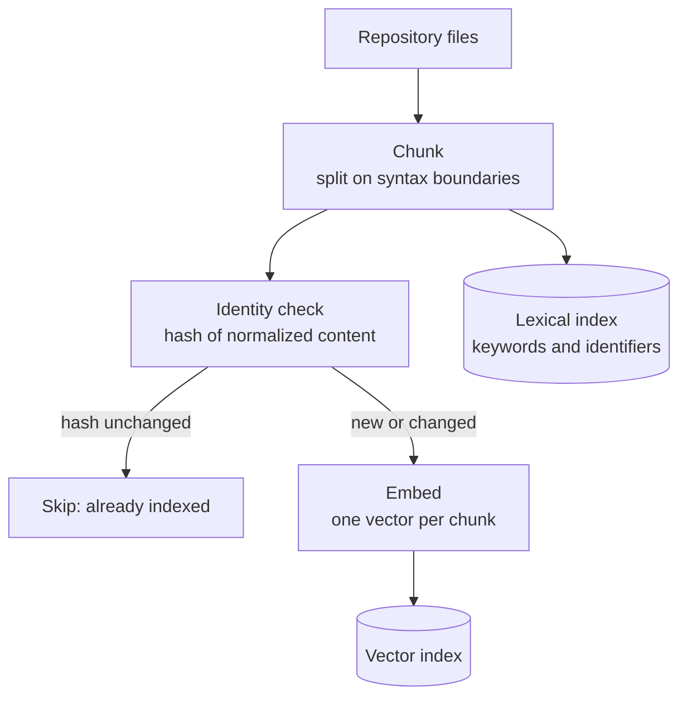
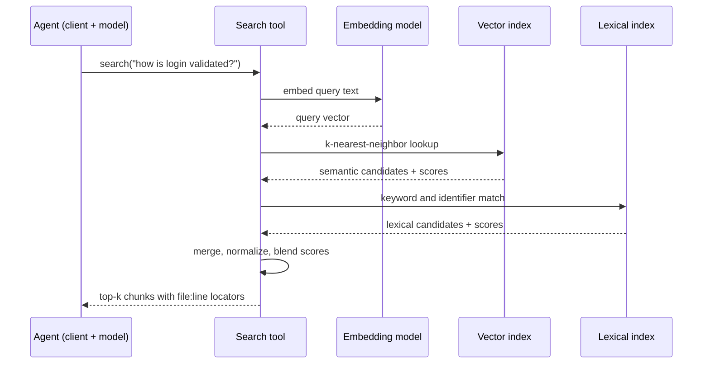

# Retrieval for code

The previous chapter argued that [dumping raw files into the context window is wasteful](why-raw-context-fails.md). This chapter builds the first alternative: fetch only what the task needs. By the end you will be able to trace a complete code-retrieval pipeline — chunk, embed, index, search, rank, assemble — and defend the three choices that separate a good code retriever from a generic document retriever: syntax-aware chunking, stable chunk identity, and hybrid ranking.

## The pipeline at a glance

**Retrieval-augmented generation (RAG)** is the practice of fetching relevant material from your own data at request time and placing it in the model's context, so the output is grounded in what your project actually contains rather than in whatever the model's training data happened to include.

Every RAG system, whatever the vendor, is the same six stages. Three run ahead of time, at index time:

1. *Chunk* — split source material into retrievable units.
2. *Embed* — turn each chunk into a vector (see [Embeddings and similarity](../part1-fundamentals/embeddings.md)).
3. *Index* — store vectors and keywords in structures built for fast lookup.

Three run per request, at query time:

4. *Search* — find candidate chunks for the query.
5. *Rank* — order candidates by a relevance score.
6. *Assemble* — pack the best candidates into a token budget.

!!! note "Settled"
    Embedding models and vector stores churn constantly, but this six-stage shape has stayed stable across generations of tooling. Learn the shape once; the parts are swappable.



## Chunking: syntax-aware beats fixed windows

A **chunk** is the unit of retrieval: the piece of text that gets one embedding, one index entry, and — if it wins the ranking — one slot in the prompt.

The generic recipe is the fixed window: every *N* tokens, with some overlap. That is tolerable for prose, where meaning spreads smoothly across sentences. Code has hard structural boundaries, and fixed windows ignore them: a window that starts mid-function captures a dangling brace, half a loop, and no signature. Its embedding represents a fragment no developer would ever ask about — and when it does match, the model receives code with no name and no context.

Syntax-aware chunking splits on the boundaries the grammar defines: functions, methods, classes. Each chunk carries a signature plus its body, which is precisely the shape of most questions ("the function that validates login"). It also localizes change: editing one method invalidates one chunk, not every window that happened to overlap it. Oversized units get split along their next natural seam — a large class becomes one chunk per member.

## Chunk identity: the line-ending trap

Re-embedding an entire repository on every change is too slow to be usable, so real indexers are incremental: re-embed only chunks whose content changed. That requires a stable identity per chunk — in practice, a hash of the chunk's content.

Here is the trap: hash the raw bytes and your identity is hostage to byte-level noise. The classic case is line endings. A Windows checkout, an editor setting, or a `.gitattributes` change can flip a file between CRLF and LF without altering a single meaningful character — and every hash in the file changes, triggering a full re-embed of code that did not change at all.

The fix is to hash *normalized* content: at minimum, convert line endings to a single form first. Including the file path in the hashed key is also worth doing, so that two identical snippets in different files keep distinct identities and their locators stay honest.

## Query time: hybrid ranking

Two search modes exist, and for code you want both.

**Semantic search** ranks chunks by embedding similarity to the query, so it can match meaning without shared words — "auth check" can surface password-verification code that never contains the string "auth". **Lexical search** matches literal text — keywords, substrings, identifiers — and is exact where exactness matters.

Code rewards lexical search unusually well, because code is full of load-bearing names. Identifiers are lexical gold: a query containing "validated" should surface `ValidateRequest`, and a lexical matcher that splits identifiers and compares word stems finds that link directly and cheaply. An embedding model will often rank it well too, but the lexical signal is precise, explainable, and free. Pure-semantic retrievers routinely miss exact identifier hits that a grep would have found — an embarrassing failure in a code tool.

**Hybrid ranking** runs both searches and blends their normalized scores into one ordering, typically as a weighted sum. The blend keeps semantic recall for paraphrased questions while letting exact name matches punch through.



## Assembling the context

Ranking produces an ordered list; assembly packs the best chunks into a [token](../part1-fundamentals/tokens.md) budget until it runs out. Two disciplines matter here. First, every chunk should carry a locator — file path and line range — so the model's output can cite checkable locations and a human can verify them. Second, the budget is finite, so anything that shrinks each chunk buys room for more chunks. Compressing retrieved code before packing it is the subject of the [next chapter](structural-minimization.md), and how to know the compression didn't destroy the answer is the subject of [Measuring context quality](measuring-quality.md).

## Freshness: the index is a snapshot

The moment you edit a file, the index describes a repository that no longer exists. Retrieval from a stale index produces confident, well-formatted, wrong answers — locators pointing at lines that moved, chunks quoting code that was deleted.

There are three broad responses. Re-index on a timer, and accept windows of staleness. Run a file watcher, and accept extra machinery that still misses edits made while it wasn't running. Or verify at read time: before serving results, cheaply check whether the underlying files changed and refresh only what did. The third option is the least glamorous and the most robust, and it reappears in this site's capstone as the [verify-on-read case study](../part5-capstone/case-verify-on-read.md).

## The degradation ladder

What happens when there is no vector index — the user just installed the tool, or the embedding model isn't available? A **degradation ladder** is an ordered sequence of fallbacks in which each step gives up ranking quality but keeps returning correct results: vector index unavailable → brute-force similarity over stored vectors; no embeddings at all → lexical search alone.

Treat the bottom rung as a feature, not an apology. A retrieval tool whose lexical fallback works before anyone has run an indexing step is useful in its first minute, and every rung above it is an upgrade rather than a prerequisite. The infrastructure side of this choice gets a full treatment in the [sqlite-vec case study](../part5-capstone/case-sqlite-vec-vs-vector-db.md).

## In practice: Sankshep

Sankshep's `search_code` tool implements this pipeline end to end, and its choices map one-to-one onto this chapter:

- *Chunking* is AST symbol-aware: a type up to 400 lines becomes a single chunk; oversized types are split by member.
- *Chunk identity* is a SHA-256 hash of the file path plus LF-normalized content — the line-ending trap above, closed by construction.
- *Ranking* blends 0.6 semantic and 0.4 lexical score when an embedding index exists, and falls back to lexical alone when it doesn't — the bottom rung of the ladder, shipped as a feature.
- *Documents* (`.docx`, `.pdf`) flow through the same chunk-embed-index path as source code.

The embedding model behind the semantic half (bge-small-en-v1.5 and its pooling details) was covered in [Embeddings and similarity](../part1-fundamentals/embeddings.md), and `search_code` refreshes its view of changed files before searching — the verify-on-read pattern examined in [Part 5](../part5-capstone/case-verify-on-read.md).

## Checkpoints

**1.** Why does fixed-window chunking hurt code retrieval more than prose retrieval?

??? success "Answer"
    Prose spreads meaning smoothly, so an arbitrary window still reads as coherent text. Code has hard structural boundaries: a window that starts mid-function has no signature and half a body, its embedding represents a fragment nobody queries for, and any match delivers context-free code to the model. Syntax-aware chunks (functions, methods, types) align retrieval units with how questions are actually asked.

**2.** A teammate's checkout converts a repository from LF to CRLF and your indexer re-embeds every file, though no code changed. What went wrong, and what is the fix?

??? success "Answer"
    Chunk identity was computed by hashing raw bytes, so a byte-level change that is semantically meaningless — line endings — altered every hash. The fix is to normalize content before hashing (convert line endings to one form, e.g. LF), so identity tracks meaningful change only.

**3.** The query "validated" needs to find `ValidateRequest`. Which retrieval signal makes that connection most reliably, and why not rely on embeddings alone?

??? success "Answer"
    The lexical signal: splitting the identifier into words and comparing stems links "validated" to `Validate` exactly, cheaply, and explainably. Embeddings often rank it well too, but pure-semantic retrieval can miss exact identifier matches that literal search finds every time — and identifiers are the densest relevance signal code has.

**4.** A retrieval tool returns file:line locators that don't match what's on disk. Name two designs that prevent this and one cost of each.

??? success "Answer"
    (a) Verify at read time: cheaply check for changed files before serving results and refresh only those — costs a small latency hit per query. (b) A file watcher that updates the index on change — costs extra machinery and still misses edits made while the watcher wasn't running. Only read-time verification is correct by construction.

**5.** Why might "no vector index yet, so fall back to lexical search" be a feature rather than a bug?

??? success "Answer"
    Because it makes the tool useful before any indexing has ever run: correct (if less well-ranked) results from the first minute, with the semantic index as an upgrade rather than a prerequisite. Each rung of a well-designed degradation ladder gives up ranking quality, never correctness.

## Try it

Build a toy hybrid retriever over five files from a project you know.

```python
from pathlib import Path
import numpy as np
from sentence_transformers import SentenceTransformer

files = [Path(p) for p in
         ["auth.py", "db.py", "http_client.py", "models.py", "utils.py"]]
texts = [f.read_text() for f in files]

model = SentenceTransformer("BAAI/bge-small-en-v1.5")
doc_vecs = model.encode(texts, normalize_embeddings=True)
query = "how is a login request validated?"
q_vec = model.encode(
    "Represent this sentence for searching relevant passages: " + query,
    normalize_embeddings=True)

semantic = doc_vecs @ q_vec          # cosine similarity: vectors are unit length
kws = [w for w in query.lower().split() if len(w) > 3]
lex = np.array([sum(k in t.lower() for k in kws) for t in texts], dtype=float)
lex = lex / (lex.max() or 1.0)

for score, f in sorted(zip(0.6 * semantic + 0.4 * lex, files), reverse=True):
    print(f"{score:.3f}  {f}")
```

Then experiment:

1. Print the semantic and lexical scores separately. Find a query where they disagree about the winner — usually one that names an identifier.
2. Re-chunk at function level (split on `def ` for Python) instead of file level and re-rank. Watch the top hit become more precise.
3. Hash each chunk with `hashlib.sha256`, convert one file's line endings to CRLF, and re-hash. Then re-hash with `content.replace("\r\n", "\n")` normalization and confirm identity survives.
