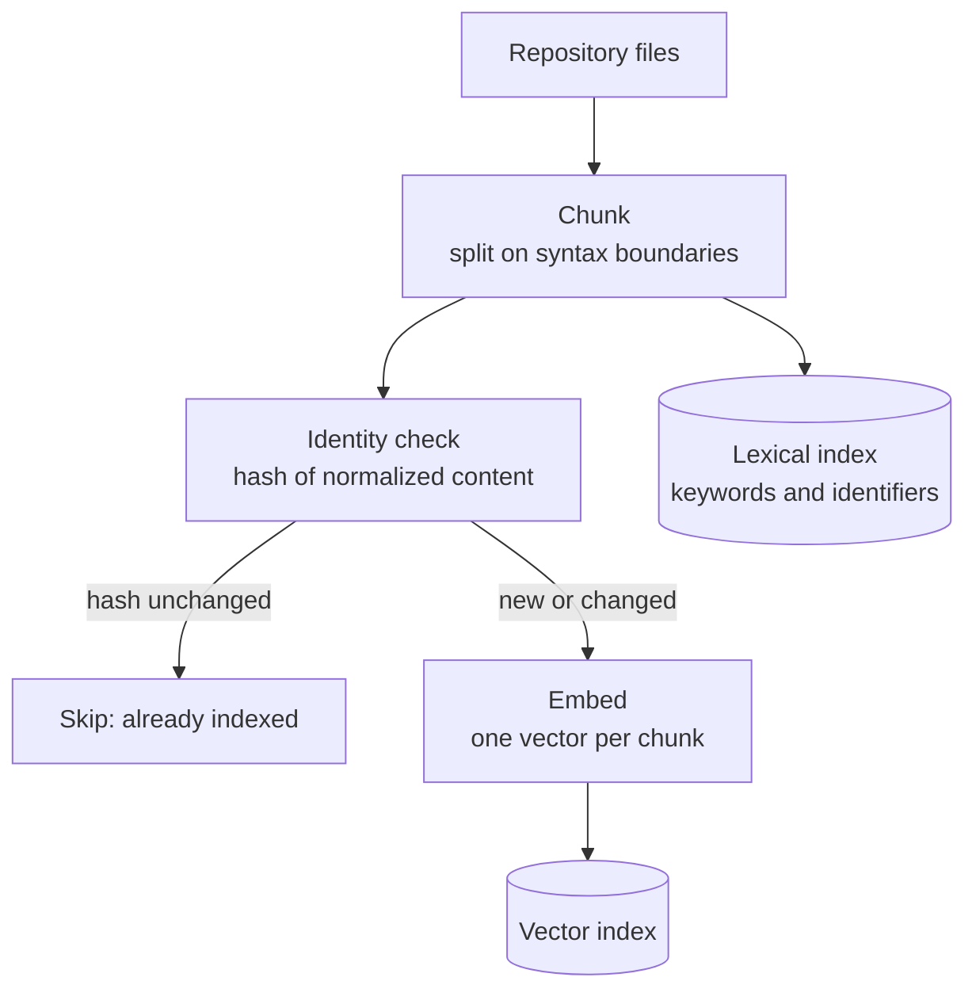
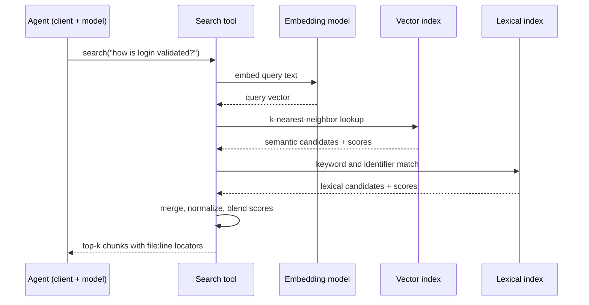
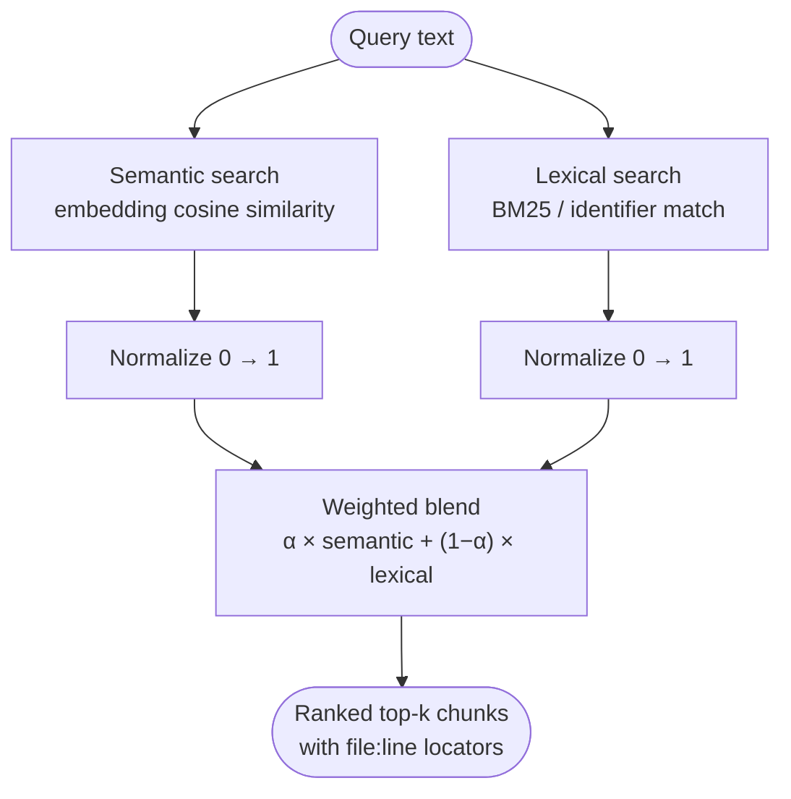
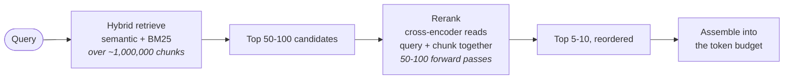

# Retrieval for code

The previous chapter argued that [dumping raw files into the context window is wasteful](why-raw-context-fails.md). This chapter builds the first alternative: fetch only what the task needs.

By the end you will be able to trace a complete code-retrieval pipeline — chunk, embed, index, search, rank, assemble. You will be able to defend the three choices that separate a good code retriever from a generic document retriever: syntax-aware chunking, stable chunk identity, and hybrid ranking. And you will know when a reranking pass earns its latency.

## The pipeline at a glance

**Retrieval-augmented generation (RAG)** means fetching relevant material from your own data at request time and putting it in the model's context. The output is then grounded in what your project actually contains, rather than in whatever the model's training data happened to include.

Every RAG system, whatever the vendor, is the same six stages.

Three run ahead of time, at index time:

1. *Chunk* — split source material into retrievable units.
2. *Embed* — turn each chunk into a vector. See [Embeddings and similarity](../part1-fundamentals/embeddings.md).
3. *Index* — store vectors and keywords in structures built for fast lookup.

Three run per request, at query time:

4. *Search* — find candidate chunks for the query.
5. *Rank* — order candidates by a relevance score.
6. *Assemble* — pack the best candidates into a token budget.

!!! note "Settled"
    Embedding models and vector stores churn constantly. This six-stage shape has stayed stable across generations of tooling. Learn the shape once. The parts are swappable.


```mermaid
flowchart TD
    repo["Repository files"] --> chunk["Chunk<br/>split on syntax boundaries"]
    chunk --> id["Identity check<br/>hash of normalized content"]
    id -- "hash unchanged" --> skip["Skip: already indexed"]
    id -- "new or changed" --> embed["Embed<br/>one vector per chunk"]
    embed --> vindex[("Vector index")]
    chunk --> lindex[("Lexical index<br/>keywords and identifiers")]
```

## Chunking: syntax-aware beats fixed windows

A **chunk** is the unit of retrieval. It is the piece of text that gets one embedding, one index entry, and — if it wins the ranking — one slot in the prompt.

The generic recipe is the fixed window: cut every *N* tokens, with some overlap. That is fine for prose, where meaning spreads smoothly across sentences.

Code has hard structural boundaries, and fixed windows ignore them. A window that starts mid-function captures a dangling brace, half a loop, and no signature. Its embedding represents a fragment no developer would ever ask about. And when it does match, the model receives code with no name and no context.

Syntax-aware chunking splits on the boundaries the grammar already defines: functions, methods, classes.

Each chunk then carries a signature plus its body, which is exactly the shape of most questions — "the function that validates login". It also localizes change: editing one method invalidates one chunk, not every window that happened to overlap it. Oversized units get split at their next natural seam, so a large class becomes one chunk per member.

??? info "Going deeper — how big should a chunk be?"

    Syntax-aware chunking answers *where* to cut. It does not answer *how much* to keep, and that trade-off runs in both directions at once.

    **Too large** and the embedding is an average over too many ideas. A 600-line class squeezed into one vector points near the center of everything it does, and close to nothing it does specifically. So it ranks mediocrely for every query and wins none of them. It also wastes budget at assembly: winning a slot means spending 600 lines to answer a question about 12 of them.

    **Too small** and you strip away the context that makes a match meaningful. A three-line helper embedded alone carries almost no signal about *why* it exists. A chunk that is just a signature with no body matches the question but cannot answer it.

    Useful anchors, rather than rules:

    - **One symbol is the right default.** A function or method, with its signature and body. This is the shape of the question people actually ask, which is the real argument for it.
    - **Roughly 200 to 800 tokens** is where most code chunks land on their own. Treat that range as something to check against, not something to enforce. A chunk far outside it usually means the *code* has a structural problem, not the chunker.
    - **Split oversized symbols at the next natural seam.** Give each piece the enclosing signature so it still makes sense alone.
    - **Keep small related symbols together** when they are meaningless apart. A tiny data class and its single constructor, say.

    The honest version: chunk size is something you measure, not something you derive. Pick the symbol-shaped default, then let the [evaluation harness](measuring-quality.md) tell you where it fails on your corpus. Anyone quoting a universal token count is quoting a number that came from someone else's data.

## Chunk identity: the line-ending trap

Re-embedding an entire repository on every change is too slow to use. So real indexers are incremental: they re-embed only the chunks whose content changed.

That needs a stable identity per chunk. In practice, a hash of the chunk's content.

Here is the trap. Hash the raw bytes and your identity is hostage to byte-level noise.

The classic case is line endings. A Windows checkout, an editor setting, or a `.gitattributes` change can flip a file between CRLF and LF without altering a single meaningful character. Every hash in the file changes, and the indexer re-embeds code that did not change at all.

The fix is to hash *normalized* content. At minimum, convert line endings to one form first.

Including the file path in the hashed key is also worth doing. Then two identical snippets in different files keep separate identities, and their locators stay honest.

## Chunk overlap

Fixed-window retrievers usually include an overlap, repeating the last N tokens of one window at the start of the next. It stops the cut falling mid-thought.

Code retrievers with syntax-aware chunking mostly do not need this. Each chunk is a whole symbol, so there is no mid-meaning cut to patch.

Overlap is still worth considering at one specific seam. Large classes split into per-member chunks can leave a caller and callee in adjacent chunks with no shared context. Copying the class signature into each member chunk is cheaper than losing the type relationship entirely.

The cost is exact duplication in the index. Two chunks with identical leading lines will both rank for queries about the class name, so reranking or deduplication has to account for it.

!!! tip
    Start without overlap. Add it only when retrieval evaluation shows that split symbols are landing in results stripped of their enclosing context.

## Query time: hybrid ranking

Two search modes exist. For code, you want both.

**Semantic search** ranks chunks by embedding similarity to the query. So it can match meaning without shared words: "auth check" can surface password-verification code that never contains the string "auth".

**Lexical search** matches literal text — keywords, substrings, identifiers. It is exact where exactness matters.

The standard scoring function for the lexical lane is **BM25**. It is worth knowing what it rewards, because you will meet the name in every retrieval library.

BM25 scores a chunk against a query on three ideas. A query term appearing in a chunk is evidence, which is *term frequency*. A term appearing in few chunks across the whole corpus is stronger evidence than one appearing everywhere, which is *inverse document frequency*. And a long chunk should not beat a short one just by containing more words, which is *length normalization*.

That second idea is why BM25 suits code so well. A rare identifier like `ValidateRequest` is a near-perfect signal. `get` or `data` is nearly worthless. BM25 works that out from your corpus without being told.

Code rewards lexical search unusually well, because code is full of load-bearing names.

Identifiers are lexical gold. A query containing "validated" should surface `ValidateRequest`, and a lexical matcher that splits identifiers and compares word stems finds that link directly and cheaply. An embedding model will often rank it well too, but the lexical signal is precise, explainable, and free.

Pure-semantic retrievers routinely miss exact identifier hits that a grep would have found. In a code tool, that is embarrassing.

**Hybrid ranking** runs both searches and blends their scores into one ordering, usually as a weighted sum. The blend keeps semantic recall for paraphrased questions, while letting exact name matches punch through.


```mermaid
sequenceDiagram
    participant A as Agent (client + model)
    participant T as Search tool
    participant E as Embedding model
    participant V as Vector index
    participant L as Lexical index
    A->>T: search("how is login validated?")
    T->>E: embed query text
    E-->>T: query vector
    T->>V: k-nearest-neighbor lookup
    V-->>T: semantic candidates + scores
    T->>L: keyword and identifier match
    L-->>T: lexical candidates + scores
    T->>T: merge, normalize, blend scores
    T-->>A: top-k chunks with file:line locators
```

The blend is a weighted sum over normalized scores. Both lanes produce raw scores on different scales, so each is first rescaled to a 0-to-1 range, then combined:


```mermaid
flowchart TD
    Q(["Query text"])
    SEM["Semantic search
embedding cosine similarity"]
    LEX["Lexical search
BM25 / identifier match"]
    NS["Normalize 0 → 1"]
    NL["Normalize 0 → 1"]
    BLEND["Weighted blend
α × semantic + (1−α) × lexical"]
    RANK(["Ranked top-k chunks
with file:line locators"])

    Q --> SEM --> NS --> BLEND
    Q --> LEX --> NL --> BLEND
    BLEND --> RANK
```

*Sankshep uses 60% semantic and 40% lexical when a vector index exists. It falls back to lexical alone when there is none.*

## Reranking: a second, slower opinion

Hybrid ranking has a structural weakness that no blend weight can fix.

Both lanes score the query and the chunk *separately*. The query became a vector without ever seeing the chunk. Each chunk became a vector months ago, without ever seeing the query. The comparison happens at the end, between two summaries produced independently.

That design is what makes retrieval fast enough to search millions of chunks. It is also what makes it approximate.

A **reranker** takes a second pass over the shortlist and removes that limitation.

It is a different kind of model: a **cross-encoder**, which reads the query and one candidate chunk *together*, in a single forward pass, and outputs one relevance score. Because the two texts attend to each other directly, it can judge something a vector comparison structurally cannot — whether this function actually handles the case the question asks about, or merely talks about a similar topic.

The catch is cost, and it is severe.

Embedding similarity compares precomputed vectors, so a query against a million chunks is a million cheap arithmetic operations. A cross-encoder has to run a full forward pass *per candidate*, at query time, with nothing precomputable. The score exists only for that exact pair. Running one over an entire corpus is not slow. It is impossible.

That dictates the architecture. Retrieval becomes a funnel: cheap and broad first, expensive and precise last.


```mermaid
flowchart LR
    Q(["Query"]) --> R1["Hybrid retrieve<br/>semantic + BM25<br/><i>over ~1,000,000 chunks</i>"]
    R1 --> S1["Top 50-100 candidates"]
    S1 --> R2["Rerank<br/>cross-encoder reads<br/>query + chunk together<br/><i>50-100 forward passes</i>"]
    R2 --> S2["Top 5-10, reordered"]
    S2 --> A["Assemble into<br/>the token budget"]
```

The first stage optimizes for **recall**: do not lose the right answer. It is allowed to be sloppy about order.

The second optimizes for **precision**: put the right answer first, over a set small enough to afford it.

Neither can do the other's job.

Three practical notes:

- **Shortlist size is the tuning knob.** Retrieve too few and reranking cannot recover an answer that was never shortlisted. The ceiling on final quality is set by the first stage's recall, not by the reranker's skill. Retrieve too many and query latency grows in step. Fifty is a reasonable place to start.
- **Rerankers pay off where embeddings are weakest.** Long chunks, whose single vector averages too much material. And queries that hinge on a qualifier — "where login is validated *for expired tokens*". A cross-encoder resolves those. Cosine similarity blurs them.
- **It is optional, and honestly so.** A reranker adds a model dependency, per-query latency, and — if hosted — a network hop that may send your code off the machine. For a local-first code tool, that budget may simply not exist. That is a legitimate engineering answer, not a gap.

!!! tip "Measure before you add one"
    Reranking is the most commonly cargo-culted stage in RAG.

    Before adding one, check whether your shortlist even contains the right chunk. If the correct answer is already in the top 50 and merely ranked eighth, a reranker will help. If it is not in the top 50 at all, the problem is chunking or first-stage retrieval, and no reranker can fix it.

    [Measuring context quality](measuring-quality.md) gives you the harness to tell those two cases apart.

## Assembling the context

Ranking produces an ordered list. Assembly packs the best chunks into a [token](../part1-fundamentals/tokens.md) budget until it runs out.

Two disciplines matter here.

First, every chunk should carry a locator — file path and line range — so the model's output can cite checkable locations and a human can verify them.

Second, the budget is finite, so anything that shrinks each chunk buys room for more chunks. Compressing retrieved code before packing it is the subject of the [next chapter](structural-minimization.md). Knowing whether the compression destroyed the answer is the subject of [Measuring context quality](measuring-quality.md).

## Freshness: the index is a snapshot

The moment you edit a file, the index describes a repository that no longer exists.

Retrieval from a stale index produces confident, well-formatted, wrong answers. Locators point at lines that moved. Chunks quote code that was deleted.

There are three broad responses.

Re-index on a timer, and accept windows of staleness. Run a file watcher, and accept extra machinery that still misses edits made while it was not running. Or verify at read time: before serving results, cheaply check whether the underlying files changed, and refresh only what did.

The third option is the least glamorous and the most robust. It comes back in this site's capstone as the [verify-on-read case study](../part5-capstone/case-verify-on-read.md).

??? info "Going deeper — keeping an index alive"

    Verify-on-read solves *correctness*: never serve a result about a file that changed. It does not solve the slower problem, which is an index that gradually drifts away from the repository it describes.

    Three maintenance jobs, in the order they usually start hurting.

    - **Incremental re-embedding.** Covered above by content hashing. Only chunks whose normalized content changed get re-embedded. The failure to watch for is the [line-ending trap](#chunk-identity-the-line-ending-trap), where a whole-file identity change quietly triggers full re-embedding and everyone concludes that indexing is "just slow".
    - **Deletion.** Easy to forget, and unpleasant when it bites. A chunk whose symbol was renamed or deleted stays in the vector index forever unless something prunes it. It keeps ranking for queries, so retrieval confidently returns code that no longer exists, with a locator pointing at whatever now sits on those lines. Pruning has to run on the same pass as re-embedding, keyed on the same identity.
    - **Re-embedding on model change.** This is the one that surprises teams. Vectors from different embedding models are not comparable, and [Embeddings and similarity](../part1-fundamentals/embeddings.md) covers why. So upgrading the embedding model invalidates *every vector in the index*, not just the changed ones. There is no incremental path. It is a full rebuild, and it should be a deliberate, versioned operation. Store the model identity alongside the index, and refuse to serve when it does not match the configured model. That turns a silent quality collapse into a loud startup error.

## The degradation ladder

What happens when there is no vector index? Maybe the user just installed the tool, or the embedding model is unavailable.

A **degradation ladder** is an ordered set of fallbacks, where each step gives up ranking quality but keeps returning correct results. Vector index unavailable, so fall back to brute-force similarity over stored vectors. No embeddings at all, so fall back to lexical search alone.

Treat the bottom rung as a feature, not an apology.

A retrieval tool whose lexical fallback works before anyone has run an indexing step is useful in its first minute. Every rung above that is an upgrade rather than a prerequisite. The infrastructure side of this choice gets a full treatment in the [sqlite-vec case study](../part5-capstone/case-sqlite-vec-vs-vector-db.md).

## In practice: Sankshep

Sankshep's `search_code` tool implements this pipeline end to end, and its choices map one to one onto this chapter.

- *Chunking* is AST symbol-aware. A type up to 400 lines becomes a single chunk, and oversized types are split by member.
- *Chunk identity* is a SHA-256 hash of the file path plus LF-normalized content. That closes the line-ending trap by construction.
- *Ranking* blends 0.6 semantic and 0.4 lexical when an embedding index exists, and falls back to lexical alone when it does not. The bottom rung of the ladder, shipped as a feature.
- *Documents* such as `.docx` and `.pdf` flow through the same chunk-embed-index path as source code.

The embedding model behind the semantic half — bge-small-en-v1.5, and its pooling details — was covered in [Embeddings and similarity](../part1-fundamentals/embeddings.md). And `search_code` refreshes its view of changed files before searching, which is the verify-on-read pattern examined in [Part 5](../part5-capstone/case-verify-on-read.md).

## Checkpoints

**0. Your retriever returns the right file ranked eighth. One colleague proposes adding a cross-encoder reranker. Another says the chunking is wrong. What single measurement settles it, and why does the answer change if the right file is ranked eightieth?**

??? success "Answer"
    Check whether the correct chunk appears in the first-stage shortlist at all.

    Ranked eighth means recall succeeded and only ordering failed. That is exactly what a reranker fixes, since it rescores a shortlist.

    Ranked eightieth, outside a top-50 shortlist, means the reranker would never see the chunk. Reranking cannot recover what retrieval never surfaced, because the ceiling is set by first-stage recall. That case points at chunking, the lexical lane, or the blend weight instead.

**1.** Why does fixed-window chunking hurt code retrieval more than prose retrieval?

??? success "Answer"
    Prose spreads meaning smoothly, so an arbitrary window still reads as coherent text.

    Code has hard structural boundaries. A window that starts mid-function has no signature and half a body. Its embedding represents a fragment nobody queries for, and any match delivers context-free code to the model.

    Syntax-aware chunks — functions, methods, types — line retrieval units up with how questions are actually asked.

**2.** A teammate's checkout converts a repository from LF to CRLF, and your indexer re-embeds every file even though no code changed. What went wrong, and what is the fix?

??? success "Answer"
    Chunk identity was computed by hashing raw bytes. So a byte-level change that means nothing — line endings — altered every hash.

    The fix is to normalize content before hashing: convert line endings to one form, such as LF. Then identity tracks meaningful change only.

**3.** The query "validated" needs to find `ValidateRequest`. Which retrieval signal makes that connection most reliably, and why not rely on embeddings alone?

??? success "Answer"
    The lexical signal. Splitting the identifier into words and comparing stems links "validated" to `Validate` exactly, cheaply, and explainably.

    Embeddings often rank it well too. But pure-semantic retrieval can miss exact identifier matches that literal search finds every time — and identifiers are the densest relevance signal code has.

**4.** A retrieval tool returns file:line locators that do not match what is on disk. Name two designs that prevent this, and one cost of each.

??? success "Answer"
    First, verify at read time: cheaply check for changed files before serving results, and refresh only those. The cost is a small latency hit per query.

    Second, a file watcher that updates the index on change. The cost is extra machinery, and it still misses edits made while the watcher was not running.

    Only read-time verification is correct by construction.

**5.** Why might "no vector index yet, so fall back to lexical search" be a feature rather than a bug?

??? success "Answer"
    Because it makes the tool useful before any indexing has run. You get correct results, if less well ordered, from the first minute — with the semantic index as an upgrade rather than a prerequisite.

    Each rung of a well-designed degradation ladder gives up ranking quality, never correctness.

## Try it

Build a toy hybrid retriever over five files from a project you know.

```python
from pathlib import Path
import numpy as np
from sentence_transformers import SentenceTransformer

files = [Path(p) for p in
         ["auth.py", "db.py", "http_client.py", "models.py", "utils.py"]]
texts = [f.read_text() for f in files]

model = SentenceTransformer("BAAI/bge-small-en-v1.5")
doc_vecs = model.encode(texts, normalize_embeddings=True)
query = "how is a login request validated?"
q_vec = model.encode(
    "Represent this sentence for searching relevant passages: " + query,
    normalize_embeddings=True)

semantic = doc_vecs @ q_vec          # cosine similarity: vectors are unit length
kws = [w for w in query.lower().split() if len(w) > 3]
lex = np.array([sum(k in t.lower() for k in kws) for t in texts], dtype=float)
lex = lex / (lex.max() or 1.0)

for score, f in sorted(zip(0.6 * semantic + 0.4 * lex, files), reverse=True):
    print(f"{score:.3f}  {f}")
```

Then experiment:

1. Print the semantic and lexical scores separately. Find a query where they disagree about the winner. It is usually one that names an identifier.
2. Re-chunk at function level, splitting on `def ` for Python, instead of file level. Re-rank, and watch the top hit get more precise.
3. Hash each chunk with `hashlib.sha256`. Convert one file's line endings to CRLF and re-hash. Then re-hash with `content.replace("\r\n", "\n")` normalization, and confirm the identity survives.
