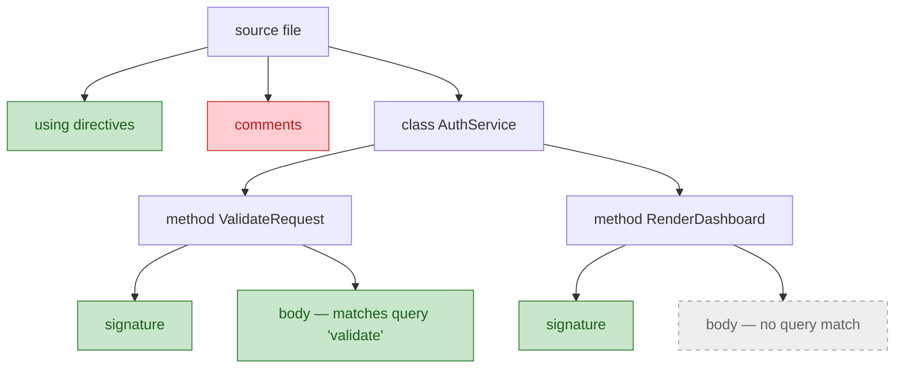
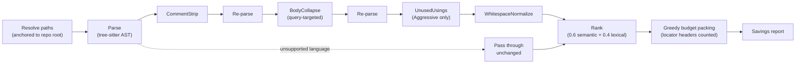

# Structural minimization

[Retrieval](rag-for-code.md) chooses *which* files reach the model. This chapter is about compressing *what is inside them* — without asking a model to do it. By the end you will be able to:

- explain why parsing beats summarizing for per-request compression,
- pick a transform for a question and name what it loses,
- state the stemming invariant that makes query-targeted collapse safe.

**Structural minimization** is compressing source code by parsing it into a syntax tree and deleting or collapsing regions you can identify structurally — comments, function bodies, unused imports — rather than paraphrasing the text. The output is still real code, just less of it.

## Compress by parsing, not summarizing

Two ways to shrink a 5,000-[token](../part1-fundamentals/tokens.md) file into a slice of your [context window](../part1-fundamentals/context-windows.md):

1. Send it to an LLM and ask for a summary.
2. Parse it and delete parts you can name.

Summarization fails three ways for a per-request tool. Non-deterministic: [sampling](../part1-fundamentals/what-llms-do.md) means two runs differ, so no test can pin the result. Expensive: you spend tokens to save tokens, on every call. Unpredictable loss: a paraphrase drops details you cannot enumerate in advance.

Parsing inverts all three: byte-identical output makes the pipeline testable; it runs in milliseconds on a CPU, offline, at zero marginal cost; and the loss is *enumerable* — if the transform is "delete comments", you know precisely what is gone.

!!! note "Settled"
    Nothing in this chapter depends on fast-moving vendor facts: parsing-based compression is ordinary compiler technology and will read the same way in five years.

The catch: you need a parser for every language you support, and working-tree files are often mid-edit and syntactically broken. Enter tree-sitter.

## Tree-sitter and queries over syntax trees

**tree-sitter** is a parsing framework with three properties that matter here: grammars for many languages, per-request speed, and error tolerance — a file with a syntax error still produces a tree, an error node wrapping the broken region while everything else parses normally. A batch compiler would reject that file outright; that tolerance is essential when your input is whatever the developer is editing right now.

You find things with a **tree-sitter query**: an S-expression pattern, conventionally stored in a `.scm` file — grep for syntax trees, matching structure rather than text.

```scheme
;; "Find every function body."
;; Matches the tree's shape, not the source text.
(function_definition
  body: (block) @function.body)
```

*Generic example query — not from Sankshep.*

A minimizer is then a short loop: parse, run queries to collect node spans, rewrite the text by deleting or replacing those spans.

## The transform toolbox

Four transforms cover most of the value. Each buys tokens by losing something specific:

| Transform | What it removes | What is lost | Watch out for |
|---|---|---|---|
| Comment stripping | comments | intent and rationale | doc comments often carry the API contract — conservative modes keep them |
| **Body collapse** | function and method bodies, leaving signatures | the "how"; only the "what" survives | fatal for "find the bug in this function" |
| Unused-import removal | import/using lines that appear unreferenced | little — but the check is a heuristic | reflection and dynamic access can fool it |
| Whitespace normalization | redundant blank lines and indentation | almost nothing | whitespace inside string literals is semantic and must be protected |

**Body collapse** is the biggest lever and the most dangerous. Keeping signatures while deleting implementations preserves the file's shape — types, names, relationships — at a fraction of the tokens: exactly right for "what does this module expose?", exactly wrong for "why does this function return the wrong value?", because the answer lived in the deleted body. Which is why the query matters.

## Query-targeted collapse and the stemming invariant

Blanket collapse treats every body the same. But a request usually arrives with a question, and the question tells you which bodies to spare. **Query-targeted collapse** extracts keywords from the query, keeps bodies matching them, and collapses the rest. Here is an invented file, minimized for "how does login validate":

```csharp
// Checks a login attempt against stored credentials.
// Returns false rather than throwing on bad input.
public bool ValidateRequest(LoginRequest req)
{
    if (req is null) return false;
    var user = _users.Find(req.UserName);
    if (user is null) return false;
    return _hasher.Verify(req.Password, user.PasswordHash);
}

public Dashboard RenderDashboard(User user)
{
    // ~40 lines of layout code ...
}
```

```csharp
public bool ValidateRequest(LoginRequest req)
{
    if (req is null) return false;
    var user = _users.Find(req.UserName);
    if (user is null) return false;
    return _hasher.Verify(req.Password, user.PasswordHash);
}
public Dashboard RenderDashboard(User user) { }
```

*Before and after. Illustrative — simplified, not Sankshep source (invented example code).* `ValidateRequest` matched the query and kept its body; `RenderDashboard` collapsed to its signature; the comments went to comment stripping.

As a tree operation:



Green: kept. Gray dashed: collapsed to a stub. Red: deleted.

One subtlety determines whether this is trustworthy. Queries use natural morphology — "validated", "validation" — while code says `ValidateRequest`. You need **stemming**: reducing a word toward its root so related forms match. But classic stemmers rewrite words, and a stem that is not a substring of the original keyword can silently change which bodies match.

The safe design is an invariant, not a smarter stemmer:

- strip at most **one** suffix, so the stem is always a prefix of the keyword ("validated" → "validat"),
- enforce a minimum stem length, so short words never degenerate,
- match by substring containment against the code.

Any text containing the keyword contains every prefix of it — including the stem. So the stemmed match set is a superset of the exact one: stemming can only *add* matches, never drop one. The failure mode points in the cheap direction — worst case you keep a collapsible body and spend a few extra tokens; you never silently delete the one body the question was about.

## From compression ratios to proof

Compression ratio alone is a vanity metric — you can always delete more. What matters is how much *meaning* survives, and that must be measured, not asserted. That is the subject of [Measuring context quality](measuring-quality.md), where the naive-versus-curated framing from [Why raw context is wasteful](why-raw-context-fails.md) finally gets numbers.

## In practice: Sankshep

Sankshep's minimizer is a production version of exactly this design. As of v1.8.0 it parses 11 languages (C#, JavaScript, TypeScript, Python, Go, Java, C, C++, Rust, PHP, Ruby) via tree-sitter, with per-language `.scm` queries. Choosing tree-sitter's breadth over Roslyn's C#-only semantic depth is ADR-0003, unpacked in a capstone [case study](../part5-capstone/case-tree-sitter-vs-roslyn.md).

The per-request pipeline:



Details worth stealing:

- **Four transforms, three levels.** CommentStrip always runs (Conservative keeps doc comments). BodyCollapse differs by level: Conservative collapses nothing, Balanced only bodies with no query match, Aggressive all non-matching bodies including expression-bodied members. UnusedUsings is an Aggressive-only heuristic; WhitespaceNormalize protects string literals.
- **Re-parse between transforms.** Text edits invalidate every node offset in the old tree, so the pipeline re-parses rather than juggling stale spans.
- **Pass-through, never throw.** A file in an unsupported language goes through unchanged; the request never fails because of a missing grammar.
- **Published gaps.** Python and Ruby have no `bodies.scm`, so body collapse is skipped there — a documented limitation, not a silent one.
- **Honest budgets.** Every packed file gets a `// path:start-end` locator header, counted *against* the token budget — anything delivered to the model costs window.
- **The stemming invariant, deployed.** Keywords drop stopwords and words under three characters, then strip one English suffix (longest first) with a minimum stem length of four — the prefix-plus-substring design above. "How does login validate" keeps `ValidateRequest` intact at Balanced.

The payoff is measured, not claimed: Sankshep's published benchmarks (docs/benchmarks.md) report Balanced holding 0.94 key-point recall while removing 30.4% of the original tokens. How such a number is produced is the [next chapter](measuring-quality.md).

## Checkpoints

1. Give three reasons a parsing-based minimizer beats model summarization for a compression step that runs on every request.

    ??? success "Answer"
        Determinism — byte-identical output, so the pipeline can be golden-tested; a sampled summary cannot. Cost — milliseconds on a CPU at zero marginal cost, versus spending tokens and a round-trip to save tokens on every call. Enumerable loss — a transform deletes exactly what you named; a paraphrase loses details you cannot predict. It also works offline.

2. Name one kind of question body collapse serves well and one it can make unanswerable.

    ??? success "Answer"
        Shape questions work — "what does this module expose?" is answerable from signatures. Behavior questions break — "why does this function return the wrong value?" — because the bug lives in the deleted body. Query-targeted collapse is the mitigation.

3. A file arrives in a language your minimizer has no grammar for. What should happen, and what is the general principle?

    ??? success "Answer"
        Pass it through unchanged rather than erroring. The principle: degrade *quality* gracefully — a missing grammar means one uncompressed file (a worse ratio), not a broken request.

4. State the stemming invariant and explain why it guarantees stemming can only add matches.

    ??? success "Answer"
        The stem is a prefix of the keyword (one suffix stripped, minimum length enforced) and matching is substring containment. Any text containing the keyword contains every prefix of it, so the stemmed match set is a superset of the exact one — matches are only ever added. Worst case: keep too much (a token cost); never lose the body the question was about.

5. Why should locator headers like `// path:start-end` be counted against the token budget?

    ??? success "Answer"
        The budget is a promise about what the model receives, and headers are delivered — they occupy window like code. Excluding them under-reports the payload and overstates compression. Measure what the model actually receives, not what your tool likes to count.

## Try it

Build a proto-minimizer — about 20 lines of Python — that collapses every top-level function body in a Python file.

1. Install the bindings: `pip install tree-sitter tree-sitter-python`.
2. Save and run this sketch (py-tree-sitter APIs drift; if a call fails, check the project README):

    ```python
    # proto_minimizer.py — collapse Python function bodies to "..."
    import sys
    import tree_sitter_python as tspython
    from tree_sitter import Language, Parser

    src = open(sys.argv[1], "rb").read()
    lang = Language(tspython.language())
    tree = Parser(lang).parse(src)

    bodies = []
    def walk(node):
        if node.type == "function_definition":
            bodies.append(node.child_by_field_name("body"))
            return  # don't descend: nested defs live inside this body
        for child in node.children:
            walk(child)
    walk(tree.root_node)

    out = src
    for b in sorted(bodies, key=lambda n: n.start_byte, reverse=True):
        out = out[:b.start_byte] + b"..." + out[b.end_byte:]
    sys.stdout.write(out.decode())
    ```

3. Run it on a real file. Count tokens before and after with tiktoken (as in the [tokens hands-on](../part1-fundamentals/tokens.md)) and compute your compression ratio.
4. Stretch: add query-targeting — take a query string as a second argument, extract keywords, and skip collapsing any body containing one. You have now rebuilt this chapter in miniature.
