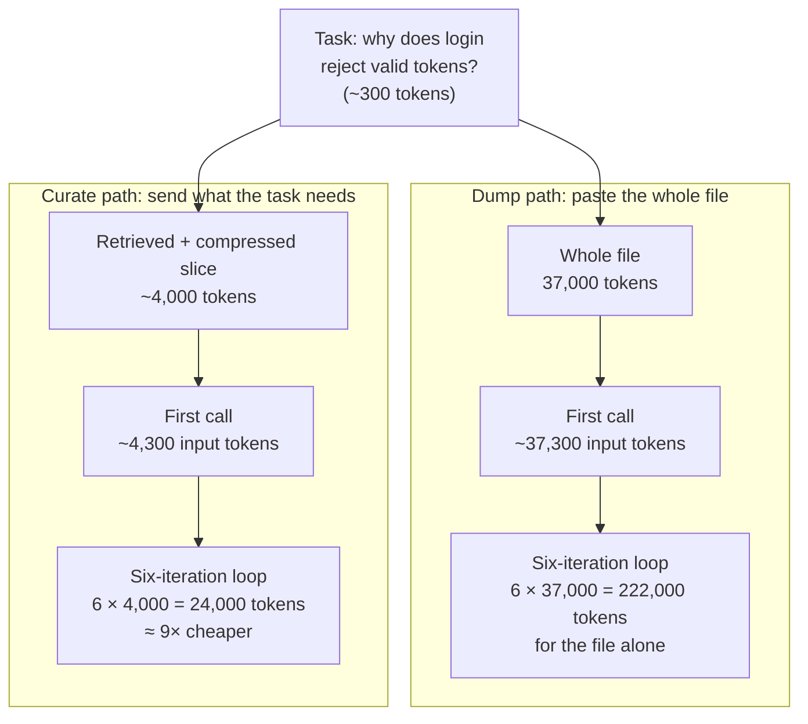

# Why raw context is wasteful

Part 1 ended with a warning: the job is curation, not accumulation. This chapter makes that warning quantitative. By the end you will be able to explain the three distinct ways that pasting raw files into a model's context wastes tokens and degrades answers, compute a signal-to-noise ratio for a prompt you actually use, and name the four curation moves the rest of this part teaches.

## The naive baseline

You have a question about your codebase. The simplest workflow: open the file, copy all of it, paste it into the chat, and ask. Every pasted character becomes [tokens](../part1-fundamentals/tokens.md), and every one of those tokens is sent as input on the next call.

Be fair to this baseline before attacking it. It requires zero engineering, and it cannot accidentally omit the relevant lines, as long as you picked the right file. For a 200-line file and a one-off question it is genuinely fine — and any curation machinery must justify its complexity against "just paste it."

The baseline stops being fine for three separate reasons, each with a different fix.

## Three failure axes

### Cost multiplies with the loop

A model call is billed by input and output tokens, so pasting a large file once has an obvious one-time cost. The less obvious part happens in an agent workflow: as [The agent loop](../part4-agents/agent-loop.md) covers in depth, the client re-sends the accumulated conversation — pasted file included — on every iteration of the loop. A wasted token is not billed once; it is billed roughly once per iteration.

Worked numbers, using a real file: one production C# source file — the largest in a benchmark corpus we return to in [Measuring context quality](measuring-quality.md) — weighs in at roughly 37,000 tokens. Your question adds another 300.

- **One call:** about 37,300 input tokens. Noticeable, survivable.
- **A six-iteration agent loop:** the file rides along in history every time — 6 × 37,000 = **222,000 input tokens** for the file alone, before tool results, the model's replies, or your follow-ups.
- **A curated alternative:** suppose retrieval and compression deliver a 4,000-token slice containing what the task needs. The same six iterations cost 6 × 4,000 = **24,000 tokens** — roughly nine times less.



We count tokens rather than dollars on purpose: prices change; token arithmetic transfers across providers. [Cost and efficiency](../part4-agents/cost-efficiency.md) builds the full bill, including levers like prompt caching that soften but do not eliminate this multiplier.

### Quality sags in the middle

If waste were only a billing problem, a generous budget would solve it. It is worse than that: irrelevant tokens actively degrade answers.

[The context window](../part1-fundamentals/context-windows.md) introduced the lost-in-the-middle result: measured accuracy drops when the information a task depends on sits in the middle of a long input rather than near its start or end. Through that lens, the dump path looks worse still: the 40 lines that answer "why does login reject valid tokens?" sit somewhere around token 18,000 of a 37,000-token paste — close to the worst position the research identifies. You paid for 37,000 tokens and, in exchange, made the relevant lines *harder* to use.

This is the axis people miss. Extra context is not neutral padding; past the point of relevance, it dilutes.

### Hard limits end the run

The third axis is the bluntest: the window is finite, and input and output share it. One 37,000-token file fits comfortably. Five such files, plus tool results, plus a long conversation history, eventually do not — and the failure arrives mid-task, after the loop has already spent its budget accumulating context it now cannot extend.

However large windows get — [The context window](../part1-fundamentals/context-windows.md) keeps the dated, sourced numbers — the first two axes still bite, because they scale with what you *put in*, not with what the window could hold. A window big enough for your whole repository is an invitation to pay the multiplier on your whole repository.

## Signal-to-noise

To reason about all three axes with one number, define the **signal-to-noise ratio** of a prompt: the fraction of delivered tokens the task actually requires — signal tokens divided by total tokens sent.

For the login question against the 37,000-token file, perhaps 1,500 tokens genuinely matter: one validation method, the config type it reads, a helper or two. That is a signal-to-noise ratio of about 4%. The complementary number is the **waste ratio** — the fraction of delivered tokens the task never needed, here 96%. You will compute your own below.

The crucial property of both numbers: they are *task-relative*. The same file is 4% signal for the login question and might be 60% signal for "summarize this file's public API." No fixed preprocessing can be right for every question — which is why serious curation happens at request time, with the task in hand. Keep that thought; it returns with force in [Structural minimization](structural-minimization.md).

## The curation taxonomy

**Context curation** is the practice of selecting, shrinking, and verifying what enters the context window, so that signal survives and noise does not. It decomposes into four moves — one per remaining chapter of this part:

1. **Retrieve** — fetch only the pieces of the corpus relevant to *this* task, instead of dumping whole files. → [Retrieval for code](rag-for-code.md)
2. **Compress** — shrink what you send without destroying its load-bearing content. → [Structural minimization](structural-minimization.md)
3. **Remember** — persist durable facts across sessions so they are never re-derived or re-pasted. → [Persistent memory](persistent-memory.md)
4. **Measure** — verify what curation costs in fidelity, because compressing is trivial and compressing *losslessly enough* is the whole discipline. → [Measuring context quality](measuring-quality.md)

The moves compose: retrieve candidates, compress what you retrieved, prepend what you remembered, and measure the pipeline end to end. The fourth move is not garnish — an unmeasured curation pipeline is a machine for silently deleting signal along with noise.

## In practice: Sankshep

[Sankshep](../part0-orientation/running-example.md), this site's running example, is a whole MCP server built as an answer to this one chapter. Its tagline is the thesis stated as a product: *"Maximum context, minimum tokens — with the benchmarks to prove it."*

The 37,000-token file in the worked example is real: the largest file in the benchmark corpus published in Sankshep's `docs/benchmarks.md` (numbers verified 2026-07-18). On that file, structural minimization removed 35–37% of the file's tokens while an LLM judge scored key-point recall at 1.00 — every key fact survived. For the questions asked, roughly a third of the file was noise, and removing it cost nothing measurable. [Measuring context quality](measuring-quality.md) unpacks how that judgment works and where it breaks down.

One foreshadow worth planting now. Once you build curation machinery, the temptation is to report flattering savings. Sankshep's ADR-0017 ("honest savings") resists that: savings ratios must be computed against the files actually delivered — never as "everything in scope ÷ budget" — and dollar estimates were deleted from its reports outright, on the grounds that *"a ratio whose numerator and denominator come from different universes is not a measurement."* That discipline gets full treatment in [Measuring context quality](measuring-quality.md) and the capstone's [measure what you ship](../part5-capstone/case-measure-what-you-ship.md).

## Checkpoints

1. In an agent workflow, why does one wasted token cost more than one token's price?

    ??? success "Answer"
        The client re-sends the accumulated conversation on every iteration of the agent loop, so a token pasted at iteration 1 is billed on every subsequent call — roughly N times over N iterations. A 30,000-token wasted paste in a six-iteration loop costs on the order of 180,000 input tokens.

2. You paste a 40,000-token file whose answer is 60 lines near its middle. Name the two failure axes hit immediately, and the third that appears as the session grows.

    ??? success "Answer"
        Immediately: the cost multiplier (the whole file re-sent every loop iteration) and lost-in-the-middle degradation (the relevant lines sit where measured accuracy is worst). As the session grows: the hard window limit — files, tool results, and history eventually exceed the finite window that input and output share, and the run fails mid-task.

3. A task needs about 1,200 tokens of a 24,000-token file you pasted whole. What are the signal-to-noise ratio and the waste ratio, and how many wasted tokens does a six-iteration loop re-send in total?

    ??? success "Answer"
        Signal-to-noise ratio: 1,200 ÷ 24,000 = 5%. Waste ratio: 95%, i.e. 22,800 wasted tokens per copy of the file. Over six iterations the waste alone accounts for about 6 × 22,800 = 136,800 input tokens.

4. Match each situation to the curation move that fixes it: (a) "which files even mention rate limiting?"; (b) "this file is relevant but far too big"; (c) "I re-explain our naming conventions every single session"; (d) "did my shrunken context still contain what mattered?"

    ??? success "Answer"
        (a) Retrieve — search the corpus instead of guessing files. (b) Compress — shrink the file while keeping load-bearing content. (c) Remember — persist the conventions once, recall per session. (d) Measure — evaluate the curated context's fidelity against the original.

## Try it

Compute the waste ratio of a file you know well.

1. Pick a source file you understand thoroughly, ideally 300+ lines, and write down one concrete task question about it.
2. Count the file's total tokens, using the same encoding as the hands-on in [Tokens and tokenization](../part1-fundamentals/tokens.md):

    ```python
    import tiktoken

    enc = tiktoken.get_encoding("o200k_base")  # encoding choice: see the Tokens chapter
    total = len(enc.encode(open("the_file.py").read()))
    ```

3. Now copy *only* the lines genuinely required to answer your question into a scratch file — the method, the types it touches, nothing else — and count those tokens as `needed`.
4. Compute: signal-to-noise = `needed / total`; waste ratio = `1 - needed / total`; loop cost of the waste = `(total - needed) * 6` for a six-iteration session.
5. Two reflections. Where do the needed lines sit — start, middle, or end? And if you redo step 3 for a *different* question, how much do the two `needed` sets overlap? That gap between task-relative signal sets is why the next four chapters curate at request time instead of preprocessing once.
