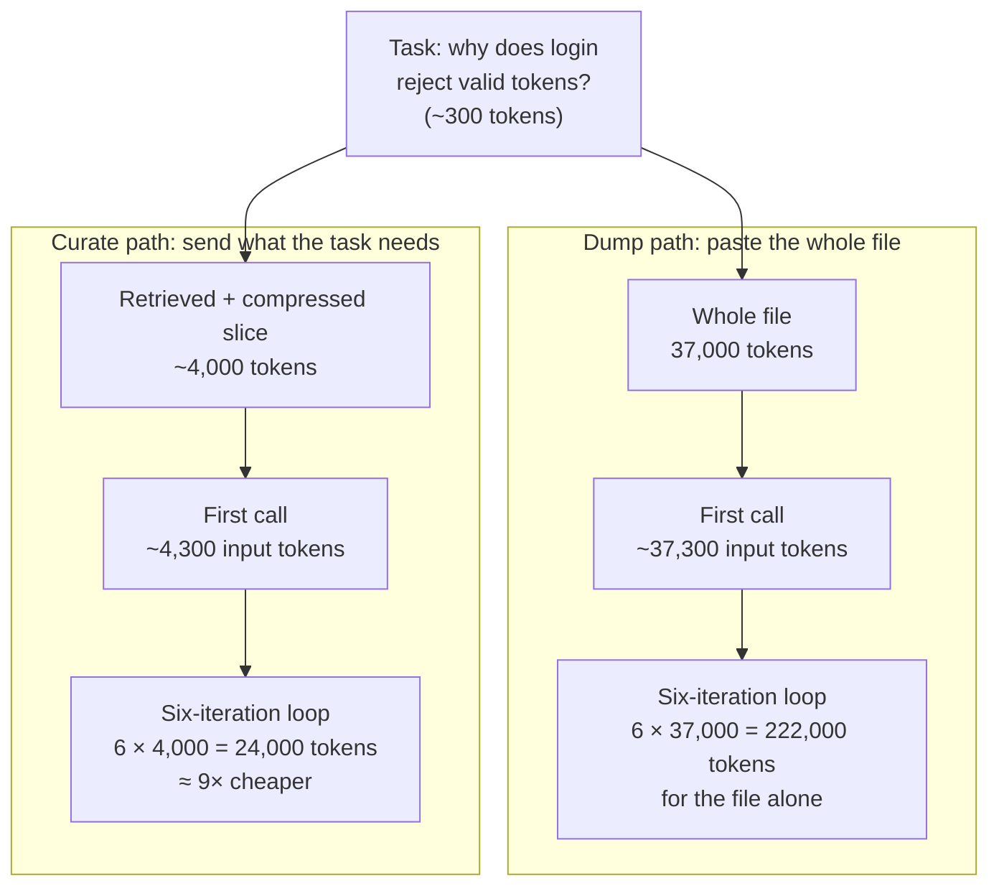
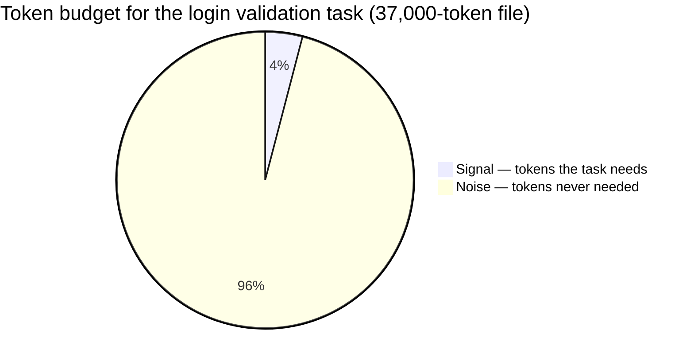
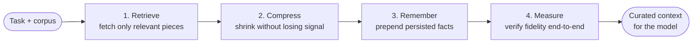

# Why raw context is wasteful

Part 1 ended with a warning: the job is curation, not accumulation. This chapter puts numbers on it.

By the end you will be able to explain the three separate ways that pasting raw files wastes tokens and degrades answers. You will be able to compute a signal-to-noise ratio for a prompt you actually use, and name the four curation moves the rest of this part teaches.

## The naive baseline

You have a question about your codebase. The simplest workflow: open the file, copy all of it, paste it into the chat, and ask.

Every pasted character becomes [tokens](../part1-fundamentals/tokens.md). Every one of those tokens is sent as input on the next call.

Be fair to this baseline before attacking it. It takes zero engineering. And as long as you picked the right file, it cannot accidentally leave out the relevant lines. For a 200-line file and a one-off question, it is genuinely fine.

Any curation machinery has to justify its complexity against "just paste it".

The baseline stops being fine for three separate reasons. Each has a different fix.

## Three failure axes

### Cost multiplies with the loop

A model call is billed by input and output tokens. So pasting a large file once has an obvious one-time cost.

The less obvious part happens in an agent workflow. As [The agent loop](../part4-agents/agent-loop.md) covers in depth, the client re-sends the whole accumulated conversation — pasted file included — on every round of the loop.

A wasted token is not billed once. It is billed roughly once per round.

Here are worked numbers, using a real file. One production C# source file — the largest in a benchmark corpus we come back to in [Measuring context quality](measuring-quality.md) — weighs about 37,000 tokens. Your question adds another 300.

- **One call:** about 37,300 input tokens. Noticeable, survivable.
- **A six-round agent loop:** the file rides along in the history every time. That is 6 × 37,000 = **222,000 input tokens** for the file alone, before tool results, the model's replies, or your follow-ups.
- **A curated alternative:** suppose retrieval and compression deliver a 4,000-token slice with what the task needs. The same six rounds cost 6 × 4,000 = **24,000 tokens**. Roughly nine times less.


```mermaid
flowchart TB
    Q["Task: why does login<br/>reject valid tokens?<br/>(~300 tokens)"]
    Q --> D1
    Q --> C1
    subgraph dump["Dump path: paste the whole file"]
        D1["Whole file<br/>37,000 tokens"] --> D2["First call<br/>~37,300 input tokens"]
        D2 --> D3["Six-iteration loop<br/>6 × 37,000 = 222,000 tokens<br/>for the file alone"]
    end
    subgraph curate["Curate path: send what the task needs"]
        C1["Retrieved + compressed slice<br/>~4,000 tokens"] --> C2["First call<br/>~4,300 input tokens"]
        C2 --> C3["Six-iteration loop<br/>6 × 4,000 = 24,000 tokens<br/>≈ 9× cheaper"]
    end
```

We count tokens rather than dollars on purpose. Prices change. Token arithmetic transfers across providers. [Cost and efficiency](../part4-agents/cost-efficiency.md) builds the full bill, including levers like prompt caching that soften this multiplier without removing it.

### Quality sags in the middle

If waste were only a billing problem, a generous budget would fix it. It is worse than that. Irrelevant tokens actively degrade answers.

[The context window](../part1-fundamentals/context-windows.md) introduced the lost-in-the-middle result. Measured accuracy drops when the information a task depends on sits in the middle of a long input, rather than near its start or end.

Through that lens the dump path looks worse still. The 40 lines that answer "why does login reject valid tokens?" sit somewhere around token 18,000 of a 37,000-token paste. That is close to the worst position the research identifies.

You paid for 37,000 tokens, and in exchange you made the relevant lines *harder* to use.

This is the axis people miss. Extra context is not neutral padding. Past the point of relevance, it dilutes.

### Hard limits end the run

The third axis is the bluntest. The window is finite, and input and output share it.

One 37,000-token file fits comfortably. Five such files, plus tool results, plus a long conversation history, eventually do not. And the failure arrives mid-task, after the loop has already spent its budget gathering context it now cannot extend.

However large windows get — [The context window](../part1-fundamentals/context-windows.md) keeps the dated, sourced numbers — the first two axes still bite. They scale with what you *put in*, not with what the window could hold.

A window big enough for your whole repository is an invitation to pay the multiplier on your whole repository.

## Signal-to-noise

One number covers all three axes. The **signal-to-noise ratio** of a prompt is the fraction of delivered tokens the task actually needs: signal tokens divided by total tokens sent.

Take the login question against the 37,000-token file. Perhaps 1,500 tokens genuinely matter: one validation method, the config type it reads, a helper or two. That is a signal-to-noise ratio of about 4%.

The other side of it is the **waste ratio** — the fraction of delivered tokens the task never needed. Here, 96%. You will compute your own below.

Both numbers have one crucial property: they are *task-relative*.

The same file is 4% signal for the login question. It might be 60% signal for "summarize this file's public API". No fixed preprocessing can be right for every question.

That is why serious curation happens at request time, with the task in hand. Hold onto that thought. It comes back with force in [Structural minimization](structural-minimization.md).


```mermaid
pie title Token budget for the login validation task (37,000-token file)
    "Signal — tokens the task needs" : 1500
    "Noise — tokens never needed" : 35500
```

*An illustrative breakdown using the worked numbers above. Signal-to-noise ratio: about 4%. Waste ratio: about 96%.*

## The curation taxonomy

**Context curation** is the practice of selecting, shrinking, and verifying what enters the context window, so signal survives and noise does not.

It breaks into four moves, one per remaining chapter of this part.

1. **Retrieve** — fetch only the pieces of the corpus relevant to *this* task, instead of dumping whole files. → [Retrieval for code](rag-for-code.md)
2. **Compress** — shrink what you send without destroying the parts that carry meaning. → [Structural minimization](structural-minimization.md)
3. **Remember** — keep durable facts across sessions, so they are never re-derived or re-pasted. → [Persistent memory](persistent-memory.md)
4. **Measure** — check what curation cost you in fidelity. Compressing is trivial. Compressing *losslessly enough* is the whole discipline. → [Measuring context quality](measuring-quality.md)

The moves compose. Retrieve candidates, compress what you retrieved, prepend what you remembered, then measure the pipeline end to end.

The fourth move is not garnish. An unmeasured curation pipeline is a machine for silently deleting signal along with noise.


```mermaid
flowchart LR
    TASK(["Task + corpus"])
    R["1. Retrieve
    fetch only relevant pieces"]
    C["2. Compress
    shrink without losing signal"]
    M["3. Remember
    prepend persisted facts"]
    V["4. Measure
    verify fidelity end-to-end"]
    CTX(["Curated context
for the model"])

    TASK --> R --> C --> M --> V --> CTX
```

*The four moves are ordered and composable. Each chapter in Part 2 covers one.*

## In practice: Sankshep

[Sankshep](../part0-orientation/running-example.md) is a whole MCP server built as an answer to this one chapter. Its tagline is the thesis stated as a product: *"Maximum context, minimum tokens — with the benchmarks to prove it."*

The 37,000-token file in the worked example is real. It is the largest file in the benchmark corpus published in Sankshep's `docs/benchmarks.md`, with numbers verified 2026-07-18.

On that file, structural minimization removed 35–37% of the tokens while an LLM judge scored key-point recall at 1.00. Every key fact survived. For the questions asked, roughly a third of the file was noise, and removing it cost nothing measurable. [Measuring context quality](measuring-quality.md) unpacks how that judgment works, and where it breaks down.

One thing worth planting now. Once you build curation machinery, the temptation is to report flattering savings.

Sankshep's ADR-0017, "honest savings", resists that. Savings ratios must be computed against the files actually delivered, never as "everything in scope divided by budget". Dollar estimates were deleted from its reports outright, on the grounds that *"a ratio whose numerator and denominator come from different universes is not a measurement."*

That discipline gets full treatment in [Measuring context quality](measuring-quality.md) and in the capstone's [measure what you ship](../part5-capstone/case-measure-what-you-ship.md).

## Checkpoints

1. In an agent workflow, why does one wasted token cost more than one token's price?

    ??? success "Answer"
        The client re-sends the accumulated conversation on every round of the agent loop. So a token pasted at round 1 is billed on every later call — roughly N times over N rounds.

        A 30,000-token wasted paste in a six-round loop costs on the order of 180,000 input tokens.

2. You paste a 40,000-token file whose answer is 60 lines near its middle. Name the two failure axes you hit immediately, and the third that shows up as the session grows.

    ??? success "Answer"
        Immediately: the cost multiplier, since the whole file is re-sent every round; and lost-in-the-middle degradation, since the relevant lines sit where measured accuracy is worst.

        As the session grows: the hard window limit. Files, tool results, and history eventually exceed the finite window that input and output share, and the run fails mid-task.

3. A task needs about 1,200 tokens of a 24,000-token file you pasted whole. What are the signal-to-noise ratio and the waste ratio, and how many wasted tokens does a six-round loop re-send in total?

    ??? success "Answer"
        Signal-to-noise ratio: 1,200 ÷ 24,000 = 5%. Waste ratio: 95%, which is 22,800 wasted tokens per copy of the file.

        Over six rounds, the waste alone accounts for about 6 × 22,800 = 136,800 input tokens.

4. Match each situation to the curation move that fixes it. (a) "Which files even mention rate limiting?" (b) "This file is relevant but far too big." (c) "I re-explain our naming conventions every single session." (d) "Did my shrunken context still contain what mattered?"

    ??? success "Answer"
        (a) Retrieve — search the corpus instead of guessing files.

        (b) Compress — shrink the file while keeping the parts that carry meaning.

        (c) Remember — save the conventions once, recall them per session.

        (d) Measure — evaluate the curated context's fidelity against the original.

## Try it

Compute the waste ratio of a file you know well.

1. Pick a source file you understand thoroughly, ideally 300 lines or more. Write down one concrete task question about it.
2. Count the file's total tokens, using the same encoding as the exercise in [Tokens and tokenization](../part1-fundamentals/tokens.md):

    ```python
    import tiktoken

    enc = tiktoken.get_encoding("o200k_base")  # encoding choice: see the Tokens chapter
    total = len(enc.encode(open("the_file.py").read()))
    ```

3. Now copy *only* the lines genuinely needed to answer your question into a scratch file. The method, the types it touches, nothing else. Count those tokens as `needed`.
4. Compute three numbers. Signal-to-noise is `needed / total`. Waste ratio is `1 - needed / total`. Loop cost of the waste is `(total - needed) * 6` for a six-round session.
5. Then two reflections.

    Where do the needed lines sit — start, middle, or end?

    And if you redo step 3 for a *different* question, how much do the two `needed` sets overlap? That gap between task-relative signal sets is exactly why the next four chapters curate at request time, instead of preprocessing once.
