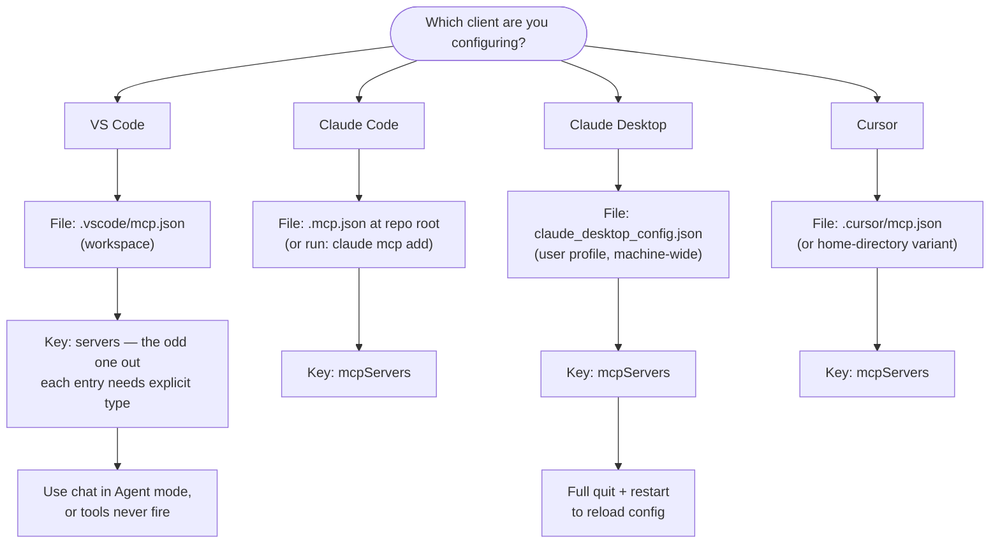
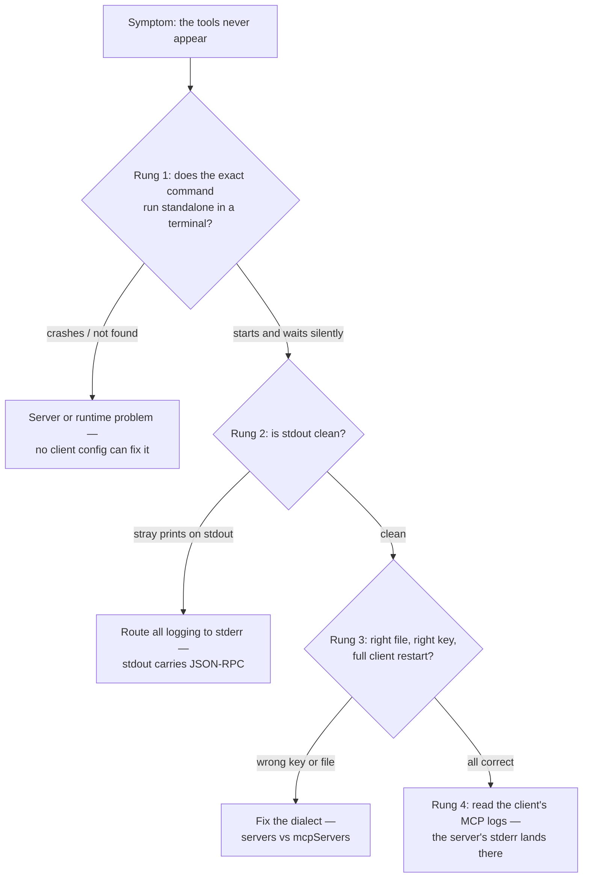

# Connecting servers to IDEs

Part 3 has zoomed steadily inward: why a protocol exists, what it carries, how the bytes move, how a server is built. This chapter is the *used* end of that zoom — where a server you can run in a terminal becomes a tool an assistant drives inside your editor. By the end you can wire any [stdio](transports.md) MCP server into the four most common clients, explain the one configuration gotcha that costs the most debugging hours, keep secrets out of committed config, and diagnose the signature symptom of a misconfigured server: nothing.

## What a client does with your entry

An MCP server ships no installer and registers nothing with the operating system. Integration is one JSON entry in a client's config file, and the entry says only two things: what to call this server, and how to start it — a command, its arguments, and optional environment variables.

The client does the rest mechanically. At startup it spawns the command as a subprocess, runs the [`initialize` handshake](wire-protocol.md) over the subprocess's stdin and stdout, calls [`tools/list`](wire-protocol.md), and from then on attaches the returned [tool](primitives.md) definitions to every request it sends to the model. The client performs all the work that makes it look like the model ["knows"](../part1-fundamentals/what-llms-do.md) about your server.

That chain has a consequence for debugging: every link is invisible until the last one. Whether the file is in the wrong place, the key is wrong, the spawn fails, or the handshake dies, the visible symptom is identical — the tools never appear. The second half of this chapter is about exactly that.

## Four clients, one server

The same server — same binary, same command line — plugs into all four major clients. Only the config dialect changes.

| Client | File | Top-level key | Quirk to remember |
| --- | --- | --- | --- |
| VS Code | `.vscode/mcp.json` (workspace) | `servers` | each entry needs an explicit `"type"`; tools run only in Agent mode |
| Claude Code | `.mcp.json` (repo root) | `mcpServers` | `claude mcp add` writes the entry for you |
| Claude Desktop | `claude_desktop_config.json` | `mcpServers` | user-level, not per-project; full quit and restart to reload |
| Cursor | `.cursor/mcp.json` | `mcpServers` | also supports a home-directory variant covering all projects |

Here is one entry in all four dialects, using the official reference filesystem server as the example — the hands-on at the end of this chapter installs it for real:

=== "VS Code"

    ```json
    {
      "servers": {
        "filesystem": {
          "type": "stdio",
          "command": "npx",
          "args": ["-y", "@modelcontextprotocol/server-filesystem", "/absolute/path/to/dir"]
        }
      }
    }
    ```

=== "Claude Code"

    ```json
    {
      "mcpServers": {
        "filesystem": {
          "command": "npx",
          "args": ["-y", "@modelcontextprotocol/server-filesystem", "/absolute/path/to/dir"]
        }
      }
    }
    ```

=== "Claude Desktop"

    ```json
    {
      "mcpServers": {
        "filesystem": {
          "command": "npx",
          "args": ["-y", "@modelcontextprotocol/server-filesystem", "/absolute/path/to/dir"]
        }
      }
    }
    ```

=== "Cursor"

    ```json
    {
      "mcpServers": {
        "filesystem": {
          "command": "npx",
          "args": ["-y", "@modelcontextprotocol/server-filesystem", "/absolute/path/to/dir"]
        }
      }
    }
    ```

!!! warning "Evolving — verified 2026-07-18"
    Every file name, top-level key, and quirk in the table was checked against official client documentation on 2026-07-18: [VS Code](https://code.visualstudio.com/docs/copilot/chat/mcp-servers), [Claude Code](https://code.claude.com/docs/en/mcp), [Claude Desktop](https://modelcontextprotocol.io/quickstart/user), and [Cursor](https://cursor.com/docs). This changes quickly; check those pages for current values.

## The gotcha: one client is the odd one out

Look at the third column again. Three clients use `mcpServers`. VS Code uses `servers`, and additionally requires an explicit `"type"` field on each entry.

What makes this the gotcha is how the failure presents. Paste a working Cursor snippet into `.vscode/mcp.json` and the JSON stays perfectly valid — it just parks your server under a top-level key VS Code never reads. Clients ignore unknown keys rather than validating against them: nothing is malformed, nothing spawns, nothing errors, nothing is logged. The symptom is silence.

VS Code has a second quirk in the same spirit. **Agent mode** is the chat mode in which the client attaches tool definitions to model requests and executes the tool calls the model emits; as of 2026-07-18, MCP tools in VS Code run only in this mode. A server can be configured, connected, and healthy — and its tools still never fire, because in other chat modes the definitions are never sent to the model at all.



## Scope and secrets

Three of the four files live inside the repository: `.vscode/mcp.json`, `.mcp.json`, and `.cursor/mcp.json`. Commit them, and every teammate who clones the repo gets the server with zero setup. Claude Desktop's `claude_desktop_config.json` sits in your user profile instead and applies machine-wide (the [quickstart](https://modelcontextprotocol.io/quickstart/user) lists the exact path per OS). Rule of thumb: config that describes the project belongs in project scope, committed; config that describes you belongs in user scope.

Secrets follow directly. A committed config must never contain a literal API key — it would sit in the repository's history forever. Every dialect above accepts an `env` object on the entry, which sets environment variables for the spawned subprocess; put the variable's *name* in the committed file and its *value* in your local environment or user-scoped config. This is the pattern [transports](transports.md) established: local stdio servers take credentials from the environment, not from an OAuth flow — auth follows transport, and [safety](../part4-agents/safety.md) picks the thread up.

## The debugging ladder

When the tools never appear, resist opening the client's settings UI first. Climb this ladder in order — each rung is cheap, and each one decisively rules out a whole layer.

1. **Does the server run standalone?** Copy the exact `command` and `args` into a terminal and run them. A healthy stdio server prints nothing and sits waiting on stdin — the same "it waits — that's correct" behavior from the [transports hands-on](transports.md). A crash or a missing runtime here is a server problem no client config can fix.
2. **Is stdout clean?** stdout is the wire: one stray print statement corrupts the JSON-RPC [framing](wire-protocol.md) and the handshake dies. All logging must go to stderr.
3. **Is the config right for this client?** Right file, right location, right top-level key — the odd-one-out gotcha — and a full client restart after every edit.
4. **What do the client logs say?** Each client keeps MCP logs, and a well-behaved server's stderr ends up in them. This is why rung 2's discipline pays twice: it keeps the wire clean, and it routes your diagnostics somewhere you can actually read them.



!!! example "In the wild: Sankshep"
    [Sankshep](../part0-orientation/running-example.md) ships a setup document for each of these four clients — same binary, four dialects, including the `servers`-versus-`mcpServers` split — because in practice the config dialect, not the server, is what varies per user. The gotcha above is confirmed from those shipped docs, not only from vendor pages. The ladder is baked into its defaults too: stdio transport with stderr-only logging, so rung 2 holds by construction and rung 4 always has something to show. One server, four editors, zero code changes — the N+M promise from [why MCP](why-mcp.md) landing in config files.

## Checkpoints

**1.** You paste a working Cursor entry into `.vscode/mcp.json`. The JSON is valid, yet no tools appear and no error is shown. Explain mechanically what happened.

??? success "Answer"
    Cursor's dialect puts servers under `mcpServers`, but VS Code reads the top-level key `servers` (with an explicit `type` per entry). Unknown top-level keys are ignored, not validated, so the file parses fine, the entry is never read, no subprocess is spawned, and there is nothing to log. Silence is the expected symptom, not a mysterious one.

**2.** Why does the debugging ladder start with running the server standalone in a terminal rather than reading client logs?

??? success "Answer"
    It is the cheapest decisive test: it needs no client at all and splits the world in two. If the process crashes or the runtime is missing, no config change can help, and the client logs would only report the same failure less directly. If it starts and waits silently, the server side is healthy, and the fault must sit in framing, config, or the client — which the later rungs check in order.

**3.** Your team's repo needs an MCP server that requires an API key. Which file does the entry go in, and where does the key go?

??? success "Answer"
    The entry goes in a project-scoped, committable file — `.vscode/mcp.json`, `.mcp.json`, or `.cursor/mcp.json`, depending on the client — so teammates inherit it on clone. The key's literal value must not: reference an environment variable by name in the entry's `env` block and let each user supply the value locally. Committed config describes the project; secrets describe, and belong to, the user.

**4.** Trace what a client does with a config entry between application launch and the first successful tool call in chat.

??? success "Answer"
    It reads the config file, spawns the entry's command as a subprocess, performs the `initialize` handshake over the subprocess's stdio, calls `tools/list`, and attaches the returned tool definitions to each request it sends to the model. When the model emits a tool call, the client maps it to `tools/call`, executes it against the server (asking the user for approval where required), and returns the result into the conversation — the full loop from [the wire protocol](wire-protocol.md).

## Try it

Install the official reference filesystem server into one client and drive it from chat. As of 2026-07-18, the npx package is `@modelcontextprotocol/server-filesystem`, published from the official [servers repository](https://github.com/modelcontextprotocol/servers) (verified 2026-07-18).

1. Check the prerequisite: `node --version`. The reference server runs on Node.js, and `npx` fetches the package on first launch.
2. Create a scratch directory to grant access to — say `~/mcp-sandbox` or `C:\mcp-sandbox`. The directories listed in `args` are the only ones the server may touch.
3. Pick one client, open its file from the table, add its dialect of the snippet, and use your scratch directory's absolute path as the final argument.
4. Restart the client fully, then confirm the server's tools show up in the client's tools UI.
5. In chat, ask: "List the files in the sandbox directory, then create `notes.txt` there containing one line: hello from MCP." Approve the tool calls the client surfaces — that approval prompt is the client, not the model, holding execution authority, a division of labor [Part 4](../part4-agents/agent-loop.md) examines closely. Confirm `notes.txt` exists on disk.

If step 4 or 5 fails, match your symptom:

??? failure "Nothing appears at all"
    Wrong top-level key for this client (the gotcha), wrong file location, or the client was not fully restarted. Claude Desktop in particular needs a complete quit, not a closed window.

??? failure "The server never starts"
    Run the exact command from your config in a terminal — rung 1 of the ladder. Typical causes: Node.js not installed, `npx` not on the client's PATH, or a typo in the package name.

??? failure "Tools appear, but calls error"
    Check the paths in `args`: they must be absolute, and every path you ask about must sit inside an allowed directory — requests outside the granted list are refused by design.

??? failure "VS Code: connected, but tools never fire"
    Switch the chat to Agent mode. In other modes the tool definitions are never attached to model requests, so no call can ever happen.

When the round trip works, you have exercised every stage of Part 3 in one sitting: a config entry became a subprocess, a handshake, a tool list, and a model-emitted call that changed a file on your disk. [Build your own MCP server](../part6-reference/build-your-own.md) puts your own code in that subprocess's seat.
