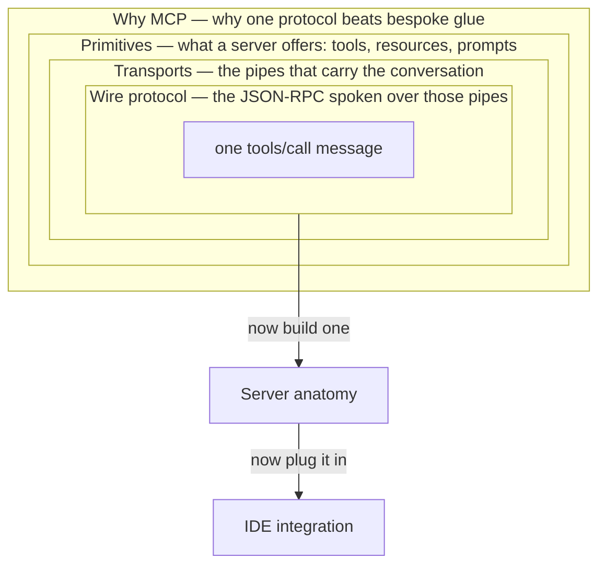

# The Model Context Protocol

Part 2 ended with a well-curated bundle of context: retrieved, minimized, remembered, measured. But it all happened inside one program. For curated context to reach a conversation on demand, some standard must define how an AI application discovers an external capability, invokes it, and receives the result — the edge [the map](../part0-orientation/the-map.md) labels "curation needs a standard carrier". This part is about that carrier.

The Model Context Protocol (MCP) — defined properly in [What problem MCP solves](why-mcp.md) — is that carrier: one shared wire format for discovering and invoking a server's capabilities, so any compliant client can use any compliant server without bespoke glue for each pairing.

## One connection, six zoom levels

The six chapters examine a single client–server connection at increasing magnification, then zoom back out and put you in the builder's seat:

- [What problem MCP solves](why-mcp.md) — how N×M bespoke integrations collapse to N+M with one protocol.
- [Tools, resources, and prompts](primitives.md) — the three things a server can offer, sorted by who invokes each.
- [Transports](transports.md) — stdio and Streamable HTTP: how the bytes actually move.
- [The wire protocol](wire-protocol.md) — the JSON-RPC messages underneath every tool call.
- [Writing an MCP server](writing-a-server.md) — the layers every server shares, and where your code goes.
- [Connecting servers to IDEs](ide-integration.md) — wiring one server into VS Code, Claude Code, Claude Desktop, and Cursor.

## What you need first

From Part 1, only [tokens](../part1-fundamentals/tokens.md) and the [context window](../part1-fundamentals/context-windows.md): everything a server returns lands in the window and is billed. The rest is systems plumbing — processes, JSON, sockets — with no machine learning in it. When Part 3 is done, tools have a standard socket; [Part 4](../part4-agents/index.md) supplies the loop that calls them.

!!! example "In the wild: Sankshep"
    Every mechanism in this part is one that Sankshep, the production server from [the running example](../part0-orientation/running-example.md), actually ships: all three primitive kinds (tools, a prompt, a resource), both transports (stdio by default, Streamable HTTP via `--http`), and client configuration for four IDEs. Each chapter points back at the matching piece.
