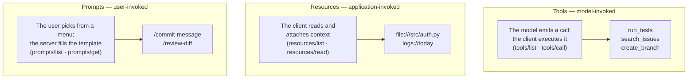
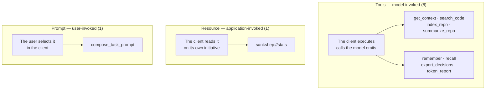

# Tools, resources, and prompts

[What problem MCP solves](why-mcp.md) introduced the cast: a host embeds a client, the client connects to servers, and each server exposes capabilities. This chapter is about the shape those capabilities take. MCP gives you exactly three shapes, and picking the wrong one is the most common design mistake in a first server. By the end of this page you will be able to sort any capability into the right shape with a single question, name the parts of a tool definition, and defend the shape of what a tool returns.

## One question sorts everything

MCP calls its three capability shapes **primitives**: the standard forms — tool, resource, prompt — in which a server exposes everything it offers. On the wire they look like siblings: a request goes out, structured JSON comes back (the exact messages are [the wire protocol](wire-protocol.md)'s subject). What separates them is not payload but initiative — *who invokes this?*

- A **tool** is a named operation the server executes on request — the model-invoked primitive (*model-controlled*, in the specification's terms): the model emits a call, the client carries it out, and the result rejoins the conversation.
- A **resource** is read-only content the server exposes under a URI — the application-invoked primitive (*application-controlled*): the client, or the user through the client's UI, reads it and attaches it as context.
- A **prompt** is a parameterized message template — the user-invoked primitive (*user-controlled*): the human picks it from a menu, the server fills it in, and the filled text enters the conversation.



One precision: "model-invoked" never means the model reaches your server — it has no network access to anything. It emits a structured block naming a tool and arguments, and the client performs the actual call; that is the operational meaning whenever this site says the model ["decides"](../part1-fundamentals/what-llms-do.md) to use a tool. A sampled continuation, client code, or a human click — that is the whole taxonomy.

## Tools: operations the model can call

A tool definition carries three load-bearing fields: a stable `name`, a prose `description` that says what the tool does and when to use it, and an `inputSchema` — a JSON Schema for the arguments, which clients can validate before sending anything. A minimal, generic definition:

```json
{
  "name": "search_notes",
  "description": "Search saved notes by keyword. Use when the user asks what has been recorded about a topic. Not for creating notes.",
  "inputSchema": {
    "type": "object",
    "properties": {
      "query": { "type": "string", "description": "Words to match against note text" }
    },
    "required": ["query"]
  }
}
```

These three fields are the entire interface the model reads — never your implementation, README, or intentions. [The wire protocol](wire-protocol.md) shows the `tools/list` response that delivers them; [Tool calling in depth](../part4-agents/tool-calling.md) treats description-writing as model-facing UX.

A tool result is a list of **content blocks** — typed chunks (text, images, links to resources) that the client appends to the conversation, where they become [tokens](../part1-fundamentals/tokens.md) in the [context window](../part1-fundamentals/context-windows.md) like everything else.

Failures come in two kinds, and the split matters. A *protocol error* — unknown tool, malformed request — is a JSON-RPC-level error the client handles; the model typically never sees it. A *tool error* — the operation ran and failed: file missing, timeout, nothing indexed — travels inside a normal result flagged **`isError: true`**, with readable text. The routing is deliberate: an error the model can read is an error [the agent loop](../part4-agents/agent-loop.md) can react to, by correcting an argument or trying another tool. Burying failures in protocol errors, or returning an empty success, starves the loop of the feedback it runs on.

## Resources: context the application attaches

A resource is identified by a URI — `file:///...`, or any scheme the server defines. The client lists them with `resources/list`, reads one with `resources/read`, and can subscribe to a URI to be notified when its content changes. What happens to the returned content — whether, when, and how much of it enters the context window — is the application's decision.

The defining difference from a tool: no model output triggers a resource read. Client code or a user gesture — picking a file from an attachment menu, say — initiates it. Typical resources are nouns — file contents, a database schema, a log stream, the server's own status. If a capability is a noun you would attach rather than a verb you would run, it is probably a resource.

## Prompts: templates the user picks

An MCP prompt is not the string you send a model — [prompting basics](../part1-fundamentals/prompting-basics.md) covered that sense — but a server-hosted template with named arguments. Clients list them via `prompts/list`, surface them as menu entries or slash commands, and on selection fetch the filled-in messages via `prompts/get` and insert them into the conversation.

Why make this a primitive when the user could just type? Because the server sits next to the data: a template that assembles the right context can be versioned and improved server-side, and every connected client inherits the improvement. And because prompts are user-invoked, they are opt-in by construction — a server cannot silently inject its templates into a conversation, a property [Safety and judgment](../part4-agents/safety.md) returns to.

## Result shape is a design decision

Tool results have a second channel. **Structured content** (`structuredContent`) is an optional machine-readable JSON result, described by an output schema in the tool definition, traveling alongside the readable blocks so client code can consume results without parsing prose. When should you use it? Two rules cover most cases.

*One result in two encodings, not two payloads.* If a tool returns both text and structured JSON, they must be two renderings of the same result. The moment one encoding carries fields the other lacks, you have two sources of truth that drift, and different clients see different answers from the same call.

*Measure delivered-and-consumed, not emitted.* A result only matters in the form that actually reaches the model's context window. A client feeding both encodings into the window pays for the duplication on every [loop iteration](../part4-agents/cost-efficiency.md); one dropping the structured half silently loses anything that lived only there. Before adding a second encoding, check what your target clients deliver to the model — measured at the window, not at your server's output.

The default that follows: return one well-shaped encoding — usually text blocks — and add structured content only when a real client consumes it programmatically.

!!! warning "Evolving — verified 2026-07-18"
    The 2025-11-25 revision of the MCP specification (status and governance in [What problem MCP solves](why-mcp.md)) adds three things that touch this chapter: experimental *async tasks* — long-running tool calls can return a handle instead of blocking; *icons* metadata, so tools, resources, and prompts can ship display icons for client UIs; and input-validation failures reported as tool-execution errors (`isError: true`) rather than protocol errors, so the model sees them and can retry. This changes quickly; check the [MCP specification changelog](https://modelcontextprotocol.io/specification/2025-11-25/changelog) for current values.

## In practice: Sankshep

Sankshep — [the running example](../part0-orientation/running-example.md) — is a clean test of the sorting question because, as of v1.8.0, it uses all three primitives:



Each lane holds what the question predicts. The eight tools are verbs a model plausibly needs mid-task: fetching minimized context, searching code, indexing, remembering and recalling project facts, reporting token usage. The one resource, `sankshep://stats` (a server-defined URI scheme), is a noun: the server's own statistics, read by a client or a curious human — no model initiative required. The one prompt, `compose_task_prompt`, is user-invoked deliberately: per ADR-0013 it returns "a prompt, not an answer" — a deterministic composition of the task, retrieved code, and project conventions that never calls an LLM. [Grounded prompting and composition](../part4-agents/grounded-prompting.md) walks through what it assembles.

Two of this page's judgment calls trace to Sankshep ADRs. The error split: per ADR-0016, paths that do not resolve inside the repository fail loudly with `isError` and a readable message, never with a partial success the loop would mistake for an answer. The result shape: ADR-0015 through ADR-0018 record the content-versus-structured-content deliberation — both quoted rules above are that chain's lessons, and the outcome is that `get_context` returns a single plain-text content block and declares no output schema.

## Checkpoints

**1. A server could expose the project changelog as a resource or wrap it in a `read_changelog` tool. What single question chooses between them, and what does each choice mean mechanically?**

??? success "Answer"
    Who invokes it? As a tool it appears in `tools/list`, so the model can emit a call for it mid-task. As a resource, only the application or user reads it — no model output can request it — the right choice if a human should deliberately attach it. Same bytes, different initiative.

**2. A tool is called with a path that does not exist. Protocol error or a result with `isError: true` — and why does the choice matter to an agent loop?**

??? success "Answer"
    `isError: true` with readable text. A protocol error signals malformed traffic and is handled by the client — the model typically never sees it, so the loop stalls without feedback. A tool error re-enters the conversation as tokens the model can react to: correcting the path or trying another tool. Reserve protocol errors for broken plumbing, tool errors for failed operations.

**3. What exactly does a model read when selecting among your tools, and what does that imply about where design effort goes?**

??? success "Answer"
    Only what `tools/list` delivered — name, description, and input schema — plus the conversation so far; never your implementation, docs, or tests. The description prose therefore *is* the interface; [Tool calling in depth](../part4-agents/tool-calling.md) treats writing it as the highest-leverage design surface a server author owns.

**4. Your tool returns its analysis twice — prose in a text block and JSON in `structuredContent` — each with slightly different fields. Which rule does this break, and what are the two failure modes?**

??? success "Answer"
    "One result in two encodings, not two payloads." First failure: drift — two sources of truth evolve independently, and clients consuming different halves see different answers. Second: waste or loss at the window — clients delivering both encodings pay tokens twice; clients dropping the structured half lose the JSON-only fields.

**5. Why does MCP make prompts user-invoked instead of letting servers inject their templates automatically?**

??? success "Answer"
    Automatic injection would let any connected server silently steer every conversation — a trust problem [Safety and judgment](../part4-agents/safety.md) examines. User invocation makes templates opt-in and visible while keeping their benefit: versioned, data-adjacent prompt engineering that every connected client inherits.

## Try it

Sort these five capabilities into tool, resource, or prompt with the who-invokes question, writing one sentence each: who initiates, and what arrives.

1. Fetch the current failing test's stack trace while debugging.
2. The team's coding-style document.
3. A guided "write a commit message" template that takes a `diff` argument.
4. Search the issue tracker for tickets matching free text.
5. A live status summary of the server itself.

??? success "Suggested sorting"
    1 and 4 are tools (mid-task verbs the model can emit calls for); 2 and 5 are resources (nouns under a URI, attached by the application or user); 3 is a prompt (a user-picked, parameterized template). Arguing 2 as a `get_style_guide` tool the model can pull on demand is legitimate — what matters is that you chose by invoker.
