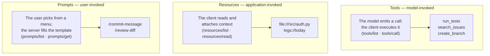
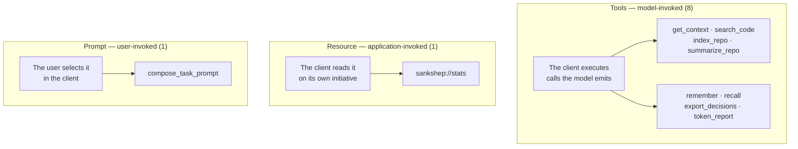

# Tools, resources, and prompts

[What problem MCP solves](why-mcp.md) introduced the cast. A host embeds a client, the client connects to servers, and each server exposes capabilities.

This chapter is about the shape those capabilities take. MCP gives you three shapes for what a server *offers*, and picking the wrong one is the most common design mistake in a first server.

By the end of this page you will be able to sort any capability into the right shape with a single question. You will be able to name the parts of a tool definition, defend the shape of what a tool returns, and handle the fourth case the question misses — what a server needs *back*.

## One question sorts everything

MCP calls its three capability shapes **primitives**. They are the standard forms — tool, resource, prompt — in which a server exposes everything it offers.

On the wire they look like siblings. A request goes out, and structured JSON comes back. The exact messages are [the wire protocol](wire-protocol.md)'s subject.

What separates them is not payload. It is initiative — *who invokes this?*

- A **tool** is a named operation the server runs on request. It is the model-invoked primitive, or *model-controlled* in the specification's terms. The model emits a call, the client carries it out, and the result rejoins the conversation.
- A **resource** is read-only content the server exposes under a URI. It is the application-invoked primitive, or *application-controlled*. The client, or the user through the client's UI, reads it and attaches it as context.
- A **prompt** is a message template with named arguments. It is the user-invoked primitive, or *user-controlled*. A human picks it from a menu, the server fills it in, and the filled text enters the conversation.


```mermaid
flowchart TB
    subgraph lane1["Tools — model-invoked"]
        direction LR
        M1["The model emits a call;<br/>the client executes it<br/>(tools/list · tools/call)"] --> T1["run_tests<br/>search_issues<br/>create_branch"]
    end
    subgraph lane2["Resources — application-invoked"]
        direction LR
        A1["The client reads and<br/>attaches context<br/>(resources/list · resources/read)"] --> R1["file:///src/auth.py<br/>logs://today"]
    end
    subgraph lane3["Prompts — user-invoked"]
        direction LR
        U1["The user picks from a menu;<br/>the server fills the template<br/>(prompts/list · prompts/get)"] --> P1["/commit-message<br/>/review-diff"]
    end
```

One precision. "Model-invoked" never means the model reaches your server. It has no network access to anything.

It emits a structured block naming a tool and arguments, and the client performs the actual call. That is the operational meaning whenever this site says the model ["decides"](../part1-fundamentals/what-llms-do.md) to use a tool.

A sampled continuation, client code, or a human click. That is the whole taxonomy of what starts a request.

Hold onto the question rather than the list of three. Later in this chapter it turns up a fourth answer the list does not contain: sometimes the *server* is the one that needs something, and the direction reverses.

## Tools: operations the model can call

A tool definition carries three load-bearing fields.

A stable `name`. A prose `description` saying what the tool does and when to use it. And an `inputSchema`, a JSON Schema for the arguments, which clients can validate before sending anything.

A minimal, generic definition:

```json
{
  "name": "search_notes",
  "description": "Search saved notes by keyword. Use when the user asks what has been recorded about a topic. Not for creating notes.",
  "inputSchema": {
    "type": "object",
    "properties": {
      "query": { "type": "string", "description": "Words to match against note text" }
    },
    "required": ["query"]
  }
}
```

These three fields are the entire interface the model reads. Never your implementation, your README, or your intentions.

[The wire protocol](wire-protocol.md) shows the `tools/list` response that delivers them. [Tool calling in depth](../part4-agents/tool-calling.md) treats description-writing as model-facing UX.

A tool result is a list of **content blocks**: typed chunks of text, images, or links to resources. The client appends them to the conversation, where they become [tokens](../part1-fundamentals/tokens.md) in the [context window](../part1-fundamentals/context-windows.md) like everything else.

Failures come in two kinds, and the split matters.

A *protocol error* — unknown tool, malformed request — is a JSON-RPC-level error the client handles. The model typically never sees it.

A *tool error* is different. The operation ran and failed: file missing, timeout, nothing indexed. It travels inside a normal result flagged **`isError: true`**, with readable text.

The routing is deliberate. An error the model can read is an error [the agent loop](../part4-agents/agent-loop.md) can react to, by correcting an argument or trying another tool.

Burying failures in protocol errors, or returning an empty success, starves the loop of the feedback it runs on.

## Resources: context the application attaches

A resource is identified by a URI. That might be `file:///...`, or any scheme the server defines.

The client lists them with `resources/list` and reads one with `resources/read`. It can also ask to be notified when a URI's content changes, by opting into the `subscriptions/listen` stream.

What happens to the returned content is the application's decision. Whether it enters the context window, when, and how much of it.

The defining difference from a tool: no model output triggers a resource read. Client code or a user gesture starts it — picking a file from an attachment menu, say.

Typical resources are nouns. File contents, a database schema, a log stream, the server's own status.

If a capability is a noun you would attach, rather than a verb you would run, it is probably a resource.

## Prompts: templates the user picks

An MCP prompt is not the string you send a model. [Prompting basics](../part1-fundamentals/prompting-basics.md) covered that sense of the word.

Here it means a server-hosted template with named arguments. Clients list them via `prompts/list` and surface them as menu entries or slash commands. On selection, they fetch the filled-in messages via `prompts/get` and insert them into the conversation.

Why make this a primitive when the user could just type?

Because the server sits next to the data. A template that assembles the right context can be versioned and improved server-side, and every connected client inherits the improvement.

And because prompts are user-invoked, they are opt-in by construction. A server cannot silently push its templates into a conversation, a property [Safety and judgment](../part4-agents/safety.md) comes back to.

## Result shape is a design decision

Tool results have a second channel.

**Structured content**, in the `structuredContent` field, is an optional machine-readable JSON result. An output schema in the tool definition describes it, and it travels alongside the readable blocks so client code can use results without parsing prose.

When should you use it? Two rules cover most cases.

*One result in two encodings, not two payloads.* If a tool returns both text and structured JSON, they must be two renderings of the same result.

The moment one encoding carries fields the other lacks, you have two sources of truth that drift. Different clients then see different answers from the same call.

*Measure delivered-and-consumed, not emitted.* A result only matters in the form that actually reaches the model's context window.

A client that feeds both encodings into the window pays for the duplication on every [loop round](../part4-agents/cost-efficiency.md). A client that drops the structured half silently loses anything that lived only there.

So before adding a second encoding, check what your target clients actually deliver to the model. Measure at the window, not at your server's output.

The default that follows: return one well-shaped encoding, usually text blocks. Add structured content only when a real client consumes it programmatically.

## The fourth primitive: asking the user

The three primitives above all answer one question: *what does a server offer?*

There is a fourth direction that question misses. What a server sometimes **needs**.

A tool may need a credential the user never supplied, or a confirmation before it deletes something.

**Elicitation** is the mechanism for that. It is a server-initiated request for information from the user, and it is the one client feature the current specification defines.

Sort it by the same test as the other three. Who invokes it? The *server*, mid-call.

That inverts the direction of every other primitive on this page, which is exactly why it deserves its own name. Tools, resources, and prompts are things a server offers. Elicitation is something a server asks for.

Mechanically it does not travel as a server-to-client call.

The server returns early from the tool call with `resultType: "input_required"`. The client collects the answer. Then the client retries the original request, carrying the answer with it. [The wire protocol chapter](wire-protocol.md#when-the-server-needs-something-back) walks through that multi round-trip pattern message by message.

The user gets asked, and the protocol never becomes bidirectional.

Two design rules follow.

A declined elicitation is a normal outcome, not an error. Users say no, and a tool that treats refusal as a crash is a badly behaved tool.

And an elicitation request is server-authored text shown to a human, which makes it an attack surface. [Safety and judgment](../part4-agents/safety.md) covers why a prompt asking the user to paste an API key deserves suspicion.

!!! warning "Evolving — verified 2026-08-20"
    The 2026-07-28 revision changes this chapter in four ways. Status and governance are in [What problem MCP solves](why-mcp.md).

    **Roots** and **Sampling** are now *deprecated*. The suggested migrations are to pass directories via tool parameters, resource URIs, or server configuration instead of Roots, and to integrate with an LLM provider API directly instead of Sampling.

    **Async tasks** moved out of the core protocol into an official extension, `io.modelcontextprotocol/tasks`, redesigned around polling.

    **`ttlMs` and `cacheScope` are now required** on every list result, so clients can cache what sessions used to keep alive.

    And `resources/subscribe` folded into the opt-in `subscriptions/listen` stream.

    This changes quickly; check the [MCP specification changelog](https://modelcontextprotocol.io/specification/2026-07-28/changelog) for current values.

??? info "Going deeper — Roots and Sampling, and why they are leaving"

    Two features you will meet in older servers and tutorials are on their way out. Both are instructive, because each was removed for the same reason the protocol went stateless.

    **Roots** let a client tell a server which directories were in scope: "this project lives at `file:///home/me/app`".

    It was always advisory. The specification never required servers to stay inside those directories. So it looked like an access control and was not one, and a security boundary that enforces nothing is worse than no boundary, because people trust it.

    The replacement is blunter and more honest. Pass the path as a tool argument, or configure it server-side, where it is visible.

    **Sampling** let a server ask the client to run a model call on its behalf. That was useful for a server that wanted to summarize something without holding API credentials of its own.

    But it required the client to accept arbitrary inference requests from a server. That is both a cost exposure and a [prompt-injection](../part4-agents/safety.md) vector, and it assumed a persistent two-way connection.

    The replacement: a server that needs a model call integrates with a provider API directly, and pays for its own tokens.

    Under the [feature lifecycle policy](why-mcp.md), both stay fully functional for at least twelve months from the 2026-07-28 revision. Deprecated means "documented as leaving, with a stated migration". It does not mean broken.

## In practice: Sankshep

Sankshep — [the running example](../part0-orientation/running-example.md) — is a clean test of the sorting question, because as of v1.8.0 it uses all three primitives.


```mermaid
flowchart TB
    subgraph slane1["Tools — model-invoked (8)"]
        direction LR
        SM["The client executes<br/>calls the model emits"] --> ST1["get_context · search_code<br/>index_repo · summarize_repo"]
        SM --> ST2["remember · recall<br/>export_decisions · token_report"]
    end
    subgraph slane2["Resource — application-invoked (1)"]
        direction LR
        SA["The client reads it<br/>on its own initiative"] --> SR["sankshep://stats"]
    end
    subgraph slane3["Prompt — user-invoked (1)"]
        direction LR
        SU["The user selects it<br/>in the client"] --> SP["compose_task_prompt"]
    end
```

Each lane holds what the question predicts.

The eight tools are verbs a model plausibly needs mid-task: fetching minimized context, searching code, indexing, remembering and recalling project facts, reporting token usage.

The one resource, `sankshep://stats`, uses a server-defined URI scheme and is a noun: the server's own statistics, read by a client or a curious human. No model initiative required.

The one prompt, `compose_task_prompt`, is user-invoked deliberately. Per ADR-0013 it returns "a prompt, not an answer" — a deterministic composition of the task, retrieved code, and project conventions, which never calls an LLM. [Grounded prompting and composition](../part4-agents/grounded-prompting.md) walks through what it assembles.

Two of this page's judgment calls trace to Sankshep ADRs.

The error split comes from ADR-0016. Paths that do not resolve inside the repository fail loudly with `isError` and a readable message. They never return a partial success that the loop would mistake for an answer.

The result shape comes from ADR-0015 through ADR-0018, which record the content-versus-structured-content deliberation. Both quoted rules above are that chain's lessons, and the outcome is that `get_context` returns a single plain-text content block and declares no output schema.

## Checkpoints

**0. A tool needs an API key the user never configured. Which primitive covers this, who invokes it, and why is that answer surprising given the sorting question?**

??? success "Answer"
    Elicitation. The *server* invokes it, mid-call.

    That inverts the direction of tools, resources, and prompts, all of which are things a server offers rather than asks for.

    Mechanically it is not a server-to-client call at all. The server returns `resultType: "input_required"`, the client collects the answer from the user, and the client retries the original request with the answer attached.

    A declined elicitation is a normal outcome to handle, not an error.

**1. A server could expose the project changelog as a resource, or wrap it in a `read_changelog` tool. What single question chooses between them, and what does each choice mean mechanically?**

??? success "Answer"
    Who invokes it?

    As a tool it appears in `tools/list`, so the model can emit a call for it mid-task.

    As a resource, only the application or user reads it. No model output can request it, which is the right choice if a human should deliberately attach it.

    Same bytes, different initiative.

**2. A tool is called with a path that does not exist. Protocol error, or a result with `isError: true` — and why does the choice matter to an agent loop?**

??? success "Answer"
    `isError: true`, with readable text.

    A protocol error signals malformed traffic and is handled by the client. The model typically never sees it, so the loop stalls with no feedback.

    A tool error re-enters the conversation as tokens the model can react to, by correcting the path or trying another tool.

    Reserve protocol errors for broken plumbing, and tool errors for failed operations.

**3. What exactly does a model read when selecting among your tools, and what does that imply about where design effort goes?**

??? success "Answer"
    Only what `tools/list` delivered — name, description, and input schema — plus the conversation so far. Never your implementation, docs, or tests.

    So the description prose *is* the interface. [Tool calling in depth](../part4-agents/tool-calling.md) treats writing it as the highest-leverage design surface a server author owns.

**4. Your tool returns its analysis twice: prose in a text block, and JSON in `structuredContent`, each with slightly different fields. Which rule does this break, and what are the two failure modes?**

??? success "Answer"
    It breaks "one result in two encodings, not two payloads".

    First failure: drift. Two sources of truth evolve independently, and clients consuming different halves see different answers.

    Second: waste or loss at the window. Clients that deliver both encodings pay tokens twice. Clients that drop the structured half lose the JSON-only fields.

**5. Why does MCP make prompts user-invoked, instead of letting servers inject their templates automatically?**

??? success "Answer"
    Automatic injection would let any connected server silently steer every conversation. That is a trust problem [Safety and judgment](../part4-agents/safety.md) examines.

    User invocation makes templates opt-in and visible, while keeping their benefit: versioned, data-adjacent prompt engineering that every connected client inherits.

## Try it

Sort these five capabilities into tool, resource, or prompt, using the who-invokes question. Write one sentence for each: who starts it, and what arrives.

1. Fetch the current failing test's stack trace while debugging.
2. The team's coding-style document.
3. A guided "write a commit message" template that takes a `diff` argument.
4. Search the issue tracker for tickets matching free text.
5. A live status summary of the server itself.

??? success "Suggested sorting"
    1 and 4 are tools: mid-task verbs the model can emit calls for.

    2 and 5 are resources: nouns under a URI, attached by the application or user.

    3 is a prompt: a user-picked template with an argument.

    Arguing for 2 as a `get_style_guide` tool the model can pull on demand is legitimate. What matters is that you chose by invoker.
