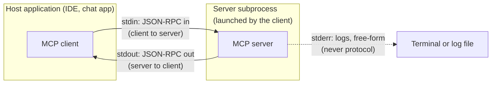
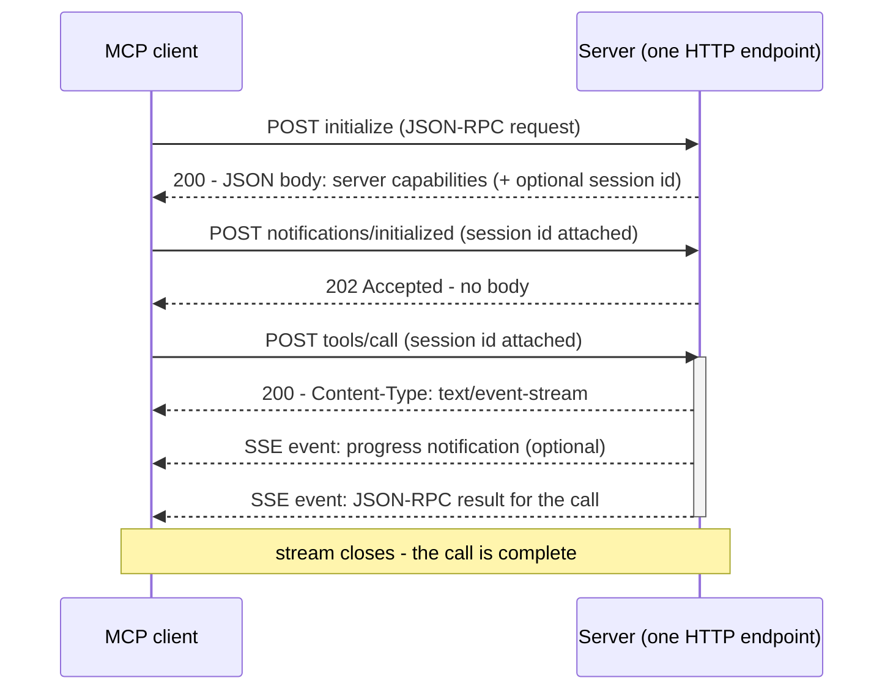

# Transports

The [previous chapter](primitives.md) catalogued what an MCP server offers: tools, resources, and prompts. This chapter is about how those offers physically travel. By the end you will be able to explain MCP's two transports, trace one message across each, choose the right one for a deployment, and recognize the single most common way a new server corrupts its own protocol.

## What a transport is

A **transport** is the mechanism that carries protocol messages between an MCP [client](why-mcp.md) and a server. MCP deliberately separates *what* is said — the JSON-RPC messages you will read line by line in [the wire protocol](wire-protocol.md) — from *how* it travels: a `tools/call` message means the same thing over a pipe between two local processes as over an HTTP connection to another machine.

!!! warning "Evolving — verified 2026-07-18"
    As of 2026-07-18, the MCP specification defines two transports: stdio, the standard for local servers, and Streamable HTTP, the current transport for remote servers. An earlier remote transport called HTTP+SSE was deprecated in the 2025-03-26 spec revision — if a tutorial describes a separate SSE endpoint plus a second endpoint for posting messages, it is describing the deprecated design. This changes quickly; check the [official spec's transports page](https://modelcontextprotocol.io/specification/2025-11-25/basic/transports) for current values.

The two transports correspond to two deployment shapes: a server that runs *as a subprocess on your machine*, and a server that runs *as a service at a URL*. Everything else about choosing between them follows from that difference.

## stdio: the server as a subprocess

The **stdio transport** runs the server as a subprocess of the client: the client launches the server executable itself, writes JSON-RPC messages to the server's standard input (one message per line), and reads responses from the server's standard output. No network is involved at any point.

That gives the connection exactly three channels, and each has one job:

- **stdin** carries requests and notifications from client to server.
- **stdout** carries responses and notifications from server to client — and *nothing else*.
- **stderr** is for logging. It is free-form text; the client may display it, capture it, or ignore it, but it never touches the protocol.

!!! danger "stdout is the wire"
    On stdio, standard output *is* the protocol channel. One stray `print` — a startup banner, a debug line you forgot, a dependency that logs to stdout — injects non-JSON bytes into the message stream. The client tries to parse `Starting server v1.2...` as a JSON-RPC message and fails; depending on the client, the symptom is a parse error, a silently dead connection, or a server that appears to never respond. The rule for every stdio server, in every language: never write to stdout yourself, and route all logging to stderr. [The wire protocol](wire-protocol.md) shows this failure at the byte level.

The subprocess shape has consequences worth making explicit:

- **Lifecycle.** The client owns the process: it spawns the server when a session starts, and the connection lives exactly as long as the process does. Nothing to deploy or keep running.
- **One client per instance.** Each client launches its own subprocess: two IDE windows means two independent server processes, each with its own state.
- **No network surface.** Nothing listens on a port. The server runs under your user account with your file permissions — the operating system is the security boundary.
- **Configuration is a command line.** A client needs only the command, its arguments, and environment variables — which is why the config files in [connecting servers to IDEs](ide-integration.md) are as small as they are.

## Streamable HTTP: the server as a service

**Streamable HTTP** is the transport for servers that run independently of any one client: the entire protocol is exposed through a single HTTP endpoint, and the client sends each JSON-RPC message as an HTTP POST to that endpoint. For the response, the server chooses per request: answer with one plain JSON body, or open a stream when it wants to send several messages — progress notifications, then the final result — for a single call.

That stream uses **server-sent events (SSE)**, a standard web mechanism in which the server holds an HTTP response open and delivers a sequence of events over it, one-way, until it closes the stream. SSE here is plumbing inside the transport, not a separate endpoint — the separate-endpoint design is the deprecated transport in the admonition above.

Because HTTP requests are independent by default, the transport needs a way to relate request number two to request number one. Conceptually this is a **session**: an identifier the server may issue at initialization, which the client attaches to every later request so the server can tie them to one logical conversation.

Sessions are optional, and declining them has a name: **stateless mode**, in which the server treats every request as self-contained. That buys operational freedom — any replica behind a load balancer can answer any request, and the server can restart without breaking clients — at the cost of holding no per-client state between calls. For a server whose tools are independent, deterministic calls, stateless is the natural fit.

Here is the shape of a Streamable HTTP conversation, from handshake to a streamed tool call:

The messages themselves — `initialize`, `notifications/initialized`, `tools/call` — are identical to what stdio carries. Only the envelope changed.

## Choosing a transport

The decision is usually made for you by one question: *who needs to reach this server?*

| Question | stdio | Streamable HTTP |
| --- | --- | --- |
| Who starts the server? | The client, as a subprocess | You or your ops team; it runs on its own |
| How many clients per instance? | Exactly one | Many, concurrently |
| Network exposure | None — no port, nothing listening | A real HTTP endpoint |
| Who is the caller, to the server? | Your OS user; secrets arrive as environment variables | Anyone who can reach the URL — callers must be authenticated |
| Classic failure smell | A stray stdout print; a wrong command path | Auth misconfiguration; session and timeout bugs |

So: a personal tool working on your local files wants stdio — zero deployment, zero network surface, lifetime managed by the client. A server shared by a team or reached across a network needs Streamable HTTP, because subprocesses do not cross machines.

Notice that *authentication follows the transport*. A stdio server never authenticates its caller: the caller launched it, on the same machine, as the same user — the operating system already settled the question — and any credentials the server itself needs arrive as environment variables in the launch configuration. An HTTP server sits on a network boundary, so it must verify every caller before doing work; MCP's answer is OAuth 2.1, covered with the rest of the trust-boundary material in [safety and judgment](../part4-agents/safety.md).

## In practice: Sankshep

[Sankshep](../part0-orientation/running-example.md) — as of 2026-07-18, at v1.8.0 — ships both transports and makes the textbook choices for each.

The default is stdio, and its logging is stderr-only, for exactly the reason in the danger box above: stdout carries JSON-RPC, so all diagnostics go to stderr as shipped policy. One binary, launched as a subprocess from an IDE's config file, is the entire local deployment story.

Passing `--http` starts Streamable HTTP in stateless mode — a deliberate pairing, since Sankshep's tools are deterministic and independent, so there is no per-client state worth a session. Two further choices preview the security posture: the HTTP listener is loopback-bound, so out of the box it accepts connections only from the same machine; and it is fail-closed — it refuses unauthenticated requests from non-loopback addresses unless the operator explicitly sets `SANKSHEP_ALLOW_UNAUTHENTICATED=1`. Exposure requires an explicit, greppable decision; silence defaults to safe.

The auth split matches the transport split, recorded in ADR-0012: the stdio path uses environment credentials and no OAuth at all, while the HTTP tier acts as an OAuth 2.1 resource server — it validates tokens, never issues them, never passes them through. What those properties mean, and the attack they prevent, is the subject of [safety and judgment](../part4-agents/safety.md).

## Checkpoints

**1.** A freshly written stdio server works in unit tests but the IDE reports a connection error the moment it starts. A teammate notices the server prints `ready.` on startup. Explain the failure and the fix.

??? success "Answer"
    On stdio, stdout is the protocol channel: the client parses everything the server writes there as JSON-RPC. The `ready.` line is not JSON, so the client's first read fails and the connection dies. The fix is to remove the print — and route all logging to stderr, which the client treats as free-form text outside the protocol.

**2.** Your team wants one centrally hosted server instance that everyone's IDE connects to. Which transport does this require, and what obligation comes with it?

??? success "Answer"
    Streamable HTTP — a stdio server is a subprocess of one client on one machine and cannot be shared or reached remotely. Hosting it creates a network endpoint, which brings the obligation to authenticate every caller: unlike stdio, the operating system no longer vouches for who is connecting.

**3.** What does stateless mode mean for a Streamable HTTP server, and what operational benefits does it buy?

??? success "Answer"
    The server issues no session identifier and treats every request as self-contained, holding no per-client state between calls. In exchange, any replica behind a load balancer can serve any request, and the server can restart without breaking clients. It fits servers whose calls are independent; it does not fit workloads needing state across calls.

**4.** Why does a stdio server typically have no authentication step at all, while an HTTP server must have one?

??? success "Answer"
    Authentication follows the transport. A stdio server is launched by its only client, on the same machine, under the same user account — the OS has already decided who is allowed to run it and which files it can touch, and secrets it needs arrive as environment variables. An HTTP server accepts connections across a network boundary, where no such prior trust exists, so it must verify each caller itself.

## Try it

Run a stdio MCP server directly in a terminal — with no client attached — and watch what happens.

1. Pick any stdio server you have. If you have none yet, [connecting servers to IDEs](ide-integration.md) walks through installing the official reference filesystem server, or you can return to this exercise with the server you build in [Build your own MCP server](../part6-reference/build-your-own.md).
2. Launch it from a terminal, the same command a client would use.
3. Observe: it prints nothing (or only a stderr log line) and then just sits there. Resist the instinct to call this broken.
4. Explain what you are seeing: the process is blocked reading stdin, waiting for an `initialize` message that in normal operation the client sends the instant it spawns the subprocess. Right now *you* are in the client's chair, and you have said nothing.
5. Type any non-JSON line and press Enter. Note which stream the reaction arrives on — a parse error logged to stderr, or a JSON-RPC error object on stdout. Either way, you just watched this chapter's framing rules enforce themselves.
6. Exit with Ctrl+C — in real use, the client owns this lifetime and ends the process when the session closes.

In [the wire protocol](wire-protocol.md), you will sit in that chair properly: typing a real handshake into a waiting server, line by line.
