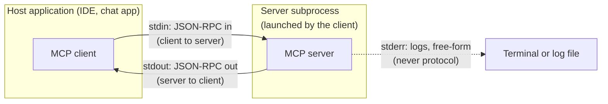
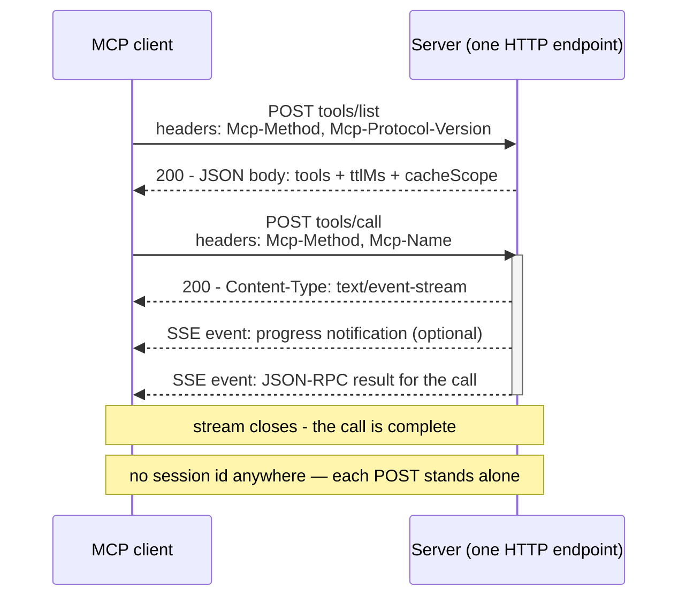
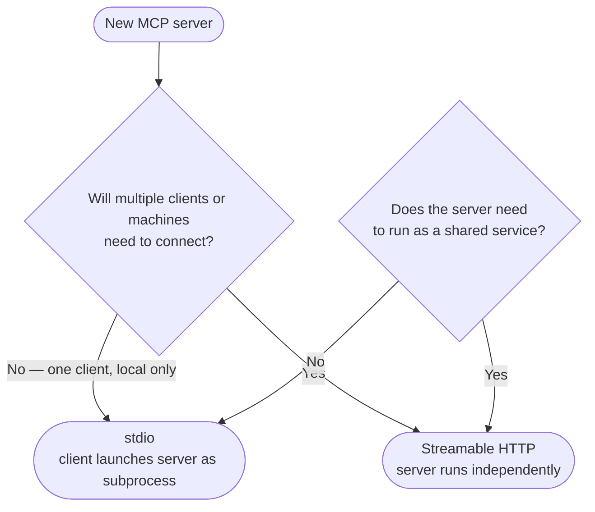

# Transports

The [previous chapter](primitives.md) catalogued what an MCP server offers: tools, resources, and prompts. This chapter is about how those offers physically travel.

By the end you will be able to explain MCP's two transports, trace one message across each, choose the right one for a deployment, and recognize the most common way a new server corrupts its own protocol.

## What a transport is

A **transport** is the mechanism that carries protocol messages between an MCP [client](why-mcp.md) and a server.

MCP deliberately separates *what* is said from *how* it travels. The JSON-RPC messages are [the wire protocol](wire-protocol.md)'s subject. A `tools/call` message means the same thing over a pipe between two local processes as it does over an HTTP connection to another machine.

!!! warning "Evolving — verified 2026-08-20"
    As of the 2026-07-28 revision, the MCP specification defines two transports. stdio is the standard for local servers. Streamable HTTP is the current transport for remote servers. An earlier remote transport called HTTP+SSE was deprecated in the 2025-03-26 revision, and formally reclassified as *Deprecated* under the feature lifecycle policy in 2026-07-28. If a tutorial describes a separate SSE endpoint plus a second endpoint for posting messages, it is describing that dead design. This changes quickly; check the [official spec's transports page](https://modelcontextprotocol.io/specification/2026-07-28/basic/transports/streamable-http) for current values.

The two transports match two deployment shapes. A server that runs *as a subprocess on your machine*, and a server that runs *as a service at a URL*.

Everything else about choosing between them follows from that difference.

## stdio: the server as a subprocess

The **stdio transport** runs the server as a subprocess of the client.

The client launches the server executable itself. It writes JSON-RPC messages to the server's standard input, one message per line, and reads responses from the server's standard output. No network is involved at any point.

That gives the connection exactly three channels, and each has one job.

```mermaid
flowchart LR
    subgraph host["Host application (IDE, chat app)"]
        C["MCP client"]
    end
    subgraph proc["Server subprocess<br/>(launched by the client)"]
        S["MCP server"]
    end
    C -- "stdin: JSON-RPC in<br/>(client to server)" --> S
    S -- "stdout: JSON-RPC out<br/>(server to client)" --> C
    S -. "stderr: logs, free-form<br/>(never protocol)" .-> L["Terminal or log file"]
```

- **stdin** carries requests and notifications from client to server.
- **stdout** carries responses and notifications from server to client, and *nothing else*.
- **stderr** is for logging. It is free-form text. The client may display it, capture it, or ignore it, but it never touches the protocol.

!!! danger "stdout is the wire"
    On stdio, standard output *is* the protocol channel.

    One stray `print` injects non-JSON bytes into the message stream. A startup banner. A debug line you forgot. A dependency that logs to stdout.

    The client then tries to parse `Starting server v1.2...` as a JSON-RPC message, and fails. Depending on the client, the symptom is a parse error, a silently dead connection, or a server that appears never to respond.

    The rule for every stdio server, in every language: never write to stdout yourself, and send all logging to stderr. [The wire protocol](wire-protocol.md) shows this failure at the byte level.

The subprocess shape has four consequences worth making explicit.

- **Lifecycle.** The client owns the process. It spawns the server when it first needs it, and the connection lives exactly as long as the process does. Nothing to deploy or keep running.
- **One client per instance.** Each client launches its own subprocess. Two IDE windows means two independent server processes, each with its own state.
- **No network surface.** Nothing listens on a port. The server runs under your user account with your file permissions, so the operating system is the security boundary.
- **Configuration is a command line.** A client needs only the command, its arguments, and environment variables. That is why the config files in [connecting servers to IDEs](ide-integration.md) are so small.

## Streamable HTTP: the server as a service

**Streamable HTTP** is the transport for servers that run independently of any one client.

The entire protocol is exposed through a single HTTP endpoint. The client sends each JSON-RPC message as an HTTP POST to that endpoint.

For the response, the server chooses per request. It can answer with one plain JSON body. Or it can open a stream, when it wants to send several messages for a single call — progress notifications, then the final result.

That stream uses **server-sent events (SSE)**, a standard web mechanism where the server holds an HTTP response open and delivers a sequence of events over it, one way, until it closes the stream.

SSE here is plumbing inside the transport, not a separate endpoint. The separate-endpoint design is the deprecated transport in the box above.

HTTP requests are independent by default, and as of the 2026-07-28 revision MCP leaves them that way.

There is no session identifier, and no protocol-level mechanism relating request two to request one. Every request carries its own protocol version and capabilities in `_meta`, and the server holds nothing between calls. [The wire protocol](wire-protocol.md) shows those fields. Here the consequence is operational.

That consequence is the reason for the change.

Any replica behind an ordinary round-robin load balancer can answer any request. No sticky routing, no shared session store. And a server can restart between two calls without breaking a client.

Remote MCP servers were genuinely hard to operate under the old design. This is what fixed it.

A server that truly needs state across calls now makes it explicit rather than implicit. A creation tool mints a handle, and later calls accept that handle as an ordinary argument. The transport neither knows nor cares.

Here is the shape of a Streamable HTTP conversation:

```mermaid
sequenceDiagram
    participant C as MCP client
    participant S as Server (one HTTP endpoint)

    C->>S: POST tools/list<br/>headers: Mcp-Method, Mcp-Protocol-Version
    S-->>C: 200 - JSON body: tools + ttlMs + cacheScope
    C->>S: POST tools/call<br/>headers: Mcp-Method, Mcp-Name
    activate S
    S-->>C: 200 - Content-Type: text/event-stream
    S-->>C: SSE event: progress notification (optional)
    S-->>C: SSE event: JSON-RPC result for the call
    deactivate S
    Note over C,S: stream closes - the call is complete
    Note over C,S: no session id anywhere — each POST stands alone
```

The messages themselves are identical to what stdio carries. Only the envelope changed.

Two envelope details are specific to HTTP.

Every POST must carry an `Mcp-Method` header, and for calls, an `Mcp-Name` header. These duplicate the JSON-RPC method and tool name.

That looks redundant until you remember what sits between a client and a remote server. Load balancers, proxies, and web application firewalls route on headers. Without these, they would have to parse every request body just to know what they are forwarding.

Servers can extend this to tool arguments. A parameter annotated `x-mcp-header` is mirrored into an `Mcp-Param-*` header.

The caveat is obvious. Anything mirrored that way is visible to every intermediary, so credentials and personal data must never be annotated that way.

??? info "Going deeper — what else the stateless revision removed"

    If you have read older MCP material, or maintain a server written before mid-2026, four removals will bite.

    - **`Mcp-Session-Id`** is gone entirely. A server that issues one is speaking an earlier revision.
    - **The HTTP `GET` endpoint** for server-to-client messages is replaced by `subscriptions/listen`. That is a single long-lived POST whose response stream carries the change notifications a client explicitly opted into, such as `toolsListChanged` and `resourcesListChanged`. Request-scoped notifications like progress still ride the response stream of the request they belong to, not this one.
    - **`resources/subscribe` and `resources/unsubscribe`** folded into that same opt-in.
    - **Stream resumability** was removed, meaning the `Last-Event-ID` header and SSE event ids. A broken response stream now loses the in-flight request, and the client must re-issue it as a *new* request with a new id. Retries are the client's job, and they have to be safe to repeat.

    The through-line: every one of these was a way of carrying state across requests. Each was deleted rather than fixed.

## Choosing a transport

One question usually decides it for you. *Who needs to reach this server?*

```mermaid
flowchart TD
    A(["New MCP server"])
    B{"Will multiple clients or machines<br/>need to connect?"}
    C{"Does the server need<br/>to run as a shared service?"}
    STDIO(["stdio<br/>client launches server as subprocess"])
    HTTP(["Streamable HTTP<br/>server runs independently"])

    A --> B
    B -- "No — one client, local only" --> STDIO
    B -- "Yes" --> HTTP
    C -- "No" --> STDIO
    C -- "Yes" --> HTTP
```

| Question | stdio | Streamable HTTP |
| --- | --- | --- |
| Who starts the server? | The client, as a subprocess | You or your ops team; it runs on its own |
| How many clients per instance? | Exactly one | Many, at the same time |
| Network exposure | None — no port, nothing listening | A real HTTP endpoint |
| Who is the caller, to the server? | Your OS user; secrets arrive as environment variables | Anyone who can reach the URL — callers must be authenticated |
| Classic failure smell | A stray stdout print; a wrong command path | Auth misconfiguration; proxy and timeout bugs |

So a personal tool working on your local files wants stdio. Zero deployment, zero network surface, and the client manages its lifetime.

A server shared by a team, or reached across a network, needs Streamable HTTP. Subprocesses do not cross machines.

Notice that *authentication follows the transport*.

A stdio server never authenticates its caller. The caller launched it, on the same machine, as the same user. The operating system already settled the question, and any credentials the server itself needs arrive as environment variables in the launch configuration.

An HTTP server sits on a network boundary. So it must verify every caller before doing work. MCP's answer is OAuth 2.1, covered with the rest of the trust-boundary material in [safety and judgment](../part4-agents/safety.md).

## In practice: Sankshep

[Sankshep](../part0-orientation/running-example.md) — as of 2026-07-18, at v1.8.0 — ships both transports, and makes the textbook choice for each.

The default is stdio, and its logging is stderr-only. That is exactly the reason in the danger box above: stdout carries JSON-RPC, so all diagnostics go to stderr as shipped policy. One binary, launched as a subprocess from an IDE's config file, is the entire local deployment story.

Passing `--http` starts Streamable HTTP in stateless mode. That was a deliberate pairing, since Sankshep's tools are deterministic and independent, so there is no per-client state worth keeping. As of the 2026-07-28 revision, that choice stopped being a choice: statelessness is what the protocol now requires of everyone.

Two further choices preview the security posture. The HTTP listener is loopback-bound, so out of the box it accepts connections only from the same machine. And it is fail-closed: it refuses unauthenticated requests from non-loopback addresses unless the operator explicitly sets `SANKSHEP_ALLOW_UNAUTHENTICATED=1`.

Exposure requires an explicit, greppable decision. Silence defaults to safe.

The auth split matches the transport split, recorded in ADR-0012. The stdio path uses environment credentials and no OAuth at all. The HTTP tier acts as an OAuth 2.1 resource server: it validates tokens, never issues them, and never passes them through.

What those properties mean, and the attack they prevent, is the subject of [safety and judgment](../part4-agents/safety.md).

## Checkpoints

**1.** A freshly written stdio server works in unit tests, but the IDE reports a connection error the moment it starts. A teammate notices the server prints `ready.` on startup. Explain the failure and the fix.

??? success "Answer"
    On stdio, stdout is the protocol channel. The client parses everything the server writes there as JSON-RPC.

    The `ready.` line is not JSON. So the client's first read fails, and the connection dies.

    The fix is to remove the print, and route all logging to stderr, which the client treats as free-form text outside the protocol.

**2.** Your team wants one centrally hosted server instance that everyone's IDE connects to. Which transport does this require, and what obligation comes with it?

??? success "Answer"
    Streamable HTTP. A stdio server is a subprocess of one client on one machine, so it cannot be shared or reached remotely.

    Hosting it creates a network endpoint, and that brings an obligation to authenticate every caller. Unlike stdio, the operating system no longer vouches for who is connecting.

**3.** What does stateless mode mean for a Streamable HTTP server, and what operational benefits does it buy?

??? success "Answer"
    The server issues no session identifier and treats every request as self-contained, holding no per-client state between calls.

    In exchange, any replica behind a load balancer can serve any request, and the server can restart without breaking clients.

    Workloads that do need state across calls carry it explicitly, in server-minted handles passed as ordinary tool arguments.

**4.** Why does a stdio server usually have no authentication step at all, while an HTTP server must have one?

??? success "Answer"
    Authentication follows the transport.

    A stdio server is launched by its only client, on the same machine, under the same user account. The OS has already decided who may run it and which files it can touch, and any secrets it needs arrive as environment variables.

    An HTTP server accepts connections across a network boundary, where no such prior trust exists. So it has to verify each caller itself.

## Try it

Run a stdio MCP server directly in a terminal, with no client attached, and watch what happens.

1. Pick any stdio server you have. If you have none yet, [connecting servers to IDEs](ide-integration.md) walks through installing the official reference filesystem server. Or come back to this exercise with the server you build in [Build your own MCP server](../part6-reference/build-your-own.md).
2. Launch it from a terminal, using the same command a client would use.
3. Observe. It prints nothing, or maybe one stderr log line, and then just sits there. Resist the instinct to call this broken.
4. Explain what you are seeing. The process is blocked reading stdin, waiting for a JSON-RPC request that a client would normally send the instant it spawns the subprocess.

    Right now *you* are in the client's chair, and you have said nothing.

5. Type any non-JSON line and press Enter. Note which stream the reaction arrives on: a parse error logged to stderr, or a JSON-RPC error object on stdout.

    Either way, you just watched this chapter's framing rules enforce themselves.

6. Exit with Ctrl+C. In real use, the client owns this lifetime and ends the process when it no longer needs the server.

In [the wire protocol](wire-protocol.md), you will sit in that chair properly, typing real requests into a waiting server, line by line.
