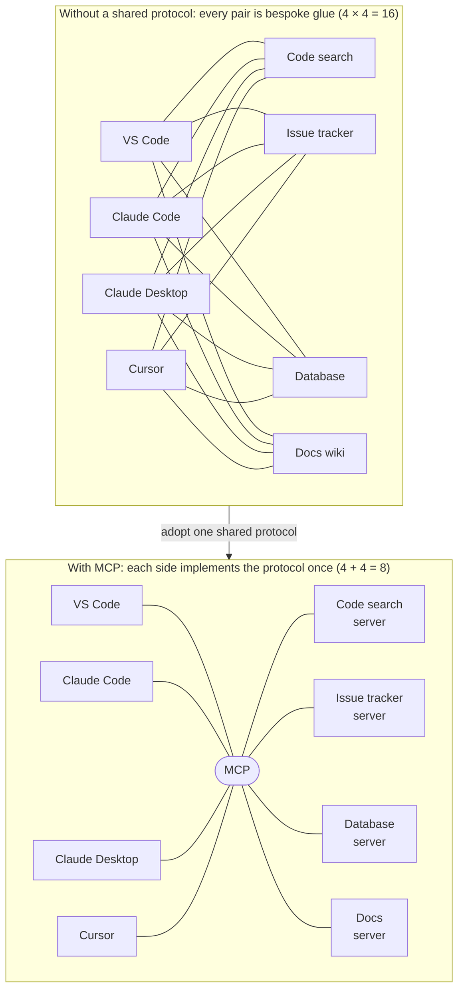
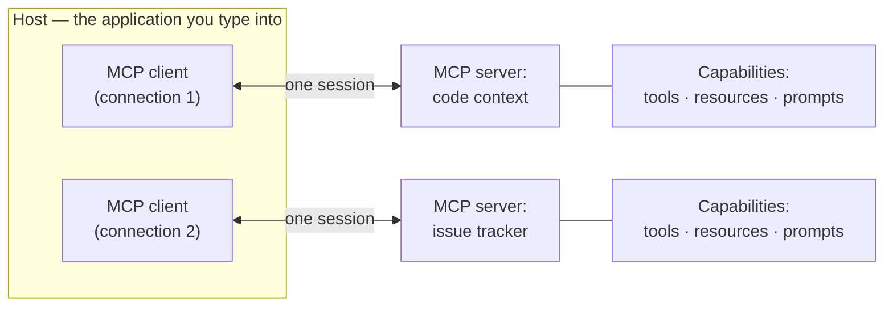

# What problem MCP solves

Part 2 ended with context worth shipping: retrieved, minimized, measured. This chapter is about the shipping — the standard carrier between programs that offer capabilities like "search this repo" and programs that use them. By the end you will be able to:

- explain why bespoke integrations scale as N×M while a shared protocol scales as N+M;
- use the protocol's vocabulary — host, client, server, capability — precisely;
- state what MCP is *not*, which heads off the most common misconceptions;
- say where the protocol stands as of 2026-07-18: specification, governance, and SDKs.

This chapter is the "why"; the rest of Part 3 zooms in on the what ([primitives](primitives.md)), the how ([transports](transports.md), [the wire protocol](wire-protocol.md)), and the doing ([writing a server](writing-a-server.md), [IDE integration](ide-integration.md)).

## The glue problem

Picture the scene before any shared protocol. On one side, AI coding assistants: VS Code's agent mode, Claude Code, Claude Desktop, Cursor. On the other, tools they would be more useful with: a code-search index, an issue tracker, a database, an internal wiki. Connecting any pair means writing an integration — how the assistant reaches the tool, asks what it offers, passes arguments, gets results and errors back. The problem is the multiplication: N assistants and M tools need N×M integrations, each written by whoever needed it first, each drifting as either side changes.

The arithmetic is merciless in both directions: a fifth tool needs four more integrations before every assistant can use it, and a fifth assistant starts every integration behind the incumbents. Most integrations never get written; most pairs simply do not work.

A shared protocol changes the shape of the work. Each assistant implements the client side once; each tool wraps itself as a server once. N + M implementations, and every pair works:

Count the edges: sixteen above, eight below. At four-and-four the saving looks modest; at ecosystem scale — hundreds of clients, thousands of servers — the top picture is a world where most connections never exist.

One honesty note: the N+M arithmetic holds only if the protocol genuinely covers what integrations need — discovery, invocation, results, errors, transport. Cover half the need and you get N+M implementations *plus* bespoke glue, and the spaghetti returns. The next four chapters equip you to judge MCP's coverage.

!!! example "In the wild: Sankshep"
    Sankshep — the running example [introduced in Part 0](../part0-orientation/running-example.md) — is one binary, and that binary, unchanged, serves all four clients in the diagram above: VS Code, Claude Code, Claude Desktop, and Cursor each need only a small configuration entry pointing at it ([Connecting servers to IDEs](ide-integration.md) shows all four). Without a shared protocol, that would have meant four separate plugins in four extension ecosystems; under MCP, each additional compliant client costs Sankshep nothing. The N+M arithmetic, paying out in a real product.

You will often hear MCP pitched as "a USB-C port for AI applications." Used once, the analogy earns its keep: one standard connection, many devices, either side swappable. Note where it stops, though. USB-C standardizes a physical and electrical contract; MCP must standardize *meaning* — how a capability describes itself, how it is invoked, what results and errors look like. And unlike a cable, an MCP server describes itself in text that lands in a model's context and does real work there ([tool calling](../part4-agents/tool-calling.md) shows that description text carries most of the load). A picture of the win, not of the mechanism — this site retires the analogy here.

## What MCP is

The **Model Context Protocol (MCP)** is an open protocol in which a client program connects to a server, asks what it offers, and invokes those offerings on a model's behalf — with message shapes, discovery, and error rules standardized so any compliant client can use any compliant server. Introduced by Anthropic in November 2024, it is built on JSON-RPC 2.0, a small remote-procedure-call message format that [the wire protocol](wire-protocol.md) walks through message by message.

The load-bearing phrase is *asks what it offers*. A client compiles in no knowledge of any particular server; at connection time it sends a discovery request, and the server answers with a machine-readable list of its capabilities. A **capability** is a named, described, schema-typed offering a server exposes — MCP defines three kinds (tools, resources, and prompts), and [the next chapter](primitives.md) sorts them by the question that actually distinguishes them: who invokes each. Runtime discovery is what makes N+M real: a client written before a server existed can still use it, because everything the client needs to learn arrives over the wire.

## The vocabulary: hosts, clients, servers

Conversations about MCP go sideways when these three words blur, so fix them now:

The **host** is the application you interact with — an IDE assistant, a desktop chat app, an agent harness. It owns the user interface, talks to the model's API, and embeds the protocol machinery. An MCP **client** is that machinery: the component inside the host holding a one-to-one session with a single server — a host connected to three servers runs three clients. An MCP **server** is the program on the other end of a session, exposing capabilities.

In [Part 0's three-layer frame](../part0-orientation/running-example.md#the-three-layer-frame), "Layer 1 — the client" bundled host and clients together — fine at that altitude. From here on, the finer grain matters: the host coordinates (which servers to connect, what the user approved, what reaches the model); each client speaks the protocol to exactly one server. When Parts 3 and 4 say "the client", they mean this side as a whole.

## What MCP is not

Four boundary lines prevent most misconceptions.

**Not a model API.** MCP never carries your prompt to a model, and no model endpoint speaks it. Two protocols are always in play: the host talks to the model over a model API and to servers over MCP, translating between them. [The wire protocol](wire-protocol.md) draws that double boundary explicitly, because seeing it collapses most of the magic.

**Not an agent framework.** There is no loop in the protocol. A server answers one request at a time; nothing in MCP plans, retries, or chains steps. The loop lives in the client layer, as [the agent loop](../part4-agents/agent-loop.md) shows — a server can be a superb tool inside someone else's loop while containing none of its own.

**Not a way to make a model "know" about your tools.** Models have [exactly two information sources](../part1-fundamentals/what-llms-do.md#only-weights-and-context): frozen weights and the current context. MCP changes neither. The client fetches capability descriptions from servers and places them in the context as [tokens](../part1-fundamentals/tokens.md) — the quoted "know" is doing the work defined in [the anthropomorphism contract](../part1-fundamentals/what-llms-do.md#the-anthropomorphism-contract). The plumbing is standardized; the model still only maps tokens to probabilities.

**Not a library.** MCP is a wire contract, like HTTP. Official SDKs are conveniences; anything that reads and writes the protocol's messages over its transports is a valid implementation — [writing a server](writing-a-server.md) uses that fact to keep SDK churn quarantined at the edge of a codebase.

## Status, governance, and SDKs

A protocol is a bet that both sides of an ecosystem will keep implementing it, so its status and stewardship are engineering inputs, not trivia.

!!! warning "Evolving — verified 2026-07-18"
    The stable MCP specification revision is **2025-11-25**, and a release candidate dated 2026-07-28 has been published — the largest revision since the protocol launched. Governance moved in December 2025: Anthropic donated MCP to the **Agentic AI Foundation** under the Linux Foundation, with Anthropic, Block, and OpenAI as co-founders. This changes quickly; check [the official specification site](https://modelcontextprotocol.io/) for current values.

Two takeaways. Spec revisions are dated snapshots, and client and server negotiate which one they speak at session start — [the wire protocol](wire-protocol.md) shows the handshake — so a large revision can land without stranding existing software. And a protocol owned by a neutral foundation, with competing vendors as co-founders, is hard for any single company to abandon or capture: the strongest available signal for the bet.

The SDK picture tells the same story from the tooling side:

!!! warning "Evolving — verified 2026-07-18"
    Official MCP SDKs cover ten languages in three tiers of maintenance and feature-completeness: Tier 1 — TypeScript, Python, C#, Go; Tier 2 — Java, Rust; Tier 3 — Swift, Ruby, PHP, Kotlin. This changes quickly; check [the official SDK list](https://modelcontextprotocol.io/docs/sdk) for current values.

Tier 1 means first-class: actively maintained and feature-complete against the current spec; lower tiers trail it. The list matters twice on this site: [writing a server](writing-a-server.md) examines the C# SDK as a concrete dependency-management case, and [build your own MCP server](../part6-reference/build-your-own.md) uses the Python and TypeScript SDKs hands-on.

## Checkpoints

**1. Your company runs 3 AI assistants and has 5 internal tools worth connecting. How many integrations exist without a shared protocol, how many implementations with one — and what must be true for the second number to hold?**

??? success "Answer"
    Without: 3 × 5 = 15 bespoke integrations. With: 3 + 5 = 8 — each assistant implements the client side once, each tool wraps itself as a server once. The arithmetic holds only if both sides implement the protocol faithfully and the protocol covers what the integrations need — discovery, invocation, results, errors, transport; anything uncovered comes back as bespoke glue on top of the 8.

**2. A colleague says "VS Code is our MCP client." Precisely speaking, what is VS Code in the protocol's vocabulary, and what is the client?**

??? success "Answer"
    VS Code is a *host*: the application the user types into, owning the UI and the model API connection. The *clients* are components inside it — one per configured server, each holding a one-to-one session, so three servers means three MCP clients. The loose usage is harmless until a host talks to several servers at once — which is the normal case.

**3. Name two places where the "USB-C port for AI applications" analogy breaks down.**

??? success "Answer"
    First, USB-C standardizes a physical and electrical contract, while MCP must standardize meaning: how capabilities describe themselves, how they are invoked, how results and errors are shaped. Second, a cable never has to explain itself to the device using it — an MCP server must describe its capabilities in text and schemas that enter a model's context and steer behavior there. The analogy captures the N+M win, not the mechanism.

**4. Rewrite this sentence so it is mechanically accurate: "The model connects to the MCP server and calls its tools."**

??? success "Answer"
    One accurate version: "The client connects to the server, fetches its capability descriptions, and places them in the model's context; when the model emits a structured request naming a tool, the client executes it over MCP and appends the result to the context." The model never holds a connection — it maps tokens to probabilities ([the anthropomorphism contract](../part1-fundamentals/what-llms-do.md#the-anthropomorphism-contract)); separate software does the connecting.
