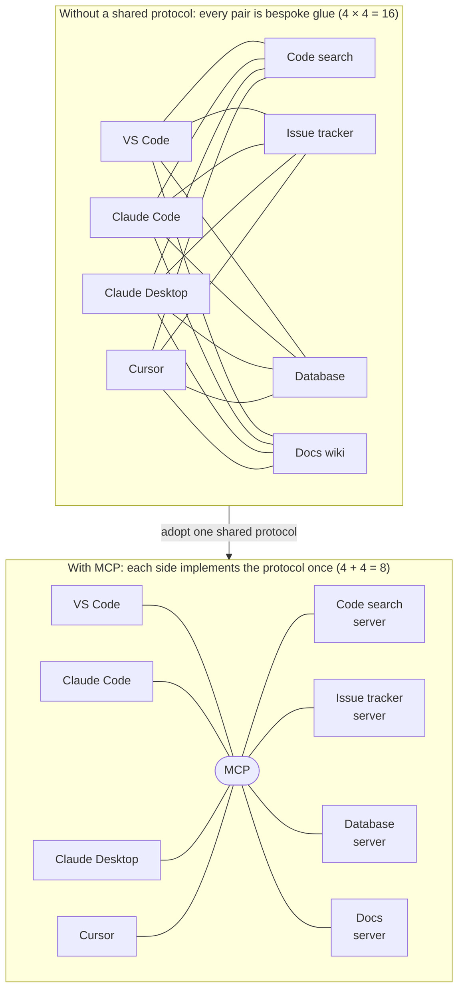
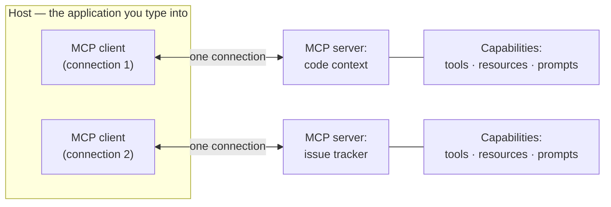

# What problem MCP solves

Part 2 ended with context worth shipping: retrieved, minimized, measured. This chapter is about the shipping.

It covers the standard carrier between programs that offer capabilities like "search this repo" and programs that use them.

By the end you will be able to:

- explain why bespoke integrations scale as N×M while a shared protocol scales as N+M;
- use the protocol's vocabulary — host, client, server, capability — precisely;
- state what MCP is *not*, which heads off the most common misconceptions;
- say where the protocol stands as of 2026-08-20: specification revision, governance, and SDKs.

This chapter is the "why". The rest of Part 3 zooms in on the what ([primitives](primitives.md)), the how ([transports](transports.md), [the wire protocol](wire-protocol.md)), and the doing ([writing a server](writing-a-server.md), [IDE integration](ide-integration.md)).

## The glue problem

Picture the scene before any shared protocol.

On one side, AI coding assistants: VS Code's agent mode, Claude Code, Claude Desktop, Cursor. On the other, tools they would be more useful with: a code-search index, an issue tracker, a database, an internal wiki.

Connecting any pair means writing an integration. How the assistant reaches the tool. How it asks what the tool offers. How it passes arguments, and gets results and errors back.

The problem is the multiplication. N assistants and M tools need N×M integrations. Each is written by whoever needed it first, and each drifts as either side changes.

The arithmetic is merciless in both directions. A fifth tool needs four more integrations before every assistant can use it. A fifth assistant starts every integration behind the incumbents.

So most integrations never get written. Most pairs simply do not work.

A shared protocol changes the shape of the work. Each assistant implements the client side once. Each tool wraps itself as a server once. That is N + M implementations, and every pair works.

```mermaid
flowchart TB
    subgraph before["Without a shared protocol: every pair is bespoke glue (4 × 4 = 16)"]
        direction LR
        A1["VS Code"]
        A2["Claude Code"]
        A3["Claude Desktop"]
        A4["Cursor"]
        B1["Code search"]
        B2["Issue tracker"]
        B3["Database"]
        B4["Docs wiki"]
        A1 --- B1 & B2 & B3 & B4
        A2 --- B1 & B2 & B3 & B4
        A3 --- B1 & B2 & B3 & B4
        A4 --- B1 & B2 & B3 & B4
    end
    subgraph after["With MCP: each side implements the protocol once (4 + 4 = 8)"]
        direction LR
        C1["VS Code"]
        C2["Claude Code"]
        C3["Claude Desktop"]
        C4["Cursor"]
        MCP(["MCP"])
        S1["Code search<br/>server"]
        S2["Issue tracker<br/>server"]
        S3["Database<br/>server"]
        S4["Docs<br/>server"]
        C1 & C2 & C3 & C4 --- MCP
        MCP --- S1 & S2 & S3 & S4
    end
    before -->|"adopt one shared protocol"| after
```

Count the edges. Sixteen above, eight below.

At four and four the saving looks modest. At ecosystem scale — hundreds of clients, thousands of servers — the top picture is a world where most connections simply never exist.

One honesty note. The N+M arithmetic holds only if the protocol genuinely covers what integrations need: discovery, invocation, results, errors, transport.

Cover half the need and you get N+M implementations *plus* bespoke glue, and the spaghetti comes back. The next four chapters equip you to judge MCP's coverage.

!!! example "In the wild: Sankshep"
    Sankshep — the running example [introduced in Part 0](../part0-orientation/running-example.md) — is one binary. That binary, unchanged, serves all four clients in the diagram above.

    VS Code, Claude Code, Claude Desktop, and Cursor each need only a small configuration entry pointing at it. [Connecting servers to IDEs](ide-integration.md) shows all four.

    Without a shared protocol, that would have meant four separate plugins in four extension ecosystems. Under MCP, each additional compliant client costs Sankshep nothing. That is the N+M arithmetic paying out in a real product.

You will often hear MCP pitched as "a USB-C port for AI applications".

Used once, the analogy earns its keep: one standard connection, many devices, either side swappable. But note where it stops.

USB-C standardizes a physical and electrical contract. MCP has to standardize *meaning* — how a capability describes itself, how it is invoked, what results and errors look like.

And unlike a cable, an MCP server describes itself in text that lands in a model's context and does real work there. [Tool calling](../part4-agents/tool-calling.md) shows that description text carries most of the load.

The analogy is a picture of the win, not of the mechanism. This site retires it here.

## What MCP is

The **Model Context Protocol (MCP)** is an open protocol. A client program connects to a server, asks what it offers, and invokes those offerings on a model's behalf.

Message shapes, discovery, and error rules are all standardized, so any compliant client can use any compliant server.

Anthropic introduced it in November 2024. It is built on JSON-RPC 2.0, a small remote-procedure-call message format that [the wire protocol](wire-protocol.md) walks through message by message.

The load-bearing phrase is *asks what it offers*.

A client compiles in no knowledge of any particular server. At connection time it sends a discovery request, and the server answers with a machine-readable list of its capabilities.

A **capability** is a named, described, schema-typed offering a server exposes. MCP defines three kinds — tools, resources, and prompts — and [the next chapter](primitives.md) sorts them by the question that actually tells them apart: who invokes each.

Runtime discovery is what makes N+M real. A client written before a server existed can still use it, because everything the client needs to learn arrives over the wire.

## The vocabulary: hosts, clients, servers

Conversations about MCP go sideways when these three words blur. So fix them now.

```mermaid
flowchart LR
    subgraph host["Host — the application you type into"]
        c1["MCP client<br/>(connection 1)"]
        c2["MCP client<br/>(connection 2)"]
    end
    s1["MCP server:<br/>code context"]
    s2["MCP server:<br/>issue tracker"]
    cap1["Capabilities:<br/>tools · resources · prompts"]
    cap2["Capabilities:<br/>tools · resources · prompts"]
    c1 <-->|"one connection"| s1
    c2 <-->|"one connection"| s2
    s1 --- cap1
    s2 --- cap2
```

The **host** is the application you interact with: an IDE assistant, a desktop chat app, an agent harness. It owns the user interface, talks to the model's API, and embeds the protocol machinery.

An MCP **client** is that machinery. It is the component inside the host that talks to a single server. A host connected to three servers runs three clients.

An MCP **server** is the program on the other end, exposing capabilities.

In [Part 0's three-layer frame](../part0-orientation/running-example.md#the-three-layer-frame), "Layer 1 — the client" bundled host and clients together. That was fine at that altitude.

From here on the finer grain matters. The host coordinates: which servers to connect, what the user approved, what reaches the model. Each client speaks the protocol to exactly one server.

When Parts 3 and 4 say "the client", they mean this side as a whole.

## What MCP is not

Four boundary lines prevent most misconceptions.

!!! info "Not a model API"
    MCP never carries your prompt to a model, and no model endpoint speaks it.

    Two protocols are always in play. The host talks to the model over a model API, and to servers over MCP, translating between them. [The wire protocol](wire-protocol.md) draws that double boundary explicitly, because seeing it collapses most of the magic.

!!! info "Not an agent framework"
    There is no loop in the protocol. A server answers one request at a time, and nothing in MCP plans, retries, or chains steps.

    The loop lives in the client layer, as [the agent loop](../part4-agents/agent-loop.md) shows. A server can be a superb tool inside someone else's loop while containing none of its own.

!!! info "Not a way to make a model \"know\" about your tools"
    Models have [exactly two information sources](../part1-fundamentals/what-llms-do.md#only-weights-and-context): frozen weights, and the current context. MCP changes neither.

    The client fetches capability descriptions from servers and puts them in the context as [tokens](../part1-fundamentals/tokens.md). The quoted "know" is doing the work defined in [the anthropomorphism contract](../part1-fundamentals/what-llms-do.md#the-anthropomorphism-contract).

    The plumbing is standardized. The model still only maps tokens to probabilities.

!!! info "Not a library"
    MCP is a wire contract, like HTTP. Official SDKs are conveniences.

    Anything that reads and writes the protocol's messages over its transports is a valid implementation. [Writing a server](writing-a-server.md) uses that fact to keep SDK churn quarantined at the edge of a codebase.

## Status, governance, and SDKs

A protocol is a bet that both sides of an ecosystem will keep implementing it. So its status and stewardship are engineering inputs, not trivia.

!!! warning "Evolving — verified 2026-08-20"
    The current MCP specification revision is **2026-07-28**. It is the largest revision since the protocol launched, and the one this site teaches. It shipped stable with same-day SDK support in TypeScript, Python, Go, and C#. The previous revision, 2025-11-25, is now *final*: unchanging, and still spoken by plenty of deployed software. Governance moved in December 2025, when Anthropic donated MCP to the **Agentic AI Foundation** under the Linux Foundation, with Anthropic, Block, and OpenAI as co-founders. This changes quickly; check [the official specification site](https://modelcontextprotocol.io/) and its [versioning page](https://modelcontextprotocol.io/specification/versioning) for current values.

Three takeaways.

First, spec revisions are dated snapshots, named for the last date a backwards-incompatible change landed. Every request declares which revision it speaks, and [the wire protocol](wire-protocol.md) shows exactly where. So a large revision can land without stranding existing software.

Second, "backwards-incompatible" is not a euphemism here. The 2026-07-28 revision deleted the session handshake and made the protocol stateless. A server written against 2025-11-25 and a client written against 2026-07-28 do not interoperate by accident. Both revisions define explicit fallback probes for exactly that reason.

Third, a protocol owned by a neutral foundation, with competing vendors as co-founders, is hard for any single company to abandon or capture. That is the strongest signal available for the bet.

!!! note "Settled"
    Since 2026-07-28 the protocol carries a formal **feature lifecycle policy**. A feature moves Active, then Deprecated, then Removed. It must sit Deprecated for at least twelve months before it is eligible for removal.

    So deprecation is now an announced state, with a published migration path and a [registry](https://modelcontextprotocol.io/specification/2026-07-28/deprecated). It is not a silent breakage.

    When you read that Roots or Sampling is deprecated in [primitives](primitives.md), that is what the word means. Still functional, documented as leaving, and safe to keep running while you migrate.

The SDK picture tells the same story from the tooling side.

!!! warning "Evolving — verified 2026-08-20"
    Official MCP SDKs cover ten languages in three tiers of maintenance and feature-completeness. Tier 1: TypeScript, Python, C#, Go. Tier 2: Java, Rust. Tier 3: Swift, Ruby, PHP, Kotlin. All four Tier 1 SDKs shipped 2026-07-28 support on the revision's publication day, in new major versions. The TypeScript SDK split into `@modelcontextprotocol/server` and `@modelcontextprotocol/client`, and the Python SDK renamed its server class from `FastMCP` to `MCPServer`. This changes quickly; check [the official SDK list](https://modelcontextprotocol.io/docs/sdk) for current values.

Tier 1 means first-class: actively maintained, and feature-complete against the current spec. Lower tiers trail it.

The list matters twice on this site. [Writing a server](writing-a-server.md) examines the C# SDK as a concrete dependency-management case. And [build your own MCP server](../part6-reference/build-your-own.md) uses the Python and TypeScript SDKs hands-on.

## Checkpoints

**1. Your company runs 3 AI assistants and has 5 internal tools worth connecting. How many integrations exist without a shared protocol, how many implementations with one — and what must be true for the second number to hold?**

??? success "Answer"
    Without a protocol: 3 × 5 = 15 bespoke integrations.

    With one: 3 + 5 = 8. Each assistant implements the client side once, and each tool wraps itself as a server once.

    The arithmetic holds only if both sides implement the protocol faithfully, and the protocol covers what the integrations need — discovery, invocation, results, errors, transport. Anything it does not cover comes back as bespoke glue on top of the 8.

**2. A colleague says "VS Code is our MCP client." Precisely speaking, what is VS Code in the protocol's vocabulary, and what is the client?**

??? success "Answer"
    VS Code is a *host*. It is the application the user types into, and it owns the UI and the model API connection.

    The *clients* are components inside it, one per configured server. Three servers means three MCP clients.

    The loose usage is harmless until a host talks to several servers at once — which is the normal case.

**3. Name two places where the "USB-C port for AI applications" analogy breaks down.**

??? success "Answer"
    First, USB-C standardizes a physical and electrical contract. MCP has to standardize meaning: how capabilities describe themselves, how they are invoked, how results and errors are shaped.

    Second, a cable never has to explain itself to the device using it. An MCP server must describe its capabilities in text and schemas that enter a model's context and steer behavior there.

    The analogy captures the N+M win, not the mechanism.

**4. Rewrite this sentence so it is mechanically accurate: "The model connects to the MCP server and calls its tools."**

??? success "Answer"
    One accurate version: "The client connects to the server, fetches its capability descriptions, and puts them in the model's context. When the model emits a structured request naming a tool, the client runs it over MCP and adds the result to the context."

    The model never holds a connection. It maps tokens to probabilities, per [the anthropomorphism contract](../part1-fundamentals/what-llms-do.md#the-anthropomorphism-contract). Separate software does the connecting.

## Try it

Count the integration burden in a system you actually use. The N×M arithmetic stops being abstract once the names are real.

1. **List your N.** Write down every AI assistant or agent harness you or your team use: an IDE assistant, a terminal agent, a desktop chat app, a CI bot. Most people find two to four.
2. **List your M.** Write down every internal system an assistant would be more useful with: your issue tracker, your code search, your runbooks wiki, your metrics dashboard, your deploy tooling.

    Be generous. Include the ones nobody has connected yet, because those are the point.

3. **Multiply, then add.** N × M is the number of bespoke integrations a pre-protocol world needs. N + M is the number of protocol implementations. Write both numbers down.
4. **Find the ones that do not exist.** Of your N × M pairs, mark which actually work today.

    The unmarked ones are not a backlog. They are the connections nobody ever judged worth a bespoke integration, which is exactly the cost the arithmetic predicts.

5. **Now apply the honesty check.** Pick your most awkward tool — one with unusual auth, streaming results, or a long-running operation. Ask what MCP would *not* cover for it.

    Anything you find is bespoke glue that survives adopting the protocol. That is the difference between N+M as a slogan and N+M as a plan.

Keep the list. When [Connecting servers to IDEs](ide-integration.md) has you wire up a real server, you will be collapsing one of these edges for real.
