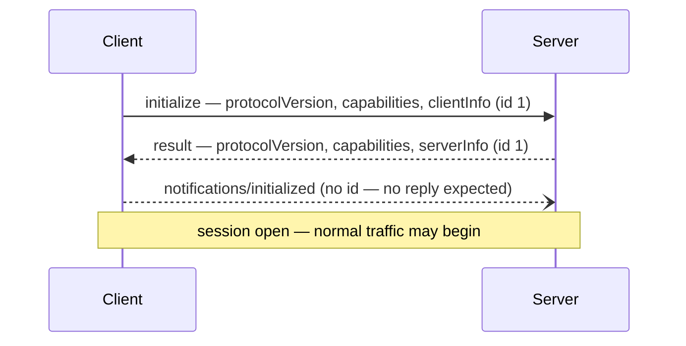
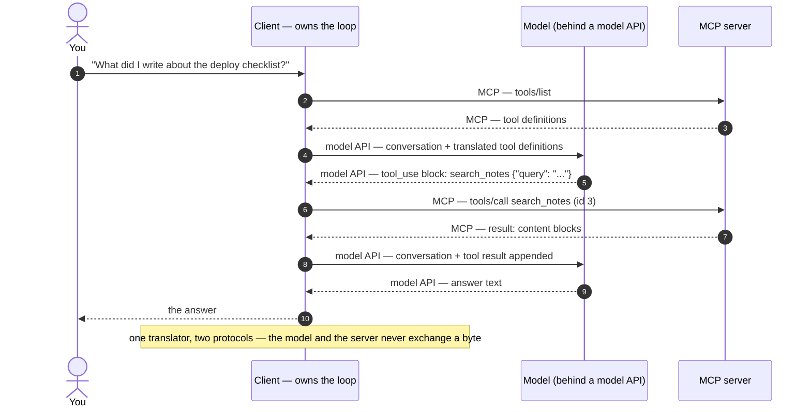
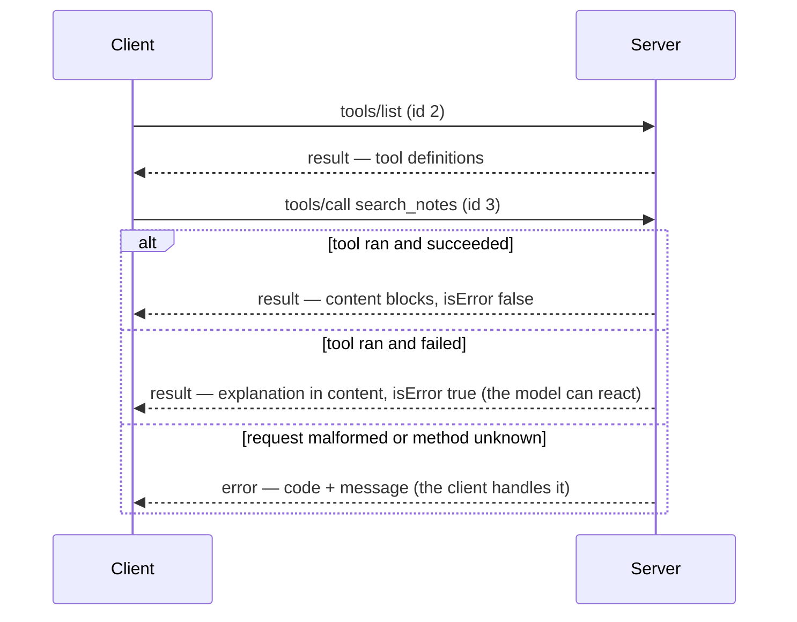

# The wire protocol

[Transports](transports.md) explained how bytes move between an MCP client and server. This chapter is about what those bytes say. By the end you will be able to read a complete MCP session line by line — the handshake, tool discovery, a tool call, and both kinds of failure — and explain, with no magic left, how a model that only [predicts next tokens](../part1-fundamentals/what-llms-do.md) ends up running a function on your machine.

Nothing here needs an SDK. Every message is plain JSON you could type by hand — and in [Try it](#try-it), you will.

## JSON-RPC in five minutes

MCP messages use **JSON-RPC 2.0** — a deliberately small remote-procedure-call format: one JSON object per message, no required HTTP, and exactly three message shapes.

A **request** carries a `method` name, optional `params`, and an `id`; it obligates the receiver to send back exactly one reply with the same `id`. A **response** is that reply: the matching `id` plus either a `result` or an `error` object — never both. A **notification** is a method call without an `id`: fire-and-forget, and the receiver must not reply.

```json
{"jsonrpc": "2.0", "id": 7, "method": "tools/list"}
{"jsonrpc": "2.0", "id": 7, "result": {"tools": []}}
{"jsonrpc": "2.0", "method": "notifications/initialized"}
```

The `id` is also the multiplexer: replies may arrive out of order over a shared connection, and the `id` matches each back to its question.

That is the whole grammar. Everything else in MCP is a vocabulary of method names — `initialize`, `tools/list`, `tools/call` — spoken in these three shapes.

## The handshake

!!! warning "Evolving — verified 2026-07-18"
    The stable MCP revision — and therefore the `protocolVersion` string in every example below — is `"2025-11-25"`. A `2026-07-28` release candidate is published but has not shipped as stable ([What problem MCP solves](why-mcp.md) covers status and governance). This changes quickly; check [modelcontextprotocol.io/specification/versioning](https://modelcontextprotocol.io/specification/versioning) for current values.

Before any tool traffic, the two sides introduce themselves. The [client](why-mcp.md) opens with an `initialize` request:

```json
{
  "jsonrpc": "2.0",
  "id": 1,
  "method": "initialize",
  "params": {
    "protocolVersion": "2025-11-25",
    "capabilities": {"roots": {"listChanged": true}},
    "clientInfo": {"name": "example-client", "version": "1.0.0"}
  }
}
```

Three things ride in `params`. `protocolVersion` names the spec revision the client wants to speak — MCP versions are dates marking the last backwards-incompatible change. `capabilities` lists the optional protocol features this client supports, so the server never has to guess. `clientInfo` identifies the client for logs.

The server answers with its own half:

```json
{
  "jsonrpc": "2.0",
  "id": 1,
  "result": {
    "protocolVersion": "2025-11-25",
    "capabilities": {"tools": {"listChanged": true}, "prompts": {}},
    "serverInfo": {"name": "example-server", "version": "0.3.0"}
  }
}
```

The version appears in both directions because this is a negotiation, not a declaration: each side may support several revisions, but a session runs on exactly one. A server that cannot speak the requested revision replies with one it can; a client that cannot accept that disconnects cleanly — visible failure at startup, not mystery mid-session. Capabilities negotiate the same way: this server advertises [tools and prompts](primitives.md) but no resources, so the client knows not to ask.

The client closes the handshake with a notification — no `id`, no reply:

```json
{"jsonrpc": "2.0", "method": "notifications/initialized"}
```



## Discovery: tools/list

With the session open, the client asks what the server offers:

```json
{"jsonrpc": "2.0", "id": 2, "method": "tools/list"}
```

```json
{
  "jsonrpc": "2.0",
  "id": 2,
  "result": {
    "tools": [{
      "name": "search_notes",
      "description": "Full-text search over saved project notes. Use when the user asks what was previously written about a topic.",
      "inputSchema": {
        "type": "object",
        "properties": {
          "query": {"type": "string", "description": "Words to search for"}
        },
        "required": ["query"]
      }
    }]
  }
}
```

Each [tool](primitives.md) is three fields: a `name` (the callable identifier), a `description` (plain prose), and an `inputSchema` (JSON Schema for the arguments). Now the load-bearing sentence of this chapter: *this response is the only knowledge of your API the model will ever have.* No source code, docs site, or README reaches the model — only these strings, placed into its [context window](../part1-fundamentals/context-windows.md). Writing them is model-facing UX; [Tool calling in depth](../part4-agents/tool-calling.md) is devoted to the craft.

## How a model ends up calling a tool

Now the step most explanations skip. The model never connects to your server: two protocols are in play, and the client translates between them.

1. The client collects tool definitions from each configured server with `tools/list`. That conversation is MCP.
2. It translates them into the tool format of the **model API** it talks to — the provider-specific interface through which a conversation goes to the model and sampled output comes back. Anthropic's and OpenAI's each differ; neither is MCP.
3. It sends the user's message plus the translated definitions to the model.
4. The model emits a structured `tool_use` block naming a tool and arguments — [sampled next tokens](../part1-fundamentals/what-llms-do.md) constrained into a schema. When someone says the model ["knows"](../part1-fundamentals/what-llms-do.md) to call the search tool, the operational content is: the description text made that continuation the probable one.
5. The client maps the block back into a `tools/call` request to the server that declared the tool — MCP again — appends the result to the conversation, and the model continues from there.



Notice what this buys. The server needs no model credentials; the model never touches your machine; and the client, which pays for every [token](../part1-fundamentals/tokens.md) on every hop, owns the whole loop — the subject of [The agent loop](../part4-agents/agent-loop.md).

## Invocation: tools/call

Step 5 on the wire, with its successful reply:

```json
{
  "jsonrpc": "2.0",
  "id": 3,
  "method": "tools/call",
  "params": {
    "name": "search_notes",
    "arguments": {"query": "deploy checklist"}
  }
}
```

```json
{
  "jsonrpc": "2.0",
  "id": 3,
  "result": {
    "content": [{"type": "text", "text": "2 notes matched:\n- 2026-05-02 deploy checklist v2 ...\n- ..."}],
    "isError": false
  }
}
```

The `content` array holds typed blocks — text here; images and other types exist — and `isError` flags whether the tool itself failed. It matters because MCP splits failure into two channels with different audiences:

- **Protocol errors** use JSON-RPC's `error` object in place of `result` — for example `{"code": -32601, "message": "Method not found"}` for a method the server does not implement. Audience: the client software. The request itself was broken; there is usually nothing useful to show the model.
- **Tool errors** are successful responses whose `result` carries `isError: true`, with the explanation in `content`. Audience: the model. The call was well-formed; the tool ran and failed — and because the explanation lands in the conversation like any other result, the model can adjust its arguments and retry, provided the text is actionable: "no note store found at ./notes — call `remember_note` first" beats a stack trace.



!!! warning "Evolving — verified 2026-07-18"
    The 2025-11-25 revision reports arguments that fail input-schema validation as tool errors (`isError: true`), not protocol errors, so the failure reaches the model and can be corrected; [Tools, resources, and prompts](primitives.md) covers that revision's other changes. This changes quickly; check the [2025-11-25 changelog](https://modelcontextprotocol.io/specification/2025-11-25/changelog) for current values.

## Bytes on the wire

One level down. Over [stdio](transports.md), framing is brutally simple: one JSON-RPC message per line, newline-separated, no embedded newlines allowed. The client reads your server's stdout line by line and hands each line to a JSON parser.

That makes the classic failure concrete. Your server prints `Loading index...` to stdout at startup; the client reads it as a frame, the JSON parse fails, and the session is corrupt before the handshake completes. The visible symptom is "server didn't start", nowhere near the print that caused it — the mechanical reason for the rule from [Transports](transports.md): stdout belongs to the protocol; logs go to stderr.

## In practice: Sankshep

Sankshep speaks exactly this dialect: [stdio](transports.md) by default, stdout carrying only JSON-RPC frames, all logging on stderr — the previous section's discipline enforced as policy, not luck.

Its error handling picks the channels deliberately. Under ADR-0016, tool paths anchor to the repo root, and a path that matches nothing fails loudly as a tool error (`isError: true`) instead of silently returning an empty result — so the model sees the miss and can correct the path: exactly the retry loop the two-channel design exists for.

And the wire doubles as the test interface. Under ADR-0008, the eval harness launches the real server binary as a subprocess and drives it with the same `initialize` → `tools/list` → `tools/call` JSON-RPC you have been reading, rather than importing internal libraries. What the benchmarks measure is what an IDE client receives, byte for byte.

## Checkpoints

1. **Name the three JSON-RPC message shapes and how to tell them apart from fields alone.**

    ??? success "Answer"
        Request, response, and notification. A request has a `method` and an `id`; a response has that same `id` with either `result` or `error` (never both); a notification has a `method` but no `id` — and never receives a reply.

2. **Why does `protocolVersion` appear in both the `initialize` request and its response?**

    ??? success "Answer"
        Because it is a negotiation: each side may support several revisions, but a session runs on exactly one. The client proposes, the server answers with a revision it can speak, and a client that cannot accept it disconnects cleanly at startup rather than failing mid-session.

3. **How many protocols are involved when an IDE agent invokes an MCP tool, and which piece of software translates between them?**

    ??? success "Answer"
        Two: MCP between client and server, and the provider-specific model API between client and model. The client translates in both directions — `tools/list` definitions into the model API's tool format, and the model's `tool_use` block back into a `tools/call` request.

4. **A tool call fails because the notes database is missing; another request names a method the server never implemented. Which wire shape does each produce, and for which audience?**

    ??? success "Answer"
        The missing database is a tool error: a normal `result` with `isError: true` and a plain-language explanation in `content`, aimed at the model, which can adjust and retry. The unknown method is a protocol error: a JSON-RPC `error` object (code `-32601`), aimed at the client software — the request itself was broken, so there is nothing for the model to react to.

5. **Your stdio server prints "ready" to stdout when it starts. Trace what happens next, and give the fix.**

    ??? success "Answer"
        Stdio framing is one JSON message per line, so the client reads `ready` as a frame and its JSON parse fails; the session is corrupt before the handshake completes, and the symptom is a server that "won't start". Fix: stdout carries only JSON-RPC; log to stderr.

## Try it

Be the client for one session, by hand, against any stdio MCP server — the reference filesystem server from [Connecting servers to IDEs](ide-integration.md), or the one you will write in [Build your own MCP server](../part6-reference/build-your-own.md).

1. Launch the server directly in a terminal. It sits silently waiting on stdin — correct behavior, as [Transports](transports.md) showed.
2. Paste this line (one line, exactly — the `protocolVersion` string was verified current on 2026-07-18) and press Enter:

    ```json
    {"jsonrpc":"2.0","id":1,"method":"initialize","params":{"protocolVersion":"2025-11-25","capabilities":{},"clientInfo":{"name":"hand-typed","version":"0.0.1"}}}
    ```

    A single-line response appears: the server's `protocolVersion`, capabilities, and `serverInfo`.

3. Complete the handshake with the notification; no reply comes back, because none is allowed:

    ```json
    {"jsonrpc":"2.0","method":"notifications/initialized"}
    ```

4. Ask for the tool list:

    ```json
    {"jsonrpc":"2.0","id":2,"method":"tools/list"}
    ```

    Read it slowly: every `description` string in it is everything any model will ever be told about this server.

5. Optional: compose your own `tools/call` line for one listed tool, following the shape above. Misspell the tool name once on purpose and observe which failure channel answers.

If a paste produces silence or an error: the JSON must be on one line, requests must carry an `id`, and the version string must be one the server supports. You have now performed by hand every wire-level step a client automates.
