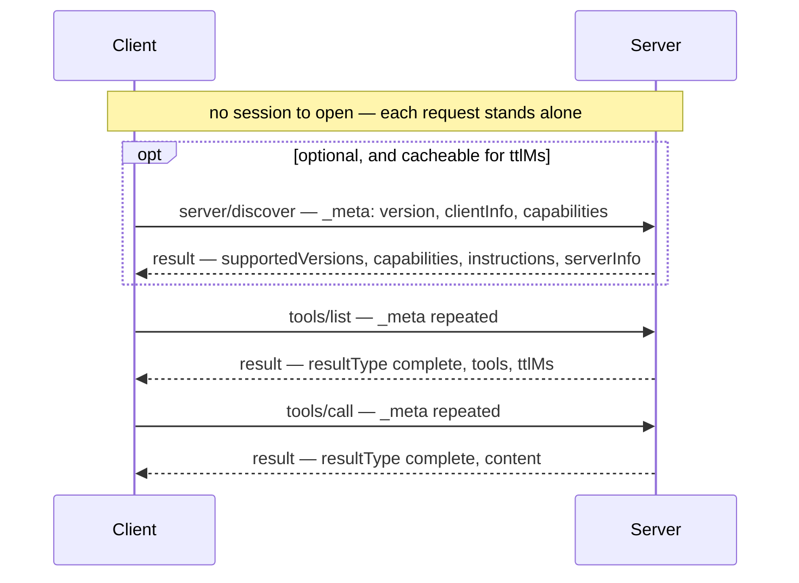
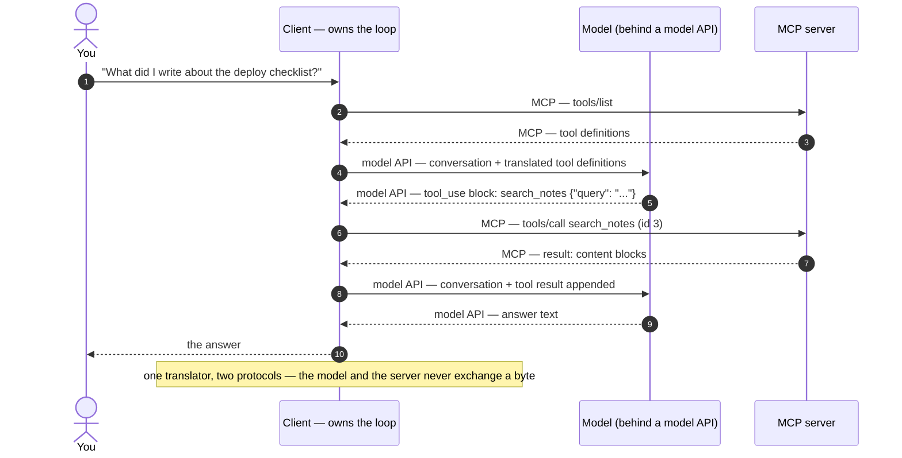
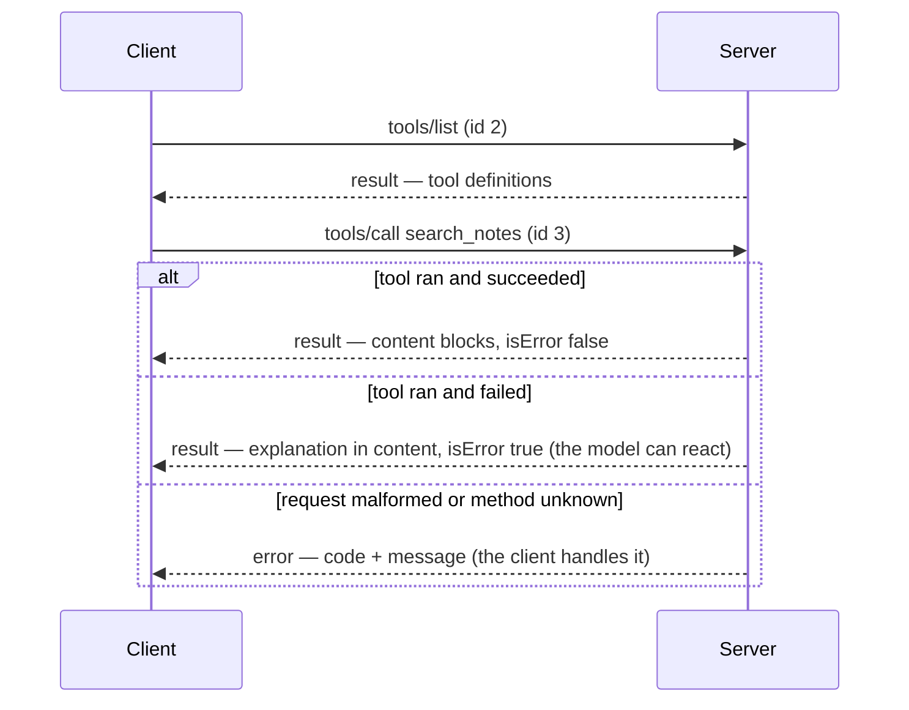
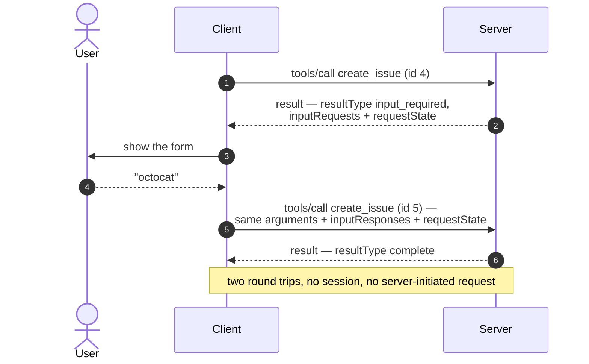

# The wire protocol

[Transports](transports.md) explained how bytes move between an MCP client and server. This chapter is about what those bytes say.

By the end you will be able to read a complete MCP exchange line by line. How a connection opens. Tool discovery. A tool call. Both kinds of failure. And what happens when a server needs something back from the client mid-call.

You will also be able to explain, with no magic left, how a model that only [predicts next tokens](../part1-fundamentals/what-llms-do.md) ends up running a function on your machine.

Nothing here needs an SDK. Every message is plain JSON you could type by hand — and in [Try it](#try-it), you will.

## JSON-RPC in five minutes

MCP messages use **JSON-RPC 2.0**, a deliberately small format for remote procedure calls. One JSON object per message, no required HTTP, and exactly three message shapes.

A **request** carries a `method` name, optional `params`, and an `id`. It obliges the receiver to send back exactly one reply with the same `id`.

A **response** is that reply. It has the matching `id`, plus either a `result` or an `error` object. Never both.

A **notification** is a method call with no `id`. Fire and forget, and the receiver must not reply.

```json
{"jsonrpc": "2.0", "id": 7, "method": "tools/list"}
{"jsonrpc": "2.0", "id": 7, "result": {"resultType": "complete", "tools": []}}
{"jsonrpc": "2.0", "method": "notifications/tools/list_changed"}
```

The `id` also does the matching. Replies may arrive out of order over a shared connection, and the `id` links each one back to its question.

That is the whole grammar. Everything else in MCP is a vocabulary of method names — `server/discover`, `tools/list`, `tools/call` — spoken in these three shapes.

## Every request introduces itself

!!! warning "Evolving — verified 2026-08-20"
    The current MCP revision is `"2026-07-28"`, and that is the `protocolVersion` string in every example below. It removed the opening handshake and made the protocol stateless. The previous revision, `2025-11-25`, is final and still widely deployed, and it appears in the compatibility block at the end of this section. This changes quickly; check [modelcontextprotocol.io/specification/versioning](https://modelcontextprotocol.io/specification/versioning) for current values.

There is no handshake.

A client does not open a session, negotiate, and then start working. It simply sends the request it wants. Every request carries its own introduction in a reserved `_meta` object.

```json
{
  "jsonrpc": "2.0",
  "id": 1,
  "method": "tools/list",
  "params": {
    "_meta": {
      "io.modelcontextprotocol/protocolVersion": "2026-07-28",
      "io.modelcontextprotocol/clientInfo": {"name": "example-client", "version": "1.0.0"},
      "io.modelcontextprotocol/clientCapabilities": {}
    }
  }
}
```

Three keys, namespaced in reverse-DNS style so extensions can add their own without colliding.

`protocolVersion` names the spec revision this request speaks. MCP revisions are dates, marking the last backwards-incompatible change.

`clientInfo` identifies the caller, for logs and display.

`clientCapabilities` declares which optional protocol features this client supports, so the server never has to guess.

Every reply carries a matching self-description, plus a required `resultType` that is new in this revision:

```json
{
  "jsonrpc": "2.0",
  "id": 1,
  "result": {
    "resultType": "complete",
    "tools": [],
    "ttlMs": 300000,
    "cacheScope": "public",
    "_meta": {
      "io.modelcontextprotocol/serverInfo": {"name": "example-server", "version": "0.3.0"}
    }
  }
}
```

`resultType` is `"complete"` for an ordinary finished result.

There is one other value, `"input_required"`. That is how a server pauses mid-call to ask the client for something, using the [multi round-trip pattern](#when-the-server-needs-something-back) below.

If a client reads a result from an older server that omits the field, it must treat it as `"complete"`.

What if the server cannot speak the requested revision? It rejects that request with an `UnsupportedProtocolVersionError`, listing what it does support. The client may then retry with a version they share.

Note where that rejection lands. On the request, not on a session. There is no session to fail.

### Why statelessness was worth a breaking change

Self-describing requests cost a few dozen extra bytes each. In return they buy three things a session-based protocol cannot offer.

- **Any replica can serve any request.** With no session pinning a client to one process, a server scales behind an ordinary round-robin load balancer. No sticky routing, no shared session store. This was the motivating problem: remote MCP servers were hard to operate precisely because sessions made every request stateful.
- **Restarts stop being outages.** A server that restarts between two requests has lost nothing, because it was holding nothing.
- **List results become cacheable.** `tools/list` results may no longer vary per connection. So a client can cache them, using the `ttlMs` and `cacheScope` hints the server returns. Servers are also asked to return tools in a consistent order. That matters more than it sounds: tool definitions sit in the model's context on every call, and a stable serialization is what makes them eligible for the [prompt caching](../part4-agents/cost-efficiency.md) discount.

The cost is that a server needing state across calls must now make that state explicit. A creation tool returns a handle, and later calls take that handle as an ordinary argument.

The protocol has no opinion about it. From the wire's point of view, a handle is just a string in a result and a string in the next call's arguments.

### Discovery: server/discover

No handshake announces what a server can do. So the protocol adds one RPC that every server **must** implement.

```json
{
  "jsonrpc": "2.0",
  "id": "discover-1",
  "method": "server/discover",
  "params": {
    "_meta": {
      "io.modelcontextprotocol/protocolVersion": "2026-07-28",
      "io.modelcontextprotocol/clientInfo": {"name": "example-client", "version": "1.0.0"},
      "io.modelcontextprotocol/clientCapabilities": {}
    }
  }
}
```

```json
{
  "jsonrpc": "2.0",
  "id": "discover-1",
  "result": {
    "resultType": "complete",
    "supportedVersions": ["2026-07-28"],
    "capabilities": {"tools": {}, "resources": {}},
    "instructions": "This server provides code search over the current repository.",
    "ttlMs": 3600000,
    "cacheScope": "public",
    "_meta": {
      "io.modelcontextprotocol/serverInfo": {"name": "example-server", "version": "0.3.0"}
    }
  }
}
```

Calling it is *optional* for clients. That is the part worth noticing.

A client may fire `tools/call` as its very first message, and handle a version error if one comes back.

`server/discover` exists for two conveniences. It presents a server's identity and capabilities in one request, instead of probing with three separate list calls. And it acts as the compatibility probe described next.

One field earns special attention. `instructions` is free text that the client may put in the model's context.

It is the server's chance to say how it wants to be used. And it deserves the same scrutiny as any tool description — [Safety and judgment](../part4-agents/safety.md) treats server-authored text as untrusted input.


```mermaid
sequenceDiagram
    participant C as Client
    participant S as Server
    Note over C,S: no session to open — each request stands alone
    opt optional, and cacheable for ttlMs
        C->>S: server/discover — _meta: version, clientInfo, capabilities
        S-->>C: result — supportedVersions, capabilities, instructions, serverInfo
    end
    C->>S: tools/list — _meta repeated
    S-->>C: result — resultType complete, tools, ttlMs
    C->>S: tools/call — _meta repeated
    S-->>C: result — resultType complete, content
```

??? info "Going deeper — the handshake, and talking to servers that still expect one"

    Revisions up to and including `2025-11-25` opened every session with a three-message handshake.

    Plenty of deployed servers and clients still speak it. So you will meet it in logs, in tutorials written before mid-2026, and in any SDK pinned to a 1.x line.

    The client opened with an `initialize` request:

    ```json
    {
      "jsonrpc": "2.0",
      "id": 1,
      "method": "initialize",
      "params": {
        "protocolVersion": "2025-11-25",
        "capabilities": {"roots": {"listChanged": true}},
        "clientInfo": {"name": "example-client", "version": "1.0.0"}
      }
    }
    ```

    The server answered with its own half: `protocolVersion`, `capabilities`, `serverInfo`.

    Then the client closed the exchange with a notification carrying no `id` and expecting no reply:

    ```json
    {"jsonrpc": "2.0", "method": "notifications/initialized"}
    ```

    Only then could tool traffic begin.

    The version appeared in both directions because it was a *negotiation*. Each side might support several revisions, but a session ran on exactly one.

    Compare the two designs and the trade-off is clear. The handshake negotiated once, and spread that cost over a long-lived session. But it made every connection stateful, which is what made remote servers hard to scale. Per-request `_meta` re-sends the same facts on every call, and buys back statelessness.

    **Bridging the two.** On Streamable HTTP, a client can tell them apart by status code.

    On [stdio](transports.md) there are no status codes. So a client supporting both **should** send `server/discover` first. A modern server answers it. A handshake-era server returns a "method not found" error, at which point the client falls back to `initialize`.

    That is the sanctioned probe. It is also why `server/discover` is mandatory for servers, even though calling it is optional for clients.

## Discovery: tools/list

The client asks what the server offers.

From here on, the examples leave out the `_meta` block for readability. It still rides on every one of these requests.

```json
{"jsonrpc": "2.0", "id": 2, "method": "tools/list"}
```

```json
{
  "jsonrpc": "2.0",
  "id": 2,
  "result": {
    "resultType": "complete",
    "tools": [{
      "name": "search_notes",
      "title": "Search project notes",
      "description": "Full-text search over saved project notes. Use when the user asks what was previously written about a topic.",
      "inputSchema": {
        "type": "object",
        "properties": {
          "query": {"type": "string", "description": "Words to search for"}
        },
        "required": ["query"]
      }
    }],
    "ttlMs": 300000,
    "cacheScope": "public"
  }
}
```

Each [tool](primitives.md) has four parts. A `name`, the callable identifier. An optional `title`, a human-readable label for client UIs. A `description` in plain prose. And an `inputSchema`, JSON Schema for the arguments.

Now the load-bearing sentence of this chapter. *This response is the only knowledge of your API the model will ever have.*

No source code reaches the model. No docs site, no README. Only these strings, placed into its [context window](../part1-fundamentals/context-windows.md).

Writing them is model-facing UX, and [Tool calling in depth](../part4-agents/tool-calling.md) is devoted to that craft.

Two fields serve the client rather than the model.

`ttlMs` is a freshness hint in milliseconds: how long this list may be cached before re-fetching. `cacheScope` says who may cache it — `"public"` allows a shared intermediary, `"private"` allows only this client.

Both are required on list results in this revision. That is what makes the stateless design practical. Without caching, dropping sessions would mean re-listing constantly.

??? info "Going deeper — why `title` and `description` are not the same field"

    It is tempting to treat `title` as decoration. It is not. The two fields have different *audiences*, which is the recurring theme of this chapter.

    `description` is written for the model. It competes for attention against every other tool's description in the context window. Its job is to make the right tool the probable continuation, so it says when to use the tool and when not to.

    `title` is written for a person, in a permission dialog or a tool picker. Its job is to let someone approving a call recognize instantly what they are approving.

    "Search project notes" is a good title and a poor description. The description above is a good description and an unreadable title.

    Collapse them into one string and you have to choose which audience to fail. Servers that predate `title` usually fail the human one, which is why approval dialogs so often show a cryptic snake_case identifier.

## How a model ends up calling a tool

Now the step most explanations skip.

The model never connects to your server. Two protocols are in play, and the client translates between them.

1. The client collects tool definitions from each configured server with `tools/list`. That conversation is MCP.
2. It translates them into the tool format of the **model API** it talks to. That is the provider-specific interface through which a conversation goes to the model and sampled output comes back. Anthropic's and OpenAI's differ from each other, and neither is MCP.
3. It sends the user's message plus the translated definitions to the model.
4. The model emits a structured `tool_use` block naming a tool and arguments. Those are [sampled next tokens](../part1-fundamentals/what-llms-do.md), constrained into a schema. When someone says the model ["knows"](../part1-fundamentals/what-llms-do.md) to call the search tool, this is what that means: the description text made that continuation the probable one.
5. The client maps the block back into a `tools/call` request, sent to the server that declared the tool. That is MCP again. It appends the result to the conversation, and the model continues from there.


```mermaid
sequenceDiagram
    autonumber
    actor U as You
    participant C as Client — owns the loop
    participant M as Model (behind a model API)
    participant S as MCP server
    U->>C: "What did I write about the deploy checklist?"
    C->>S: MCP — tools/list
    S-->>C: MCP — tool definitions
    C->>M: model API — conversation + translated tool definitions
    M-->>C: model API — tool_use block: search_notes {"query": "..."}
    C->>S: MCP — tools/call search_notes (id 3)
    S-->>C: MCP — result: content blocks
    C->>M: model API — conversation + tool result appended
    M-->>C: model API — answer text
    C-->>U: the answer
    Note over C: one translator, two protocols — the model and the server never exchange a byte
```

Notice what this buys you.

The server needs no model credentials. The model never touches your machine. And the client — which pays for every [token](../part1-fundamentals/tokens.md) on every hop — owns the whole loop. That is the subject of [The agent loop](../part4-agents/agent-loop.md).

## Invocation: tools/call

Step 5 on the wire, with its successful reply:

```json
{
  "jsonrpc": "2.0",
  "id": 3,
  "method": "tools/call",
  "params": {
    "name": "search_notes",
    "arguments": {"query": "deploy checklist"}
  }
}
```

```json
{
  "jsonrpc": "2.0",
  "id": 3,
  "result": {
    "resultType": "complete",
    "content": [{"type": "text", "text": "2 notes matched:\n- 2026-05-02 deploy checklist v2 ...\n- ..."}],
    "isError": false
  }
}
```

The `content` array holds typed blocks. Text here, though image, audio, resource-link, and embedded-resource types exist too.

`isError` flags whether the tool itself failed. It matters because MCP splits failure into two channels with different audiences.

- **Protocol errors** use JSON-RPC's `error` object in place of `result`. For example, `{"code": -32601, "message": "Method not found"}` for a method the server does not implement. The audience is the client software. The request itself was broken, so there is usually nothing useful to show the model.
- **Tool errors** are successful responses whose `result` carries `isError: true`, with the explanation in `content`. The audience is the model. The call was well-formed, the tool ran, and it failed. Because the explanation lands in the conversation like any other result, the model can adjust its arguments and retry — provided the text is actionable. "No note store found at ./notes — call `remember_note` first" beats a stack trace.


```mermaid
sequenceDiagram
    participant C as Client
    participant S as Server
    C->>S: tools/list (id 2)
    S-->>C: result — tool definitions
    C->>S: tools/call search_notes (id 3)
    alt tool ran and succeeded
        S-->>C: result — content blocks, isError false
    else tool ran and failed
        S-->>C: result — explanation in content, isError true (the model can react)
    else request malformed or method unknown
        S-->>C: error — code + message (the client handles it)
    end
```

!!! note "Settled"
    The split has been stable across revisions, and the assignment is deliberate.

    Arguments that fail input-schema validation are reported as *tool* errors, with `isError: true`. Not as protocol errors. So the failure reaches the model and can be corrected.

    Only structural failures use the protocol channel: unknown tool, malformed request.

    The rule of thumb: if a differently-worded retry could plausibly fix it, the model should see it.

## When the server needs something back

Everything so far has been strictly request and reply. The client asks, the server answers.

But servers sometimes cannot finish a call alone. A tool may need a credential the user never supplied, or a confirmation before doing something destructive.

Older revisions solved this by letting the server open its own request back to the client mid-session. That required a two-way, stateful connection — exactly what this revision removed.

The replacement is **multi round-trip requests (MRTR)**, and it inverts the flow. Instead of the server calling the client, the server *returns early* with a description of what it needs.

```json
{
  "jsonrpc": "2.0",
  "id": 4,
  "result": {
    "resultType": "input_required",
    "inputRequests": {
      "github_login": {
        "method": "elicitation/create",
        "params": {
          "mode": "form",
          "message": "Please provide your GitHub username",
          "requestedSchema": {
            "type": "object",
            "properties": {"name": {"type": "string"}},
            "required": ["name"]
          }
        }
      }
    },
    "requestState": "eyJsb2NhdGlvbiI6Ik5ldyBZb3JrIn0..."
  }
}
```

This is the other `resultType`. The call did not fail, and it did not finish. It is parked.

`inputRequests` is a keyed map of what the server needs. `requestState` is an opaque blob the server uses to resume, and the client must hand it back untouched.

The client gathers the input — here, by showing the user a form — and then **retries the original request**, carrying the answers plus the state.

```json
{
  "jsonrpc": "2.0",
  "id": 5,
  "method": "tools/call",
  "params": {
    "name": "create_issue",
    "arguments": {"title": "Fix the deploy checklist"},
    "inputResponses": {
      "github_login": {"action": "accept", "content": {"name": "octocat"}}
    },
    "requestState": "eyJsb2NhdGlvbiI6Ik5ldyBZb3JrIn0..."
  }
}
```

Two details are easy to get wrong.

The retry must use a **new** JSON-RPC `id`. It is a new request, not a re-send.

And `action` is part of the answer. A user who declines produces `"action": "decline"`, which the server must handle as a legitimate outcome rather than an error.


```mermaid
sequenceDiagram
    autonumber
    actor U as User
    participant C as Client
    participant S as Server
    C->>S: tools/call create_issue (id 4)
    S-->>C: result — resultType input_required,<br/>inputRequests + requestState
    C->>U: show the form
    U-->>C: "octocat"
    C->>S: tools/call create_issue (id 5) —<br/>same arguments + inputResponses + requestState
    S-->>C: result — resultType complete
    Note over C,S: two round trips, no session, no server-initiated request
```

Notice what this preserves.

The server never opens a connection to the client, so the transport stays one-directional and stateless. But the *user* still gets asked.

That is the whole trick. The interaction is two-way while the protocol is not.

!!! info "One pattern, three former features"
    MRTR is the single replacement for three separate server-initiated requests in earlier revisions.

    `elicitation/create` asked the user something. `roots/list` asked which directories were in scope. `sampling/createMessage` asked the client to run a model call.

    All three now travel as `inputRequests` entries. Two of them — Roots and Sampling — are additionally *deprecated*, which [Tools, resources, and prompts](primitives.md) takes up.

## Bytes on the wire

One level down.

Over [stdio](transports.md), framing is brutally simple. One JSON-RPC message per line, separated by newlines, with no embedded newlines allowed. The client reads your server's stdout line by line and hands each line to a JSON parser.

That makes the classic failure concrete.

Your server prints `Loading index...` to stdout at startup. The client reads it as a frame, and its JSON parse fails.

The visible symptom is "server didn't start", reported nowhere near the print that caused it. That is the mechanical reason for the rule from [Transports](transports.md): stdout belongs to the protocol, and logs go to stderr.

## In practice: Sankshep

Sankshep speaks exactly this dialect. [stdio](transports.md) by default, stdout carrying only JSON-RPC frames, all logging on stderr. That is the previous section's discipline enforced as policy, not luck.

Its error handling picks the channels deliberately. Under ADR-0016, tool paths anchor to the repo root. A path that matches nothing fails loudly as a tool error, with `isError: true`, instead of silently returning an empty result.

So the model sees the miss and can correct the path. That is exactly the retry loop the two-channel design exists for.

And the wire doubles as the test interface. Under ADR-0008, the eval harness launches the real server binary as a subprocess and drives it with the same `tools/list` and `tools/call` JSON-RPC you have been reading, rather than importing internal libraries.

What the benchmarks measure is what an IDE client receives, byte for byte.

## Checkpoints

1. **Name the three JSON-RPC message shapes, and how to tell them apart from fields alone.**

    ??? success "Answer"
        Request, response, and notification.

        A request has a `method` and an `id`. A response has that same `id`, with either `result` or `error`, never both. A notification has a `method` but no `id`, and never receives a reply.

2. **Under the 2026-07-28 revision there is no handshake. So where does a client state which protocol revision it speaks, and what does the server do if it disagrees?**

    ??? success "Answer"
        In `params._meta`, under the key `io.modelcontextprotocol/protocolVersion`, on *every* request. There is no session in which to negotiate once.

        A server that cannot speak the requested revision rejects that individual request with an `UnsupportedProtocolVersionError`, listing what it does support. The client may retry with a version they share.

        The failure is scoped to a request, not a connection.

3. **How many protocols are involved when an IDE agent invokes an MCP tool, and which software translates between them?**

    ??? success "Answer"
        Two. MCP between client and server, and the provider-specific model API between client and model.

        The client translates in both directions: `tools/list` definitions into the model API's tool format, and the model's `tool_use` block back into a `tools/call` request.

4. **One tool call fails because the notes database is missing. A separate request names a method the server never implemented. Which wire shape does each produce, and for which audience?**

    ??? success "Answer"
        The missing database is a tool error. A normal `result` with `isError: true` and a plain-language explanation in `content`, aimed at the model, which can adjust and retry.

        The unknown method is a protocol error. A JSON-RPC `error` object with code `-32601`, aimed at the client software. The request itself was broken, so there is nothing for the model to react to.

5. **A tool needs the user's API key before it can run. The protocol is stateless, and servers cannot open requests to clients. So how does the server ask, and what must the client send back?**

    ??? success "Answer"
        The server returns early with `resultType: "input_required"`, an `inputRequests` map describing what it needs, and an opaque `requestState` blob.

        The client collects the input from the user and **retries the original request**, with the same method and arguments. It adds `inputResponses` keyed to match, plus the `requestState` handed back untouched, and it uses a *new* JSON-RPC `id`.

        The interaction is two-way. The protocol never is.

6. **Your stdio server prints "ready" to stdout when it starts. Trace what happens next, and give the fix.**

    ??? success "Answer"
        Stdio framing is one JSON message per line. So the client reads `ready` as a frame, and its JSON parse fails.

        The symptom is a server that "won't start", reported nowhere near the print that caused it.

        The fix: stdout carries only JSON-RPC, and logs go to stderr.

## Try it

Be the client for one session, by hand, against any stdio MCP server. Use the reference filesystem server from [Connecting servers to IDEs](ide-integration.md), or the one you will write in [Build your own MCP server](../part6-reference/build-your-own.md).

1. Launch the server directly in a terminal. It sits silently waiting on stdin, which is correct behavior, as [Transports](transports.md) showed.
2. Send the compatibility probe first. Paste this as one line and press Enter. The `protocolVersion` string was verified current on 2026-08-20.

    ```json
    {"jsonrpc":"2.0","id":1,"method":"server/discover","params":{"_meta":{"io.modelcontextprotocol/protocolVersion":"2026-07-28","io.modelcontextprotocol/clientInfo":{"name":"hand-typed","version":"0.0.1"},"io.modelcontextprotocol/clientCapabilities":{}}}}
    ```

    **You learn something either way.** A result listing `supportedVersions` means you are talking to a 2026-07-28-era server, so carry on to step 3.

    A `-32601` "method not found" error means this server predates the revision. You have just run the stdio fallback probe by hand. Continue with the legacy handshake instead:

    ```json
    {"jsonrpc":"2.0","id":1,"method":"initialize","params":{"protocolVersion":"2025-11-25","capabilities":{},"clientInfo":{"name":"hand-typed","version":"0.0.1"}}}
    {"jsonrpc":"2.0","method":"notifications/initialized"}
    ```

3. Ask for the tool list:

    ```json
    {"jsonrpc":"2.0","id":2,"method":"tools/list","params":{"_meta":{"io.modelcontextprotocol/protocolVersion":"2026-07-28","io.modelcontextprotocol/clientInfo":{"name":"hand-typed","version":"0.0.1"},"io.modelcontextprotocol/clientCapabilities":{}}}}
    ```

    Read the reply slowly. Every `description` string in it is everything any model will ever be told about this server.

    Note the `ttlMs` and `cacheScope` fields, if present. You are looking at the caching hints that replace what a session used to provide.

4. Compose your own `tools/call` line for one listed tool, following the shape above.

    Then misspell the tool name on purpose, and watch *which failure channel answers*. You get a JSON-RPC `error` object, not an `isError` result, because an unknown tool is a structural failure with nothing for a model to correct.

5. Send `tools/list` a second time, unchanged.

    It works — and that is the point of the whole revision. You never opened a session, so there is nothing to keep alive, and nothing to lose if the server restarts between your two requests.

    Try exactly that. Restart the server, then send `tools/list` again.

If a paste produces silence or an error, check three things. The JSON must be on one line. Requests must carry an `id`. And the version string must be one the server supports.

You have now performed by hand every wire-level step a client automates.
