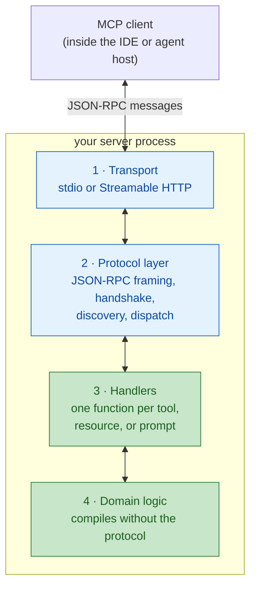
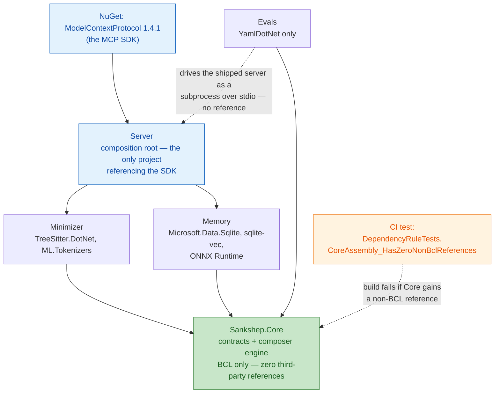

# Writing an MCP server

[The wire protocol](wire-protocol.md) spelled out the messages an MCP server must answer, one JSON line at a time. This chapter is about the software that answers them. By the end you will be able to:

- name the four layers every MCP server shares and identify the two you actually write,
- explain why a tool's description is user-interface text aimed at a model,
- structure a server so that protocol churn can never reach your domain logic.

## The anatomy every server shares

Strip away the language and the framework, and every MCP server — a 100-line notes demo or a production code-context engine — is the same four layers:

1. **Transport.** Moves bytes between client and server: stdio frames or Streamable HTTP, exactly as covered in [Transports](transports.md).
2. **Protocol layer.** Speaks JSON-RPC: parses frames, runs the `initialize` handshake, answers `tools/list`, validates incoming calls, and dispatches each request to the right piece of your code. This is the machinery [the wire protocol chapter](wire-protocol.md) walked through — and in practice you never write it, because the SDK ships it.
3. **Handlers.** A **handler** is the function the protocol layer invokes when a specific request arrives — one per tool, resource, or prompt. It translates a protocol-shaped request into a call on your domain code, then translates the result back into [content blocks](primitives.md).
4. **Domain logic.** The capability itself: the search index, the database, the parser, the API wrapper. It has no idea MCP exists.



Blue layers come from the SDK; green layers are yours. That split is the entire value proposition of the official SDKs ([Why MCP](why-mcp.md) lists the language tiers): layers 1 and 2 are identical across every server on earth, so writing an MCP server mostly means writing handlers and the domain logic behind them.

## Registering a tool

Here is what the handler layer looks like in practice — a single tool, in C#-flavored code:

```csharp
// One tool: a described function the SDK exposes over MCP.
[McpServerTool(Name = "search_notes")]
[Description("Full-text search over saved notes. Use when the user " +
    "asks what was previously decided or recorded. Returns matching " +
    "notes as plain text; an empty result means nothing matched.")]
public static string SearchNotes(
    [Description("Substring to look for, e.g. 'deploy checklist'.")]
    string query)
{
    // The handler body is one line: hand off to domain logic.
    return NoteStore.Search(query);
}
```

*Illustrative — simplified, not Sankshep source. SDK APIs drift between versions; treat this as the shape of the idea, not paste-ready code.*

Three things are worth noticing, because they hold in every SDK:

- **The metadata travels verbatim.** The name and description strings are what the client ships back in the `tools/list` response. You are not writing comments; you are writing the API documentation the model receives.
- **The schema is declared, not hand-written.** Most SDKs derive the JSON Schema for the tool's input from the handler's signature and parameter annotations, so the types you declare become the contract the client validates against.
- **The handler is thin.** One line in, one line out. Everything interesting happens in `NoteStore`, which imports nothing protocol-related.

## Tool descriptions are model-facing UX

That first observation deserves its own rule, because it is the least obvious part of server-writing: **a tool description is user-interface text whose user is a model.**

Mechanically: [the wire protocol chapter](wire-protocol.md) established that the `tools/list` response is the only knowledge of your API the model will ever have. The client folds those names, descriptions, and schemas into the model's [context window](../part1-fundamentals/context-windows.md), and tool selection is next-token prediction over that text. Everything the model ["knows"](../part1-fundamentals/what-llms-do.md#the-anthropomorphism-contract) about your server is the strings you wrote in the registration above. A vague description does not produce an error — it produces a model that emits calls to the wrong tool, or none at all, and you get to debug that by rereading your own prose.

So budget writing time accordingly: the description paragraph often matters more than the handler body. The craft — verb-first phrasing, when-to-use *and* when-not-to-use, argument semantics, how many tools is too many — gets a full treatment in [Tool calling in depth](../part4-agents/tool-calling.md). For now, the rule is enough: when you edit a description, you are editing the model's behavior.

## Structure that survives growth

The anatomy diagram showed a clean stack. The common failure mode is letting it smear: protocol types leak inward until the search index takes an SDK request object as a parameter and the database layer returns SDK content blocks. Everything still works — until the SDK changes, and now a package update touches every file in the repository.

The defense is a **dependency fence**: a hard rule about which projects may reference which packages, so that third-party churn is confined to the edge of your codebase. For an MCP server the fence has one load-bearing clause: *the SDK is referenced by exactly one project — the outermost one — and the domain logic compiles without it.*

What the fence buys, concretely:

- **Upgrades are local.** A breaking SDK release is a one-project migration, not a codebase-wide one.
- **The domain is testable without a client.** You can unit-test search, storage, and parsing as plain functions — no handshake, no subprocess, no JSON.
- **The domain is reusable.** The same logic can back a CLI, a library, or a different protocol tomorrow, because nothing in it mentions MCP.

A fence that lives in a wiki page erodes; the durable version is a fence that lives in a test — an automated check that fails the build the moment a forbidden reference appears. A production example follows in a moment; the full design rationale is in the capstone [dependency fence case study](../part5-capstone/case-dependency-fence.md).

Is the churn threat real? Look at the official C# SDK's release feed:

!!! warning "Evolving — verified 2026-07-18"
    The official C# SDK ships on NuGet as `ModelContextProtocol` (with `ModelContextProtocol.Core` and `ModelContextProtocol.AspNetCore` variants), maintained in the MCP organization together with Microsoft. The SDK is GA: the stable release is 1.4.1 (published 2026-07-09) — and a 2.0.0-preview.3 is already on the feed. This changes quickly; check the [NuGet package page](https://www.nuget.org/packages/ModelContextProtocol) for current values.

Read that admonition as an argument, not just a version report: a stable 1.4.1 and a 2.0 preview exist *at the same time*. The major-version migration is not hypothetical — it is already published. Whether it costs an afternoon or a quarter depends on which side of a fence your SDK reference lives.

## In practice: Sankshep

Sankshep's solution shape is this chapter's structure, enforced. ADR-0004 confines the MCP SDK to the `Server` project; everything below it compiles without the protocol.



The shape maps onto the anatomy directly. `Server` is layers 1–3: transport, SDK protocol layer, and the handlers behind Sankshep's eight tools, one prompt, and one resource ([Primitives](primitives.md) toured that surface). The subsystem projects — Minimizer, Memory — are layer 4, and `Sankshep.Core` at the bottom holds the shared contracts with *zero* non-BCL references: not the SDK, not even tree-sitter or SQLite.

Two details are worth stealing for any server you build:

- **The fence is a failing test, not a convention.** The CI test named in the diagram inspects the compiled `Core` assembly's references and fails the build if anything beyond the .NET base class library appears. Nobody has to remember the rule; the build remembers it.
- **The evals sit outside the fence on purpose.** The `Evals` project never references `Server` — it launches the shipped binary as a subprocess and speaks stdio JSON-RPC to it, per ADR-0008. The wire protocol you learned two chapters ago doubles as the test interface, and the tests exercise exactly what a real client would.

When SDK 2.0 lands, Sankshep's migration is one project — which is the whole point.

## Checkpoints

1. Name the four layers of the universal server anatomy, and say which two you write when you use an official SDK.

    ??? success "Answer"
        Transport, protocol layer, handlers, domain logic. The SDK provides the transport and the protocol layer (framing, handshake, discovery, dispatch); you write the handlers and the domain logic behind them.

2. What is the mechanical reason that editing a tool's description string changes a model's behavior?

    ??? success "Answer"
        The description travels verbatim in the `tools/list` response, the client folds it into the model's context, and tool selection is next-token prediction over that text. There is no other channel: the description is the model's entire evidence about what the tool does, so changing the text changes which continuations — which tool calls — are probable.

3. Your domain logic no longer compiles without the MCP SDK package. What has gone wrong, and what does it cost you later?

    ??? success "Answer"
        Protocol types have leaked past the handler layer into the domain — the fence is breached. The costs arrive later: any breaking SDK release becomes a codebase-wide migration instead of a one-project one, the domain can no longer be unit-tested as plain functions, and it cannot be reused behind a CLI or another protocol without dragging the SDK along.

4. Why is a dependency fence enforced by a CI test more durable than one written in an architecture document?

    ??? success "Answer"
        A documented rule relies on every future contributor reading, remembering, and honoring it — it erodes one convenient shortcut at a time. A test that inspects the compiled assembly's references fails the build the instant the rule is broken, so the fence is checked on every commit by a machine that never forgets. Sankshep's `DependencyRuleTests.CoreAssembly_HasZeroNonBclReferences` is exactly this.

## Try it

Design a server on paper — no code, that is [Part 6's job](../part6-reference/build-your-own.md). Pick a workflow you actually repeat (searching your bookmarks, checking a deploy pipeline, querying a work log) and produce a one-page design:

1. **List 3–5 capabilities.** Run each through the who-invokes rule from [Primitives](primitives.md): model-invoked → tool, application-read → resource, user-picked → prompt.
2. **For each tool, write the registration metadata** — the part this chapter says matters most:
    - a `verb_noun` name,
    - a description paragraph that says what it does, when to use it, and when *not* to,
    - a JSON Schema sketch of the input, with a one-line description per property,
    - one sentence describing what the result content looks like (including what an empty result means).
3. **Draw your fence.** For each tool, write the one-line domain function signature its handler would call. Check the signatures: if any of them mentions a protocol type, redraw.

Keep the page. When you reach [Build your own MCP server](../part6-reference/build-your-own.md), you will implement a design exactly like it — and the description paragraphs you just drafted will be tested by a real model.
