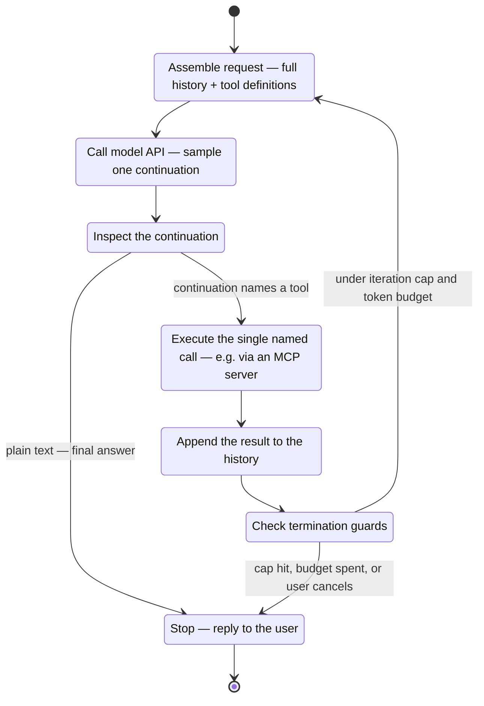
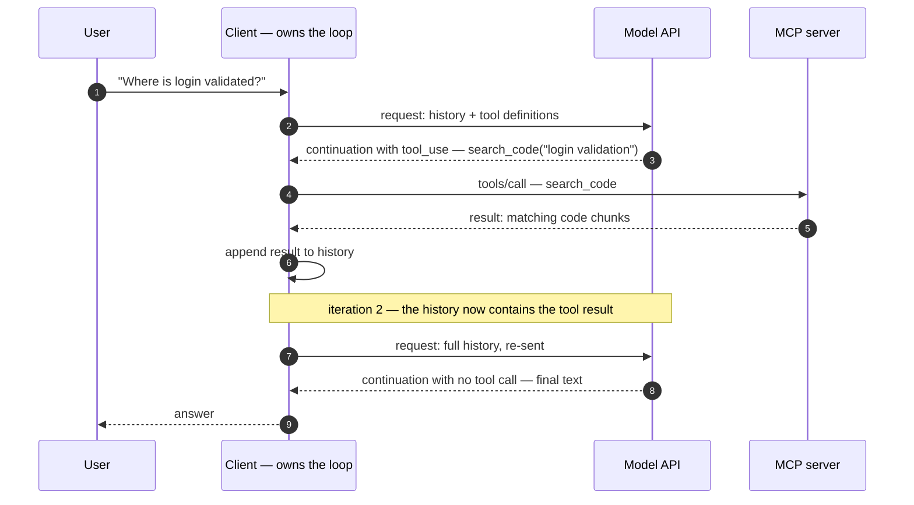

# The agent loop

Part 3 ended with three programs able to exchange exactly one tool call: a client, a model API, and an [MCP server](../part3-mcp/writing-a-server.md). This chapter adds the ingredient that turns that plumbing into behavior — a loop. By the end you will be able to:

- define "agent" operationally, without mental-state verbs;
- trace one full iteration across the client, the model API, and an MCP server;
- say which piece of software owns the loop, and why neither the model nor the server can;
- recognize the three standard ways loops fail, and the guard that catches each.

## What makes an LLM an agent

An **agent** is an LLM run inside a loop with three additions: tools it can request, state carried between iterations, and a stop condition. Remove any one of the three and you are back to a chat window.

Each addition is ordinary software, not model magic:

- Tools are the capabilities from [Part 3's primitives](../part3-mcp/primitives.md): described to the model as text, executed by other programs. The model never runs them — it only emits [tokens](../part1-fundamentals/tokens.md) that name them.
- **State** is the conversation history: every user message, model reply, tool call, and tool result so far. The model itself carries nothing between API calls — [only weights and context](../part1-fundamentals/what-llms-do.md#only-weights-and-context) — so the history *is* the agent's working state. Anything that must outlive the session needs [persistent memory](../part2-context/persistent-memory.md) instead.
- A **stop condition** is the rule that ends the loop. There are exactly two kinds: the natural exit, where the sampled continuation contains no tool call and is treated as the final answer, and the forced exits — an iteration cap, a token budget, or the user cancelling.

One phrase needs defusing before it does damage. When this site says an agent "decides" to search the code, the [anthropomorphism contract](../part1-fundamentals/what-llms-do.md#the-anthropomorphism-contract) fixes the meaning: sampling produced a continuation naming `search_code`, and the client executed it. A decision is a probable continuation plus machinery that honors it. Everything in this chapter is that machinery.

## The loop as a state machine

Here is the whole mechanism, with its termination guards drawn in:

Two details deserve emphasis. First, the diagram has no state named "think" or "plan": every lap is the same [autoregressive generation](../part1-fundamentals/what-llms-do.md#the-autoregressive-loop) from Part 1, pointed at a history that now contains tool results. Second, the guards are not optional polish. Nothing in the model's mechanism guarantees the natural exit is ever reached, so a loop without forced exits is a loop that can run until something external — money, patience, a rate limit — stops it for you.

## One iteration, end to end

The state machine above lives in one program. Here is a single pass through it, plus the closing lap, with every network boundary visible:

Steps 2–6 are one iteration: assemble, sample, execute, append. Steps 7–8 are the natural exit — the continuation contains no tool call, so the loop ends.

Notice that two different protocols appear in this picture. Steps 2, 3, 7, and 8 speak the model vendor's API; steps 4 and 5 speak MCP. The client translates between them, exactly as [the wire protocol](../part3-mcp/wire-protocol.md) chapter laid out. The model and the server never talk to each other directly — every arrow touching one of them has the client on its other end.

## Who owns the loop

The client. Not the model, not the server — and both exclusions are mechanical, not conventions someone could revisit:

- **The model cannot loop.** It maps a token sequence to a distribution and stops. It has no way to execute a call, wait for a result, or issue its own next request — there is no third channel beyond weights and context. What it contributes is *intentions*: structured continuations naming a tool and arguments.
- **The server cannot loop either.** It answers one `tools/call` at a time. It never sees the conversation, is never told what iteration this is, and has no connection to any model. From the server's seat, an eight-iteration agent session is just eight unrelated requests.
- **The client sees both sides**, so the loop logic — assemble the request, parse the continuation, execute the call, append the result, check the guards — can only live there.

This division is the three-layer frame from [the running example](../part0-orientation/running-example.md), now load-bearing. It also assigns responsibility: if an agent runs away, the bug — and the bill — belongs to the client layer. Later chapters build on this repeatedly: [subagents](agents-subagents.md) are extra loops the client spawns, and [cost and efficiency](cost-efficiency.md) locates model-routing policy in the client for exactly this reason.

## Every lap re-sends the conversation

Model APIs are stateless: each call must include everything the model should condition on. So step 7 in the sequence diagram does not send "the new part" — it re-sends the entire history, tool result included, and every later iteration re-sends all of it again.

The consequences compound. Iteration *N* carries the accumulated tokens of iterations 1 through *N−1*, so input cost grows with every lap even when each new result is small — and the growing history is all spent from one shared [context window](../part1-fundamentals/context-windows.md). This is the single most important fact about agent economics, and [cost and efficiency](cost-efficiency.md) works the numbers in full.

## Three ways loops fail

Each failure mode maps to a specific missing guard or a specific unmanaged input.

**Runaway.** The natural exit never arrives: the sampled continuation keeps naming tools — often the same call with the same arguments — and nothing forces a stop. The guard is the iteration cap, plus client-side detection of repeated identical calls. A cap that ends a loop mid-task feels crude; an uncapped loop that burns a day's budget on one question is worse.

**Bloat.** The loop terminates, but the history has grown so large that answer quality sags long before the window's hard limit — the [lost-in-the-middle effect](../part1-fundamentals/context-windows.md) applied to a conversation that is mostly stale tool results. The guards are curation: compact or drop superseded results, and hand large sub-tasks to [subagents](agents-subagents.md) with fresh windows.

**Result flooding.** A single tool call returns far more than the question needed — a whole file, a thousand search hits — and one lap swamps the window for every lap after it. The guard sits on both sides of the tool boundary: clients truncate oversized results, and well-designed servers return curated results in the first place, which is Part 2's whole argument and a preview of [result design](tool-calling.md). Flooded results are also where untrusted text enters the history, which is [safety's](safety.md) problem to examine.

!!! example "In the wild: Sankshep"
    Sankshep — the MCP server from [the running example](../part0-orientation/running-example.md) — sits at the `S` position in the sequence diagram, and nowhere else. It never loops: each of its 8 tools answers exactly one `tools/call` and returns. It never calls a model: its `compose_task_prompt` output is assembled deterministically, and per ADR-0013 a build-time test enforces that no model client can even enter the composition path. Its contribution to the loop is indirect but real — it attacks bloat and result flooding by returning [minimized](../part2-context/structural-minimization.md), budget-packed context instead of raw files, so each lap adds fewer tokens to the history that every later lap re-sends. The loop itself belongs to whichever client invoked it; a tool that stays out of the loop works identically under all of them.

## Checkpoints

**1. Define an agent in one sentence, and name the three additions that turn a bare LLM into one.**

??? success "Answer"
    An agent is an LLM run inside a loop with tools it can request, state carried between iterations, and a stop condition. Drop the tools and it is a chat; drop the state and no iteration builds on the last; drop the stop condition and nothing ends the loop but an external limit.

**2. Which component loops — model, server, or client? Give the mechanical reason the other two cannot.**

??? success "Answer"
    The client. The model only maps token sequences to distributions — it cannot execute a call or issue its own next request. The server only answers single `tools/call` requests — it never sees the conversation and has no link to any model. Only the client touches both sides, so assemble-sample-execute-append-check can live only there.

**3. Translate "the agent decided it was finished" into mechanical terms. What is the other way a loop can end?**

??? success "Answer"
    Sampling produced a continuation containing no tool call, and the client treated that plain-text continuation as the final answer — the natural exit. The other endings are forced: an iteration cap, a token budget, or the user cancelling.

**4. Each tool result in a session is roughly the same size, yet iteration 6 costs far more than iteration 1. Why?**

??? success "Answer"
    Model APIs are stateless, so every iteration re-sends the entire history. Iteration 6's input includes the prompt plus all five earlier continuations and tool results; the per-lap addition may be constant, but the re-sent base grows every lap.

**5. Match each failure mode — runaway, bloat, result flooding — to the guard that addresses it.**

??? success "Answer"
    Runaway → an iteration cap plus detection of repeated identical calls, because the natural exit may never arrive. Bloat → history curation and handing sub-tasks to subagents with fresh windows, because stale results degrade quality before the window fills. Result flooding → client-side truncation and, better, servers that return curated results in the first place, because one oversized result taxes every later lap.
