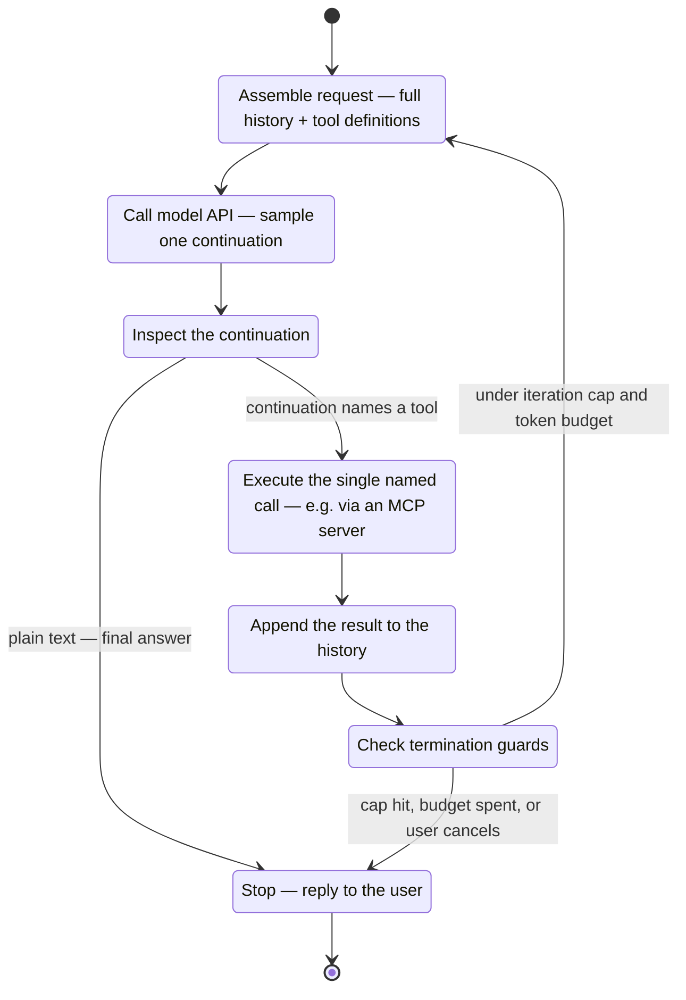
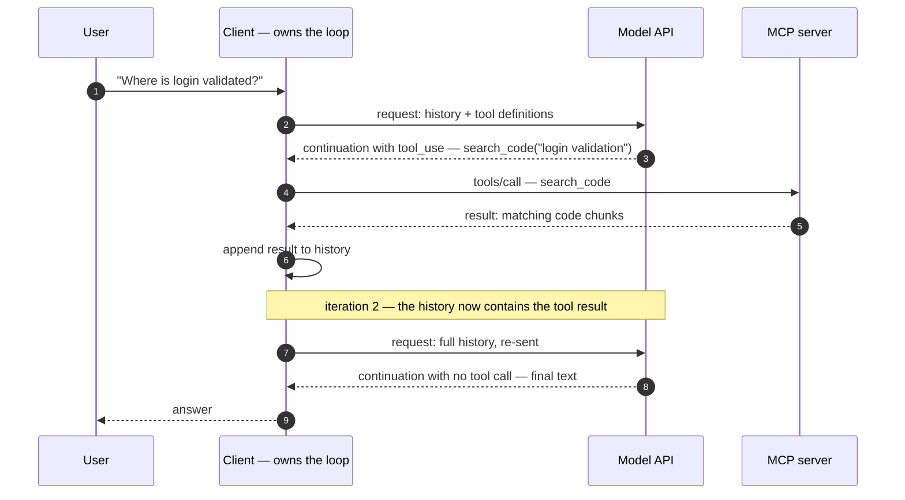
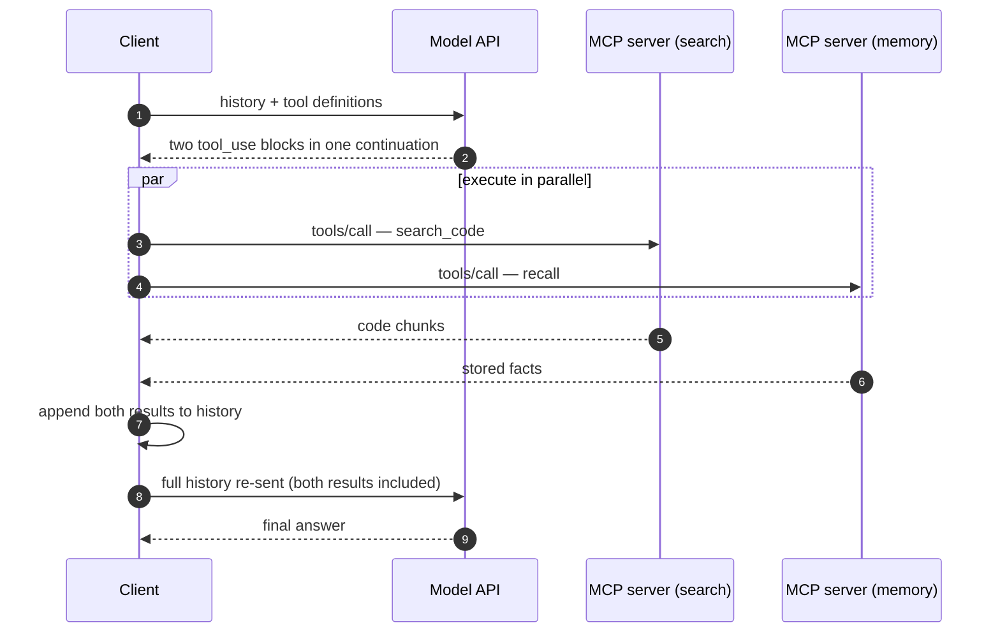

# The agent loop

Part 3 ended with three programs able to exchange exactly one tool call: a client, a model API, and an [MCP server](../part3-mcp/writing-a-server.md).

This chapter adds the ingredient that turns that plumbing into behavior. A loop.

By the end you will be able to:

- define "agent" precisely, without mental-state verbs;
- trace one full round across the client, the model API, and an MCP server;
- say which software owns the loop, and why neither the model nor the server can;
- recognize the three standard ways loops fail, and the guard that catches each;
- explain what streaming changes about the loop, and what it does not.

## What makes an LLM an agent

An **agent** is an LLM run inside a loop, with three additions. Tools it can request. State carried between rounds. And a stop condition.

Remove any one of the three and you are back to a chat window.

Each addition is ordinary software, not model magic.

- **Tools** are the capabilities from [Part 3's primitives](../part3-mcp/primitives.md). They are described to the model as text, and executed by other programs. The model never runs them. It only emits [tokens](../part1-fundamentals/tokens.md) that name them.
- **State** is the conversation history: every user message, model reply, tool call, and tool result so far. The model itself carries nothing between API calls — [only weights and context](../part1-fundamentals/what-llms-do.md#only-weights-and-context) — so the history *is* the agent's working state. Anything that must outlive the session needs [persistent memory](../part2-context/persistent-memory.md) instead.
- A **stop condition** is the rule that ends the loop. There are exactly two kinds. The natural exit, where the sampled continuation contains no tool call and is treated as the final answer. And forced exits: a round cap, a token budget, or the user cancelling.

One phrase needs defusing before it does damage.

When this site says an agent "decides" to search the code, the [anthropomorphism contract](../part1-fundamentals/what-llms-do.md#the-anthropomorphism-contract) fixes the meaning. Sampling produced a continuation naming `search_code`, and the client ran it.

A decision is a probable continuation, plus machinery that acts on it. Everything in this chapter is that machinery.

## The loop as a state machine

Here is the whole mechanism, with its stopping guards drawn in.

```mermaid
stateDiagram-v2
    [*] --> Assemble
    Assemble --> Sample
    Sample --> Inspect
    Inspect --> Execute: continuation names a tool
    Inspect --> Done: plain text — final answer
    Execute --> Append
    Append --> Guards
    Guards --> Assemble: under iteration cap and token budget
    Guards --> Done: cap hit, budget spent, or user cancels
    Done --> [*]

    Assemble: Assemble request — full history + tool definitions
    Sample: Call model API — sample one continuation
    Inspect: Inspect the continuation
    Execute: Execute the single named call — e.g. via an MCP server
    Append: Append the result to the history
    Guards: Check termination guards
    Done: Stop — reply to the user
```

Two details deserve emphasis.

First, the diagram has no state named "think" or "plan". Every lap is the same [autoregressive generation](../part1-fundamentals/what-llms-do.md#the-autoregressive-loop) from Part 1, pointed at a history that now contains tool results.

Second, the guards are not optional polish. Nothing in the model's mechanism guarantees the natural exit is ever reached. So a loop without forced exits is a loop that can run until something external stops it for you — money, patience, or a rate limit.

## One round, end to end

The state machine above lives in one program. Here is a single pass through it, plus the closing lap, with every network boundary visible.

```mermaid
sequenceDiagram
    autonumber
    participant U as User
    participant C as Client — owns the loop
    participant M as Model API
    participant S as MCP server

    U->>C: "Where is login validated?"
    C->>M: request: history + tool definitions
    M-->>C: continuation with tool_use — search_code("login validation")
    C->>S: tools/call — search_code
    S-->>C: result: matching code chunks
    C->>C: append result to history
    Note over C,M: iteration 2 — the history now contains the tool result
    C->>M: request: full history, re-sent
    M-->>C: continuation with no tool call — final text
    C-->>U: answer
```

Steps 2 through 6 are one round: assemble, sample, execute, append.

Steps 7 and 8 are the natural exit. The continuation contains no tool call, so the loop ends.

Notice that two different protocols appear here. Steps 2, 3, 7, and 8 speak the model vendor's API. Steps 4 and 5 speak MCP.

The client translates between them, exactly as [the wire protocol](../part3-mcp/wire-protocol.md) chapter laid out. The model and the server never talk to each other directly. Every arrow touching one of them has the client on its other end.

## Who owns the loop

The client. Not the model, not the server.

Both exclusions are mechanical. They are not conventions somebody could revisit.

- **The model cannot loop.** It maps a token sequence to a distribution and stops. It has no way to run a call, wait for a result, or issue its own next request. There is no third channel beyond weights and context. What it contributes is *intentions*: structured continuations naming a tool and arguments.
- **The server cannot loop either.** It answers one `tools/call` at a time. It never sees the conversation, is never told which round this is, and has no connection to any model. From the server's seat, an eight-round agent session is just eight unrelated requests.
- **The client sees both sides.** So the loop logic — assemble the request, parse the continuation, run the call, append the result, check the guards — can only live there.

This division is the three-layer frame from [the running example](../part0-orientation/running-example.md), now load-bearing.

It also assigns responsibility. If an agent runs away, the bug — and the bill — belongs to the client layer.

Later chapters build on this repeatedly. [Subagents](agents-subagents.md) are extra loops the client spawns. And [cost and efficiency](cost-efficiency.md) puts model-routing policy in the client for exactly this reason.

## Every lap re-sends the conversation

Model APIs are stateless. Each call must include everything the model should condition on.

So step 7 in the sequence diagram does not send "the new part". It re-sends the entire history, tool result included. And every later round re-sends all of it again.

The consequences compound.

Round *N* carries the accumulated tokens of rounds 1 through *N−1*. So input cost grows with every lap, even when each new result is small. And the growing history all comes out of one shared [context window](../part1-fundamentals/context-windows.md).

This is the single most important fact about agent economics. [Cost and efficiency](cost-efficiency.md) works the numbers in full.

## Three ways loops fail

Each failure mode maps to a specific missing guard, or a specific unmanaged input.

**Runaway.** The natural exit never arrives. The sampled continuation keeps naming tools, often the same call with the same arguments, and nothing forces a stop.

The guard is a round cap, plus client-side detection of repeated identical calls. A cap that ends a loop mid-task feels crude. An uncapped loop that burns a day's budget on one question is worse.

**Bloat.** The loop terminates, but the history has grown so large that answer quality sags long before the window's hard limit.

That is the [lost-in-the-middle effect](../part1-fundamentals/context-windows.md), applied to a conversation that is mostly stale tool results. The guards are curation: compact or drop superseded results, and hand large sub-tasks to [subagents](agents-subagents.md) with fresh windows.

**Result flooding.** A single tool call returns far more than the question needed — a whole file, a thousand search hits. One lap then swamps the window for every lap after it.

The guard sits on both sides of the tool boundary. Clients truncate oversized results. And well-designed servers return curated results in the first place, which is Part 2's whole argument and a preview of [result design](tool-calling.md).

Flooded results are also where untrusted text enters the history. That is [safety's](safety.md) problem to examine.

## Parallel tool calls

Some model APIs support **multiple tool calls in a single continuation**. The model names two or more tools in one turn instead of one.

The client runs all of them, collects all results, appends them together, and continues the loop.

This is a performance optimization, not a change to the loop's structure. The guards still apply, and the re-send rule still charges input tokens for the entire history on the next lap.

```mermaid
sequenceDiagram
    autonumber
    participant C as Client
    participant M as Model API
    participant S1 as MCP server (search)
    participant S2 as MCP server (memory)

    C->>M: history + tool definitions
    M-->>C: two tool_use blocks in one continuation
    par execute in parallel
        C->>S1: tools/call — search_code
        C->>S2: tools/call — recall
    end
    S1-->>C: code chunks
    S2-->>C: stored facts
    C->>C: append both results to history
    C->>M: full history re-sent (both results included)
    M-->>C: final answer
```

!!! warning
    Not all model APIs support parallel tool calls. Check the vendor's documentation before relying on fan-out. A client that expects a single call per turn will misparse a multi-call response.

## Streaming, and why the loop does not change

Watch any agent work and text appears word by word.

It is worth being precise about what that does and does not change, because it is a common source of confused mental models.

**Streaming** means the model API returns the continuation bit by bit, as tokens are sampled, rather than holding it back until generation finishes.

It is the [decode phase](../part1-fundamentals/what-llms-do.md) made visible. Prefill processes your whole history in one parallel pass, which is why nothing appears at first. Then tokens arrive one at a time, at a fairly steady rate.

Three things follow, and the third is the one that matters for loop design.

- **It is a latency illusion, and a good one.** Total time to the finished continuation is unchanged. What changes is time to the *first* visible token, which is most of what makes a system feel responsive.
- **It changes nothing about cost.** The same tokens are sampled and billed either way. Streaming is a delivery option, not a pricing one.
- **A tool call cannot be acted on until it is complete.** This is the load-bearing point. A partially streamed `tool_use` block might have a tool name and half its arguments. That is unparseable, and dangerous to guess at. So the client streams text to the user as it arrives, but must buffer any tool call until the block closes before running anything.

That last constraint is why the [state machine](#the-loop-as-a-state-machine) above needs no streaming state.

Streaming affects how the *Sample* step delivers its output. It does not affect what the loop does with it. Inspect still receives one complete continuation.

An agent that appears to "start searching while still talking" has simply finished a tool-call block early in a longer continuation.

One visible consequence is worth naming, because it makes agents feel slower than they are.

Between the last streamed word of one lap and the first streamed word of the next sits an entire tool execution, plus a fresh prefill over a now-longer history.

Those silent gaps, not the typing speed, are where an agent session's wall-clock time actually goes.

!!! example "In the wild: Sankshep"
    Sankshep — the MCP server from [the running example](../part0-orientation/running-example.md) — sits at the `S` position in the sequence diagram, and nowhere else.

    It never loops. Each of its 8 tools answers exactly one `tools/call` and returns.

    It never calls a model. Its `compose_task_prompt` output is assembled deterministically, and per ADR-0013 a build-time test enforces that no model client can even enter the composition path.

    Its contribution to the loop is indirect but real. It attacks bloat and result flooding by returning [minimized](../part2-context/structural-minimization.md), budget-packed context instead of raw files. So each lap adds fewer tokens to the history that every later lap re-sends.

    The loop itself belongs to whichever client invoked it. A tool that stays out of the loop works identically under all of them.

## Checkpoints

**1. Define an agent in one sentence, and name the three additions that turn a bare LLM into one.**

??? success "Answer"
    An agent is an LLM run inside a loop, with tools it can request, state carried between rounds, and a stop condition.

    Drop the tools and it is a chat. Drop the state and no round builds on the last. Drop the stop condition and nothing ends the loop but an external limit.

**2. Which component loops — model, server, or client? Give the mechanical reason the other two cannot.**

??? success "Answer"
    The client.

    The model only maps token sequences to distributions. It cannot run a call or issue its own next request.

    The server only answers single `tools/call` requests. It never sees the conversation, and has no link to any model.

    Only the client touches both sides. So assemble, sample, execute, append, check can live only there.

**3. Translate "the agent decided it was finished" into mechanical terms. What is the other way a loop can end?**

??? success "Answer"
    Sampling produced a continuation containing no tool call, and the client treated that plain-text continuation as the final answer. That is the natural exit.

    The other endings are forced: a round cap, a token budget, or the user cancelling.

**4. Each tool result in a session is roughly the same size, yet round 6 costs far more than round 1. Why?**

??? success "Answer"
    Model APIs are stateless, so every round re-sends the entire history.

    Round 6's input includes the prompt plus all five earlier continuations and tool results. The per-lap addition may be constant, but the re-sent base grows every lap.

**5. Match each failure mode — runaway, bloat, result flooding — to the guard that addresses it.**

??? success "Answer"
    Runaway needs a round cap, plus detection of repeated identical calls, because the natural exit may never arrive.

    Bloat needs history curation, and handing sub-tasks to subagents with fresh windows, because stale results degrade quality before the window fills.

    Result flooding needs client-side truncation and, better, servers that return curated results in the first place, because one oversized result taxes every later lap.

## Try it

Watch a real loop from the outside, then count it. Any agent with a visible tool-call log works: an IDE agent mode, a terminal agent, or your own client.

1. **Ask a question that needs at least two lookups**, so the loop must run more than once. Something like: *"Which file defines our retry policy, and does anything else reference it?"*
2. **Count the rounds.** Each tool call plus its result is one lap. Note how many laps ran before a continuation arrived with no tool call in it. That final one is the natural exit.
3. **Identify the three ingredients** in what you just watched. The tools, which the log shows being called. The state, which is the growing conversation the client re-sends. And the stop condition — which of the two kinds ended it, natural exit or a cap.
4. **Estimate the bill.** If the history was roughly *T* tokens by the end and the loop ran *N* laps, input tokens billed are far closer to *N × T* than to *T*, because every lap re-sends everything.

    Do that multiplication for your own run. Then ask what one flooded tool result — a whole file returned where ten lines were needed — would have cost across all remaining laps.

5. **Provoke a failure mode, safely.** Ask something deliberately unanswerable with the available tools. *"What did the deploy log say last Tuesday?"*, against an agent with no log access.

    Watch whether it retries the same call with near-identical arguments. If it does, you are watching a runaway begin — and whatever stopped it was a guard, not the model's good judgment.

Keep your lap count and token estimate. [Cost and efficiency](cost-efficiency.md) turns exactly those two numbers into a bill.
