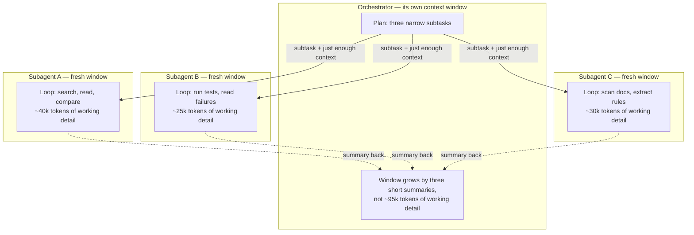
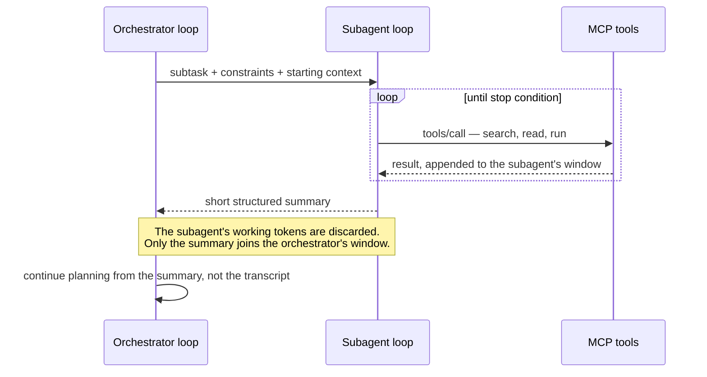

# Agents, subagents, and orchestration

[The agent loop](agent-loop.md) put one model in one loop with one growing conversation. This chapter is about what happens when that single loop stops being enough — and about the discipline of noticing when it is still enough. By the end you will be able to explain why a long-running agent degrades, state precisely what a subagent isolates and what crosses its boundary in each direction, recognize the three common orchestration patterns, and argue against orchestration for the majority of tasks where it costs more than it buys.

## Why one agent degrades

An agent's conversation only grows. Every tool result — each search hit, file read, and test log — is appended to the [context window](../part1-fundamentals/context-windows.md) and then [re-sent on every subsequent call](../part1-fundamentals/context-windows.md#the-window-is-re-sent-on-every-call). Two problems compound as the loop runs:

- **Cost.** Iteration N pays to resend everything from iterations 1 through N−1. [Cost and efficiency](cost-efficiency.md) works this multiplier out in a table; here it is enough to note that it grows with every step.
- **Quality.** Models retrieve information least reliably from the middle of a long context — the [lost in the middle](../part1-fundamentals/context-windows.md#lost-in-the-middle) effect. An agent that read forty files to fix one bug is still carrying thirty-nine of them, mostly irrelevant now, diluting the tokens that matter.

Part 2's refrain — the job is curation, not accumulation — was about building one prompt. It applies just as hard across a whole session: an agent that accumulates every intermediate result is running the naive baseline from [why raw context fails](../part2-context/why-raw-context-fails.md), one iteration at a time.

## What a subagent is

A **subagent** is a fresh agent loop started on behalf of another agent: it receives a narrow task and an empty context window of its own, runs until its stop condition, and returns a short result — not its transcript — to whoever launched it. The launcher is the **orchestrator**: the agent, or plain program, that splits a job into subtasks, starts subagents, and integrates what they send back.

Context isolation is the point. The subagent's forty tool calls, dead ends, and raw file contents live and die in *its* window. Only the distilled result — a summary, a verdict, a list of paths — enters the orchestrator's window. The boundary works in both directions: the subagent does not inherit the orchestrator's conversation history, and the orchestrator never sees the subagent's working detail.

Because the three subagents share nothing, they can run at the same time. That is a second, distinct benefit — parallelism — but it is downstream of the first: isolation is what makes the parallelism safe.

One more piece of demystification, in the spirit of [the agent loop](agent-loop.md): the orchestrator "decides" to spawn a subagent only in the [operational sense](../part1-fundamentals/what-llms-do.md#the-anthropomorphism-contract) — its sampled output named a spawn action, and ordinary client-layer software created the new loop, capped it, and collected its return. Neither model is running the machinery; both are text predictors whose outputs the machinery honors.

## Three orchestration patterns

!!! note "Settled"
    These shapes predate LLM agents by decades — they are the fan-out, pipeline, and worker-pool patterns of distributed systems, wearing new clothes. The vocabulary here is stable even where specific agent products change fast.

- **Fan-out** runs many same-shaped, independent subtasks at once — "check each of these twelve modules for uses of the deprecated API" — and merges the results. Independence is the entry requirement: if subtask outcomes affect each other, fan-out silently produces inconsistent answers.
- **Pipeline** runs stages in sequence, each stage's summary becoming the next stage's input: research, then plan, then implement, then review. Each stage starts with a clean window containing only what the previous stage chose to pass forward.
- **Orchestrator-worker** keeps one long-lived orchestrator that spawns workers dynamically as the plan evolves — closer to a tech lead delegating than to a fixed assembly line. It is the most flexible pattern and the most expensive to coordinate.

Real systems mix them: a pipeline whose middle stage fans out is common.

## What crosses the boundary

What passes down is a prompt, and everything from [prompting basics](../part1-fundamentals/prompting-basics.md) applies: the task statement, the constraints, just enough starting context to avoid re-derivation, and access to tools. Too little context and the subagent rediscovers what the orchestrator already knew — at full price. Too much and you have reinvented the shared window you were trying to escape.

What comes back should be a contract you design *before* launching: short and structured. "Return the five most relevant files, one line each on why, and a confidence verdict" produces something an orchestrator can act on. "Investigate the auth code" produces an essay.

## The honest costs

Orchestration is not free, and the costs are structural, not incidental:

1. **Boundary information loss.** The summary is lossy by construction. The odd comment the subagent read but judged irrelevant, the pattern it half-noticed — gone. If the orchestrator turns out to need that nuance, it either pays to re-derive it or proceeds without it, and nothing flags which happened.
2. **Latency.** Every spawn is a cold start: a fresh loop, fresh tool discovery, fresh reading. Pipelines serialize those cold starts; fan-out parallelizes work but waits on its slowest branch before merging.
3. **Coordination overhead.** The orchestrator spends tokens describing subtasks and digesting summaries; each subagent's down-payload duplicates context its siblings also received; and someone has to handle the subagent that returns garbage, times out, or answers a different question than it was asked.

## When not to orchestrate

Most of the time. If the whole job — code, tool results, and conversation — fits comfortably in one window, a single loop beats N loops: no boundary loss, no cold starts, no coordination tax. Refactoring where every piece interacts with every other piece is actively hostile to splitting, because the "narrow task with separable detail" premise is false.

A workable rule: orchestrate when the working detail needed to finish the subtasks is much larger than the results, *and* the subtasks are separable. Both conditions, not either. A subagent is a curation instrument — it buys a clean window at the price of a lossy boundary — and curation with overhead only pays when there is real bulk to curate away.

!!! example "In the wild: Sankshep"
    Everything above happens in the client layer. An MCP server sits below it and cannot tell who is calling: each `tools/call` arrives as a single self-contained request over [the wire protocol](../part3-mcp/wire-protocol.md), identical whether the caller is a lone agent, an orchestrator, or a subagent three levels deep. Sankshep leans into that: it never runs a loop of its own and never calls a model at request time — its `compose_task_prompt` is deterministic by ADR-0013, enforced by a build-time test. Because no tool call depends on conversation state held by the server, the answer depends only on the arguments and the repository's current state, so every topology on this page can share one server without coordination. That is the transferable rule for tool builders: keep tools free of conversation state and deterministic, and fan-out, pipelines, and worker pools all get your server for free.

## Checkpoints

1. A coding agent has been running one conversation for forty iterations, and both your bill and its answer quality are worsening. Name the two distinct mechanisms at work.

    ??? success "Answer"
        Cost: the context window is re-sent on every call, so iteration N pays again for everything from iterations 1 through N−1 — the bill grows with each step even if the new work is small. Quality: accumulated tool results push relevant material into a long context's weakly attended middle (lost in the middle), so mostly irrelevant earlier reads dilute what matters now.

2. When an orchestrator spawns a subagent, what is isolated, what passes down, and what comes back?

    ??? success "Answer"
        The context windows are isolated: the subagent starts empty and never sees the orchestrator's history; the orchestrator never sees the subagent's transcript. Down goes a designed payload — task statement, constraints, just enough starting context, tool access. Back comes a short structured result agreed in advance: a summary, verdict, or list — never the working detail.

3. Match the pattern to the job: (a) audit thirty modules for the same deprecated API, (b) research a library, then plan a migration, then implement it, then review the diff, (c) triage a vague bug report where each finding changes what to look at next.

    ??? success "Answer"
        (a) Fan-out — same-shaped, independent subtasks merged at the end. (b) Pipeline — sequential stages, each starting clean from the previous stage's summary. (c) Orchestrator-worker — one long-lived planner spawning workers dynamically as the picture changes.

4. A teammate proposes spawning subagents for a 300-line change confined to one file. Make the counter-argument.

    ??? success "Answer"
        The job fits in one window, so isolation buys nothing — there is no bulk of working detail to curate away. Meanwhile every structural cost still applies: the summary boundary loses nuance, each spawn adds a cold start, and the orchestrator burns tokens describing subtasks and digesting results. Orchestrate only when working detail vastly exceeds the results *and* the subtasks are separable; here neither condition holds.
