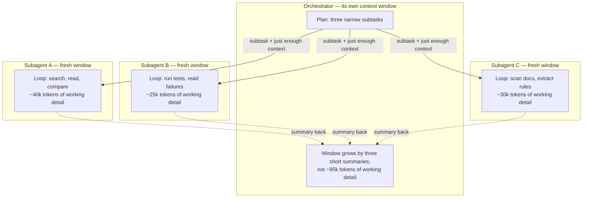
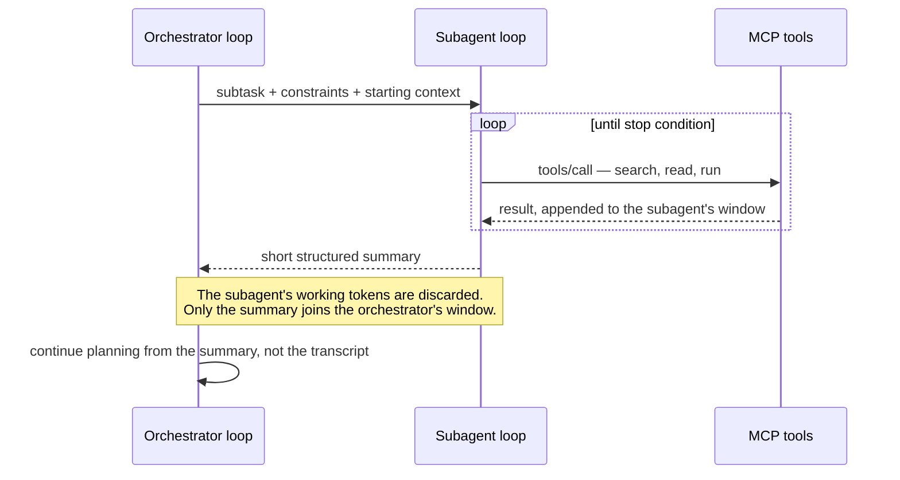

# Agents, subagents, and orchestration

[The agent loop](agent-loop.md) put one model in one loop with one growing conversation.

This chapter is about what happens when that single loop stops being enough. It is also about the discipline of noticing when it is still enough.

By the end you will be able to explain why a long-running agent degrades. You will be able to state precisely what a subagent isolates, and what crosses its boundary in each direction. You will recognize the three common orchestration patterns — and be able to argue against orchestration for the majority of tasks, where it costs more than it buys.

## Why one agent degrades

An agent's conversation only grows.

Every tool result is appended to the [context window](../part1-fundamentals/context-windows.md): each search hit, file read, and test log. Then it is [re-sent on every later call](../part1-fundamentals/context-windows.md#the-window-is-re-sent-on-every-call).

Two problems compound as the loop runs.

- **Cost.** Round N pays to re-send everything from rounds 1 through N−1. [Cost and efficiency](cost-efficiency.md) works this multiplier out in a table. Here it is enough to note that it grows with every step.
- **Quality.** Models retrieve information least reliably from the middle of a long context. That is the [lost in the middle](../part1-fundamentals/context-windows.md#lost-in-the-middle) effect. An agent that read forty files to fix one bug is still carrying thirty-nine of them, mostly irrelevant now, diluting the tokens that matter.

Part 2's refrain was that the job is curation, not accumulation. That was about building one prompt.

It applies just as hard across a whole session. An agent that accumulates every intermediate result is running the naive baseline from [why raw context fails](../part2-context/why-raw-context-fails.md), one round at a time.

## What a subagent is

A **subagent** is a fresh agent loop started on behalf of another agent.

It receives a narrow task and an empty context window of its own. It runs until its stop condition. Then it returns a short result — not its transcript — to whoever launched it.

The launcher is the **orchestrator**: the agent, or plain program, that splits a job into subtasks, starts subagents, and combines what they send back.

Context isolation is the point.

The subagent's forty tool calls, dead ends, and raw file contents live and die in *its* window. Only the distilled result enters the orchestrator's window: a summary, a verdict, a list of paths.

The boundary works in both directions. The subagent does not inherit the orchestrator's conversation history, and the orchestrator never sees the subagent's working detail.

```mermaid
flowchart TB
    subgraph orch["Orchestrator — its own context window"]
        PLAN["Plan: three narrow subtasks"]
        SUM["Window grows by three short summaries,<br/>not ~95k tokens of working detail"]
    end
    subgraph sga["Subagent A — fresh window"]
        LA["Loop: search, read, compare<br/>~40k tokens of working detail"]
    end
    subgraph sgb["Subagent B — fresh window"]
        LB["Loop: run tests, read failures<br/>~25k tokens of working detail"]
    end
    subgraph sgc["Subagent C — fresh window"]
        LC["Loop: scan docs, extract rules<br/>~30k tokens of working detail"]
    end
    PLAN -->|"subtask + just enough context"| LA
    PLAN -->|"subtask + just enough context"| LB
    PLAN -->|"subtask + just enough context"| LC
    LA -.->|"summary back"| SUM
    LB -.->|"summary back"| SUM
    LC -.->|"summary back"| SUM
```

Because the three subagents share nothing, they can run at the same time.

That is a second, separate benefit — parallelism. But it is downstream of the first. Isolation is what makes the parallelism safe.

One more piece of demystification, in the spirit of [the agent loop](agent-loop.md).

The orchestrator "decides" to spawn a subagent only in the [operational sense](../part1-fundamentals/what-llms-do.md#the-anthropomorphism-contract). Its sampled output named a spawn action, and ordinary client-layer software created the new loop, capped it, and collected its return.

Neither model is running the machinery. Both are text predictors whose outputs the machinery acts on.

## Three orchestration patterns

!!! note "Settled"
    These shapes predate LLM agents by decades. They are the fan-out, pipeline, and worker-pool patterns of distributed systems, wearing new clothes. The vocabulary here is stable, even where specific agent products change fast.

- **Fan-out** runs many same-shaped, independent subtasks at once. "Check each of these twelve modules for uses of the deprecated API." Then it merges the results. Independence is the entry requirement: if subtask outcomes affect each other, fan-out silently produces inconsistent answers.
- **Pipeline** runs stages in sequence, with each stage's summary becoming the next stage's input. Research, then plan, then implement, then review. Each stage starts with a clean window holding only what the previous stage chose to pass forward.
- **Orchestrator-worker** keeps one long-lived orchestrator that spawns workers as the plan evolves. It is closer to a tech lead delegating than to a fixed assembly line. It is the most flexible pattern, and the most expensive to coordinate.

Real systems mix them. A pipeline whose middle stage fans out is common.

## What crosses the boundary

What passes down is a prompt. So everything from [prompting basics](../part1-fundamentals/prompting-basics.md) applies: the task statement, the constraints, just enough starting context to avoid re-deriving what is already known, and access to tools.

Too little context and the subagent rediscovers what the orchestrator already knew, at full price. Too much and you have reinvented the shared window you were trying to escape.

What comes back should be a contract you design *before* launching. Short and structured.

"Return the five most relevant files, one line each on why, and a confidence verdict" produces something an orchestrator can act on. "Investigate the auth code" produces an essay.

```mermaid
sequenceDiagram
    participant O as Orchestrator loop
    participant S as Subagent loop
    participant T as MCP tools
    O->>S: subtask + constraints + starting context
    loop until stop condition
        S->>T: tools/call — search, read, run
        T-->>S: result, appended to the subagent's window
    end
    S-->>O: short structured summary
    Note over O,S: The subagent's working tokens are discarded.<br/>Only the summary joins the orchestrator's window.
    O->>O: continue planning from the summary, not the transcript
```

## The honest costs

Orchestration is not free, and the costs are structural rather than incidental.

1. **Boundary information loss.** The summary is lossy by construction. The odd comment the subagent read but judged irrelevant, the pattern it half-noticed — gone. If the orchestrator turns out to need that nuance, it either pays to re-derive it or proceeds without it. Nothing flags which happened.
2. **Latency.** Every spawn is a cold start: a fresh loop, fresh tool discovery, fresh reading. Pipelines line those cold starts up one after another. Fan-out runs work in parallel, but still waits on its slowest branch before merging.
3. **Coordination overhead.** The orchestrator spends tokens describing subtasks and digesting summaries. Each subagent's payload duplicates context its siblings also received. And someone has to handle the subagent that returns garbage, times out, or answers a different question than it was asked.

## When not to orchestrate

Most of the time.

If the whole job — code, tool results, and conversation — fits comfortably in one window, a single loop beats N loops. No boundary loss, no cold starts, no coordination tax.

Refactoring where every piece interacts with every other piece is actively hostile to splitting, because the "narrow task with separable detail" premise is simply false.

A workable rule: orchestrate when the working detail needed to finish the subtasks is much larger than the results, *and* the subtasks are separable. Both conditions, not either one.

A subagent is a curation instrument. It buys a clean window at the price of a lossy boundary. And curation with overhead only pays when there is real bulk to curate away.

!!! example "In the wild: Sankshep"
    Everything above happens in the client layer. An MCP server sits below it and cannot tell who is calling.

    Each `tools/call` arrives as a single self-contained request over [the wire protocol](../part3-mcp/wire-protocol.md). It looks identical whether the caller is a lone agent, an orchestrator, or a subagent three levels deep.

    Sankshep leans into that. It never runs a loop of its own, and never calls a model at request time. Its `compose_task_prompt` is deterministic by ADR-0013, enforced by a build-time test.

    Because no tool call depends on conversation state held by the server, the answer depends only on the arguments and the repository's current state. So every topology on this page can share one server with no coordination.

    That is the transferable rule for tool builders. Keep tools free of conversation state and deterministic, and fan-out, pipelines, and worker pools all get your server for free.

## Checkpoints

1. A coding agent has been running one conversation for forty rounds, and both your bill and its answer quality are getting worse. Name the two separate mechanisms at work.

    ??? success "Answer"
        **Cost.** The context window is re-sent on every call. So round N pays again for everything from rounds 1 through N−1, and the bill grows with each step even if the new work is small.

        **Quality.** Accumulated tool results push relevant material into a long context's weakly attended middle — lost in the middle. So mostly irrelevant earlier reads dilute what matters now.

2. When an orchestrator spawns a subagent, what is isolated, what passes down, and what comes back?

    ??? success "Answer"
        The context windows are isolated. The subagent starts empty and never sees the orchestrator's history. The orchestrator never sees the subagent's transcript.

        Down goes a designed payload: task statement, constraints, just enough starting context, and tool access.

        Back comes a short structured result agreed in advance — a summary, verdict, or list. Never the working detail.

3. Match the pattern to the job. (a) Audit thirty modules for the same deprecated API. (b) Research a library, then plan a migration, then implement it, then review the diff. (c) Triage a vague bug report where each finding changes what to look at next.

    ??? success "Answer"
        (a) Fan-out. Same-shaped, independent subtasks, merged at the end.

        (b) Pipeline. Sequential stages, each starting clean from the previous stage's summary.

        (c) Orchestrator-worker. One long-lived planner spawning workers as the picture changes.

4. A teammate proposes spawning subagents for a 300-line change confined to one file. Make the counter-argument.

    ??? success "Answer"
        The job fits in one window, so isolation buys nothing. There is no bulk of working detail to curate away.

        Meanwhile every structural cost still applies. The summary boundary loses nuance. Each spawn adds a cold start. And the orchestrator burns tokens describing subtasks and digesting results.

        Orchestrate only when working detail vastly exceeds the results *and* the subtasks are separable. Here, neither condition holds.

## Try it

Feel the difference context isolation makes, using one agent and one deliberately polluting task.

1. **Pollute a context on purpose.** In a fresh session, ask an agent to read something large and mostly irrelevant: a long log file, a generated file, a big dependency manifest. Let the whole thing land in the conversation.
2. **Now ask a precise question** about a small, unrelated part of the project. Note the answer's quality, and note how long the agent takes to get to the point.
3. **Start a fresh session** and ask the same precise question with no pollution. Compare.

    The difference you feel is bloat: the [lost-in-the-middle effect](../part1-fundamentals/context-windows.md) applied to a conversation rather than a document.

4. **Now do it as delegation.** In one fresh session, ask the agent to *summarize* the large file in five bullet points. Take those bullets, paste them into a second fresh session, and ask your precise question there.

    You have just hand-executed a subagent. The expensive reading happened in a context you then threw away, and only the distillate crossed the boundary.

5. **Name what crossed.** Write down exactly what moved between the two sessions — five bullets, a few hundred tokens — versus what stayed behind.

    That ratio is the entire economic argument for orchestration. Doing it by hand once makes the automated version much harder to over-apply.

If step 4 produced a worse answer than step 3, that is the honest result, and worth keeping. The summary dropped something the question needed.

Choosing what crosses the boundary is the hard part. Not the spawning.
