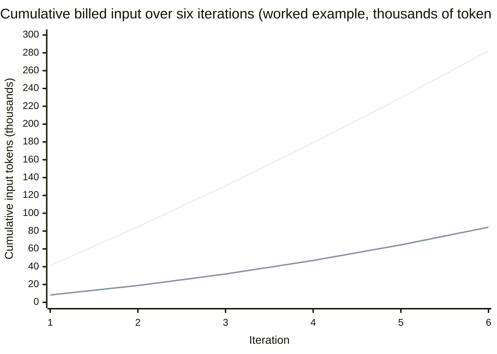

# Cost and efficiency

Every chapter so far has counted [tokens](../part1-fundamentals/tokens.md); this one counts what happens when [the agent loop](agent-loop.md) multiplies them. By the end you will be able to:

- reconstruct an agent session's bill from the loop mechanics alone, without knowing a single price;
- apply the two big levers — fewer tokens per call, a cheaper model per step — and name the software layer each lives in;
- decide where a system should degrade gracefully and where it must refuse outright.

The prerequisite fact comes from [the context window](../part1-fundamentals/context-windows.md): model API calls are stateless, so the client re-sends the entire conversation on every call. Everything below is that one fact, priced.

## How the bill accrues

A single call bills two quantities: input tokens sent and output tokens produced. Output tokens are the pricier kind, but input dominates agent bills by volume — tool results and history dwarf anything a model writes back.

!!! warning "Evolving — verified 2026-07-18"
    Per-token prices change often and vary by provider and model, so this page states none. Two structural facts held across major providers as of 2026-07-18: output tokens cost more per token than input tokens, and cache-read input tokens cost less than fresh ones. This changes quickly; check the official pricing pages — [Anthropic](https://docs.anthropic.com/en/docs/about-claude/pricing), [OpenAI](https://platform.openai.com/docs/pricing), [Gemini](https://ai.google.dev/gemini-api/docs/pricing) — for current values.

In a loop, iteration N re-sends everything from iterations 1 through N−1. Call this the **loop multiplier**: the factor by which a looping workflow re-bills tokens already paid for, because each iteration's input contains all of its predecessors.

A worked six-iteration session: base context (system prompt plus tool definitions) is 4,000 tokens; the task adds 300; each iteration the model emits ~300 tokens and the tool it named returns ~2,000.

| Iteration | New tokens since last call        | Input billed | Output billed |
|-----------|-----------------------------------|-------------:|--------------:|
| 1         | task message (300)                | 4,300        | 300           |
| 2         | iter-1 reply + tool result (2,300)| 6,600        | 300           |
| 3         | +2,300                            | 8,900        | 300           |
| 4         | +2,300                            | 11,200       | 300           |
| 5         | +2,300                            | 13,500       | 300           |
| 6         | +2,300                            | 15,800       | 300           |
| **Total** |                                   | **60,300**   | **1,800**     |

The conversation never exceeds ~16,000 tokens, yet 60,300 input tokens are billed: a token is billed once per iteration it survives, so the earliest tokens are paid for six times.

Now attach the worked example from [Why raw context is wasteful](../part2-context/why-raw-context-fails.md): paste a real 37,000-token file into iteration 1 and every input grows by 37,000 — 282,300 billed input tokens in total. Deliver a curated 4,000-token slice instead and the same six iterations bill 84,300.



The upper line is the whole-file paste; the lower is the curated slice. Same task, same loop — the only difference is what rode along in history. That widening gap motivates both levers.

## Lever 1: send fewer tokens per call

The cheapest token is the one you never send — and a token removed before iteration 1 is removed from every iteration. This lever is Part 2 in its entirety: [retrieve](../part2-context/rag-for-code.md) the relevant slice, [minimize](../part2-context/structural-minimization.md) it, [remember](../part2-context/persistent-memory.md) durable facts instead of re-deriving them, and [measure](../part2-context/measuring-quality.md) what the shrinking cost in fidelity.

Its second half is **prompt caching**: a provider feature that recognizes when the opening span of a request is byte-identical to a recent request's opening span, and bills those re-read tokens at a discounted cache rate instead of the full input rate. A loop's system prompt, tool definitions, and history-so-far form exactly such a stable prefix — each iteration appends rather than edits.

Two caveats keep caching a softener, not a cure:

- **The prefix must actually be stable.** A timestamp interpolated into the system prompt, tool definitions serialized in a different order, history edited in place — any of these makes every call a full-price cache miss. Byte-identical output is cache-friendly output, a point [grounded prompting](grounded-prompting.md) develops.
- **Discounted is not free.** Cache reads still bill, output is never cached, and each iteration's fresh suffix always bills at the full rate. The multiplier is softened, not repealed — so caching and curation compose rather than substitute.

## Lever 2: route steps to cheaper models

Not every iteration needs the flagship. Summarizing a tool result or formatting a commit message is work a small model handles; untangling a race condition may not be. **Model routing** is the practice — implemented in client code — of selecting which model serves each call: a cheap model for easy steps, escalating to an expensive one for hard steps.

Where does routing live? Recall the three-layer frame from [the running example](../part0-orientation/running-example.md). The model cannot route: it is the thing being chosen, and it only maps tokens to probability distributions ([What an LLM actually does](../part1-fundamentals/what-llms-do.md)). A tool server cannot route: it answers one call at a time and never sees the loop, the conversation, or the invoice. That leaves the client — the layer that [owns the loop](agent-loop.md), assembles every request, holds the keys, and pays the bill. Routing is a client-layer concern because only the client has both the visibility to choose and the authority to act.

Typical signals: the kind of step (mechanical transform vs open-ended design), a cheap-model attempt failing validation (try cheap, escalate on failure), and explicit per-task hints. The risks are equally concrete:

- **Quality cliffs.** A cheaper model has weaker weights; whether it "understands" a given step (in the [operational sense](../part1-fundamentals/what-llms-do.md)) is an empirical question that fails silently when the answer is no.
- **Per-route evals.** An eval that passes on the flagship certifies nothing about the cheap route; every route is a configuration to measure separately.
- **Route-dependent bugs.** "Works when the router picks the big model" is among the least reproducible bug reports an agent system can produce.

!!! example "In the wild: Sankshep"
    Sankshep is the deliberate counter-example: it refuses to route because it refuses to call models at all. As of 2026-07-18 (v1.8.0), it makes no LLM call at request time — `compose_task_prompt` returns "a prompt, not an answer" (ADR-0013), and a build-time test enforces that no model client can enter the composition path.

    ```mermaid
    flowchart LR
        dev([You])
        subgraph L1["Layer 1 — the client · ROUTING LIVES HERE"]
            loop["Owns the loop, pays the bill:<br/>selects a model for each call"]
        end
        subgraph L2["Layer 2 — the models"]
            cheap["Cheaper model"]
            flagship["Flagship model"]
        end
        subgraph L3["Layer 3 — the tools"]
            snk["Sankshep<br/>deterministic — never calls a model"]
        end
        dev --> loop
        loop -->|"easy step"| cheap
        loop -->|"hard step"| flagship
        loop <-->|"tool calls"| snk
        snk -. "no request-time LLM calls —<br/>forbidden by a build-time test" .-x flagship
    ```

    Staying deterministic at Layer 3 buys three things: byte-identical outputs (golden-testable, and cache-stable across reruns); zero marginal model cost (a tool call spends CPU, not tokens); and composability — with no hidden model calls of its own, the server behaves identically under *any* client's routing policy. Its efficiency contribution is therefore Lever 1 only: the Balanced profile holds 0.94 key-point recall at 30.4% compression, per Sankshep's published `docs/benchmarks.md` (verified 2026-07-18). The honesty coda: "roundtrips avoided" — better context saving whole iterations — is [explicitly not measured, so it is not claimed](../part2-context/measuring-quality.md).

## Degradation economics

Failure has a token bill too. When a dependency breaks a run mid-loop, every token billed so far bought nothing, and the retry re-bills all of it — the loop multiplier applied to failure. A tool's failure policy is therefore an economic decision, with two defensible modes:

- **Fail soft on quality.** Where a missing dependency only degrades ranking or compression, keep answering: each rung of a [degradation ladder](../part2-context/rag-for-code.md) gives up quality, never correctness, and a plainer answer beats a crashed and re-billed loop.
- **[Fail closed](../part2-context/measuring-quality.md) on safety and honesty.** Where failure would compromise integrity — authentication, artifact verification, a regression gate — refuse outright. A degraded safety check is no safety check with better uptime.

The rule in one line: degrade quality gracefully; never degrade safety or honesty.

!!! example "In the wild: Sankshep"
    The fail-soft ladder: a missing tree-sitter grammar means the file [passes through unminimized](../part2-context/structural-minimization.md); sqlite-vec unavailable means brute-force similarity in pure C#; an empty index means lexical search; a request that would deliver zero tokens raises a loud tool-level error (`isError`, ADR-0016) rather than a silently empty success. Every rung returns fewer or plainer tokens — never wrong ones. The fail-closed points are the other category: unauthenticated non-loopback HTTP is refused (see [Safety and judgment](safety.md)), an embedding-model download failing its SHA-256 check is discarded, and the eval-regression gate fails the build. Quality bends; integrity does not.

## The five-question bill checklist

1. **What rides in every call that was only needed once?** The multiplier bills history; the biggest wins are recurring blocks — Lever 1.
2. **Is the prefix cache-stable, and what silently breaks it?** Hunt for timestamps, nondeterministic serialization, edited history.
3. **Which iterations actually needed the expensive model — and how would you know?** If the answer is a guess, routing needs per-route evals before it needs a router.
4. **When a dependency goes missing, does spend degrade or evaporate?** A mid-loop crash re-bills the whole run.
5. **Are efficiency claims measured on what ships, or inferred?** Compression is easy to claim; [measurement](../part2-context/measuring-quality.md) is the discipline.

## Checkpoints

**1. In the worked table, the conversation never exceeds ~16,000 tokens, yet 60,300 input tokens are billed. Explain the mechanism.**

??? success "Answer"
    Calls are stateless, so each iteration re-sends the whole conversation so far; a token is billed once per iteration it survives. The earliest tokens are billed six times, making the total the sum of a growing series, not the size of the final window.

**2. A teammate adds the current timestamp to the system prompt "for freshness". What does this do to the bill?**

??? success "Answer"
    It breaks prompt caching on every call: the opening span is no longer byte-identical to the previous request's, so the entire prefix re-bills at the full input rate instead of the discounted cache rate. Volatile content belongs at the end of the context, or nowhere.

**3. Why is model routing a client-layer concern?**

??? success "Answer"
    The model cannot route — it is the object of the choice and only maps tokens to distributions. A tool server cannot route — it sees one isolated call, never the loop or the invoice. Only the client has both visibility (it assembles every request and owns the loop) and authority (it holds the keys and pays the bill).

**4. An MCP tool calls an LLM internally to summarize its result before returning it. Name two costs versus a deterministic implementation.**

??? success "Answer"
    Any two of: outputs are no longer byte-identical, so the tool cannot be golden-tested and destabilizes cache-friendly prefixes; every call carries a hidden marginal token bill and latency the client cannot see; and the tool escapes the client's routing policy — the client may route the loop to a cheap model while the tool quietly bills a flagship.

**5. Classify as fail-soft or fail-closed, and state the deciding rule: (a) a grammar is missing for one language; (b) a downloaded model fails its hash check; (c) eval recall drops below baseline; (d) the vector index does not exist yet.**

??? success "Answer"
    (a) and (d) fail soft: results get plainer or less well ranked but stay correct. (b) and (c) fail closed: a corrupt artifact and a shipped regression compromise integrity silently. The rule: degrade quality gracefully; never degrade safety or honesty.

## Try it

Build the cumulative-token table for a real session of your own.

1. Pick a recent agent session with at least five tool-calling iterations (most agentic IDEs and CLIs can show the transcript).
2. Reconstruct the worked table: one row per iteration — *new tokens since last call*, *input billed*, *output billed*. Estimate counts with the tools from [Tokens and tokenization](../part1-fundamentals/tokens.md), or characters ÷ 4 as a rough floor.
3. Sum the input column and divide by the final context size. That is your realized loop multiplier (the worked example's was ~3.7).
4. Find the largest block appearing in more than one row — usually a pasted file or verbose tool result — and name the lever that shrinks it: curation before iteration 1, or caching of the stable prefix.
5. If your client reports cache hits, check whether anything (timestamps, edited history) broke the prefix mid-session. You now hold the two numbers this chapter is about: what the loop multiplied, and what it multiplied needlessly.
