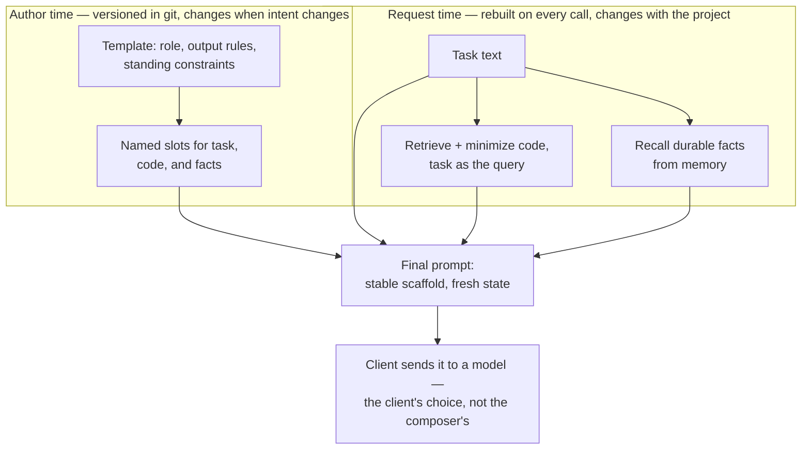
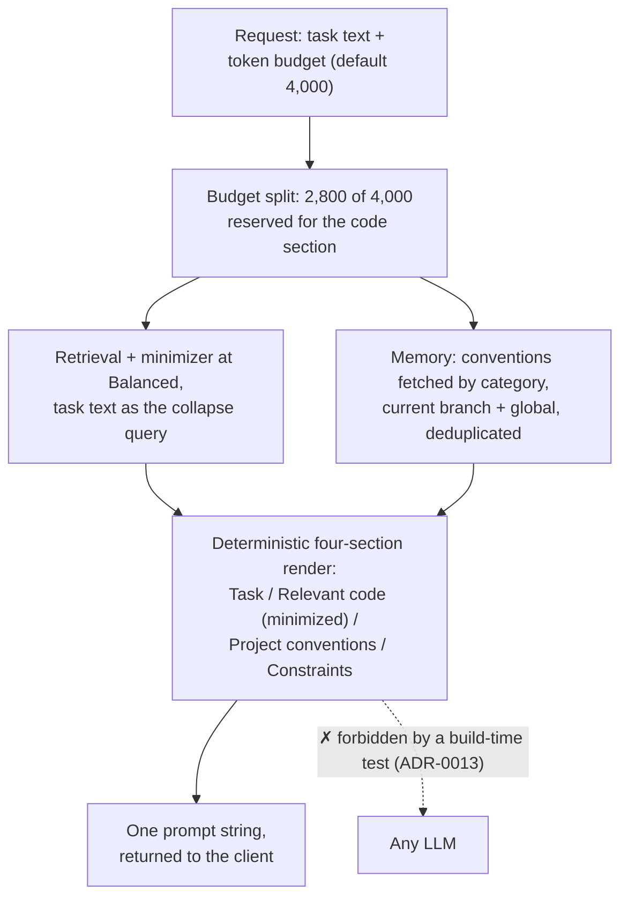

# Grounded prompting and composition

The last three chapters covered the [agent loop](agent-loop.md), [tool calling](tool-calling.md), and [subagent orchestration](agents-subagents.md) — machinery that moves prompts around and acts on what comes back. This chapter asks where a good prompt comes from in the first place. By the end you will be able to say precisely what makes a prompt *grounded*, assemble one mechanically from live project state, explain why the assembler must never call a model, and fit author-time templates and request-time grounding into one pipeline instead of treating them as rivals.

## What grounding means

**Grounding** is building the variable parts of a prompt from verifiable project state at the moment of the request — the working tree, the memory store, the standing constraints — rather than from what anyone remembers being true. A **grounded prompt** is one where every contextual claim is traceable to a source that existed when the prompt was assembled: this code came from that file as it exists on disk right now; this convention came from that database row.

The alternative is the everyday default. A model has exactly two sources — [its weights and its window](../part1-fundamentals/what-llms-do.md) — so whatever the window lacks gets filled from training data, and whatever the human pastes from memory arrives at the freshness of that memory. A function renamed last sprint, a convention repealed last quarter: an ungrounded prompt carries both, confidently. The model ["knows"](../part1-fundamentals/what-llms-do.md) nothing about your repository beyond what the window contains, so the window had better contain the repository as it is, not as it was.

Grounding, in short, adds two properties to the [five working parts of a prompt](../part1-fundamentals/prompting-basics.md): **freshness** (state read at request time) and **provenance** (every claim has a source you can point to).

## Composition: a prompt built from parts

**Prompt composition** is the mechanical assembly of a final prompt from independently produced parts, each with its own source, its own producer, and its own share of the [token](../part1-fundamentals/tokens.md) budget. For a coding task, four streams are typical:

1. **The task** — the one human-authored part, stated by the user.
2. **Relevant code** — found by [retrieval](../part2-context/rag-for-code.md) and compressed by [structural minimization](../part2-context/structural-minimization.md), with the task text serving as the query for both.
3. **Durable facts** — conventions and decisions recalled from [persistent memory](../part2-context/persistent-memory.md).
4. **Constraints** — standing rules and an out-clause, stated explicitly.

This is the prompt anatomy from [prompting basics](../part1-fundamentals/prompting-basics.md), with every part except the task produced by machinery. That factoring is the point: each producer can be tested in isolation, each section gets an explicit budget so the whole fits the [context window](../part1-fundamentals/context-windows.md) with room left for the answer, and improving one stream — better retrieval, sharper minimization — improves every future prompt without anyone rewriting anything.

## Determinism is a feature

A composer should be a pure function: identical repo state, identical memory contents, identical task in — byte-identical prompt out. That property unlocks the strongest cheap test there is. A **golden test** compares a program's output byte for byte against a stored known-good file; if composition is deterministic, you can pin entire composed prompts as golden files and any behavioral drift fails the build.

One design rule follows immediately: *the composer must not call a model*. A model call anywhere in the assembly path destroys determinism ([sampling](../part1-fundamentals/what-llms-do.md) means two runs differ), adds marginal cost and latency to every request, and loses content you cannot enumerate — the same three arguments that ruled out summarization in [structural minimization](../part2-context/structural-minimization.md), now applied one level up.

The same rule has a boundary corollary, best stated as a slogan: the composer produces **a prompt, not an answer**. Its job ends when the prompt string is returned. Sending that string to a model — and choosing *which* model — belongs to the client, because the client [owns the loop](agent-loop.md) and pays the bill ([cost and efficiency](cost-efficiency.md) develops why routing lives there). A composition tool that answered its own prompts would hard-wire a model choice into the wrong layer and forfeit every property above.

## Author-time templates, request-time grounding

Grounding does not replace the [prompt templates](../part1-fundamentals/prompting-basics.md) you already version in your repository. The two live on different clocks:

- An **author-time template** is written by a person, reviewed, and versioned; it changes when *intent* changes. It encodes role, output rules, tone, and standing constraints.
- Request-time grounding is rebuilt on every call; it changes when the *project* changes. It supplies the code, the facts, and the freshness no template can contain.

They compose rather than compete: a template's slots are exactly where a grounding tool's output belongs, and some template formats can invoke such tools directly.

!!! warning "Evolving — verified 2026-07-18"
    VS Code's Copilot prompt files (`.prompt.md`) accept a `tools:` frontmatter key that can name MCP tools, so a versioned author-time template can call a request-time grounding tool by name. This changes quickly; check the [VS Code Copilot customization docs](https://code.visualstudio.com/docs/copilot/copilot-customization) for current values.

A reader of the final prompt cannot tell which lane a given line came from, and should not need to. The division exists for the maintainers: template changes get code review; grounding changes get golden tests.

## In practice: Sankshep

Sankshep ships this whole chapter as its single MCP prompt, `compose_task_prompt` — the user-invoked primitive from [tools, resources, and prompts](../part3-mcp/primitives.md). The request carries a task and a token budget (default 4,000). The composer splits the budget, reserving 2,800 for code; runs [retrieval](../part2-context/rag-for-code.md) and the [minimizer](../part2-context/structural-minimization.md) at the Balanced level with the task text as the collapse query; pulls conventions from [memory](../part2-context/persistent-memory.md) wholesale by category, scoped to the current branch plus global entries, deduplicated; and renders four sections in a fixed order — `# Task`, `# Relevant code (minimized)`, `# Project conventions`, `# Constraints`.

The crossed-out edge is the load-bearing one. ADR-0013 names the contract — "a prompt, not an answer" — and enforces it structurally: a build-time test walks the composition path's dependency closure and fails if any model-client library appears in it. The rule is a failing test, not a convention. The payoff is everything this chapter promised: identical inputs yield byte-identical prompts, so the composer is golden-tested; composition costs zero model tokens; and the output works under any client's model-routing policy, because it never presumed one. Whether the composed prompt actually beats a naive one is a measurable question — [measuring context quality](../part2-context/measuring-quality.md) shows how Sankshep's evals answer it, unflattering results included.

## Checkpoints

**1. A prompt contains the line: "Our error handling uses `Result<T>`; see `src/Errors.cs`." What would make this line grounded, and what would make it ungrounded?**

??? success "Answer"
    Grounded: the line was produced at request time from a verifiable source — a memory row recorded as a convention, or the file as it exists in the working tree — so it carries provenance and freshness. Ungrounded: a human typed it from recollection. The words can be identical in both cases; grounding is a property of where the claim came from and when, not of how it reads.

**2. Why must a composition tool never call a model while assembling the prompt — even a small, cheap one?**

??? success "Answer"
    Three reasons. Determinism dies: sampled output differs run to run, so golden tests become impossible. Cost and latency appear: you spend tokens and a round trip on every request before the real model call even happens. And the layering breaks: the tool would embed a model dependency in a layer that should stay model-agnostic, when model choice belongs to the client that [owns the loop](agent-loop.md) ([cost and efficiency](cost-efficiency.md)).

**3. What is a golden test, and what property of the composer makes it possible?**

??? success "Answer"
    A golden test compares output byte for byte against a stored known-good file. It requires determinism: the same repo state, memory contents, and task must yield a byte-identical prompt. One timestamp, one unordered collection, or one model call in the pipeline, and the comparison can never pass reliably again.

**4. A teammate argues: "We already version `.prompt.md` templates, so a composition tool is redundant." What is the flaw?**

??? success "Answer"
    The two operate on different clocks. Templates are author-time artifacts: they encode intent, roles, and output rules, and change only when a person edits them. They cannot contain today's working tree or this branch's recorded facts — that is request-time state, which grounding rebuilds on every call. They compose: the template's slots are where the grounding tool's output goes, and a `tools:` reference can wire the two together.

**5. The rule "a prompt, not an answer" draws a boundary. What sits on each side, and what does the composer gain by staying on its side?**

??? success "Answer"
    On the composer's side: assembling a prompt string from project state, deterministically. On the client's side: choosing a model, sending the prompt, and running the loop. By stopping at the string, the composer stays golden-testable, adds zero model-token cost, and remains usable under any client's routing policy — properties it would forfeit the moment it answered its own prompt.

## Try it

Compose one prompt by hand, both ways, for a repository you know well.

1. **Pick a real task.** Something concrete, such as "add input validation to the signup endpoint".
2. **Ungrounded baseline.** Write the prompt from memory alone: describe the task, name the relevant files and functions as you recall them, state the conventions you believe the team follows. Do not open a single file. Save it.
3. **Grounded version.** Build the same four sections from state: open the actual files and copy in the current signatures plus the one function body that matters; find the real conventions (grep the docs, or check your notes from the [persistent memory](../part2-context/persistent-memory.md) hands-on); write explicit constraints with an out-clause.
4. **Audit the baseline.** Diff your recalled claims against reality: renamed functions, moved files, conventions that no longer hold. Each miss is a defect the grounded pipeline structurally cannot produce — and a correction you would otherwise spend a loop iteration paying for.
5. **Compare answers.** Send both prompts to an assistant in fresh conversations. Score the responses on the task you actually have: which cites code that exists, stays in scope, and could be applied without hand-editing?
