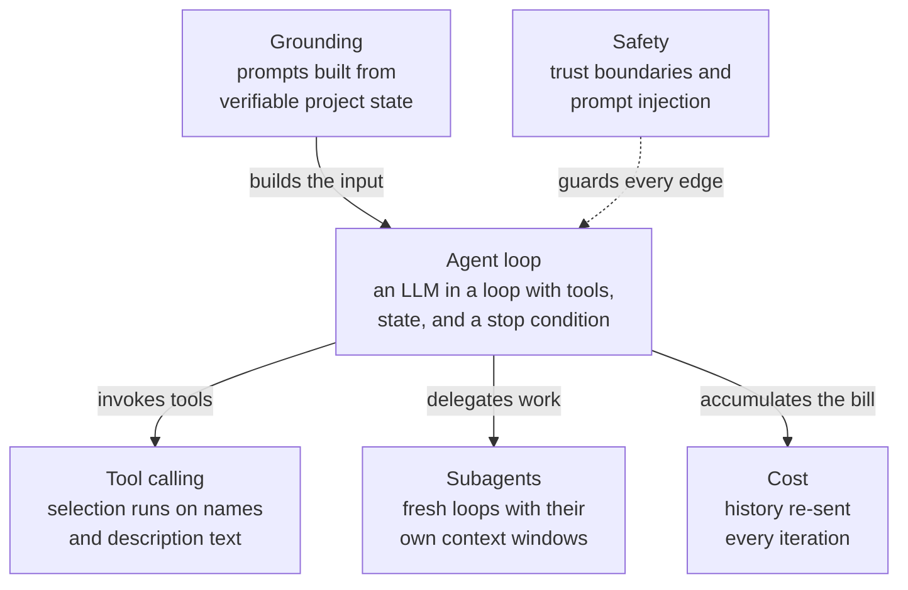

# Agents

Part 3 left you with a working connection: an MCP server wired into an IDE, its tools listed and callable. But a list of tools does nothing by itself. Something has to send the model a task, read the tool call it emits, execute that call, feed the result back, and stop when the work is done. That something — the loop, and the software that owns it — is what this part is about.

The first chapter defines the agent precisely and settles the part's central question: which piece of software actually ["decides"](../part1-fundamentals/what-llms-do.md) what happens next. The other five chapters each take one concern that every loop raises.

## One loop, five concerns

- [The agent loop](agent-loop.md) — an LLM in a loop with tools, state, and a stop condition, and which layer owns that loop.
- [Tool calling in depth](tool-calling.md) — how tools get selected, and why the description text does most of the work.
- [Agents, subagents, and orchestration](agents-subagents.md) — fresh loops with their own [context windows](../part1-fundamentals/context-windows.md), and what that isolation buys.
- [Grounded prompting and composition](grounded-prompting.md) — building prompts from verifiable project state at request time.
- [Cost and efficiency](cost-efficiency.md) — the loop re-sends history every iteration; here is the bill, and the levers against it.
- [Safety and judgment](safety.md) — trust boundaries, prompt injection through tool results, and where to fail closed.

## What you need first

This part assumes Part 3's machinery: [tools, resources, and prompts](../part3-mcp/primitives.md), and the [wire protocol](../part3-mcp/wire-protocol.md) that carries a call. It also leans on the operational vocabulary from [what an LLM actually does](../part1-fundamentals/what-llms-do.md) — the loop looks far less magical once "the model called a tool" is unpacked into "the model emitted structured text and other software acted on it."

!!! example "In the wild: Sankshep"
    Sankshep, the server from [the running example](../part0-orientation/running-example.md), runs through this part as a deliberate counter-example: it is a tool inside someone else's loop. It never loops and never calls a model, and its outputs stay deterministic — [Cost and efficiency](cost-efficiency.md) argues that this restraint is exactly what keeps a tool composable under any client's policy.
