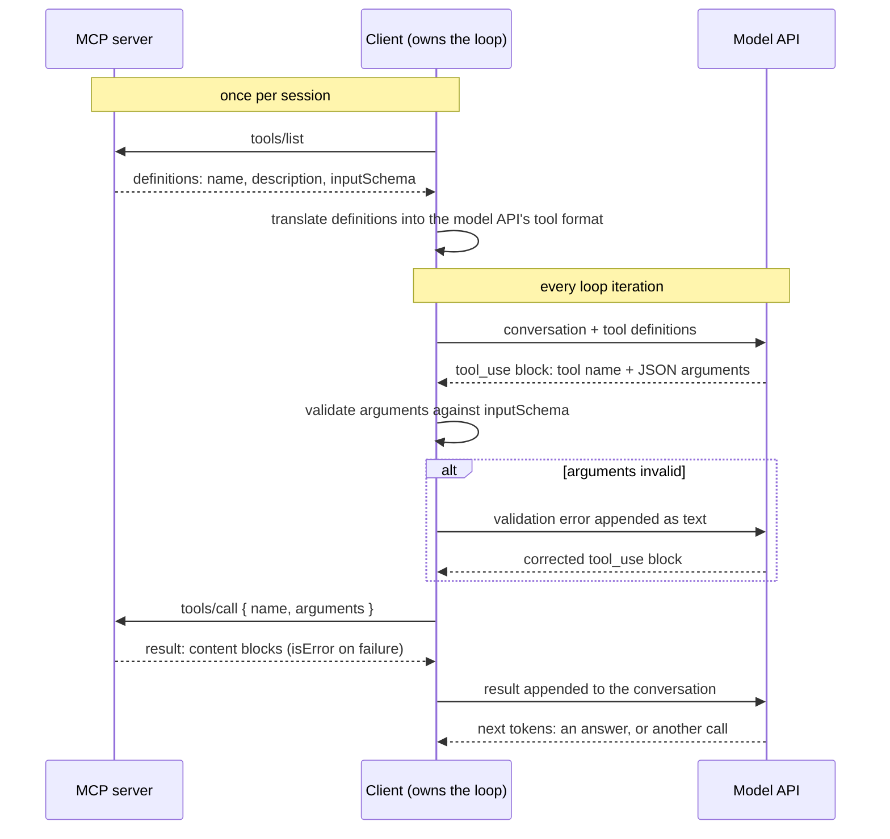
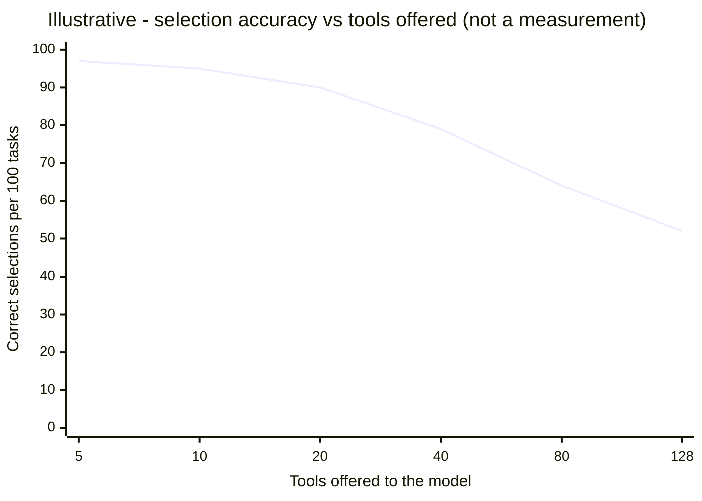

# Tool calling in depth

[The agent loop](agent-loop.md) established who does what: the client owns the loop, the model emits intentions, servers execute single calls. This chapter zooms into the loop's most consequential arrow — the moment a tool gets picked. By the end you will be able to explain where selection actually happens, write descriptions that select well, judge how many tools is too many, and design results and errors that keep a loop moving.

## Selection is text comprehension

**Tool selection** is the step where the model, given the conversation so far plus the serialized list of tool definitions, emits a structured block naming one tool and its arguments. Nothing else participates: no registry lookup, no routing table, no inspection of your server's code. Selection is [next-token prediction](../part1-fundamentals/what-llms-do.md) over text, and the text it runs on is your tool names, descriptions, and schemas, rendered into the [context window](../part1-fundamentals/context-windows.md) with the rest of the conversation.

[The wire protocol chapter](../part3-mcp/wire-protocol.md) put it bluntly: the `tools/list` response is the only knowledge of your API the model will ever have. When the model ["decides"](../part1-fundamentals/what-llms-do.md) to call a search tool, the mechanical fact underneath is that your description text made that continuation the most probable one. The practical thesis of this chapter follows: selection quality is a writing problem, tuned by editing prose, not hyperparameters.

## The lifecycle of one call

Here is one tool call end to end, including the validation step that many clients run before any bytes reach your server.



Two details reward attention. First, the translation step: the definitions cross two different protocols — MCP between client and server, the model API between client and model — a boundary covered in [the wire protocol chapter](../part3-mcp/wire-protocol.md). Second, client-side schema validation exists because the arguments are sampled tokens, not compiler output: they can be malformed JSON or miss a required field. Checking them against the schema catches that failure without a server round trip and lets the model emit a corrected call. The server still validates on its own side — defense in depth, not redundancy.

## Writing descriptions that select well

A description serves the model twice: at selection time ("is this the tool for this step, with what arguments?") and at result time ("what did this output represent?"). The craft rules that consistently pay off:

- **Lead with a verb.** "Search support tickets by free-text query" beats "This tool provides ticket search functionality."
- **Say when to use it — and when not.** The when-not clause is the fence between neighboring tools; without it, two plausible tools produce a near-tie that [sampling](../part1-fundamentals/what-llms-do.md) resolves arbitrarily.
- **Specify argument semantics.** Units, formats, defaults, and one concrete example value prevent most malformed calls.
- **State the result shape.** "Returns the 10 best matches with id, title, and status" sets up the follow-up step; silence leaves it to inference.

The difference in practice:

```json
{ "name": "search", "description": "Searches the data." }
```

```json
{
  "name": "search_tickets",
  "description": "Search support tickets by free-text query. Use when the
    user asks about a customer issue or bug report. Do NOT use for billing
    records (use search_invoices). Args: query - plain English, not a
    ticket id (use get_ticket for ids); status - optional, 'open' or
    'closed', default both. Returns the 10 best matches with ticket id,
    title, and status."
}
```

The first version forces the model to guess from a name; the second answers every question selection asks. This is the rule [Server anatomy](../part3-mcp/writing-a-server.md) introduced — tool descriptions are model-facing UX — applied with a checklist. One economic note: definitions are input [tokens](../part1-fundamentals/tokens.md), re-sent on every loop iteration ([Cost and efficiency](cost-efficiency.md) does that arithmetic). A sentence that prevents one wrong call pays for itself; padding never does.

## How many tools is too many

Every definition you register occupies context window space on every iteration, and every added tool is another candidate for a near-miss match. Selection does not fail suddenly at some threshold — it erodes.



The curve makes an argument rather than reporting a benchmark, but two x-positions are real platform facts: ~20 is where vendor guidance starts advising caution, and 128 is a hard cap on one major API.

!!! warning "Evolving — verified 2026-07-18"
    As of 2026-07-18: the 128-tool limit is **OpenAI's** tools-array cap — a platform limit, not part of the MCP spec and not an Anthropic limit. OpenAI's guidance recommends keeping fewer than ~20 tools active for reliable selection. Anthropic imposes no hard tool-count cap and offers a Tool Search Tool, which lets tool definitions be discovered on demand instead of loaded up front. Anthropic's engineering guidance names the underlying erosion "context rot" — quality degrades as the window fills with marginally relevant material. This changes quickly; check the [OpenAI function-calling docs](https://platform.openai.com/docs/guides/function-calling) and [Anthropic's tool-use docs](https://docs.claude.com/en/docs/agents-and-tools/tool-use/overview) for current values.

The portable lesson: platform caps are the outer wall, not the target — selection degrades long before any limit rejects your request.

## Designing results and errors

The result of a call re-enters the context window and is read as text on the next iteration — result design is context engineering, one call at a time. MCP results are [content blocks](../part3-mcp/primitives.md); the protocol also allows a structured JSON rendering of the same result for the application to parse. The judgment call, introduced with [the primitives](../part3-mcp/primitives.md), is to treat these as one result in alternative encodings — emitting a text rendering *plus* a large JSON payload of the same data can double the token bill for zero added information.

Errors deserve equal design effort, because in a loop an error is not an endpoint — it is the input to the next step. An **actionable error** is an error message written so the model's next sampled step can plausibly fix the problem: it names what failed, why, and what to do instead. "Path `src/auth.cs` not found; paths are relative to the repository root; call `list_files` to see valid paths" lets a loop self-correct in one iteration. A 40-line stack trace burns the same tokens and affords nothing — the model cannot re-run your debugger. And recall [the wire protocol's](../part3-mcp/wire-protocol.md) distinction: protocol errors mean the machinery broke; tool errors (`isError: true`) are results, delivered to the model, so their text is model-facing UX too.

## Curate the toolbelt

A small set of sharp, non-overlapping tools outperforms a large set of vague ones at any budget. Curation is the ongoing practice that keeps it that way.

- **Merge overlap.** Two tools whose descriptions could both match the same request create ties; one tool with a mode argument often selects better than two near-twins.
- **Name by verb and object.** `search_tickets`, `get_ticket`, `close_ticket` — the name alone should narrow the choice.
- **Delete what never fires.** A tool that is never selected still costs window space every single iteration.
- **Watch real selections.** Client logs show which tool was called with which arguments; wrong-tool patterns point at the description needing a sharper when-not clause.

## In practice: Sankshep

Sankshep's toolbelt is a worked example of curation: exactly 8 tools — `get_context`, `search_code`, `index_repo`, `summarize_repo`, `remember`, `recall`, `export_decisions`, `token_report` — comfortably below every threshold above, each name a verb-object pair covering one job. One of them, `token_report`, exists purely for observability: its output reports what the other tools saved, so the toolbelt carries its own measurement.

Its error design follows ADR-0016: file paths anchor to the repository root, and a request naming paths that match nothing fails loudly with `isError` rather than returning a quietly empty result — the actionable-error rule, chosen over the polite failure that would send a loop three iterations in the wrong direction.

Its result design went through the content-versus-structured debate as a real ADR chain (0015 through 0018), landing on `get_context` returning one plain-text block with no output schema. Two of that chain's conclusions restate this chapter in Sankshep's own words: measure what is *delivered and consumed*, not what is emitted; and ship "one result in two encodings, not two payloads."

## Checkpoints

**1.** Where does tool selection actually happen — in the server, the client, or the model — and what information is it based on?

??? success "Answer"
    In the model. Given the conversation plus the serialized tool definitions, it emits a structured block naming a tool — next-token prediction over text. The client fetched the definitions and the server authored them, but at selection time the only inputs are the definition text in the context window.

**2.** An agent keeps calling `search_tickets` when it should call `search_invoices`. What is the first fix to try, before writing any code?

??? success "Answer"
    Edit the descriptions. Selection is a writing problem: add a when-not clause to each tool ("Do NOT use for billing records — use search_invoices") so the descriptions partition the task space instead of overlapping. No code change helps while the text the model reads makes both tools equally probable.

**3.** Why do clients validate tool arguments against the schema before forwarding a call, when the server validates anyway?

??? success "Answer"
    Because arguments are sampled tokens, not compiler output — they can be malformed JSON or miss a required field. Client-side validation catches that without spending a server round trip, feeds the error text straight back, and lets the model emit a corrected call in the same iteration. Server-side validation remains as defense in depth.

**4.** Your tool returns a stack trace when a file path is wrong. Rewrite the failure behavior using this chapter's rules, and say why it matters inside a loop.

??? success "Answer"
    Return a tool error (`isError: true`) whose text is actionable: what failed ("path not found"), why ("paths are relative to the repository root"), and the next move ("list the directory first"). In a loop the error text is input to the next model step — an actionable message lets the loop self-correct in one iteration; a stack trace costs the same tokens and affords no valid next action.

**5.** A vendor ships an MCP server exposing 130 tools. One team's agent setup rejects it outright; another's accepts it but selects tools poorly. Explain both outcomes.

??? success "Answer"
    The hard rejection is a platform cap: as of 2026-07-18, OpenAI's API limits the tools array to 128 entries — an OpenAI limit, not an MCP or Anthropic one, so an Anthropic-backed setup accepts all 130. But acceptance is not health: selection erodes well before any cap, since every definition consumes window space and adds near-miss candidates. Both teams would do better with a curated subset or on-demand discovery.

## Try it

Measure the writing-problem claim directly.

1. Pick a working MCP setup — the reference server you installed in [Connecting servers to IDEs](../part3-mcp/ide-integration.md) works, or the toy server from [Build your own](../part6-reference/build-your-own.md).
2. Choose one tool and write down five tasks that should trigger it, phrased naturally and **without naming the tool** ("what's in the config directory?" — not "use list_directory").
3. Sabotage: replace the tool's description with a vague one-liner ("Does file stuff."). Run the five tasks in fresh conversations and record which tool gets called. Score correct selections out of 5.
4. Repair: rewrite the description with the checklist — verb first, when to use, when not, argument semantics, result shape. Run the same five tasks again and re-score.
5. Compare the two columns. Then read your other tools' descriptions and note which are closer to the sabotaged version than the repaired one — those are your cheapest reliability wins.
