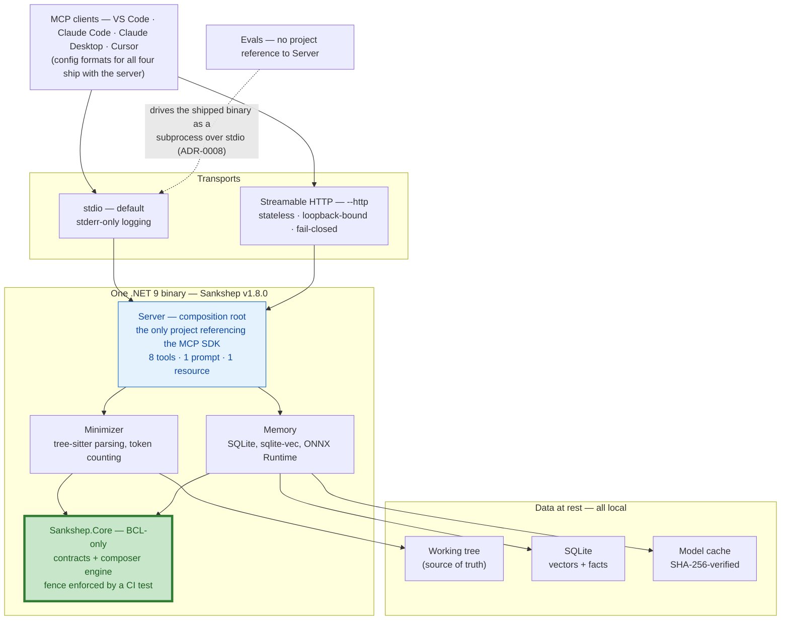
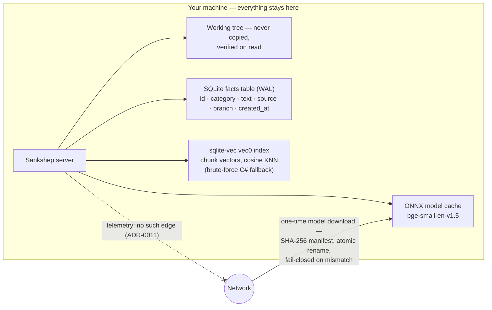

# The whole picture

Everything this site has taught — [tokens](../part1-fundamentals/tokens.md), the [context window](../part1-fundamentals/context-windows.md), [retrieval](../part2-context/rag-for-code.md), [minimization](../part2-context/structural-minimization.md), [memory](../part2-context/persistent-memory.md), [measurement](../part2-context/measuring-quality.md), the [MCP machinery](../part3-mcp/index.md), and the [agent loop](../part4-agents/agent-loop.md) driving it — meets in one running program here. By the end you will be able to describe Sankshep's architecture in thirty seconds, trace one request through every subsystem naming the chapter that taught each step, and defend what the server deliberately does not do. This page is the capstone's hub: every design decision gets its own [case study](index.md), and every trace step links back to the chapter that owns it.

## The 30-second version

If an interviewer gives you half a minute, this paragraph is the answer.

As of 2026-07-18, Sankshep is a local-first .NET 9 MCP server at v1.8.0. It exposes 8 [tools](../part3-mcp/primitives.md), 1 prompt, and 1 resource — all three MCP primitives — over [stdio](../part3-mcp/transports.md) by default, with a stateless, loopback-bound Streamable HTTP mode behind `--http`. The code is four projects behind a [dependency fence](../part3-mcp/writing-a-server.md): a BCL-only core, with tree-sitter minimization, ONNX-plus-sqlite-vec retrieval, and SQLite memory around it, and the MCP SDK confined to the outermost project. It makes no model calls at request time — every output is deterministic — and its compression claims are benchmarked against the shipped binary: Balanced holds 0.94 key-point recall while removing 30.4% of the tokens (published in its `docs/benchmarks.md`, verified 2026-07-18).

## The shape of the solution



Two structural facts carry most of the weight. First, the fence: `Sankshep.Core` holds the contracts and the composer engine with zero non-BCL references, and the CI test `DependencyRuleTests.CoreAssembly_HasZeroNonBclReferences` fails the build if that ever changes — the pattern taught in [Writing an MCP server](../part3-mcp/writing-a-server.md) and defended in the [dependency fence case study](case-dependency-fence.md). Second, the evals sit outside the process entirely: they launch the shipped binary and speak stdio JSON-RPC to it, so what the benchmarks measure is what an IDE client receives.

## The surface, mapped to subsystems

The whole public surface fits in one table.

| Surface | Primitive | What sits behind it | Taught in |
| --- | --- | --- | --- |
| `get_context`, `search_code`, `index_repo`, `summarize_repo` | tools | the retrieval index and the minimizer, over the working tree | [Retrieval for code](../part2-context/rag-for-code.md), [Structural minimization](../part2-context/structural-minimization.md) |
| `remember`, `recall`, `export_decisions` | tools | the SQLite facts table — branch-scoped, never vectorized | [Persistent memory](../part2-context/persistent-memory.md) |
| `token_report` | tool | observability over token spend | [Measuring context quality](../part2-context/measuring-quality.md), [Cost and efficiency](../part4-agents/cost-efficiency.md) |
| `compose_task_prompt` | prompt | the composer engine in Core — deterministic, no model calls (ADR-0013) | [Grounded prompting and composition](../part4-agents/grounded-prompting.md) |
| `sankshep://stats` | resource | application-read statistics | [Tools, resources, and prompts](../part3-mcp/primitives.md) |

The who-invokes rule from [Primitives](../part3-mcp/primitives.md) sorts this surface cleanly: models invoke the tools, the application reads the resource, a person picks the prompt — all three primitives, used as designed.

## One request, end to end

The centerpiece. An agent working in your IDE needs code context, and a `get_context` call with the query "how does login validate" and a 4,000-token budget travels the whole stack.

```mermaid
sequenceDiagram
    autonumber
    participant C as IDE client
    participant S as Sankshep (subprocess)
    participant W as Working tree
    participant X as Vector index
    Note over C,S: launch and handshake — once per session
    C->>S: spawn from the IDE's config entry
    C->>S: initialize (protocolVersion, capabilities)
    S-->>C: server capabilities — tools, prompts, resources
    C--)S: notifications/initialized
    Note over C: the model emits a tool_use block; the client translates it to MCP
    C->>S: tools/call get_context — "how does login validate", budget 4,000
    S->>S: resolve paths against the repo root — no match fails loudly (isError)
    S->>W: verify-on-read — mtime scan, then content-hash diff
    W-->>S: changed files re-read, deleted files pruned
    S->>S: parse (tree-sitter), strip comments, re-parse, collapse non-query bodies, normalize whitespace
    S->>X: semantic similarity for candidates
    X-->>S: cosine scores
    S->>S: blend 0.6 semantic + 0.4 lexical, rank
    S->>S: greedy pack into 4,000 tokens — locator headers counted
    S-->>C: one JSON-RPC frame on stdout — minimized context + savings report
    Note over C: result appended to the conversation — the loop continues
```

Step by step, with the chapter that taught each move:

1. **Configuration.** A few lines in the IDE's config file name the binary and its arguments — the four client formats are in [Connecting servers to IDEs](../part3-mcp/ide-integration.md).
2. **Spawn.** The client launches the server as a subprocess; stdout will carry only JSON-RPC, and all logging goes to stderr — the stdio discipline from [Transports](../part3-mcp/transports.md).
3. **Handshake.** `initialize`, capability exchange, `notifications/initialized` — spelled out line by line in [The wire protocol](../part3-mcp/wire-protocol.md).
4. **The call arrives.** The `tools/list` descriptions sit in the model's context; the model emits a `tool_use` block naming `get_context`, and the client translates it into a `tools/call` request — the two-protocol translation from [The wire protocol](../part3-mcp/wire-protocol.md); the description craft behind that selection is [Tool calling in depth](../part4-agents/tool-calling.md).
5. **Path resolution.** Requested paths anchor to the repo root; a path matching nothing fails loudly as a tool error (`isError`, ADR-0016), so the miss reaches the model and can be corrected — the two failure channels from [The wire protocol](../part3-mcp/wire-protocol.md).
6. **Verify-on-read.** A cheap mtime scan gates a precise content-hash diff; changed files are re-read, deleted files pruned. The working tree — not a snapshot — is the truth, so branch switches just work. The freshness problem is [Retrieval for code](../part2-context/rag-for-code.md)'s; the design is the [verify-on-read case study](case-verify-on-read.md).
7. **Parse and transform.** Each file becomes a tree-sitter syntax tree, re-parsed between transforms; an unsupported language passes through unchanged. Comment stripping runs first, then query-targeted body collapse: stopwords drop, "login" and "validate" survive keyword extraction under the one-suffix stemming invariant, and `ValidateRequest` matches — its body stays intact while unrelated bodies collapse to signatures. All from [Structural minimization](../part2-context/structural-minimization.md).
8. **Rank.** Candidates are ordered by 0.6 semantic plus 0.4 lexical score when the embedding index exists, lexical alone when it does not — the hybrid blend and the degradation ladder from [Retrieval for code](../part2-context/rag-for-code.md).
9. **Pack.** Greedy packing fills the 4,000-token budget, with every `// path:start-end` locator header counted against it — honest budgets, from [Structural minimization](../part2-context/structural-minimization.md).
10. **Report.** The savings report compares delivered files only — never everything-in-scope divided by budget, and no dollar figures (ADR-0017) — the accounting rules from [Measuring context quality](../part2-context/measuring-quality.md).
11. **Return.** One JSON-RPC frame on stdout; the client appends the result to the conversation and the model continues — back into [the agent loop](../part4-agents/agent-loop.md), which the client owns.

Notice what the trace never contains: a model call. Sankshep sits at the tool layer of the three-layer frame from [the running example](../part0-orientation/running-example.md), and every step above is deterministic.

## Data at rest



Three stores, one conditional network edge. The facts table is the [right-sized memory design](../part2-context/persistent-memory.md) — plain SQL, never vectorized. The vector index is sqlite-vec's `vec0` with a pure-C# brute-force fallback — the [embedded-over-dedicated choice](case-sqlite-vec-vs-vector-db.md). The [embedding](../part1-fundamentals/embeddings.md) model is cached locally; the only network traffic the server initiates is its one-time download — SHA-256-verified against a manifest, atomically renamed, discarded on mismatch — and `SANKSHEP_MODEL_OFFLINE=1` removes even that edge. Telemetry is not disabled; it is structurally absent — the [local-first case study](case-local-first.md) treats that as a property you can verify, not a promise to trust.

## Where the judgment lives

Each load-bearing decision has an ADR and a dedicated case study using the capstone's [shared template](index.md): context, decision, alternatives, tradeoffs, what would change it, transferable lesson.

| The call | ADR | Case study |
| --- | --- | --- |
| tree-sitter breadth over Roslyn depth | ADR-0003 | [Tree-sitter over Roslyn](case-tree-sitter-vs-roslyn.md) |
| local ONNX embeddings over a cloud API | ADR-0005 | [Local ONNX over cloud](case-local-onnx-vs-cloud.md) |
| embedded sqlite-vec over a dedicated vector DB | ADR-0002 | [sqlite-vec over a vector DB](case-sqlite-vec-vs-vector-db.md) |
| verify-on-read over watchers and timers | ADR-0006 | [Verify-on-read](case-verify-on-read.md) |
| the SDK behind a tested fence | ADR-0004 | [The dependency fence](case-dependency-fence.md) |
| local-first, no telemetry by default | ADR-0011 | [Local-first, no telemetry](case-local-first.md) |
| evals against the shipped binary | ADR-0008 | [Measure what you ship](case-measure-what-you-ship.md) |

## What it refuses to do

An architecture is defined by its refusals as much as its features. Five are deliberate:

- **No model calls at request time.** `compose_task_prompt` returns "a prompt, not an answer" (ADR-0013), and a build-time test keeps every model-client library out of the composition path — the determinism argument from [Grounded prompting](../part4-agents/grounded-prompting.md).
- **No routing.** Choosing which model serves a step belongs to the client, which owns the loop and pays the bill; a deterministic tool composes under any client's routing policy — the layering argument from [Cost and efficiency](../part4-agents/cost-efficiency.md).
- **No telemetry by default.** Observability is local-only, with low-cardinality metrics that cannot accidentally capture code (ADR-0011) — the [local-first case study](case-local-first.md).
- **No token pass-through.** The HTTP tier is an OAuth 2.1 resource server: it validates tokens, never issues them, never forwards them (ADR-0012) — the confused-deputy material in [Safety and judgment](../part4-agents/safety.md).
- **No unmeasured claims.** "Roundtrips avoided" would be a flattering number, and it is explicitly not measured, so it is not claimed — the honest non-claim from [Measuring context quality](../part2-context/measuring-quality.md).

Each refusal keeps a responsibility in the layer that can actually discharge it. That — more than any single subsystem — is the architecture.

## Checkpoints

1. **"You have thirty seconds — describe the system."** Give the paragraph.

    ??? success "Answer"
        A local-first .NET 9 MCP server (v1.8.0 as of 2026-07-18): 8 tools, 1 prompt, 1 resource over stdio by default, plus a stateless loopback HTTP mode. Four projects behind a dependency fence — BCL-only core; tree-sitter minimization; ONNX + sqlite-vec retrieval; SQLite memory — with the MCP SDK confined to the outermost project. No model calls at request time, so outputs are deterministic; compression benchmarked against the shipped binary: 0.94 recall with 30.4% of tokens removed at Balanced.

2. **"Walk me through what happens between the model emitting a `tool_use` block for `get_context` and the first byte of the result reaching it."**

    ??? success "Answer"
        The client translates the block into an MCP `tools/call` request and writes it to the subprocess's stdin. The server resolves paths against the repo root (failing loudly with `isError` on a miss), verifies freshness with an mtime scan then a content-hash diff, parses each file with tree-sitter, strips comments, collapses bodies matching no query keyword, ranks 0.6 semantic + 0.4 lexical, packs greedily into the budget with locator headers counted, and writes one JSON-RPC frame — minimized context plus savings report — to stdout. The client appends the result and the model continues.

3. **"Your server never calls an LLM. Isn't that a missing feature?"**

    ??? success "Answer"
        It is the load-bearing feature. Determinism makes outputs byte-identical and golden-testable; a call costs CPU, not tokens, so there is no hidden marginal bill; and a server that presumes no model behaves identically under any client's routing policy. Model choice belongs to the client — the layer with visibility into the loop and authority over the invoice. A build-time test enforces the refusal, so it is architecture, not intention.

4. **"How would you convince a skeptic that removing 30% of the tokens doesn't destroy the answers?"**

    ??? success "Answer"
        Not with the ratio — with the paired measurement. The harness launches the shipped binary as a subprocess and drives it over stdio, so it measures what clients receive; key-point recall over 50 atomic facts holds 0.94 at Balanced with 30.4% of tokens removed, and the unflattering numbers are published too — Aggressive scores 0.11; a composed-versus-naive eval showed naive winning on recall. A CI gate fails the build if recall regresses. An instrument that can produce bad news makes its good news credible.

5. **"The MCP C# SDK ships version 2.0 tomorrow. What does your migration touch?"**

    ??? success "Answer"
        One project. The SDK is referenced only by `Server`; everything beneath compiles without the protocol, and `DependencyRuleTests.CoreAssembly_HasZeroNonBclReferences` fails the build if the fence is breached. The evals never reference `Server` — they drive the binary over stdio — so they keep working as the migration's safety net. A 2.0 preview already sits alongside stable 1.4.1 (see [Writing an MCP server](../part3-mcp/writing-a-server.md)).
