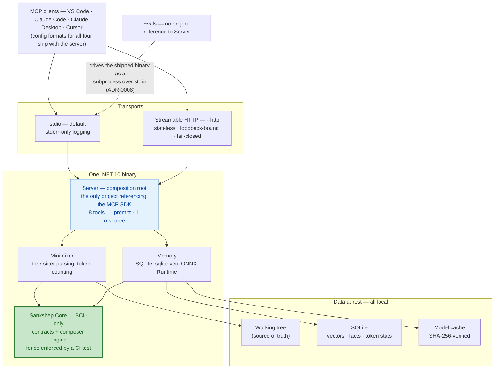
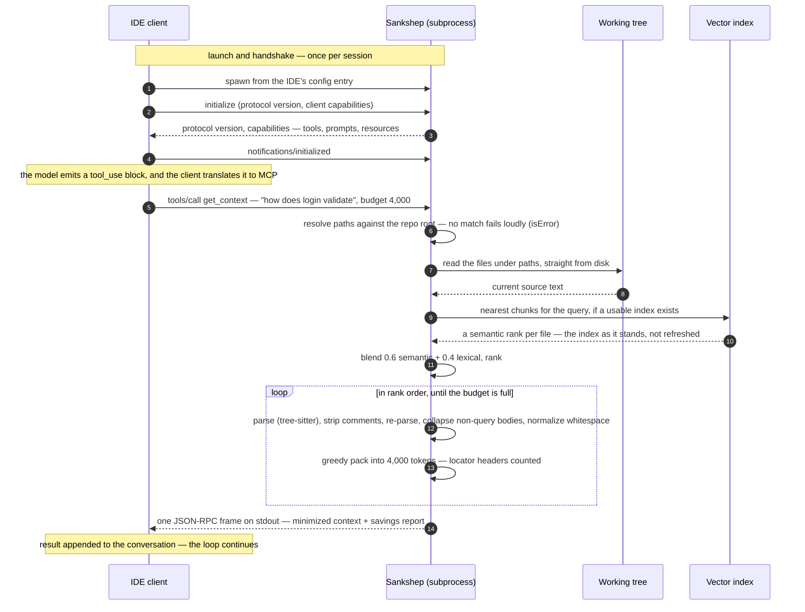
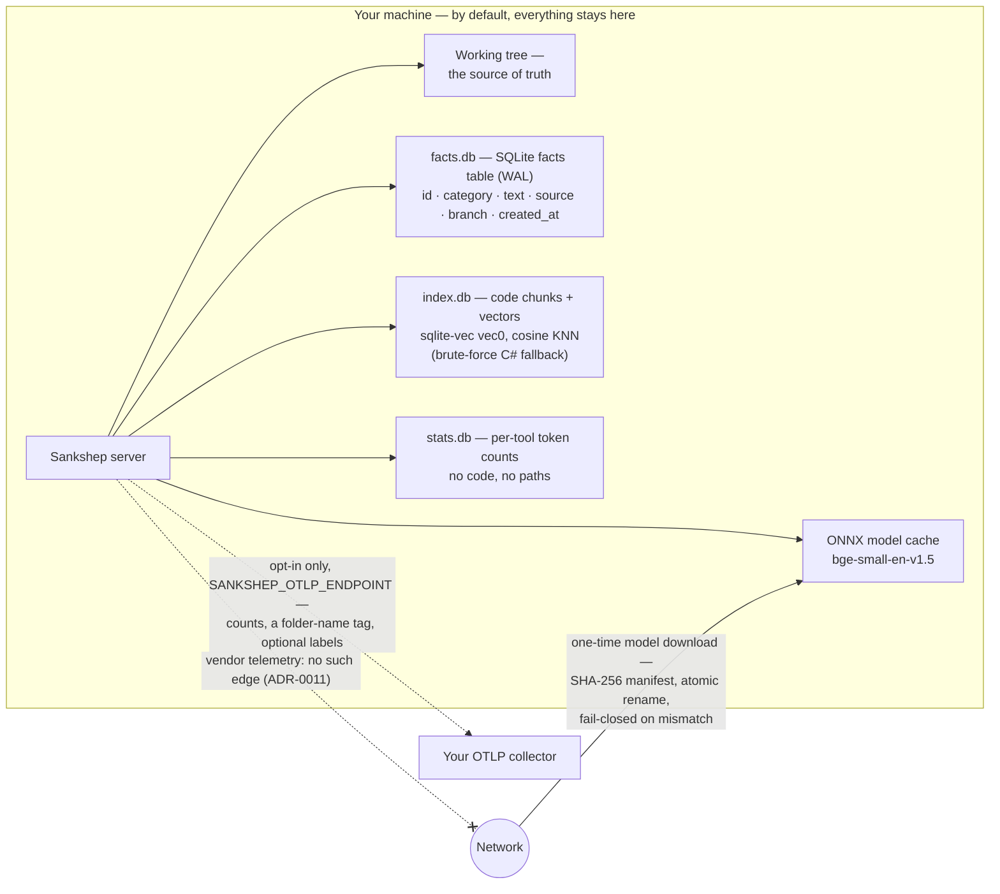

# The whole picture

Everything this site has taught meets in one running program here. [Tokens](../part1-fundamentals/tokens.md). The [context window](../part1-fundamentals/context-windows.md). [Retrieval](../part2-context/rag-for-code.md) and [minimization](../part2-context/structural-minimization.md). [Memory](../part2-context/persistent-memory.md) and [measurement](../part2-context/measuring-quality.md). The [MCP machinery](../part3-mcp/index.md), and the [agent loop](../part4-agents/agent-loop.md) driving it.

By the end you will be able to describe Sankshep's architecture in thirty seconds. You will be able to trace one request through every subsystem, naming the chapter that taught each step. And you will be able to defend what the server deliberately does not do.

This page is the capstone's hub. Every design decision gets its own [case study](index.md), and every trace step links back to the chapter that owns it.

## The 30-second version

If an interviewer gives you half a minute, this paragraph is the answer.

Sankshep is a local-first .NET 10 MCP server.

It exposes 8 [tools](../part3-mcp/primitives.md), 1 prompt, and 1 resource. That is all three MCP primitives. They run over [stdio](../part3-mcp/transports.md) by default, with a stateless, loopback-bound Streamable HTTP mode behind `--http`.

The code is four projects behind a [dependency fence](../part3-mcp/writing-a-server.md). A BCL-only core sits at the bottom. Around it: tree-sitter minimization, ONNX-plus-sqlite-vec retrieval, and SQLite memory. The MCP SDK is confined to the outermost project.

It makes no model calls at request time, so every output is deterministic. And its compression claims are benchmarked against the shipped binary, paired with judged recall that carries the judge's own error bar — the numbers are in [Measuring context quality](../part2-context/measuring-quality.md).

## The shape of the solution

```mermaid
flowchart TB
    IDE["MCP clients — VS Code · Claude Code · Claude Desktop · Cursor<br/>(config formats for all four ship with the server)"]
    subgraph TRANS["Transports"]
        direction LR
        STDIO["stdio — default<br/>stderr-only logging"]
        HTTP["Streamable HTTP — --http<br/>stateless · loopback-bound · fail-closed"]
    end
    subgraph BIN["One .NET 10 binary"]
        SRV["Server — composition root<br/>the only project referencing the MCP SDK<br/>8 tools · 1 prompt · 1 resource"]
        MIN["Minimizer<br/>tree-sitter parsing, token counting"]
        MEM["Memory<br/>SQLite, sqlite-vec, ONNX Runtime"]
        CORE["Sankshep.Core — BCL-only<br/>contracts + composer engine<br/>fence enforced by a CI test"]
        SRV --> MIN
        SRV --> MEM
        MIN --> CORE
        MEM --> CORE
    end
    subgraph STORES["Data at rest — all local"]
        direction LR
        WT["Working tree<br/>(source of truth)"]
        DB["SQLite<br/>vectors · facts · token stats"]
        MC["Model cache<br/>SHA-256-verified"]
    end
    EV["Evals — no project reference to Server"]
    IDE --> STDIO
    IDE --> HTTP
    STDIO --> SRV
    HTTP --> SRV
    MIN --> WT
    MEM --> DB
    MEM --> MC
    EV -. "drives the shipped binary as a<br/>subprocess over stdio (ADR-0008)" .-> STDIO

    classDef fence fill:#c8e6c9,stroke:#2e7d32,stroke-width:4px,color:#1b5e20;
    classDef edge fill:#e3f2fd,stroke:#1565c0,color:#0d47a1;
    class CORE fence;
    class SRV edge;
```

Two structural facts carry most of the weight.

First, the fence. `Sankshep.Core` holds the contracts and the composer engine with zero non-BCL references. The CI test `DependencyRuleTests.CoreAssembly_HasZeroNonBclReferences` fails the build if that ever changes. It is the pattern taught in [Writing an MCP server](../part3-mcp/writing-a-server.md), and defended in the [dependency fence case study](case-dependency-fence.md).

Second, the evals sit outside the process entirely. They launch the shipped binary and speak stdio JSON-RPC to it. So what the benchmarks measure is what an IDE client receives.

## The surface, mapped to subsystems

The whole public surface fits in one table.

| Surface | Primitive | What sits behind it | Taught in |
| --- | --- | --- | --- |
| `get_context`, `search_code`, `index_repo`, `summarize_repo` | tools | the retrieval index and the minimizer, over the working tree | [Retrieval for code](../part2-context/rag-for-code.md), [Structural minimization](../part2-context/structural-minimization.md) |
| `remember`, `recall`, `export_decisions` | tools | the SQLite facts table — branch-scoped, never vectorized | [Persistent memory](../part2-context/persistent-memory.md) |
| `token_report` | tool | observability over token spend | [Measuring context quality](../part2-context/measuring-quality.md), [Cost and efficiency](../part4-agents/cost-efficiency.md) |
| `compose_task_prompt` | prompt | the composer engine in Core — deterministic, no model calls (ADR-0013) | [Grounded prompting and composition](../part4-agents/grounded-prompting.md) |
| `sankshep://stats` | resource | application-read statistics | [Tools, resources, and prompts](../part3-mcp/primitives.md) |

The who-invokes rule from [Primitives](../part3-mcp/primitives.md) sorts this surface cleanly. Models invoke the tools. The application reads the resource. A person picks the prompt.

All three primitives, used as designed.

## One request, end to end

This is the centerpiece.

An agent working in your IDE needs code context. A `get_context` call travels the whole stack, carrying the query "how does login validate" and a 4,000-token budget.

```mermaid
sequenceDiagram
    autonumber
    participant C as IDE client
    participant S as Sankshep (subprocess)
    participant W as Working tree
    participant X as Vector index
    Note over C,S: launch and handshake — once per session
    C->>S: spawn from the IDE's config entry
    C->>S: initialize (protocol version, client capabilities)
    S-->>C: protocol version, capabilities — tools, prompts, resources
    C->>S: notifications/initialized
    Note over C: the model emits a tool_use block, and the client translates it to MCP
    C->>S: tools/call get_context — "how does login validate", budget 4,000
    S->>S: resolve paths against the repo root — no match fails loudly (isError)
    S->>W: read the files under paths, straight from disk
    W-->>S: current source text
    S->>X: nearest chunks for the query, if a usable index exists
    X-->>S: a semantic rank per file — the index as it stands, not refreshed
    S->>S: blend 0.6 semantic + 0.4 lexical, rank
    loop in rank order, until the budget is full
        S->>S: parse (tree-sitter), strip comments, re-parse, collapse non-query bodies, normalize whitespace
        S->>S: greedy pack into 4,000 tokens — locator headers counted
    end
    S-->>C: one JSON-RPC frame on stdout — minimized context + savings report
    Note over C: result appended to the conversation — the loop continues
```

Step by step, with the chapter that taught each move:

1. **Configuration.** A few lines in the IDE's config file name the binary and its arguments — the four client formats are in [Connecting servers to IDEs](../part3-mcp/ide-integration.md).
2. **Spawn.** The client launches the server as a subprocess; stdout will carry only JSON-RPC, and all logging goes to stderr — the stdio discipline from [Transports](../part3-mcp/transports.md).
3. **Handshake.** The client opens the session with `initialize`, naming its protocol version and capabilities; the server answers with the version it will speak and its own capabilities — tools, prompts, resources — and `notifications/initialized` closes the exchange. The revisions Sankshep's [public changelog](https://nitinpawar28.github.io/sankshep-docs/changelog/) says it answers, 2024-11-05 through 2025-11-25, all open this way. Under the 2026-07-28 revision there is no handshake at all: each request carries its version and capabilities in `_meta`, and `server/discover` reports what a server offers — both spelled out line by line in [The wire protocol](../part3-mcp/wire-protocol.md).
4. **The call arrives.** The `tools/list` descriptions sit in the model's context; the model emits a `tool_use` block naming `get_context`, and the client translates it into a `tools/call` request — the two-protocol translation from [The wire protocol](../part3-mcp/wire-protocol.md); the description craft behind that selection is [Tool calling in depth](../part4-agents/tool-calling.md).
5. **Path resolution.** Requested paths anchor to the repo root; a path matching nothing fails loudly as a tool error (`isError`, ADR-0016), so the miss reaches the model and can be corrected — the two failure channels from [The wire protocol](../part3-mcp/wire-protocol.md).
6. **Read the working tree.** `get_context` reads the files under `paths` straight from disk, so the code it returns is current — the working tree, not a snapshot, is the truth. It consults the index only for ranking's semantic signal, and uses the index as it stands, without refreshing it. By default, keeping the index fresh is `search_code`'s job: verify-on-read re-checks indexed files on every search, and only `index_repo` discovers new ones. The freshness problem is [Retrieval for code](../part2-context/rag-for-code.md)'s; the design is the [verify-on-read case study](case-verify-on-read.md).
7. **Rank.** Before anything is parsed, candidates are ordered by 0.6 semantic plus 0.4 lexical score — lexical over each file's original text — when a usable embedding index exists, and by lexical alone when it does not. That is the hybrid blend and the degradation ladder from [Retrieval for code](../part2-context/rag-for-code.md).
8. **Parse and transform.** Only now does parsing start, in rank order, and only until the budget fills. Each file in a language Sankshep parses becomes a tree-sitter syntax tree, re-parsed whenever a transform changes its text. Comment stripping runs first, then query-targeted body collapse: stopwords drop, "login" and "validate" survive keyword extraction under the one-suffix stemming invariant, and `ValidateRequest` matches — its body stays intact while unrelated bodies collapse to signatures. All from [Structural minimization](../part2-context/structural-minimization.md).
9. **Pack.** Greedy packing fills the 4,000-token budget, with every `// path:start-end` locator header counted against it — honest budgets, from [Structural minimization](../part2-context/structural-minimization.md). A file too big for what is left is cut at a line boundary, by position rather than relevance, or withheld, and the response's header says which. In 4.0.0 — built, not yet published as of 2026-10-08 — that file [arrives by its declarations](../part2-context/structural-minimization.md#in-practice-sankshep) instead, the ones the query is about first, each cited by path, line range and symbol, and a `PARTIAL` header line names it. The response header's WARNING, NOTE and WITHHELD lines fit inside the budget there too; on 3.0.0 they are added on top, so a call that fills its budget comes back 120–150 tokens over. The benefit of packing by declarations has not been measured yet.
10. **Report.** The savings report compares delivered files only — never everything-in-scope divided by budget, and no dollar figures (ADR-0017) — the accounting rules from [Measuring context quality](../part2-context/measuring-quality.md).
11. **Return.** One JSON-RPC frame on stdout; the client appends the result to the conversation and the model continues — back into [the agent loop](../part4-agents/agent-loop.md), which the client owns.

Notice what the trace never contains. A model call.

Sankshep sits at the tool layer of the three-layer frame from [the running example](../part0-orientation/running-example.md). Every step above is deterministic.

## Data at rest

```mermaid
flowchart LR
    subgraph LOCAL["Your machine — by default, everything stays here"]
        S["Sankshep server"]
        WT["Working tree —<br/>the source of truth"]
        FACTS["facts.db — SQLite facts table (WAL)<br/>id · category · text · source · branch · created_at"]
        VEC["index.db — code chunks + vectors<br/>sqlite-vec vec0, cosine KNN<br/>(brute-force C# fallback)"]
        STATS["stats.db — per-tool token counts<br/>no code, no paths"]
        MC["ONNX model cache<br/>bge-small-en-v1.5"]
        S --> WT
        S --> FACTS
        S --> VEC
        S --> STATS
        S --> MC
    end
    NET(("Network"))
    COL["Your OTLP collector"]
    NET -->|"one-time model download —<br/>SHA-256 manifest, atomic rename,<br/>fail-closed on mismatch"| MC
    S -. "vendor telemetry: no such edge (ADR-0011)" .-x NET
    S -. "opt-in only, SANKSHEP_OTLP_ENDPOINT —<br/>counts, a folder-name tag, optional labels" .-> COL
```

Four local stores, and by default one conditional network edge.

By default the three databases live under `<repo>/.sankshep/`. `SANKSHEP_STATE_DIR` points them elsewhere, and a supervised service keeps them in a machine-wide directory.

The facts table is the [right-sized memory design](../part2-context/persistent-memory.md): plain SQL, never vectorized.

The vector index is sqlite-vec's `vec0`, with a pure-C# brute-force fallback. That is the [embedded-over-dedicated choice](case-sqlite-vec-vs-vector-db.md).

The statistics behind `token_report` and `sankshep://stats` are per-tool token counts — no code, no paths.

The [embedding](../part1-fundamentals/embeddings.md) model is cached locally. The only network traffic the server starts by default is its one-time download, which is SHA-256-verified against a manifest, atomically renamed, and discarded on mismatch. Setting `SANKSHEP_MODEL_OFFLINE=1` removes even that edge.

Telemetry is off by default, and there is no vendor for it to reach. The only outbound export is opt-in: set `SANKSHEP_OTLP_ENDPOINT`, and counts plus a folder-name tag and any team or instance labels you set — never code, paths, or queries — go to a collector you run. With nothing set, a socket-level test asserts that `get_context` opens zero outbound connections. The [local-first case study](case-local-first.md) treats that as a property you can verify, rather than a promise to trust.

## Where the judgment lives

Each load-bearing decision has an ADR, and a dedicated case study using the capstone's [shared template](index.md). Context, decision, alternatives, tradeoffs, what would change it, transferable lesson.

| The call | ADR | Case study |
| --- | --- | --- |
| tree-sitter breadth over Roslyn depth | ADR-0003 | [Tree-sitter over Roslyn](case-tree-sitter-vs-roslyn.md) |
| local ONNX embeddings over a cloud API | ADR-0005 | [Local ONNX over cloud](case-local-onnx-vs-cloud.md) |
| embedded sqlite-vec over a dedicated vector DB | ADR-0002 | [sqlite-vec over a vector DB](case-sqlite-vec-vs-vector-db.md) |
| verify-on-read over watchers and timers | ADR-0006 | [Verify-on-read](case-verify-on-read.md) |
| the SDK behind a tested fence | ADR-0004 | [The dependency fence](case-dependency-fence.md) |
| local-first, no telemetry by default | ADR-0011 | [Local-first, no telemetry](case-local-first.md) |
| evals against the shipped binary | ADR-0008 | [Measure what you ship](case-measure-what-you-ship.md) |

## What it refuses to do

An architecture is defined by its refusals as much as its features.

Five of Sankshep's are deliberate.

- **No model calls at request time.** `compose_task_prompt` returns "a prompt, not an answer" (ADR-0013), and a build-time test keeps every model-client library out of the composition path — the determinism argument from [Grounded prompting](../part4-agents/grounded-prompting.md).
- **No routing.** Choosing which model serves a step belongs to the client, which owns the loop and pays the bill; a deterministic tool composes under any client's routing policy — the layering argument from [Cost and efficiency](../part4-agents/cost-efficiency.md).
- **No telemetry by default.** Observability is local-only by default; any export is opt-in, and its low-cardinality metrics cannot accidentally capture code (ADR-0011) — the [local-first case study](case-local-first.md).
- **No token pass-through.** With OAuth 2.1 configured, the HTTP tier is a resource server only: it validates tokens, never issues them, never forwards them (ADR-0012) — the confused-deputy material in [Safety and judgment](../part4-agents/safety.md).
- **No unmeasured claims.** "Roundtrips avoided" would be a flattering number, and it is explicitly not measured, so it is not claimed — the honest non-claim from [Measuring context quality](../part2-context/measuring-quality.md).

Each refusal keeps a responsibility in the layer that can actually discharge it.

That, more than any single subsystem, is the architecture.

## Checkpoints

1. **"You have thirty seconds — describe the system."** Give the paragraph.

    ??? success "Answer"
        A local-first .NET 10 MCP server: 8 tools, 1 prompt, 1 resource over stdio by default, plus a stateless loopback HTTP mode. Four projects behind a dependency fence — BCL-only core; tree-sitter minimization; ONNX + sqlite-vec retrieval; SQLite memory — with the MCP SDK confined to the outermost project. No model calls at request time, so outputs are deterministic; compression benchmarked against the shipped binary, paired with judged recall that carries the judge's own error bar.

2. **"Walk me through what happens between the model emitting a `tool_use` block for `get_context` and the first byte of the result reaching it."**

    ??? success "Answer"
        The client translates the block into an MCP `tools/call` request and writes it to the subprocess's stdin. The server resolves paths against the repo root (failing loudly with `isError` on a miss), reads the files straight from the working tree, and ranks them before parsing anything — 0.6 semantic + 0.4 lexical when a usable index exists, lexical alone when not. Then, in rank order and only until the budget fills, it parses each file it can with tree-sitter, strips comments, collapses bodies matching no query keyword, and packs greedily with locator headers counted. Last, it writes one JSON-RPC frame — minimized context plus savings report — to stdout. The client appends the result and the model continues.

3. **"Your server never calls an LLM. Isn't that a missing feature?"**

    ??? success "Answer"
        It is the load-bearing feature. Determinism makes outputs byte-identical and golden-testable; a call costs CPU, not tokens, so there is no hidden marginal bill; and a server that presumes no model behaves identically under any client's routing policy. Model choice belongs to the client — the layer with visibility into the loop and authority over the invoice. A build-time test enforces the refusal, so it is architecture, not intention.

4. **"How would you convince a skeptic that removing more than half the tokens doesn't destroy the answers?"**

    ??? success "Answer"
        Not with the ratio — with the paired measurement. The harness launches the shipped binary as a subprocess and drives it over stdio, so it measures what clients receive. Key-point recall over atomic facts is scored beside compression at every level, with the judge's own run-to-run swing published as the error bar. In the run measured 2026-09-20 on v3.0.0, Balanced recovered more facts than Conservative, which keeps every body — 0.67 against 0.50, a gap far larger than the judge's own swing of about 0.05 — while removing 59.5% of the tokens. The unflattering numbers are published too: Aggressive scores 0.10, and a composed-versus-naive eval showed naive winning on recall. [Measuring context quality](../part2-context/measuring-quality.md) has the full table. The maintainer's benchmark run fails closed, exiting non-zero when recall regresses; a judged run costs API calls, so it runs on demand rather than on every merge. An instrument that can produce bad news makes its good news credible.

5. **"The MCP C# SDK ships version 3.0 tomorrow. What does your migration touch?"**

    ??? success "Answer"
        One project. The SDK is referenced only by `Server`; everything beneath compiles without the protocol, and `DependencyRuleTests.CoreAssembly_HasZeroNonBclReferences` fails the build if the fence is breached. The evals never reference `Server` — they drive the binary over stdio — so they keep working as the migration's safety net. The 2.0 migration already went this way — one project — and [Writing an MCP server](../part3-mcp/writing-a-server.md) keeps the dated version facts. The fence exists for exactly the day a new major version ships.

## Try it

Practise the skill this part exists to build: describing a system's architecture out loud, at three different depths, without notes.

1. **The 30-second version.** Close this page and say — aloud, or written in one paragraph — what Sankshep is, what problem it solves, and the one design commitment that shapes everything else. Compare against [the 30-second version](#the-30-second-version). If yours took two minutes, you described the implementation instead of the shape.
2. **The request trace.** Now walk one `get_context` call from the client's spawn to the returned frame, naming each subsystem it touches in order. Check against the [sequence diagram](#one-request-end-to-end). Missing a step is normal; the useful signal is *which* step, because that is the subsystem you have not really understood yet.
3. **The defence.** Pick any one step you just named and answer three questions about it: what alternative was available, what the chosen approach costs, and what would make you reverse it. If the third answer is "nothing", you are holding a belief rather than a decision — the case studies are where each one gets its flip condition.
4. **Now do it for your own system.** Take a service you work on and produce the same three artefacts: a 30-second shape, one request traced end to end through named subsystems, and one decision defended with its alternative, its cost, and its reversal condition. This is the interview answer, and it is also the design-review answer.
5. **Find your gap.** Whichever of the four steps was hardest tells you what to do next: step 1 means you lack a mental model, step 2 means you know components but not flow, step 3 means you inherited decisions without their rationale. [How to learn a codebase like this](learning-a-codebase.md) is organized around exactly those three failures.
