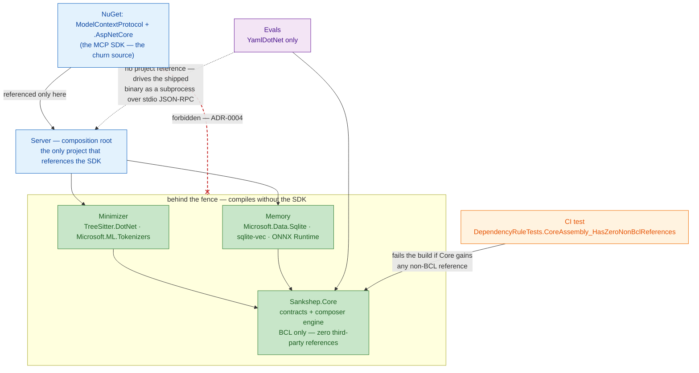

# Case study: the dependency fence

Sankshep's codebase has a shape, and the shape is a rule: the MCP SDK is referenced by exactly one project, and the innermost project references nothing outside .NET's own base class library. This case study walks that rule — ADR-0004 — through the capstone template: the context that forced a decision, the decision itself, the alternatives it beat, the costs it accepted, and the conditions that would flip it. By the end you will be able to defend a [dependency fence](../part3-mcp/writing-a-server.md) to a skeptical interviewer, name what it really costs, and say when you would not build one.

## The context

Sankshep v1.8.0 is a .NET 9 MCP server with a small protocol surface — eight [tools, one prompt, and one resource](../part3-mcp/primitives.md) — and a large domain underneath it: [structural minimization](../part2-context/structural-minimization.md), [retrieval](../part2-context/rag-for-code.md), [persistent memory](../part2-context/persistent-memory.md), a deterministic [composer engine](../part4-agents/grounded-prompting.md), and an [eval harness](../part2-context/measuring-quality.md). None of that domain logic is MCP-specific. Parsing a file with tree-sitter, running a cosine search, or packing code into a budget would work exactly the same behind a CLI or a different protocol.

The protocol layer, by contrast, sits on moving ground. MCP itself keeps shipping revisions ([What problem MCP solves](../part3-mcp/why-mcp.md) tracks the dated status), and the official C# SDK moves with it. As of 2026-07-18, the SDK's stable release is 1.4.1 — published 2026-07-09 — while a 2.0.0-preview.3 already sits on the same NuGet feed. [Writing an MCP server](../part3-mcp/writing-a-server.md) owns the dated version details; what matters here is the shape of the fact: a major-version migration is not hypothetical for this dependency. It is pre-announced.

So the question ADR-0004 answers is concrete: when SDK 2.0 lands with breaking changes, how many projects have to change?

## The decision

ADR-0004 draws one line: the SDK packages — `ModelContextProtocol` and its `AspNetCore` variant — may be referenced by the `Server` project and nothing else. `Server` is the composition root: it wires the transports, hosts the [handlers](../part3-mcp/writing-a-server.md), and translates between SDK types and the contracts everything else is written against.

Below that line sit the subsystems. `Minimizer` brings tree-sitter and the tokenizer; `Memory` brings SQLite, sqlite-vec, and ONNX Runtime. Both depend on `Sankshep.Core`, which holds the shared contracts and the composer engine — and references nothing outside the BCL, the base class library that ships with .NET itself. Not the SDK, not tree-sitter, not SQLite.

The innermost clause is not a convention. A CI test, `DependencyRuleTests.CoreAssembly_HasZeroNonBclReferences`, inspects the compiled `Core` assembly's reference list on every build and fails the build if anything beyond the BCL appears. Nobody has to remember the rule, review for it, or re-read the ADR. The build remembers.

The fence has a second face, easy to miss: the `Evals` project sits *outside* it. Evals references `Core` and one YAML parser — never `Server`. To test the server, it launches the shipped binary as a subprocess and speaks [stdio](../part3-mcp/transports.md) JSON-RPC to it, per ADR-0008 — the same [wire protocol](../part3-mcp/wire-protocol.md) any real client would use. The separation runs in both directions: inside the fence, the domain compiles without the protocol; outside it, the tests exercise the protocol without touching the code. [Case study: measure what you ship](case-measure-what-you-ship.md) takes up why that outside position makes the measurements honest.

!!! note "Settled"
    Only the SDK versions on this page churn. The pattern itself — confine a volatile dependency to an edge project and keep the domain free of it — is decades-old engineering, known elsewhere as ports-and-adapters or an anti-corruption layer. What Sankshep adds is not the pattern but the enforcement mechanism: a test.

## The alternatives

**Reference the SDK wherever it is convenient.** The cheapest option today, and the default outcome of not deciding. Protocol request and content types gradually become domain types; the search index takes an SDK object as a parameter. Nothing breaks — until an SDK release with breaking changes turns a package update into a codebase-wide migration, and until unit-testing the domain requires standing up protocol machinery. Rejected because the cost is deferred, not avoided, and it compounds.

**Fence by convention.** Write the rule in the ADR and enforce it in code review. This is the most common real-world answer, and it erodes exactly the way [Writing an MCP server](../part3-mcp/writing-a-server.md) describes: one expedient shortcut at a time, each individually reasonable, none caught by a compiler. A rule that lives only in prose depends on every future contributor reading, remembering, and honoring it under deadline. Rejected as the *enforcement* mechanism — the ADR still documents the why.

**No SDK at all.** Hand-roll the JSON-RPC layer: framing, handshake, discovery, dispatch. This buys total insulation from SDK churn by trading it for protocol churn — every MCP revision becomes implementation work you now own, along with the framing and validation bugs the SDK community has already fixed. Rejected because the fence delivers most of the insulation while keeping the maintained protocol layer.

## The tradeoffs

The fence is not free, and the honest defense names its costs:

- **A translation tax at the boundary.** Handlers in `Server` map SDK types to `Core` contracts and back. That is duplicated shape — two definitions of "a chunk of context" exist, one per side — and it is the deliberate price of the design: the duplication is the decoupling.
- **Discipline about where code lands.** Every capability must be split into a protocol-facing sliver (in `Server`) and a domain implementation (behind the fence). For a quick feature, that is more ceremony than one file that does both.
- **Uneven enforcement.** The named test pins the innermost clause — `Core` stays BCL-only — with mechanical certainty. The outer clause, SDK-only-in-`Server`, is a project-reference rule; a fence is only as strong as the checks on each clause, and project references at least change rarely and visibly.

Against that, the benefits, each traceable to a fact on this page: SDK 2.0 arrives as a one-project migration instead of a rewrite; the domain is unit-testable as plain functions, with no handshake or subprocess in sight; and the eval harness can sit outside the process boundary and measure the shipped artifact rather than a library import.

## What would change it

- **A server small enough to be all edge.** In a 100-line notes server — the kind you will build in [Build your own MCP server](../part6-reference/build-your-own.md) — the handlers *are* the program. A fence around nothing is ceremony; skip it until there is a domain worth protecting.
- **A server that is pure protocol adaptation.** A thin proxy that reshapes requests for an existing API has no protocol-free domain to fence off. The pattern needs a substrate.
- **A frozen dependency.** If the SDK and the protocol reached a years-stable plateau, the fence's expected payoff would shrink toward zero. As of 2026-07-18 the opposite is true — the 2.0 preview coexisting with stable 1.4.1 is the strongest available evidence that the churn this fence guards against is live.

What would *not* change it: team size. A solo maintainer forgets rules under deadline exactly the way a large team does; the failing test does not care who is typing.

!!! tip "Transferable lesson"
    Put third-party churn behind a fence, and make the fence a failing test, not a wiki page. Any dependency that ships breaking changes on someone else's schedule — an ORM, a cloud SDK, a UI framework, a young protocol — belongs behind one edge project you can migrate alone. And a structural rule enforced by a red build survives contributors, deadlines, and refactors that a document does not.

## Checkpoints

1. `Sankshep.Core` compiles without the MCP SDK — but also without tree-sitter and SQLite. Why does the innermost clause exclude *all* non-BCL packages instead of just the SDK?

    ??? success "Answer"
        Because the fence targets churn in general, not MCP in particular — every third-party package is on someone else's release schedule, and `Core`'s contracts are referenced by every other project, so any third-party type admitted there would propagate everywhere at once. A zero-non-BCL rule is also mechanically checkable with no judgment calls: `DependencyRuleTests.CoreAssembly_HasZeroNonBclReferences` inspects the compiled assembly's reference list, and "zero" needs no allowlist to maintain.

2. The `Evals` project could reference `Server` directly and call the handlers in-process — simpler and faster. What does driving the shipped binary as a subprocess over stdio buy instead?

    ??? success "Answer"
        It makes the tests exercise exactly what a real client exercises: process startup, transport framing, the handshake, discovery, serialization, and the stdout discipline stdio demands — none of which an in-process call touches. Per ADR-0008, the wire protocol doubles as the test interface, so the measurements apply to the shipped artifact rather than a library that merely shares code with it. It also keeps `Evals` outside the fence: with no reference to `Server`, SDK churn cannot reach the harness either.

3. A teammate argues the CI test should be deleted: "tests should verify behavior, and a reference list is structure, not behavior." What is the counterargument?

    ??? success "Answer"
        The structure *is* behavior — deferred. Which projects reference the SDK determines what a breaking SDK release costs, whether the domain can be tested without protocol machinery, and whether the code can be reused behind another interface; the reference list is simply where that behavior is visible early. The test converts a slow architectural regression, normally discovered during a painful upgrade, into an immediate red build. The alternative enforcement — prose plus vigilance — is the "fence by convention" option this page rejects, because it erodes one convenient shortcut at a time.
