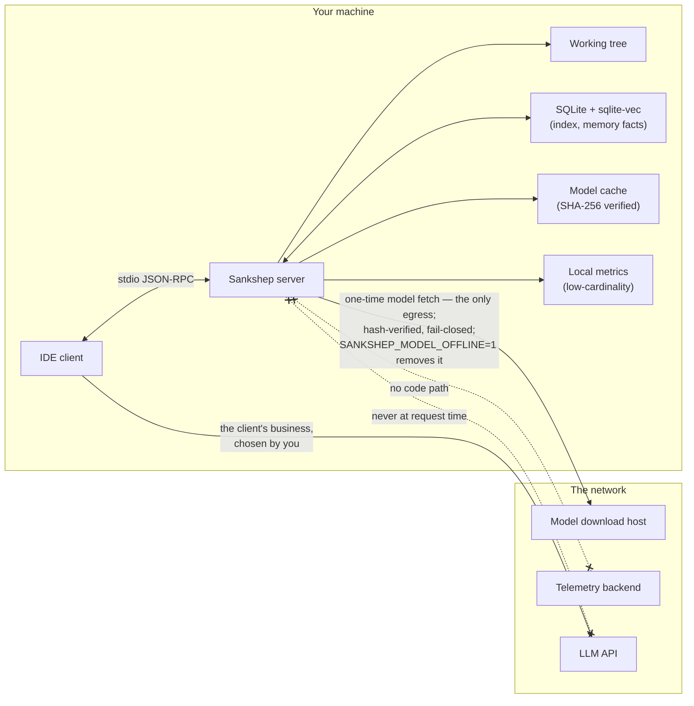

# Case study: local-first and no telemetry

Every developer tool eventually faces the telemetry question: what, if anything, leaves the user's machine? This case study examines Sankshep's answer — nothing, by default — and what that answer costs. By the end you should be able to defend (or attack) a no-telemetry design in an interview, and name the structural evidence that separates a real privacy posture from a paragraph in a privacy policy.

## Context

Sankshep is an MCP server whose entire job is reading private source code. Its [tools](../part3-mcp/primitives.md) walk a working tree, its [retrieval index](../part2-context/rag-for-code.md) stores [embeddings](../part1-fundamentals/embeddings.md) of that code, and its [memory](../part2-context/persistent-memory.md) stores facts a developer chose to write down about their project. The default deployment is a subprocess speaking [stdio](../part3-mcp/transports.md) inside an IDE — as the [safety chapter](../part4-agents/safety.md) put it, a local stdio server crosses no privilege boundary on its own.

That makes the data it handles about as sensitive as developer-tool data gets. And the standard product playbook pulls hard in the other direction: usage analytics on by default, crash reports with payloads, "anonymized" event streams — because fleet data is genuinely useful for prioritizing work and catching failures.

The stakes are raised by ADR-0014: Sankshep's source is proprietary (free binary, private source), which is covered in [the running example](../part0-orientation/running-example.md). Users cannot read the code to check what it phones home. Whatever privacy promise the server makes has to be checkable some other way.

## The decision

ADR-0011: observability is local-only, and the metrics that do exist are low-cardinality only. As of 2026-07-18, the shipped server (v1.8.0) sends no telemetry.

Three design choices make that a property of the architecture rather than a policy statement:

**Everything at request time runs locally.** Parsing is tree-sitter on your CPU; embeddings come from a local ONNX model; vector search is sqlite-vec inside a local SQLite file; the composer never calls an LLM. There is no request-time network dependency to piggyback data onto.

**The metrics are low-cardinality by construction.** A counter labeled by tool name or outcome draws its labels from a small, fixed set. It *cannot* contain a file path, a query string, or a line of code — there is no field for one. High-cardinality labels are the classic accidental-capture bug: one string interpolation and your "anonymous usage metric" contains proprietary source. Keeping cardinality low means even the local metrics cannot capture repo content by mistake. The observability that does exist points at the user, not a vendor: the `sankshep://stats` resource and the `token_report` tool report locally, to you.

**The one network edge is narrow, verified, and removable.** The only egress in the design is the one-time embedding-model download — SHA-256 manifest, atomic rename, fail-closed on mismatch (detailed in [the local-ONNX case study](case-local-onnx-vs-cloud.md)) — and `SANKSHEP_MODEL_OFFLINE=1` removes even that for air-gapped machines. The optional `--http` transport binds to loopback and fails closed on unauthenticated non-loopback binds unless `SANKSHEP_ALLOW_UNAUTHENTICATED=1` is set deliberately. The v1.8.0 security audit treated egress as a defended boundary, not an assumption.

Here is the resulting data-flow map. Solid edges exist; dashed, crossed edges are the ones that deliberately do not.

Note the bottom edge: context still reaches a model API — through the client you chose, in [the loop the client owns](../part4-agents/agent-loop.md). Local-first does not mean your code never travels; it means *this server adds no edges* to the map you already agreed to.

## The alternatives

**Opt-out telemetry (the default playbook).** Rich analytics on by default, a setting to disable it. This maximizes fleet insight, because most users never change defaults — which is exactly the problem. For a tool whose input is proprietary source code, defaults decide what actually happens on thousands of machines, and every high-cardinality event field is one bug away from exfiltrating code.

**Opt-in telemetry.** Honest, but the data is sparse and biased toward enthusiasts, which limits its value for the very prioritization arguments used to justify it.

**A hosted service.** Run the server in the cloud and observability comes free — every request is already on your infrastructure. But now the entire repository passes through someone else's machines, which inverts the trust model this tool exists to serve. (The same flip condition appears in [the sqlite-vec case study](case-sqlite-vec-vs-vector-db.md): hosted multi-tenant scale changes everything at once.)

## The tradeoffs

The honest cost is **no fleet insight**. The maintainer cannot see which tools get called, which languages fail to parse in the wild, or what latency real users experience. There is no crash dashboard. A bug exists only when someone reports it with a reproduction; nothing is learned from silent failures on other people's machines.

The offset is **local measurement**. Sankshep's eval harness drives the real shipped binary as a subprocess over stdio (ADR-0008) and its regression gate fails closed, so quality regressions are caught by [measurement the maintainer runs](../part2-context/measuring-quality.md) rather than by surveilling users — the published benchmark numbers come from exactly those runs, a discipline [the measurement case study](case-measure-what-you-ship.md) examines in full. Evals are not a perfect substitute for fleet data: they answer "did quality regress on my corpus?", not "what do users actually do?". The design accepts that gap deliberately.

The decision is also protected by scope discipline. ADR-0019 defines the product as a focused local/stdio core, with an enterprise tier optional and off by default — in its words, "scope has to be declared". Fleet-style features are not banned forever; they are fenced into a tier a user must explicitly turn on. The default stays local no matter what the roadmap grows.

## What would change it

- **An organization deploying to a fleet and wanting aggregate metrics.** That is the enterprise-tier shape ADR-0019 anticipates: declared, opt-in, off by default — and any metrics would need to stay low-cardinality for the same accidental-capture reason.
- **Evidence that local evals systematically miss real-world failures.** If field failures repeatedly shipped because no eval could represent them, the cost side of the ledger grows, and a minimal opt-in crash signal becomes worth debating.
- **Becoming a hosted product.** Then the whole trust model, not just telemetry, is renegotiated — a different product, not a patch to this one.

What would *not* change it: convenience. "It would help the roadmap" is the argument every opt-out default makes, and conceding it quietly is how privacy postures erode one release at a time.

!!! tip "Transferable lesson"
    **Defaults are the product.** Most users run what ships; a privacy posture that requires configuration is a posture only for experts. And **a privacy promise you cannot verify structurally is a promise about intentions** — policies change with ownership; architecture can be inspected. Offer evidence instead: a single auditable egress, a flag that removes it (`SANKSHEP_MODEL_OFFLINE=1`), loopback-bound fail-closed defaults, metrics whose schema *cannot hold* the sensitive data. A user who can air-gap the machine and watch the tool keep working is not trusting you; they are checking.

## Checkpoints

1. Why do *low-cardinality* metrics matter to a privacy promise, even when the metrics never leave the machine?

    ??? success "Answer"
        A low-cardinality metric draws its labels from a small fixed set (tool name, outcome), so it has no field that could hold a file path, query string, or line of code — accidental capture is structurally impossible, not just prohibited. High-cardinality fields are one string-interpolation bug away from recording proprietary source. Designing the schema so it cannot hold the secret beats promising not to look at it — and it keeps the promise intact even if the metrics are ever exported deliberately later.

2. The honest cost of no telemetry is no fleet insight. How does Sankshep compensate, and what does the compensation *not* cover?

    ??? success "Answer"
        It compensates with local measurement: an eval harness that drives the real shipped binary as a subprocess over stdio (ADR-0008), with a regression gate that fails closed, plus user-facing observability (`sankshep://stats`, `token_report`). That answers "did quality regress on the corpus I can test?" but not "what do real users do, and where does it fail on their machines?" — that gap is accepted deliberately, and bug reports must carry their own reproductions.

3. What structural evidence backs the claim "no telemetry", given that the source is proprietary (ADR-0014) and cannot be audited by users?

    ??? success "Answer"
        The architecture is checkable from outside: request-time work is fully local (parsing, ONNX embeddings, sqlite-vec, a composer that never calls an LLM), so there is no network dependency to hide traffic in; the only egress is a one-time, hash-verified model download that `SANKSHEP_MODEL_OFFLINE=1` removes entirely; and the `--http` transport binds to loopback and fails closed on unauthenticated non-loopback use. You can run the server air-gapped and observe that it still works — verification by construction rather than by trust.
