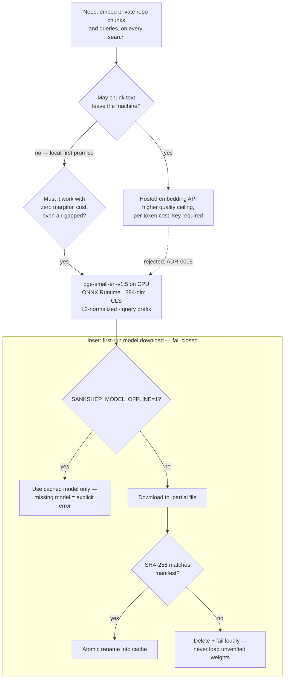

# Case study: local ONNX over cloud embeddings

Every retrieval system needs an [embedding](../part1-fundamentals/embeddings.md) model, and the obvious move is to call the strongest hosted API you can afford. Sankshep's ADR-0005 records the opposite choice: a small open model, run locally on CPU. This case study reconstructs that decision so you can defend one like it — or recognize when it is wrong. By the end you will be able to argue for a deliberately modest component, name exactly what the modesty costs, and state the measurable condition that would reverse the call.

## The context

Sankshep's retrieval pipeline uses vectors in two places. At index time, `index_repo` embeds AST-aware chunks of the repository ([Retrieval for code](../part2-context/rag-for-code.md) covers the chunking). At query time, `search_code` and the ranking stage inside `get_context` blend scores at 0.6 semantic to 0.4 lexical — the semantic 0.6 is entirely the embedding model's work. These are [tools](../part3-mcp/primitives.md) an agent calls dozens of times per session, so whatever produces the vectors runs constantly.

And it runs inside a system whose identity is local-first. The corpus is a private repository — often exactly the code an organization is most reluctant to send anywhere. The product promise, examined in [Case study: local-first, no telemetry](case-local-first.md), is that nothing leaves the machine by default. So the constraint set for the embedding choice was fixed before any model was evaluated: private text, no per-call budget, and it must keep working on a machine with no network access at all.

## The decision

ADR-0005: run bge-small-en-v1.5 locally through ONNX Runtime on CPU. No API, no key, no network round-trip per query.

The configuration reads like a checklist of the [four settings that break embedding pipelines silently](../part1-fundamentals/embeddings.md#four-details-that-break-pipelines-silently): 384 dimensions; CLS pooling, not mean; L2-normalized vectors; and the asymmetric query prefix `"Represent this sentence for searching relevant passages: "` applied to queries only. The ONNX session loads lazily on first use, and index-time embedding runs in batches of 16. The resulting vectors land in sqlite-vec — itself a deliberate-modesty decision, argued in [Case study: sqlite-vec over a vector DB](case-sqlite-vec-vs-vector-db.md).

One consequence deserves its own paragraph: the model download is the system's single hash-verified network egress. On first run, Sankshep fetches the model to a `.partial` file, checks its SHA-256 against a manifest, and only then atomically renames it into the cache. A mismatch means delete and fail loudly — unverified weights are never loaded. Setting `SANKSHEP_MODEL_OFFLINE=1` refuses even that one fetch: the cached model is used, or the operation errors explicitly. Notice the asymmetry with the rest of the system, which degrades gracefully when quality is at stake ([degradation economics](../part4-agents/cost-efficiency.md#degradation-economics)): a missing grammar becomes pass-through, a missing `vec0` becomes brute force — but a bad hash is not a quality problem, it is an integrity problem, and integrity [fails closed](../part4-agents/safety.md).

## The alternatives

The serious alternative was a hosted embedding API, and its strengths are real: a higher quality ceiling than any small local model, zero local compute, and operations that are someone else's job. The generic version of this tradeoff appears in [Local or cloud](../part1-fundamentals/embeddings.md#local-or-cloud); here is how it lands against this system's constraint set.

- **Privacy becomes contractual instead of structural.** Every chunk of a private repository crosses the network at index time, and every query at query time. The local-first promise would rest on a provider's terms of service rather than on the absence of a network path.
- **Cost stops being zero.** Hosted APIs bill per [token](../part1-fundamentals/tokens.md) — and not just once, because the index is not static. Sankshep re-embeds changed files as the working tree moves ([Case study: verify-on-read](case-verify-on-read.md)), so an active repository pays indexing costs continuously.
- **A key becomes a prerequisite.** Some machines cannot have one: air-gapped environments, locked-down corporate laptops, CI runners without secrets. For those users the feature would simply not exist.
- **The model can be retired under you.** When a provider sunsets an embedding model, the replacement lives in a different vector space, and the entire corpus must be re-embedded on the provider's schedule, not yours.

A third option sits between the two: a larger local model — 768 or 1024 dimensions, more layers — buys back some quality while staying on-machine, at the price of more memory and slower CPU inference. Nothing in the architecture forbids it; it is the natural first stop if the flip condition below ever triggers, precisely because it preserves every structural property of the local choice.

## The tradeoffs

| Axis | Local bge-small on CPU | Hosted embedding API |
| --- | --- | --- |
| Privacy | chunks never leave the machine | every chunk and query crosses the network |
| Marginal cost | zero per query and per re-index | per-token, at index time and query time |
| Offline and air-gap | works; `SANKSHEP_MODEL_OFFLINE=1` skips even the first fetch | unavailable without a network and a key |
| Quality ceiling | below the strongest hosted models | the state of the art, rented |
| Operations | you own download integrity, runtime, batching | the provider's problem |
| Model lifecycle | pinned weights, hash-verified, change only when you choose | provider retirement forces a full re-embed |

The honest cost is the quality ceiling. bge-small-en-v1.5 is a good small model, not the best model, and no amount of engineering around it changes that ranking. Two things bound the damage. First, embeddings carry only 0.6 of the ranking weight: the 0.4 lexical component catches exactly the cases vectors blur, because identifiers are lexical gold — a query containing "validate" finds `ValidateRequest` with no semantics required. Second, the ceiling is watched, not assumed, which is what the next section is about.

## What would change it

A decision like this rots when the flip condition lives in someone's head. ADR-0005's flip condition is written down and measurable: swap the model when evals show retrieval is the bottleneck.

The instrumentation for that already exists. The keypoint-recall harness from [Measuring context quality](../part2-context/measuring-quality.md) judges whether delivered context still answers real questions, driving the shipped binary end to end ([Case study: measure what you ship](case-measure-what-you-ship.md)). If judged misses started tracing back to retrieval — the right chunks never surfaced, rather than surfacing and being over-compressed — the embedding model would be the limiting factor, and the review reopens. As of 2026-07-18, the published results give the condition nothing to trigger on: Sankshep's public benchmarks page reports the Balanced profile holding 0.94 recall while removing 30.4% of tokens, so the pipeline's weakest link is not visibly the model.

Anyone who does pull the trigger inherits a known checklist, straight from the [four silent footguns](../part1-fundamentals/embeddings.md#four-details-that-break-pipelines-silently): the entire corpus must be re-embedded, because vectors from different models occupy unrelated spaces; dimensions, pooling, normalization, and the query prefix all change per model; and the same recall evals must re-run afterward to confirm the bottleneck actually moved. The swap is contained — vectors in, vectors out — but it is a migration, not a config flip.

## The transferable lesson

!!! tip "Transferable lesson"
    The "worse" model that runs everywhere beats the better model that needs permission slips — when running everywhere is the promise your product makes. Choosing a deliberately modest component is sound engineering on two conditions: the constraints that favor it are structural (privacy, cost, air-gap), not aesthetic; and the point where modest stops being enough is a measurement, not an opinion. Write the flip condition into the decision record, wire an eval to it, and the argument about "shouldn't we use a better model?" turns into a number you check.

## Checkpoints

1. A hosted embedding API outscores bge-small-en-v1.5 on public retrieval benchmarks. Defend Sankshep's choice in about three sentences, without disputing the benchmark.

    ??? success "Answer"
        Quality is one axis among several, and the binding constraints here are structural: private code must not leave the machine, queries must cost nothing at the margin, and the tool must work air-gapped — a hosted API fails all three by construction. The quality gap is bounded in practice by hybrid ranking (the 0.4 lexical weight catches identifier matches vectors blur) and is monitored by recall evals rather than assumed away. If those evals ever show retrieval is the bottleneck, the decision reverses on evidence — the choice is modest, not dogmatic.

2. Sankshep converts a missing tree-sitter grammar into pass-through and a missing `vec0` into brute-force search, yet a SHA-256 mismatch on the model download is a hard, loud failure. Why the different treatment?

    ??? success "Answer"
        The graceful paths degrade *quality*: the user gets slower or less-compressed results, visibly and safely. A failed hash is an *integrity* problem — the file is corrupt or has been tampered with somewhere between the manifest and the machine — and loading it would either poison every vector silently or execute an unverified artifact. The rule from the safety and cost chapters is: degrade quality gracefully, never degrade safety or honesty. The download sits on the security side of that line, so it fails closed.

3. Evals finally show retrieval is the bottleneck and your team swaps in a larger embedding model. What must happen before anyone trusts search results again?

    ??? success "Answer"
        Re-embed the entire corpus — old and new vectors occupy unrelated spaces, even at matching dimensions, so mixing them makes scores meaningless. Update every model-card setting the pipeline depends on: dimensions, pooling rule, normalization, and the asymmetric query prefix, which are all per-model. Then re-run the same recall evals that triggered the swap, both to confirm the bottleneck moved and to keep the regression gate honest about what the new model actually delivers.
